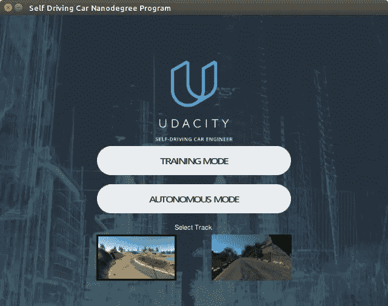
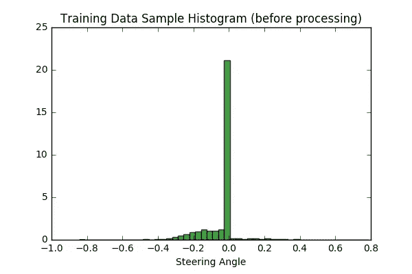
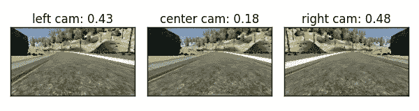
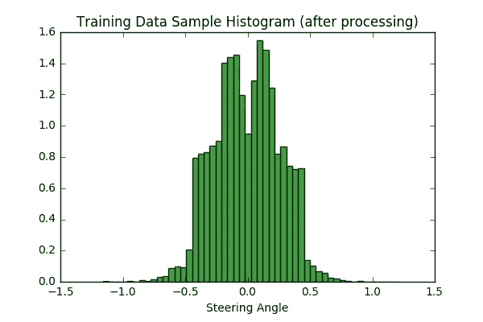
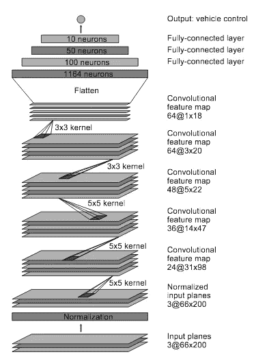

# 行为克隆在自动驾驶汽车模拟赛道上的应用

> 原文：<https://towardsdatascience.com/behavioural-cloning-applied-to-self-driving-car-on-a-simulated-track-5365e1082230?source=collection_archive---------1----------------------->

最近我在 [Udacity](https://www.udacity.com/) 上了一门课程，重点是[无人驾驶汽车](https://www.udacity.com/drive)，所以我终于能够在课程中发布其中一个项目了。

这个项目，标题如上，有一个目标是*训练一个模型在模拟轨道上自动驾驶汽车。该模型驾驶汽车的能力是通过克隆人类驾驶员的行为来学习的。训练数据从模拟器中的人类驾驶示例中获得，然后输入到深度学习网络中，该网络学习模拟中遇到的每一帧的响应(转向角度)。换句话说，该模型被训练为在驾驶时为每一帧预测适当的转向角度。然后，在新的轨迹上验证该模型，以检查用于执行转向角预测的学习特征的一般化。*

我对这个项目的解决方案受到了 nvidia 论文、 [comma.ai 论文](https://arxiv.org/pdf/1608.01230v1.pdf)和 [vivek 博客](https://chatbotslife.com/using-augmentation-to-mimic-human-driving-496b569760a9#.5dpi87xzi)的影响，我在制定解决方案时参考了这些论文。 [Keras 深度学习库](https://keras.io/)与 [Tensorflow](https://www.tensorflow.org/) 后端一起使用，执行深度学习操作。

这篇文章组织如下:1。数据记录，2。数据处理，3。模特培训，4。模型测试；5 .结论。

**1。数据记录**

模拟器有两种模式——训练模式和自主模式。训练模式用于收集训练数据，方法是在赛道上行驶，并将行驶数据记录在文件夹中。自主模式用于测试经过训练的模型。

Self-Driving Car Simulator

Udacity 提供了一组训练数据(24，108 个数据集)，可以通过模拟器下载。我认为 Udacity 数据集可能不够，所以我记录了自己的训练数据(104，145 个数据集)，并将使用 Udacity 数据集进行验证。绘制 10，000 个训练数据样本的直方图显示，由于轨道的性质，来自轨道 1 的数据具有更多的 0°和左转向角，因此我们的处理步骤还将包括数据扩充和平衡，以防止我们的模型偏向于直行和左转。

# 2.数据处理

进行数据处理是为了让我们的模型能够轻松地处理用于训练的原始数据。在这个项目中，数据处理内置在一个生成器(keras *fit_generator* )中，以允许实时处理数据。这样做的好处是，在我们处理大量数据的情况下，整个数据集不会加载到内存中，因此我们可以一次处理一批可管理的数据。因此，为了提高效率，发电机与模型并行运行。

以下是对数据执行的处理步骤:

1.  **从中心、左、右摄像机图像中随机选择:**模拟器提供三个摄像机视图，即:中央、左侧和右侧视图。因为我们只需要使用一个摄像机视图，所以我们从三个视图中随机选择。在使用左右图像时，我们分别给转向角加上和减去 0.25，以补偿相机偏移 [1](https://arxiv.org/pdf/1604.07316v1.pdf) 。
2.  **平移图像(抖动)并补偿转向角:**由于原始图像大小为 160x320 像素，我们随机将图像向左或向右平移，并以每平移像素 0.008 补偿转向角的平移。然后，我们从图像中裁剪出一个 120x220 像素的感兴趣区域。*请注意，对于我的解决方案，我仅在水平方向平移。*
3.  **随机翻转图像:**为了平衡左右图像，我们随机翻转图像并改变转向角的符号。下图显示了经过抖动、裁剪和角度校正后的左、右和中央摄像机的视图。右摄像机视图已经翻转，因此看起来像左摄像机图像。
4.  **增亮**我们通过将图像转换为 HSV 通道，并随机缩放 V 通道来模拟不同的亮度场合。

Camera views after processing and steering angle compensation.

绘制 10，000 个已处理图像的样本显示了处理后转向角的更平衡的分布:

# 3.模特培训

采用 [Nvidia 模型](https://arxiv.org/pdf/1604.07316v1.pdf)进行训练，因为它在试验了其他类型的模型(例如 comma.ai)后给出了更好的结果。该网络由 9 层组成，包括一个归一化层、5 个卷积层和 3 个全连接层。与 Nvidia 模型相反，输入图像在传送到网络之前被分割成 HSV 平面。

[Nvidia model](https://arxiv.org/pdf/1604.07316v1.pdf)

图像在第一层被标准化。根据 Nvidia 的论文，这使得标准化也可以通过 GPU 处理来加速。

卷积在前三层中使用 2x2 步长和 5x5 内核，非步长卷积在后两层中使用 3x3 内核。

卷积层之后是三个全连接层，然后输出转向角。

通过在所有层上使用积极的下降(0.2)和在第一层上使用 L2 正则化(0.001)来减少过拟合。这被证明是一个很好的实践，因为该模型可以推广到第二个轨道，而无需将其用于培训。

Adam 优化器用于优化。由于学习速率是自适应的，这几乎不需要调整。此外，在训练过程中使用检查点和早期停止机制，通过监控验证损失来选择最佳训练模型，如果损失在连续三个时期内没有减少，则停止训练。

虽然有超过 100，000 个训练数据，但是每个时期包括 24，064 个样本。这使得训练更容易处理，并且由于我们使用了生成器，所有的训练数据仍然在训练中使用，但是在不同的时期。

再次重申，自我记录的数据用于训练，而 Udacity 提供的数据用于训练期间的验证。

# 4.模型检验

经过训练的模型在第一条跑道上进行了测试。这给出了一个很好的结果，因为赛车可以在赛道上平稳行驶。[参见下面的路线 1 测试结果视频](https://youtu.be/PAouMCtEhWY)

此外，为了测试推广性，在第二个轨道上测试了模型。值得注意的是，该模型从未在这条赛道的样本上训练过，但它在这条赛道上驾驶成功。[参见下面的路线 2 测试结果视频:](https://youtu.be/hOsUNo5g3A4)

# 5.结论

通过使用人类行为采样数据来训练在模拟轨道上自主驾驶的深度学习模型。该模型包括 5 个卷积层和 3 个更完全连接的层，能够通过克隆人类行为进行学习，并能够概括对新测试轨道的反应。虽然该模型只控制转向角，但它也可以扩展到控制油门和刹车。

# 笔记

以下是我在这个项目中的个人笔记:

1.  **数据处理和学习过程一样重要:**我意识到，也许这个项目最重要的部分是提出一种预测测试用例并进行归纳的数据处理，因此使用了抖动和亮度增强。一旦我能够在 Nvidia 模型上训练，在 comma.ai 模型上工作也很容易，在相同的数据处理下，它也给出了令人满意的结果。
2.  **数据量统计:**更多的数据最能提高学习效率。当我有大量数据进行训练时，我可以很容易地看到改进，并能够根据 Udacity 数据集进行验证。
3.  **一些我觉得没用的处理:**虽然其他一些人也用了这些方法，但对我来说并没有什么影响。例如，垂直平移、通过添加一些均匀噪声来扰动 0°附近的转向角，以及使用正方形大小的输入。

你可以在我的 [github 这里](https://github.com/toluwajosh)找到这个项目和其他自动驾驶汽车相关的项目。虽然这个项目已经完成，但我想改进或者训练这辆车在越野赛道上行驶。请在评论中给出任何建议、更正或补充。