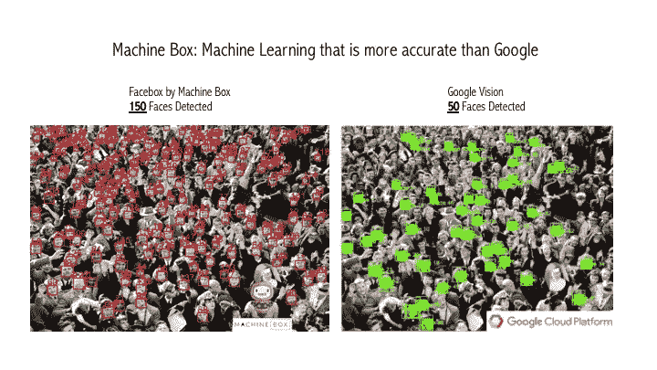
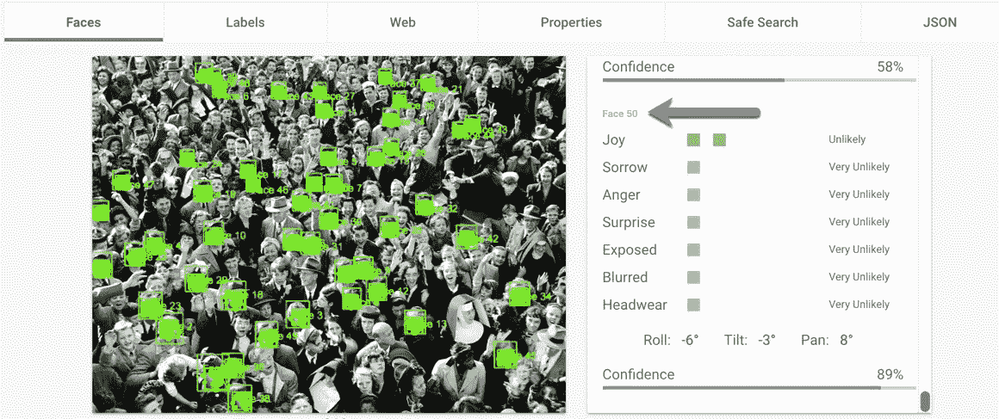

# 比谷歌更擅长机器学习——可能吗？

> 原文：<https://towardsdatascience.com/being-better-at-machine-learning-than-google-is-it-possible-62c5e4643ddb?source=collection_archive---------4----------------------->

Comparing Facebox by Machine Box with Google Vision

说你在某件事上比谷歌更好是没有意义的。然而，当我对我们的面部识别技术和[谷歌的视觉 API](https://cloud.google.com/vision/) 进行测试时，我发现我们更加准确……**更加准确**。

当我看到‘我们’时，我说的是我公司的[机器箱](https://goo.gl/AVfc2i)。我们在 [Docker](http://docker.com) 容器中制作机器学习模型，这样任何可以编写 API 的开发人员都可以在他们的产品中实现机器学习，不需要博士或数学知识。

这一切都是从一个实验开始的，看看 Facebox 可以在一张图片中看到多少张脸。我搜索“人群”的图片，想找到一些好的测试图片，结果发现了这个:

A photo with a lot of faces — source: [http://www.sportsplexoperators.com/blog/wp-content/uploads/2013/07/crowd_2.jpg](http://www.sportsplexoperators.com/blog/wp-content/uploads/2013/07/crowd_2.jpg)

所以我创建了一个 Facebox 的实例，并把图片贴在上面。下载并分析图像几秒钟后，Facebox 用 JSON 作出响应，在 JSON 的顶部是一个`facesCount`元素，显示检测到的人脸总数。

JSON response from Facebox

153，还不错。我通过我们开发人员的控制台预览模式再次运行了这张图片，得到了一些值得截图的东西:

Screen shot of Facebox’s preview mode in the developer console

然后我想知道，鉴于他们围绕机器学习的新声明，这与其他云认知服务，特别是谷歌视觉，有什么关系。我访问了他们的页面，他们让你在服务上发布一张照片，看看会有什么结果。经过几秒钟的处理，我得到了这个结果。

Google Vision console

我可以立即从缩略图看出检测到的人脸较少，但当我向下滚动右侧的响应窗口时，我有点震惊地看到他们只检测到了 **50** 张人脸。

他们漏掉了那张照片中的 100 多张脸。那太多了。😬

谷歌视觉的人脸识别产品当然有更多的功能，比如情绪检测、眉毛定位、头饰检测等等。在 Machine Box，我们让 Facebox 非常擅长检测和识别人脸([你可以用一张图片教 Facebox 某人是谁](https://blog.machinebox.io/machine-learning-model-training-vs-machinebox-teaching-f959f5fa4635))。就是这样！我们这样做是因为我们希望我们的盒子具有尽可能高的质量，这意味着只有在技术水平足够好以返回准确结果的情况下才实现特性。

也就是说，我们喜欢谷歌，对于一些用例来说，他们用于机器学习的公共云 API 将会工作得很好。他们有一个惊人的数据集来训练机器学习模型。那么 Machine Box 比 Google 更擅长机器学习吗？不，当然不是…是谷歌！他们在深度学习和其他人工智能相关技术上投入了大量时间和金钱，当然，也为地球上的几乎每个人提供了有价值的服务，这令人敬畏。但是，很多开发人员需要在本地或在他们自己的基础设施中实现一些具有极高精确度的东西(他们喜欢 Docker)，所以他们选择了 Machine Box——我们非常感激。

制作锋利的开发工具是我们的热情和信念，我们希望您能[尝试一下](https://goo.gl/AVfc2i)。它将永远免费用于开发和测试。