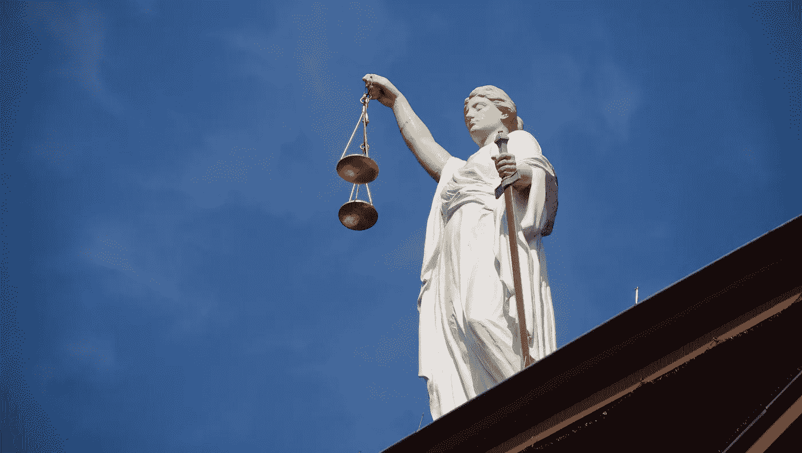
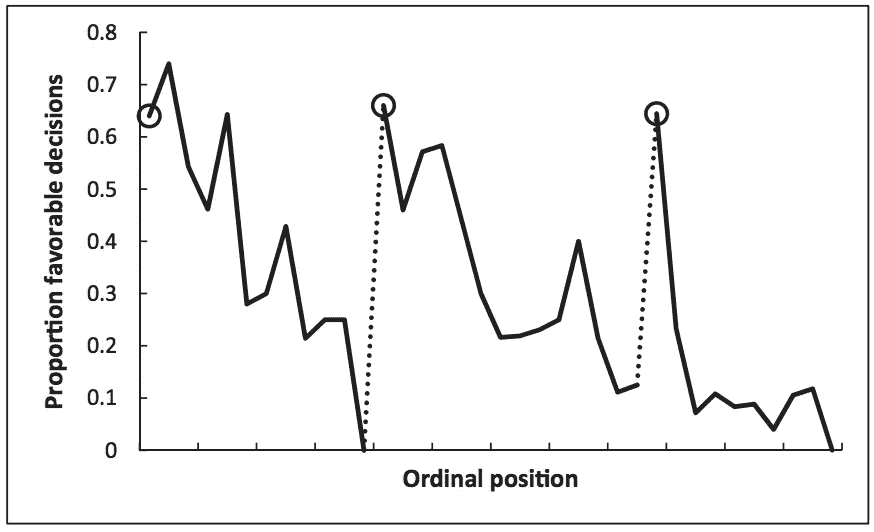

# 数据科学的优势和伦理挑战——COMPAS 和智能电表

> 原文：<https://towardsdatascience.com/benefits-and-ethical-challenges-in-data-science-compas-and-smart-meters-da549dacd7cd?source=collection_archive---------3----------------------->

## 长篇散文。

Getting the balance right: weighing benefits against ethical challenges in Data Science.

# 1.介绍

最近在处理大量数据方面取得的进步为改善个人生活和我们社会的福利创造了大量新的机会。例如，监控家庭用电量的智能电表可以在不在家时帮助省电，或者根据消费模式建议最便宜的电力供应商。

然而，想象一下电力供应商的网站说，如果你提供实时而不是每周的电力消耗数据，你每年的电力成本将下降 20%。应该允许电力供应商向消费者施压，用隐私换取金钱吗？

## 1.1.概述

本文描述了数据科学的两个应用，即美国法院和家用智能电表中使用的替代制裁罪犯管理概况(COMPAS)软件系统，以对比它们的好处和道德挑战。

## 1.2.关键术语的定义

定义数据科学有两个组成部分。首先，海量数据(兆兆字节、千兆字节)具有大数据的三个特征:容量、速度和多样性(Laney，2001)。第二，数据科学代表以软件形式实现的统计模型，可以检测这些数据中的模式。

当关于什么是对什么是错的观点出现分歧时，伦理挑战就出现了。比如，一个算法是否应该拥有决定被告是否被保释的权力？由于统计模型是建立在数据之上的，像 COMPAS 这样的应用首先需要分析数据是如何产生的。当巡逻的警察以有偏见的方式控制公民时，道德挑战可能会出现，但这超出了本文的范围。

为了*改善个人生活和我们社会的福利*需要一个应用程序来为一个或多个个人的生活创造价值，而没有负外部性并且在法律界限内。换句话说，有人*从使用这项技术中获益*。

最后，*智能电表*是一种电子设备，它测量家庭用电量，并与其他电子设备进行通信，作为连接网络的一部分(想想物联网)。

# 2.好处和道德挑战

COMPAS 和智能电表利用大量数据，提供清晰明确的优势，提出引人注目的道德挑战，受到众多学者的讨论，似乎对当今和未来的社会影响最大。

## 2.1.什么是 COMPAS？

美国各地的法官越来越依赖算法来评估等待审判的被告是否有可能再次犯罪。由 Northpointe 公司开发的一个这样的算法系统叫做 COMPAS，在威斯康星州、加利福尼亚州、科罗拉多州和佛罗里达州等地使用。在审讯过程中，每名被告都提供了 100 多个独立的输入变量，包括年龄、性别和犯罪史(安格温，未注明日期)。根据被告与特定群体的相似程度，COMPAS 输出从 0 到 10 的风险评分。得分从 5 到 7 代表中等，得分从 8 到 10 代表再次犯罪的可能性高。评委将分数视为决策过程中的众多因素之一。

## **好处**

Swets 等人(2000 年)的研究论文发现，在某些情况下，数据科学方法优于人类判断。COMPAS 是对人类判断的补充，保证了基于所有可用的案例证据对被告进行客观公正的评估。它有助于防止出现 Danziger 等人(2011 年)描述的结果，他们发现，在法官用膳休息后，法院做出有利裁决的可能性迅速上升(见下图)。

Proportion of rulings in favour of the prisoners. Circled points represent the first decision after meal breaks (Danziger et al., 2011).

此外，COMPAS 在充斥着官僚主义和行政挑战的刑事司法系统中大放异彩，因为它简化了管理，简化了决策过程，提高了效率。

## **伦理挑战**

我确定了三个主要的道德挑战:不公平的歧视、强化人类偏见和缺乏透明度。

***不公平的歧视。***

什么是*公平*被告评估，数据科学家如何开发适用于任何被告的相应算法？

Northpointe 对公平算法的定义指出，无论种族如何，每个风险类别中重新犯罪的被告比例大致相同。换句话说，例如 7 的风险分数预示着黑人和白人被告再次犯罪的可能性相等。根据定义，任何替代定义都会通过人为提高白人被告的风险水平来歧视他们。斯坦福大学和伯克利大学的研究人员根据佛罗里达州布劳沃德县的大约 5，000 个样本验证了单一风险分数代表实际再犯的风险大致相等(Corbett-Davies 等人，2016 年)。

然而，调查性新闻机构 ProPublica 通过分析佛罗里达州布劳沃德县治安官办公室的 1 万多份被告样本，发现了对黑人被告的不公平歧视。他们比较了 COMPAS 发布的累犯风险分数和分数发布两年后的实际累犯率，发现该算法将黑人被告归类为中等至高风险的可能性是白人被告的两倍多，即使黑人和白人被告都没有继续犯罪。虽然黑人被告没有重新犯罪，但他们受到了法院系统更严厉的对待(Larson et al .，2016)。

歧视性待遇本身不存在道德问题；这种待遇的影响，即根据种族被送进监狱或保释，是这种应用的伦理问题(Schermer，2011)。

一个算法能在满足 Northpointe 对公平的定义的同时减轻 ProPublica 的合法担忧吗？

***强化人类的偏见。***

前面定义的数据科学的两个方面(大量数据和统计模型)导致了基于过去数据模式做出决策的固有限制。COMPAS 的开发人员可能会向系统输入累犯数据，让模型识别与再次犯罪可能性相关的变量——这是训练分类算法的标准方式。如果数据是完全无偏的，那就不会有问题，但是公司所能做的就是鹦鹉学舌般地告诉我们自己的偏见。其中包括法官严重的种族主义偏见，他们认为黑人被告“比白人更有可能再次杀人”(Epps，2017 年)，或者墨西哥被告实施了性侵犯，“因为他是墨西哥人，墨西哥男子想拿什么就拿什么”(科罗拉多最高法院，2017 年)。

将判决的责任交给电脑，让法官不仅可以根据相关因素(如犯罪的严重性)做出决定，还可以根据道德上有问题的因素(如推断的种族和性别)做出决定。假设 COMPAS 预测被告是高风险。然而，法官不同意并释放了被告，他后来再次犯罪。为什么法官不遵从软件的建议？这种结果比 COMPAS 建议低风险时更容易发现，但法官对被告进行判决，并(可能)防止再犯。

**谓缺乏透明度。**

向公众隐瞒公司的内部运作禁止了对减轻习得性偏见的理解和讨论。然而，可以理解的是，Northpointe 辩称，公布其专有算法将导致竞争劣势，“因为这肯定是我们业务的核心部分”(Liptak，2017)，正如《纽约时报》援引一位高管的话说。当政府机构授权私营公司将数据科学应用于敏感的政府数据时，这种困境就不足为奇了。有两个关键领域需要透明度。

首先，统计建模的透明度要求 Northpointe 披露导致风险评分的逐步过程、基本模型及其参数。根据所使用的模型，这项任务可能非常困难，因为像神经网络这样的模型的确切工作方式仍然不清楚。立法者应该只允许完全理解的算法做出如此广泛的建议吗？

第二，仍然不清楚使用了什么数据。虽然种族不是一个输入变量，但其他变量，如性别，在 Eric L. Loomis 案件的诉讼程序中显而易见(威斯康星州最高法院，2016 年)。如果用于训练的数据集可以根据其他变量来推断种族，这在伦理上是非常成问题的。有超过 100 个输入变量，有可能一些变量子集可以准确地预测种族。在这种情况下，统计模型无法区分单个变量和该组变量的预测能力。Northpointe 的首席科学家蒂姆·布伦南(Tim Brennan)甚至承认，“很难构建一个不包括可以与种族相关的项目的分数”(Angwin et al .，2016)。共享变量之间的相关性与商业秘密并不冲突。

被告应该有权知道 COMPAS 是如何计算分数的吗？COMPAS 是否侵犯了被告获得个性化判决的权利和基于准确信息被判刑的权利？(《州诉卢米斯案》，2017 年)

## 2.2.什么是智能电表？

最近的技术进步引发了从许多小规模来源而不是少数大型发电厂向更分布式发电的转变。这至少需要对电网进行部分重新设计，包括智能电表，以保证安全运行。更具体地说，系统运营商可以获得网络透明度，消费者可以可视化和优化他们的电力消耗。智能电表有很多好处，但也有风险(芬斯特和鲍姆加特，2015)。

## 利益

电力供应商的利益可分为网络运营和更灵活的计费(Jawurek 等人，2012 年)。

智能电表使公司能够更好地管理电网，包括更好地预测未来的网络容量需求、网络基础设施的预防性维护和快速停电检测(Depuru 等人，2011b)。

关于计费机会，公司可以利用数据开发新的电价模型，包括电力消费和发电(上网电价)。这为消费者提供了更多选择的新市场。事实上，先进的计量基础设施是具有波动电力馈入的分散式网络的关键使能因素(Rö mer et al .，2012)。此外，智能电表有助于检测欺诈，降低电力供应商和消费者的成本。一项研究估计，全球电力供应商每年因窃电损失约 250 亿美元，由于发电量增加和缺乏回收二氧化碳的资金，这也导致二氧化碳排放量增加。即使是部分缓解也能降低电力公司和消费者的成本，减少二氧化碳排放，增加社会福利(Depuru 等人，2011a)。

除此之外，消费者还受益于更高的电力消费透明度、为物联网中心的计量基础设施重新定位的灵活性，为其他智能服务和新的商业模式提供动力，例如允许离家为电动汽车充电(Veale，2017)。

## 道德挑战

道德挑战可以分为三个主要领域:隐私、缺乏透明度、同意和权力。

***隐私。***

乍一看，人们可能不会将用电量归类为特别敏感的数据。然而，精确的仪表读数可以用来确定一个人是否在家，在什么时间使用哪些电器(莫利纳-马卡姆等人，2010 年)，你是否让电器超过要求的时间，甚至建筑物的特征(贝克尔等人，2014 年)。因此，用户日常生活的隐私细节可能会被暴露，并以侵犯个人隐私的方式使用(Quinn，2009)。

**谓缺乏透明度。**

例如，征收新关税的机会引发了透明度问题。假设我的邻居和我的价格不同，即使我们有相同的单位面积和数据参数。这种差异是因为我周末用的电比她多吗？什么数据定义关税模型？

***同意和权力。***

新的关税模型可能会将数据粒度与关税价格联系起来。换句话说，数据越细，资费越便宜。因此，消费者可以用隐私换取电费，这可能会推动低收入家庭同意更多的数据共享(Veale，2017)。

然而，在同意分享之前，消费者首先需要理解并能够访问这些数据。尼森鲍姆(2011)将这个问题称为*透明悖论*:低水平数据难以理解，汇总统计数据隐藏了关键细节——我们无法在不放弃另一个的情况下实现一个。

# 3.批判性分析

我不想提供克服所讨论的挑战的具体建议，而是想用以下方法批判性地分析第 2 部分中讨论的挑战:统计分析、权衡而不是完美、数据的伦理(个人和群体隐私)以及实践的伦理。

## 3.1.康派斯牌衬衫

## **统计分析**

回到涉及 Northpointe 和 ProPublica 的辩论，我们建立了两个前提:

*   无论种族如何，每个风险类别中重新犯罪的被告比例应该大致相同(Northpointe 对公平的定义)。
*   没有再犯的黑人被告被认为比他们的白人同行更危险(ProPublica 的批评)。

缺少的一条信息是，黑人被告的总体累犯率高于白人被告(52%比 39%)(Corbett-Davies 等人，2016 年)。这意味着，为了满足 Northpointe 对公平的定义，我们说过改变这一定义是有问题的，从数学上来说，对于最终没有再次犯罪的被告，黑人被告被分配更高的风险水平——该模型代表了数据集中的偏斜。

这并不意味着我们应该忽视 ProPublica 的观点，而是应该与包括立法者、法官和公民在内的利益相关者就哪些算法应该优先考虑以及可以引入哪些替代政策进行公开讨论。例如，新的跟踪技术可以使保释要求变得无用，这样就不会有人被不必要的监禁。

## **取舍而非完美。**

COMPAS 不能做出完美的决策，但是我们不能期望它没有偏见和副作用。完美是一个追求的方向，但是当我们务实地比较有 COMPAS 的法院系统和没有 COMPAS 的法院系统时，前者似乎具有更好的利益与挑战之比(Baase，2012)。我们仍应寻求改进，例如终止与 Northpointe 的合作，在美国政府内部开发类似的软件工具，并防止商业秘密的困境。政府可以公布算法细节以确保透明度。

## 3.2.智能电表

## **数据伦理学。**

最紧迫的个人隐私挑战是重新识别和实时监控。这些可以通过例如将所有数据存储在设备上来减轻，直到在消费发生一天后传输总消费数据。这种方法降低了信息价值，但增加了隐私，同时仍然允许前面讨论的好处。电力供应商寻求高粒度的数据，但无论消费者的收入水平如何，法律都应确保数据粒度不能越过个人尊严屈服于电力供应商要求的界限(Warren 和 Brandeis，1890)。

欧盟委员会(2014 年)在 2014 年宣布，到 2020 年，28 个成员国中的 16 个将大规模(80%或以上)覆盖智能电表。数据粒度、安全机制和应急计划等关键主题尚未得到解决。

例如，计量数据可以根据特定的消费模式(例如工作日与周末)将人们分类。保护个人隐私并不一定意味着保护群体隐私。人群可能成为罪犯的诱人目标，例如周末用电量较少的市民，暗示他们不在家。Floridi 认为，当前的政策框架(如当前的欧洲立法)过于以人类为中心(强调自然人)和原子论(只考虑单个个人)，无法确保群体隐私。法律保护个人隐私和社会隐私，但不保护社会群体的隐私。Floridi (2015 年)认为，这种新法律需要调和两种道德义务:改善人类福利和促进人权隐私权。有时，保护个体的唯一方式是保护群体，就像一个渔民带着一群沙丁鱼一样——他试图抓住鱼群，而不是个体沙丁鱼(Floridi，2014)。

## **实践伦理。**

传统的伦理分析可能会提出一个道义上的行为准则，关于什么是道德的，什么不是。然而，我们处在一个应用伦理学的环境中，在这种环境中，结果主义的方法更合适。这是因为新技术带来了新问题，而旧方法对这些问题的价值有限。政策可能导致不可预见的后果，因此需要一个灵活的政策框架，允许快速和频繁的适应。这种框架的一个例子是英国内阁办公室部长(2016) *数据科学道德框架*，旨在通过建立六项对比公共利益和项目风险的关键原则，使创新更加容易。这是一份简单易懂的文件。

# 4.结论

总之，本文对问题进行了批判性分析，并围绕 COMPAS 和智能电表作为应用数据科学的例子展开了辩论。确定的挑战包括不公平的歧视、强化人类偏见(COMPAS)、隐私、同意和权力(智能电表)以及缺乏透明度(两者都有)。批判性分析使用了统计分析、权衡而非完美(COMPAS)、个人和群体隐私以及实践道德(智能仪表)等方法。

让我们回到开篇提出的问题:应该允许电力供应商向消费者施压，用隐私换取金钱吗？*否*。考虑到所讨论的方法，政策制定者需要给予消费者最低程度的隐私，无论其经济状况如何。找到合适的水平需要公开的公共讨论(参见 COMPAS)和灵活的政策框架(参见 smart meters)。

> *你还想到了其他什么应用？*

# 5.文献学

Angwin，j . n . d .样本-对比-风险-评估-对比-“核心”。ProPublica。

Angwin，j .，Larson，j .，Mattu，s .，Kirchner，l .，2016。机器偏差。全国各地都有用来预测未来罪犯的软件。而且对黑人有偏见。ProPublica。

Baase，s .，2012 年。火的礼物:计算技术的社会、法律和伦理问题，第 4 版。由…编辑新泽西州上萨德尔河皮尔逊。

贝克尔，c .，萨达莫里，l .，斯塔克，t .，桑蒂尼，s .，2014 年。从智能电表数据揭示家庭特征。能量 78，397–410。【https://doi.org/10.1016/j.energy.2014.10.025 

科比特-戴维斯，s .，皮尔森，e .，费勒，a .，戈埃尔，s .，2016。一个用于保释和判决的计算机程序被贴上了对黑人有偏见的标签。其实没那么清楚。华盛顿州贴吧。

Danziger，s .，Levav，j .，Avnaim-Pesso，l .，2011 年。司法判决中的外部因素。继续。自然。阿卡德。Sci。108, 6889–6892.[https://doi.org/10.1073/pnas.1018033108](https://doi.org/10.1073/pnas.1018033108)

德普鲁，s . s . s . s . r .，王，l .，天尊菩萨，v .，2011a。窃电——概述、问题、预防和基于智能电表的防窃电方法。能源政策，关于海上风力发电规划、经济和环境的特殊章节 39，1007–1015。[https://doi.org/10.1016/j.enpol.2010.11.037](https://doi.org/10.1016/j.enpol.2010.11.037)

Depuru，s . s . s . s . r .，Wang，l .，Devabhaktuni，v .，n . 2011 b。面向电网的智能电表——挑战、问题、优势和现状，载于:2011 年 IEEE/PES 电力系统会议和博览会。发表于 2011 年 IEEE/PES 电力系统会议暨博览会，第 1–7 页。[https://doi.org/10.1109/PSCE.2011.5772451](https://doi.org/10.1109/PSCE.2011.5772451)

Epps，g .，2017。最高法院在陪审团室直面种族主义。大西洋。

欧盟委员会，2014 年。以电力为重点，对 EU-27 中的智能计量部署进行基准测试。

印第安纳州鲍姆加特市芬斯特，2015 年。隐私感知智能计量:一项调查。IEEE Commun。Surv。家教。17, 1088–1101.[https://doi.org/10.1109/COMST.2015.2425958](https://doi.org/10.1109/COMST.2015.2425958)

佛罗里达州弗洛里迪，2015 年。信息伦理，再版。由…编辑牛津大学出版社，牛津。

佛罗里达州弗洛里迪，2014 年。开放数据、数据保护和群体隐私。菲洛斯。技术。27, 1–3.[https://doi.org/10.1007/s13347-014-0157-8](https://doi.org/10.1007/s13347-014-0157-8)

Jawurek，m .，Kerschbaum，f .，Danezis，g .，2012 年。SoK:智能电网的保密技术——选项调查。

兰尼博士，2001 年。3D 数据管理:控制数据量、速度和多样性。

拉尔森，j .，马特图，s .，基什内尔，l .，安格温，j .，2016。我们如何分析 COMPAS 累犯算法？ProPublica。

利普塔克，2017 年。被一个软件程序的秘密算法送进了监狱。纽约时报。

内阁办公室部长，2016 年。数据科学道德框架— GOV.UK

2016 年，米特斯塔特大学，法学学士，阿洛大学，轩辕洛尹大学，沃希特大学，洛里迪大学。算法的伦理:绘制辩论图。大数据 Soc。3, 2053951716679679.https://doi.org/10.1177/2053951716679679

莫利纳-马卡姆，a .，谢诺伊，p .，傅，k .，切切特，e .，欧文，d .，2010。智能电表私人回忆录，载于:第二届 ACM 建筑节能嵌入式传感系统研讨会会议录，BuildSys '10。美国纽约州纽约市 ACM，第 61-66 页。【https://doi.org/10.1145/1878431.1878446 

h .尼森鲍姆，2011 年。在线隐私的情境方法。代达罗斯 140，32–48。[https://doi.org/10.1162/DAED_a_00113](https://doi.org/10.1162/DAED_a_00113)

奎因，2009 年。隐私和新能源基础设施(SSRN 学术论文编号 ID 1370731)。纽约州罗切斯特市社会科学研究网络。

Rö mer，b .，Reichhart，p .，Kranz，j .，皮科特，a .，2012 年。智能计量和分散式电力存储在智能电网中的作用:正外部性的重要性。能源政策，特别部分:过去和未来的能源转变——历史的洞察力 50，486–495。[https://doi.org/10.1016/j.enpol.2012.07.047](https://doi.org/10.1016/j.enpol.2012.07.047)

Schermer，B.W .，2011 年。自动剖析和数据挖掘中的隐私限制。计算机。法律安全。修订版 27，45–52。[https://doi.org/10.1016/j.clsr.2010.11.009](https://doi.org/10.1016/j.clsr.2010.11.009)

2017 年州诉卢米斯案。。哈维。法律修订

科罗拉多州最高法院，2017 年。佩纳-罗德里格斯诉科罗拉多(教学大纲)。

威斯康星州最高法院，2016 年。埃里克. l .卢米斯诉威斯康星。

Swets，J.A .，Dawes，R.M .，Monahan，j .，2000 年。心理科学可以改善诊断决策。心理学。Sci。公共利益 1，1–26。[https://doi.org/10.1111/1529-1006.001](https://doi.org/10.1111/1529-1006.001)

维勒，硕士，2017。数据管理和使用:技术和治理案例研究——为英国科学院和皇家学会编写。

沃伦，法学博士，布兰代斯，法学博士，1890 年。隐私权。哈维。法律修订版 4，193–220。https://doi.org/10.2307/1321160