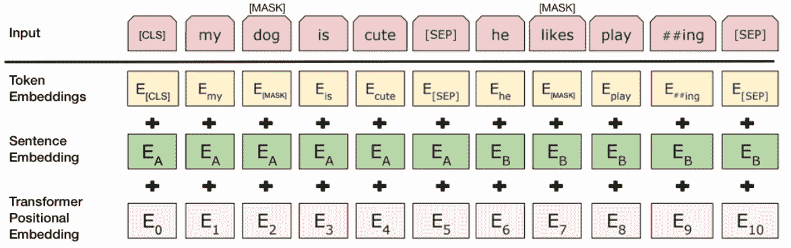
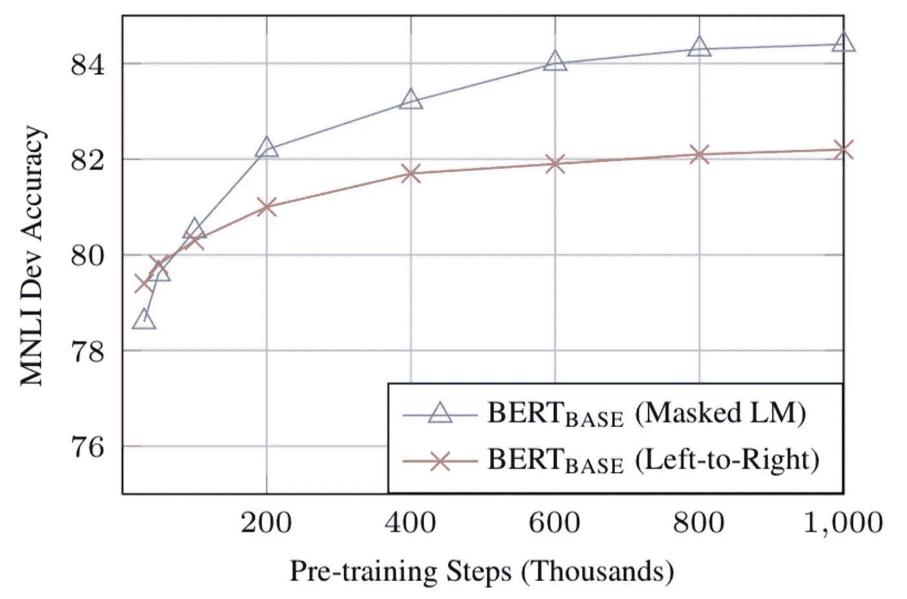

# BERT 解释道:NLP 的艺术语言模型

> 原文：<https://towardsdatascience.com/bert-explained-state-of-the-art-language-model-for-nlp-f8b21a9b6270?source=collection_archive---------0----------------------->

BERT(来自变压器的双向编码器表示)是谷歌人工智能语言的研究人员最近发表的一篇论文。它在各种各样的 NLP 任务中展示了最先进的结果，包括问答(SQuAD v1.1)、自然语言推理(MNLI)等，从而在机器学习社区中引起了轰动。

BERT 的关键技术创新是将 Transformer(一种流行的注意力模型)的双向训练应用于语言建模。这与以前从左到右或者结合从左到右和从右到左训练来查看文本序列的努力形成对比。论文的研究结果表明，双向训练的语言模型比单向训练的语言模型具有更深的语境感和语流感。在论文中，研究人员详细介绍了一种名为掩蔽 LM (MLM)的新技术，它允许在模型中进行双向训练，这在以前是不可能的。

# 背景

在计算机视觉领域，研究人员已经多次展示了迁移学习的价值——在已知任务(例如 ImageNet)上预先训练神经网络模型，然后进行微调——使用经过训练的神经网络作为新的特定目的模型的基础。近年来，研究人员已经表明，类似的技术在许多自然语言任务中是有用的。

另一种不同的方法是基于特征的训练，这种方法在 NLP 任务中也很流行，并在最近的 ELMo 论文中举例说明。在这种方法中，预先训练的神经网络产生单词嵌入，然后将其用作 NLP 模型中的特征。

# 伯特是如何工作的

BERT 使用 Transformer，这是一种学习文本中单词(或子单词)之间上下文关系的注意力机制。一般来说，Transformer 包括两个独立的机制——一个读取文本输入的编码器和一个为任务生成预测的解码器。由于 BERT 的目标是生成一个语言模型，所以只有编码器机制是必要的。谷歌在[的一篇论文](https://arxiv.org/pdf/1706.03762.pdf)中描述了 Transformer 的详细工作原理。

与顺序读取文本输入(从左到右或从右到左)的方向模型相反，Transformer 编码器一次读取整个单词序列。因此，它被认为是双向的，虽然说它是非定向的会更准确。这一特性允许模型基于单词的所有周围环境(单词的左侧和右侧)来学习单词的上下文。

下图是变压器编码器的高级描述。输入是一系列标记，这些标记首先被嵌入到向量中，然后在神经网络中进行处理。输出是大小为 H 的向量序列，其中每个向量对应于一个具有相同索引的输入令牌。

当训练语言模型时，存在定义预测目标的挑战。许多模型预测序列中的下一个单词(例如，“孩子从 __”回家)，这是一种方向性的方法，固有地限制了上下文学习。为了克服这一挑战，BERT 采用了两种训练策略:

## 蒙面 LM (MLM)

在将单词序列输入 BERT 之前，每个序列中 15%的单词被替换为一个[MASK]标记。然后，该模型尝试根据序列中其他未屏蔽单词提供的上下文来预测屏蔽单词的原始值。在技术术语中，输出字的预测需要:

1.  在编码器输出之上添加分类层。
2.  将输出向量乘以嵌入矩阵，将它们转换到词汇维度。
3.  用 softmax 计算词汇中每个单词的概率。

BERT 损失函数只考虑屏蔽值的预测，而忽略非屏蔽字的预测。因此，该模型比方向模型收敛得更慢，这一特性被其增强的上下文感知所抵消(参见要点 3)。

*注意:在实践中，BERT 实现稍微复杂一些，并不能取代所有的 15%屏蔽字。更多信息参见* [*附录 A*](https://www.lyrn.ai/2018/11/07/explained-bert-state-of-the-art-language-model-for-nlp/#appendix-A) *。*

## 下一句预测(NSP)

在 BERT 训练过程中，模型接收句子对作为输入，并学习预测句子对中的第二个句子是否是原始文档中的后续句子。在训练期间，50%的输入是一对，其中第二个句子是原始文档中的后续句子，而在另外 50%中，从语料库中随机选择一个句子作为第二个句子。假设随机句子将与第一个句子断开。

为了帮助模型在训练中区分这两个句子，输入在进入模型之前以下列方式处理:

1.  在第一个句子的开头插入一个[CLS]标记，在每个句子的结尾插入一个[SEP]标记。
2.  指示句子 A 或句子 B 的句子嵌入被添加到每个记号。句子嵌入在概念上类似于词汇为 2 的标记嵌入。
3.  向每个标记添加位置嵌入，以指示其在序列中的位置。Transformer 论文中介绍了位置嵌入的概念和实现。

Source: [BERT](https://arxiv.org/abs/1810.04805) *[Devlin et al*., 2018], with modifications

为了预测第二个句子是否确实与第一个句子相关联，执行以下步骤:

1.  整个输入序列经过变压器模型。
2.  使用简单的分类层(权重和偏差的学习矩阵)，将[CLS]令牌的输出转换成 2×1 形状的向量。
3.  用 softmax 计算 IsNextSequence 的概率。

在训练 BERT 模型时，屏蔽 LM 和下一句预测一起训练，目标是最小化两种策略的组合损失函数。

# 如何使用 BERT(微调)

使用 BERT 完成特定任务相对简单:

BERT 可以用于各种各样的语言任务，同时只在核心模型中增加了一个小的层:

1.  通过在[CLS]令牌的转换器输出之上添加分类层，类似于下一句分类来完成诸如情感分析的分类任务。
2.  在问题回答任务中(例如，SQuAD v1.1)，软件接收关于文本序列的问题，并被要求在序列中标记答案。使用 BERT，可以通过学习标记答案开始和结束的两个额外向量来训练问答模型。
3.  在命名实体识别(NER)中，软件接收文本序列，并被要求标记文本中出现的各种类型的实体(人、组织、日期等)。使用 BERT，可以通过将每个令牌的输出向量馈送到预测 NER 标签的分类层来训练 NER 模型。

在微调训练中，大多数超参数保持与 BERT 训练中相同，本文对需要调整的超参数给出了具体指导(第 3.5 节)。BERT 团队已经使用这种技术在各种具有挑战性的自然语言任务上实现了最先进的结果，详见本文的第 4 部分。

# 外卖食品

1.  模型的大小很重要，即使是大规模的。 BERT_large，拥有 3.45 亿个参数，是同类型中最大的模型。在小规模任务上，它明显优于 BERT_base，后者使用相同的架构，只有 1 . 1 亿个参数。
2.  *有了足够的训练数据，更多的训练步数==更高的准确率。*例如，在 MNLI 任务上，当在 1M 步(128，000 字批量大小)上训练时，与相同批量大小的 500K 步相比，BERT_base 准确度提高了 1.0%。
3.  *伯特的双向方法(MLM)比从左到右的方法*收敛得慢(因为每批中只有 15%的单词被预测)，但是在少量的预训练步骤之后，双向训练仍然优于从左到右的训练。

Source: [BERT](https://arxiv.org/abs/1810.04805) *[Devlin et al*., 2018]

# 计算考虑因素(培训和应用)

# 结论

BERT 无疑是机器学习用于自然语言处理的一个突破。事实上，它的平易近人，并允许快速微调，将有可能允许在未来广泛的实际应用。在这个总结中，我们试图描述论文的主要思想，而不是淹没在过多的技术细节中。对于那些希望更深入了解的人，我们强烈建议阅读全文和其中引用的辅助文章。另一个有用的参考是 [BERT 源代码](https://github.com/google-research/bert)和模型，它们涵盖了 103 种语言，并由研究团队慷慨地作为开源发布。

## 附录 A —单词屏蔽

在 BERT 中训练语言模型是通过预测输入中随机选取的 15%的标记来完成的。这些标记经过如下预处理— 80%替换为“[MASK]”标记，10%替换为随机单词，10%使用原始单词。促使作者选择这种方法的直觉如下(感谢来自 Google 的 Jacob Devlin 的洞察力):

*   如果我们 100%的时间都使用[MASK],那么这个模型不一定能为非屏蔽单词产生良好的表征。未屏蔽的标记仍然用于上下文，但是该模型被优化用于预测屏蔽的单词。
*   如果我们在 90%的时间里使用[掩码],在 10%的时间里使用随机单词，这将告诉模型观察到的单词是*永远不会*正确的。
*   如果我们在 90%的时间里使用[MASK],在 10%的时间里保留同一个单词，那么这个模型就可以简单地复制非上下文嵌入。

这种方法的比率没有进行消融，不同的比率可能效果更好。此外，模型性能并没有通过简单地屏蔽 100%的所选令牌来测试。

*关于最近机器学习研究的更多总结，请查看* [*Lyrn。AI*](https://www.lyrn.ai) *。*