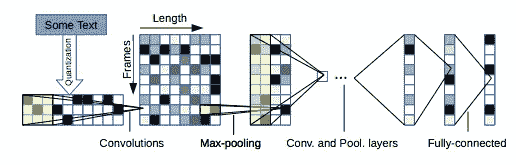
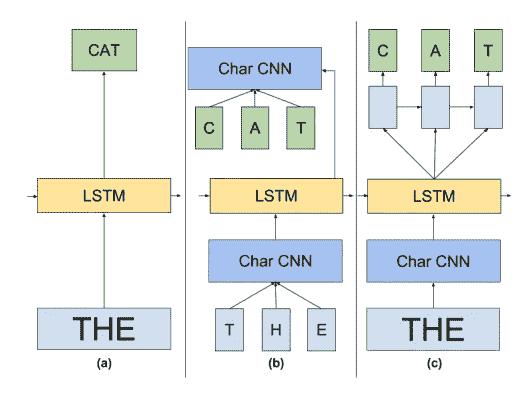
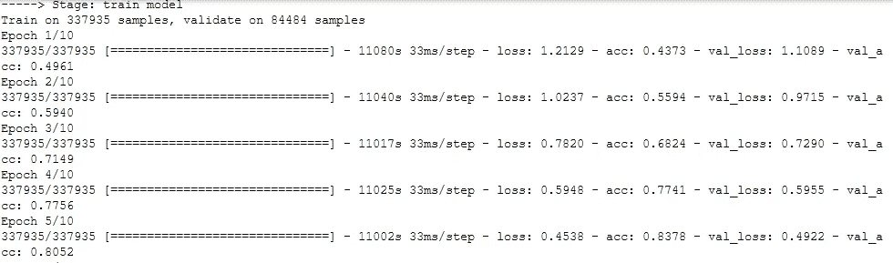

# 除了单词嵌入，为什么你需要知道字符嵌入？

> 原文：<https://towardsdatascience.com/besides-word-embedding-why-you-need-to-know-character-embedding-6096a34a3b10?source=collection_archive---------1----------------------->


Photo by [Kai D.](https://unsplash.com/@dilucidus?utm_source=medium&utm_medium=referral) on [Unsplash](https://unsplash.com?utm_source=medium&utm_medium=referral)

2013 年，Tomas Mikolov [1]引入了单词嵌入来学习更好的单词质量。那时，单词嵌入是处理文本的最新技术。后来，也引入了 doc2vec。如果我们从另一个角度思考呢？不是从一个单词到一个文档的聚合，而是从一个字符到一个单词的聚合。

在这篇文章中，你将经历什么，为什么，什么时候以及如何进行字符嵌入。

# 什么？

项和扬恩[2]介绍了人物 CNN。他们发现字符包含了改善模型性能的关键信号。在本文中，字符表定义了 70 个字符，其中包括 26 个英文字母、10 个数字、33 个特殊字符和换行符。



Capture from Text Understanding from Scratch (Xiang and Yann, 2016)

```
# Copy from Char CNN paperabcdefghijklmnopqrstuvwxyz0123456789 -,;.!?:’’’/\|_@#$%ˆ&*˜‘+-=()[]{}
```

另一方面，Google Brain 团队引入了[探索语言建模的极限](https://arxiv.org/pdf/1602.02410.pdf)并发布了 [lm_1b](https://github.com/tensorflow/models/tree/master/research/lm_1b) 模型，该模型包含 256 个向量(包括 52 个字符、特殊字符)，维数仅为 16。与单词嵌入相比，维数可以增加到 300，而向量的数量是巨大的。



Capture from Exploring the Limits of Language Modeling ( Rafal et al., 2016)

# 为什么？

在英语中，所有的单词都是由 26 个字符组成的(如果同时包含大小写字符，则为 52 个字符，如果包含特殊字符，则为更多)。有了字符嵌入，每个单词的**向量都可以形成，即使是未登录词**(可选)。另一方面，单词嵌入只能处理那些看到的单词。

Another benefit is that it good fits for **misspelling words, emoticons, new words (e.g. In 2018, Oxford English Dictionary introduced new word which is boba tea 波霸奶茶. Before that we do not have any pre-trained word embedding for that)**.

它比 word2vec 嵌入更好地处理不常用的单词，因为后者缺乏足够的训练机会来训练这些不常用的单词。

第三个原因是，由于只有少量的向量，它**降低了模型的复杂性并提高了性能**(就速度而言)

# 什么时候？

在 NLP 中，我们可以将字符嵌入应用于:

*   [文本分类](https://arxiv.org/pdf/1509.01626.pdf)
*   [语言模型](https://arxiv.org/pdf/1602.02410.pdf)
*   [命名实体识别](https://www.aclweb.org/anthology/Q16-1026)

# 怎么会？

***字符嵌入***

1.  定义一个列表中的一个字符(即 m)。例如，可以使用字母数字和一些特殊字符。对于我的例子，英语字符(52)，数字(10)，特殊字符(20)和一个未知字符，UNK。总共 83 个字符。
2.  将字符转换为 1-hot 编码，得到一个向量序列。对于未知字符和空白字符，用全零向量代替。如果超过预定义的最大字符长度(即 l)，则忽略它。每个字符的输出是 16 维向量。
3.  使用 3 个 1D CNN 层(可配置)来学习序列

***句子嵌入***

1.  双向 LSTM 遵循 CNN 层
2.  LSTM 之后添加了一些辍学层。

# 密码

这个示例代码将演示如何使用字符嵌入来进行分类。测试数据集可以在 [UCI ML 知识库](http://archive.ics.uci.edu/ml/datasets/News+Aggregator)中找到。

***预处理***

首先，我们需要准备元信息，包括字符字典和将标签从文本转换为数字(因为 keras 只支持数字输入)。

```
preporcess(labels=df['category'].unique())
```

输出

```
-----> Stage: preprocess
Totoal number of chars: 83
First 3 char_indices sample: {';': 0, '"': 1, 'A': 2}
First 3 indices_char sample: {0: ';', 1: '"', 2: 'A'}
Label to Index:  {'b': 0, 'e': 2, 'm': 3, 't': 1}
Index to Label:  {0: 'b', 1: 't', 2: 'e', 3: 'm'}
```

***流程***

我们必须将原始输入训练数据和测试转换为 keras 输入的 numpy 格式

```
x_train, y_train = char_cnn.process(
    df=train_df, x_col='headline', y_col='category')
x_test, y_test = char_cnn.process(
    df=test_df, x_col='headline', y_col='category')
```

输出

```
-----> Stage: process
Number of news: 100
Actual max sentence: 3
Train Shape:  (100, 5, 256) (100,)
-----> Stage: process
Number of news: 10
Actual max sentence: 1
Train Shape:  (10, 5, 256) (10,)
```

***建立模型***

利用 CNN 层和双向 LSTM 构建字符 CNN 文本分类器。首先，用一维 CNN 建立字符块

```
def _build_character_block(
    self, block, dropout=0.3, 
    filters=[64, 100], kernel_size=[3, 3], 
    pool_size=[2, 2], padding='valid', activation='relu', 
    kernel_initializer='glorot_normal'):

    for i in range(len(filters)):
        block = Conv1D(
            filters=filters[i], kernel_size=kernel_size[i],
            padding=padding, activation=activation,
            kernel_initializer=kernel_initializer)(block) block = Dropout(dropout)(block)
        block = MaxPooling1D(pool_size=pool_size[i])(block) block = GlobalMaxPool1D()(block)
    block = Dense(128, activation='relu')(block)
    return block
```

句子级别块将使用 3 个字符块构建

```
def _build_sentence_block(
    self, max_len_of_sentence, max_num_of_setnence, 
    filters=[[100, 200, 200], [200, 300, 300], [300, 400, 400]], 
    kernel_sizes=[[4, 3, 3], [5, 3, 3], [6, 3, 3]], 
    pool_sizes=[[2, 2, 2], [2, 2, 2], [2, 2, 2]],
    dropout=0.4):

    sent_input = Input(shape=(max_len_of_sentence, ), dtype='int64')
    embedded = Embedding(self.num_of_char, char_dimension,
        input_length=max_len_of_sentence)(sent_input)

    blocks = []
    for i, filter_layers in enumerate(filters):
        blocks.append(
            self._build_character_block(
                    block=embedded, filters=filter_layers,
                    kernel_size=kernel_sizes[i],
                    pool_size=pool_sizes[i])
            ) sent_output = concatenate(blocks, axis=-1)
    sent_output = Dropout(dropout)(sent_output)
    sent_encoder = Model(inputs=sent_input, outputs=sent_output) return sent_encoder
```

最后，我们将根据句子建立文档块

```
def _build_document_block(
    self, sent_encoder, max_len_of_sentence, max_num_of_setnence, 
    num_of_label, dropout=0.3, 
    loss='sparse_categorical_crossentropy', optimizer='rmsprop',
    metrics=['accuracy']):

    doc_input = Input(shape=(
        max_num_of_setnence, max_len_of_sentence), dtype='int64')
    doc_output = TimeDistributed(sent_encoder)(doc_input)
    doc_output = Bidirectional(LSTM(
        128, return_sequences=False, 
        dropout=dropout))(doc_output) doc_output = Dropout(dropout)(doc_output)
    doc_output = Dense(128, activation='relu')(doc_output)
    doc_output = Dropout(dropout)(doc_output)
    doc_output = Dense(
        num_of_label, activation='sigmoid')(doc_output) doc_encoder = Model(inputs=doc_input, outputs=doc_output)
    doc_encoder.compile(
        loss=loss, optimizer=optimizer, metrics=metrics)
    return doc_encoder
```

输出

***训练***

```
train(x_train, y_train, x_test, y_test, epochs=10)
```

输出



# 结论

你可以从 [github](https://github.com/makcedward/nlp/blob/master/sample/nlp-character_embedding.ipynb) 中找到所有代码。

字符嵌入是解决大量文本分类的绝妙设计。它解决了一些单词嵌入问题。字符嵌入和单词嵌入的区别在于，字符嵌入可以构建任何单词，只要包含这些字符。

脸书艾研究([尚可](https://research.fb.com/category/facebook-ai-research/))做了更进一步。小组使用子词来训练模型。以“脸书”为例，他们用“F”、“Fa”、“Fac”等来训练单词。关于 fasttext 的详细信息，您可以访问他们的网站[以便更好地了解。](https://fasttext.cc)

这是对字符嵌入的一些评论，因为它不包括任何词义，而只是使用字符。我们可以同时包括字符嵌入和单词嵌入来解决我们的 NLP 问题。

# 额外材料

[用于信息检索的卷积池结构潜在语义模型](http://www.iro.umontreal.ca/~lisa/pointeurs/ir0895-he-2.pdf)

[学习词性标注的字符级表示](http://proceedings.mlr.press/v32/santos14.pdf)

[用于文本分类的字符级卷积网络](https://arxiv.org/pdf/1509.01626.pdf)

[情感分析中的人物级深度学习](https://offbit.github.io/how-to-read/)

# 关于我

我是湾区的数据科学家。专注于数据科学、人工智能，尤其是 NLP 和平台相关领域的最新发展。你可以通过[媒体博客](http://medium.com/@makcedward/)、 [LinkedIn](https://www.linkedin.com/in/edwardma1026) 或 [Github](https://github.com/makcedward) 联系我。

# 参考

[1]托马斯·米科洛夫、格雷戈·科拉多、程凯和杰弗里·迪恩。向量空间中单词表示的有效估计。2013 年 9 月。[https://arxiv.org/pdf/1301.3781.pdf](https://arxiv.org/pdf/1301.3781.pdf)

[2]张翔，颜乐存。文本理解从零开始。2016.[https://arxiv.org/pdf/1502.01710v5.pdf](https://arxiv.org/pdf/1502.01710v5.pdf)

[3]金伊、杰尼特伊、桑塔格、拉什..字符感知神经语言模型。2015.[https://arxiv.org/pdf/1508.06615.pdf](https://arxiv.org/pdf/1508.06615.pdf)