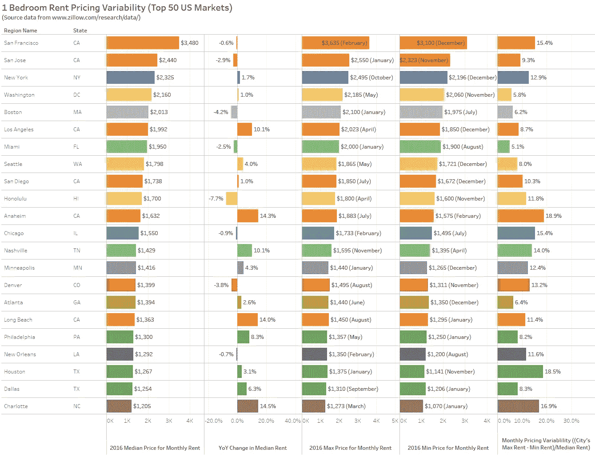
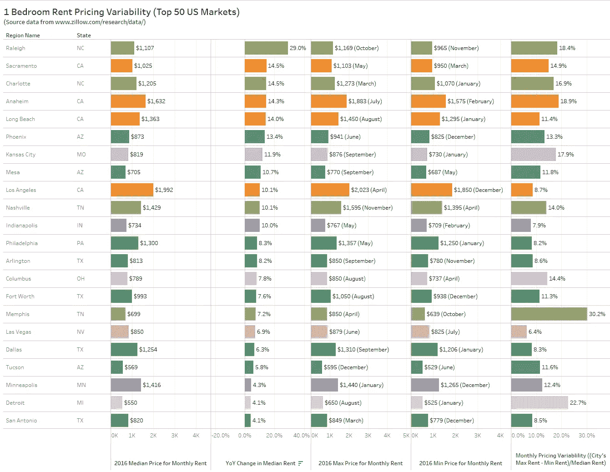
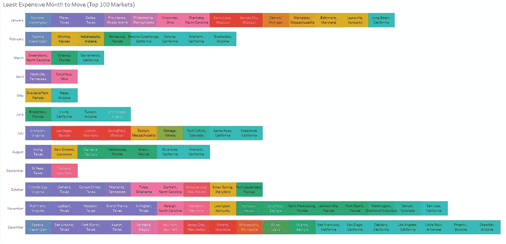
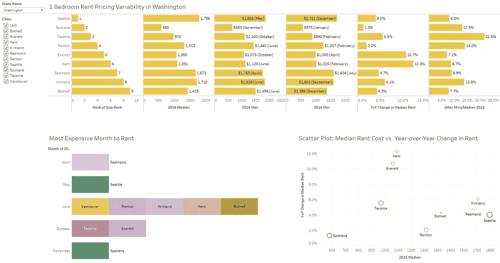

# 按城市划分的最佳和最差租赁时间

> 原文：<https://towardsdatascience.com/best-and-worst-times-to-rent-by-city-f19aaa1378ae?source=collection_archive---------1----------------------->

寻找一个新的公寓或晚上更新你的租约是我们许多人每年都必须参与的一些更有压力的事件。一部分原因是每天都可能发生的租金定价的剧烈波动。特别是对于长期租赁，即使是轻微的租金价格上涨也意味着租赁期内的一笔巨款。利用 Zillow 提供的逐月单居室租金数据，我们来看看一些与租金相关的指标:
美国顶级城市租金最贵和最便宜的月份
年同比租金价格趋势
每个市场的价格波动幅度

*下面我将呈现一些最有趣的全国范围内的见解，但如果你有兴趣查看特定的州或城市，我强烈推荐你访问我的* [*免费互动仪表板*](https://public.tableau.com/profile/david.peterson#!/vizhome/MonthlyRentChangesandVariability/ApartmentRentPricingVariabilityandTrends) *，以便更深入地挖掘你感兴趣的地点。*

**租金最贵的城市:一居室租金定价——按月租金中位数(美元)排序**

看看排名前 50 位的市场，通常都是顶级玩家。大城市和硅谷位居前列，前五大市场的一居室公寓平均月租金超过 2000 美元！旧金山以每月 3480 美元的租金中位数领先，这似乎很荒谬。然而，这五大市场的租金中值增幅不超过 1.7%(纽约)，实际上旧金山、圣何塞和波士顿的租金有所下降(我知道你在想什么，“太便宜了！”).那么，如果这些顶级市场没有继续暴涨，那么哪些市场会继续暴涨呢？

**上涨的租金成本:单卧室租金定价——按租金中值的同比变化排序**

当查看前 50 个市场中哪个经历了最大的年同比增长时，北卡罗来纳州和加利福尼亚州占据了前 5 名。北卡罗来纳州城市罗利和夏洛特的增长率分别为 29%和 14.5%。在加州，萨克拉门托、阿纳海姆和长滩的同比增幅分别为 14.5%、14.3%和 14.0%。

**定价可变性:单卧室租金定价——按月定价可变性排序**

我为此分析的另一件事是定价的每月可变性。为此，我查看了每个城市最贵月的租金中位数和最便宜月的租金中位数之间的差异，并将该差异除以 2016 年的租金中位数。田纳西州的孟菲斯以 30.2%的可变性击败竞争对手，紧随其后的是底特律(22.7%)。这两个城市的月租金都相对较低(月租金中位数都在 700 美元以下)，但排名第三的阿纳海姆的月租金变动率为 18.9%(最便宜的月份(仍为 1575 美元)和最贵的月份(1883 美元)相差 308 美元)。另一个值得一提的是旧金山，排在前十名之外。在 12 月(3100 美元)和 2 月(3635 美元)租公寓有 535 美元的月差。尽管如此，引用北加州人的话说，即使是最便宜的月租金 3100 美元也是“海拉贵”。

当观察排名最前的所有 272 个城市时，发现平均而言，租金最便宜的月份是 1 月和 12 月，其中 34.2%的城市有最便宜的月份。租金最贵的时间往往是在夏季的中心(9 月是 13.1%的城市租金最贵的月份，紧随其后的是 6 月和 7 月。

现在让我们来看看排名前 100 的市场，这些市场被贴上了一居室租金最便宜的月份的标签。瓷砖按州进行了着色:

现在，这些只是一些样本见解，但我已经建立了一个交互式仪表板，供您在 Tableau Public 上访问和互动，以便您可以更深入地了解您最关心的州和城市。点击此处查看！

[要阅读更多关于公立学校免费餐项目、NBA 出勤率和旅游业的数据报道，请点击这里！](http://dwpeterson.com/category/data-stories/)

**最佳和最差租赁月份(美国前 30 大市场):**

**纽约纽约**纽约房租最便宜的月份:12 月(比纽约房租中位数低 5)
纽约房租最贵的月份:10 月(比纽约房租中位数高 7)
加州洛杉矶
洛杉矶房租最便宜的月份:12 月(比洛杉矶房租中位数低 7)
洛杉矶房租最贵的月份:4 月(比洛杉矶房租中位数高 1)
**芝加哥、 伊利诺伊州**
芝加哥房租最便宜的月份:7 月(比芝加哥房租中位数低 3)
芝加哥房租最贵的月份:2 月(比芝加哥房租中位数高 11)
**德克萨斯州休斯顿**
休斯顿房租最便宜的月份:11 月(比休斯顿房租中位数低 9)
休斯顿房租最贵的月份:1 月(比休斯顿房租中位数高 8)
**费城、 宾夕法尼亚州**
费城房租最便宜的月份:1 月(比费城房租中位数低 3)
费城房租最贵的月份:5 月(比费城房租中位数高 4)
**亚利桑那州凤凰城**
凤凰城房租最便宜的月份:12 月(比凤凰城房租中位数低 5)
凤凰城房租最贵的月份:6 月(比凤凰城房租中位数高 7)
**拉斯维加斯、 内华达州**
拉斯维加斯房租最便宜的月份:7 月(比拉斯维加斯房租中位数低 2)
拉斯维加斯房租最贵的月份:6 月(比拉斯维加斯房租中位数高 3)
**德克萨斯州圣安东尼奥**
圣安东尼奥房租最便宜的月份:12 月(比圣安东尼奥房租中位数低 4)
圣安东尼奥房租最贵的月份:3 月(比圣安东尼奥房租中位数高 3%)

*要查看其他几大城市房租最便宜和最贵的月份，请前往* [*我的网站*](https://dwpeterson.com/2017/12/03/best-worst-rent-prices-per-city/) *！*

*感谢您阅读我最新的数据帖子。作为一名产品营销和数据分析专业人士，我对数据支持的讲故事充满热情。这些数据新闻帖子是我将真实数据与我个人的不同兴趣整合起来的方式，这些兴趣包括从旅行和娱乐到经济和社会问题的任何事情。
如果您有任何评论、故事想法或预期的数据项目，请随时发送电子邮件至 dwpwriting <至> gmail < dot > com 或通过*[*LinkedIn*](https://www.linkedin.com/in/davidwpeterson/)*联系我。*

*原载于 2017 年 12 月 3 日*[*【dwpeterson.com】*](https://dwpeterson.com/2017/12/03/best-worst-rent-prices-per-city/)*。*