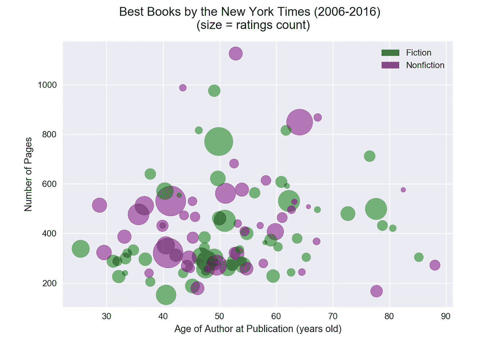
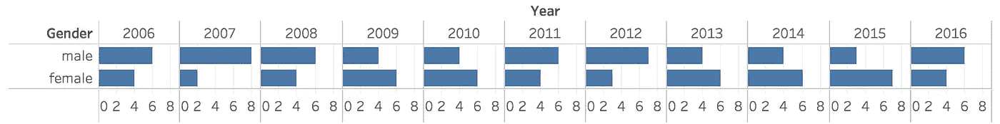
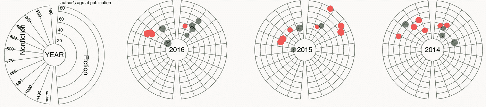
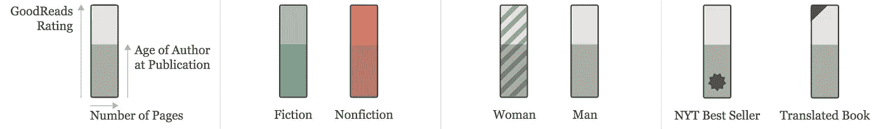
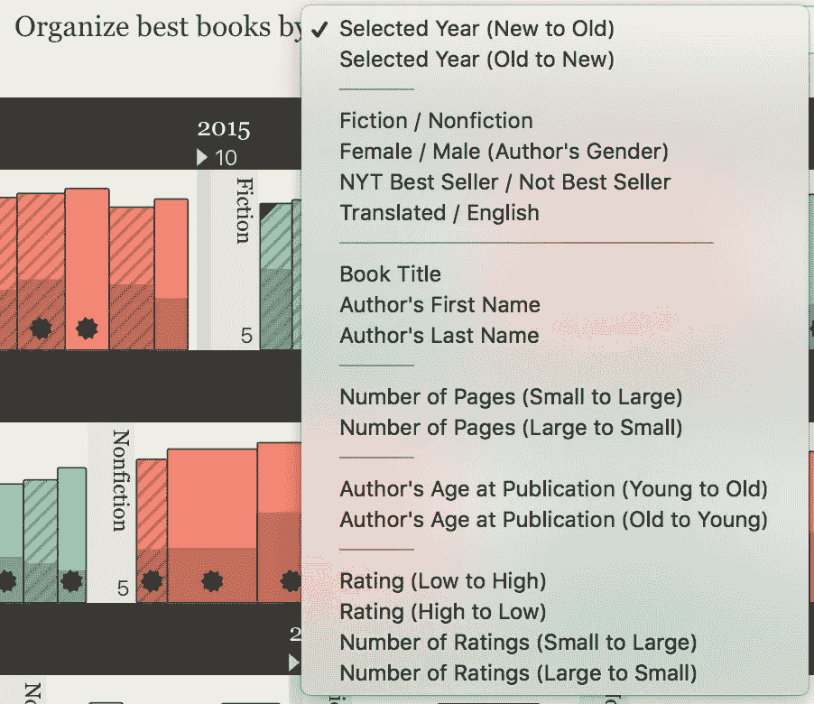
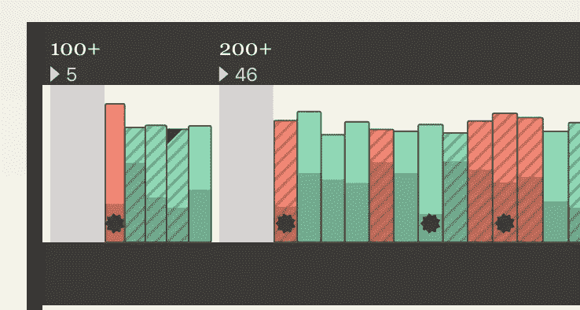
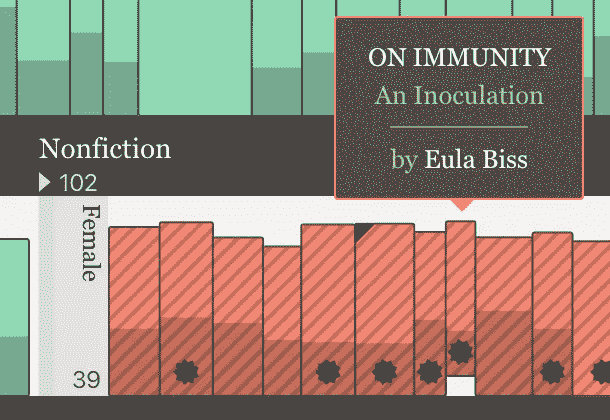
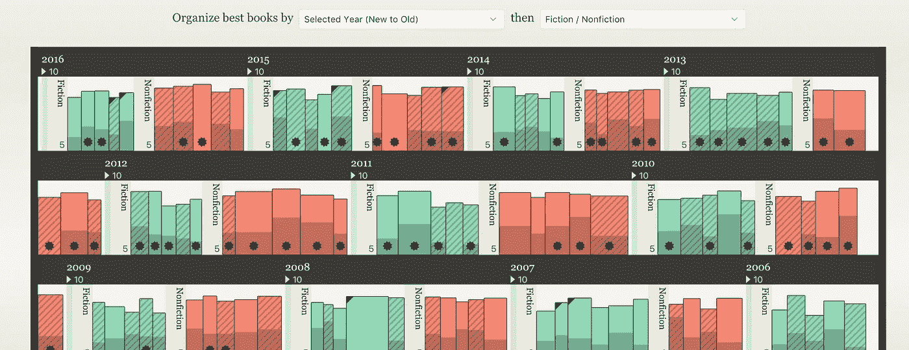

# 最佳书架:用 D3.js 改编真实世界对象的数据可视化

> 原文：<https://towardsdatascience.com/best-bookshelf-data-visualization-adapting-real-world-objects-with-d3-js-ca420b5d79cc?source=collection_archive---------6----------------------->

这个项目是关于数据可视化项目，最好的书架。

[](http://tany.kim/best-bookshelf) [## 最佳书架

### 1996 年以来《纽约时报》评选的最佳书籍的数据可视化。由谭永金创作。由…提供动力

tany.kim](http://tany.kim/best-bookshelf) 

当你听到“数据可视化”时，第一个想到的视觉形式是什么？条形图还是折线图？一些更奇特的东西，比如热图或者定向网络？虽然这些经过验证的可视化技术已被广泛用于有效地交流数据，但独特的视觉形式可以更好地实现主题匹配，并且可以简单地在视觉上更令人愉悦*，而*不会牺牲数据可视化最重要的作用——将数字真实地编码为视觉元素。

这篇文章是关于我最近的数据可视化项目[最佳书架](http://tany.kim/best-bookshelf)的设计过程。*我将书籍和作者数据可视化，以适应现实世界中的物体、书籍和书架*。改编有三个方面。

1.  每本书的数据维度*被编码到一本书的物理属性*中。
2.  *分组和排序书籍的方式*类似于书架上存放书籍的各种规则(每个人都有她或他自己的方式！).
3.  交互和跟随*动画复制了在书架上拿起和移动书籍*的动作。


How would you organize your books on the bookshelf? ([source](https://www.google.com/url?sa=i&rct=j&q=&esrc=s&source=images&cd=&ved=0ahUKEwiM7YzJg4rVAhVollQKHTMkDwgQjRwIBw&url=https%3A%2F%2Fwww.pinterest.com%2Fexplore%2Fbookshelf-ideas%2F&psig=AFQjCNE494wcYORMRh0z81ZPxQisze7QEQ&ust=1500164773325666))

Curious to know what the height, width, diagonal lines, tags, and colors mean? How would you organize books?

# 《纽约时报》最佳书籍及其元数据

我关心我花时间看的内容的质量。在找好书推荐的时候，偶然看到一篇文章，《纽约时报》的[2016 年 10 本最好的书](https://www.nytimes.com/interactive/2016/books/review/best-books.html)。从这开始，我列出了从 1996 年开始的所有最好的书，那是 NYT 第一次宣布最好/最著名的书。后来，利用[Goodreads API](https://www.goodreads.com/api)和[纽约时报图书 API](https://developer.nytimes.com/books_api.json) (当然还有手工填写电子表格)，我收集了每本书及其作者的元数据。Python 脚本可以在我的 [GitHub repo](https://github.com/tanykim/best-bookshelf) 获得。

最终，我有了 206 本书和 184 个作者。数据集包括以下字段。在这里，我按数据类型列出了它们——它们是在设计过程中将被可视化编码的东西。

**名义数据**

*   书名:如《房间》
*   作者姓名:如爱玛·多诺霍
*   出版商:例如，利特尔、布朗和公司

**分类数据—每种类型有两个值**

*   体裁:小说和非小说
*   作者性别:女性或男性
*   畅销书:要么这些书是纽约时报的畅销书，要么不是
*   语言:原文为英文或翻译

**定量数据—序数**

*   选择年份:例如，2010 年
*   出版和原始出版日期
*   作者的出生日期:如 1969 年 10 月 24 日
*   作者死亡日期:可以为空

**定量数据—连续**

*   页数
*   给图书评分的 Goodreads 用户数
*   平均阅读评分
*   最初出版时作者的年龄:从最初出版日期和出生/死亡日期开始计算。
*   书名的长度

# 数据集的初步检查

在可视化设计的早期阶段，我通常会快速检查数据集，看看是否有什么有趣的模式。我使用的一些常用方法是带有 ggplot 的 *R 和带有 Matplotlib 或 Seaborn* 的 *Python。为了这个项目，我也尝试了 [Tableau Public](https://public.tableau.com/s/) 。通过这项初步工作，我从数据集中发现了一些事实。举几个例子，我看到大多数书的页数在 200-400 页之间；小说的作者比非小说的作者年龄范围更广。从过去 11 年的数据来看，我并没有看到作者性别的不平衡(但是你会在文章的最后看到一些不同的东西！).*



Age of author at publication & Number of pages, generated with Python Matplotlib



Gender of authors of the best books from 1996 to 2006

另外，我按年创建了*小倍数*。这是用 D3.js 做的。



Small multiples: visualizing best books by year

在这一点上，我不相信数据集对于一个交互式可视化项目来说是足够引人注目的。老实说，尽管我在生成数据集方面付出了努力，但我还是对继续这个项目持怀疑态度。

# 来自日常物品的设计灵感

我承认简单地在二维图表上绘制图书并不有趣，我开始考虑一种不同的方法——根据不同的数据维度列出和过滤图书。这样，作为数据点的书籍可以以线性方式显示；然后我意识到这正是人们整理书架上书籍的方式。

## 将数据字段编码成书籍的物理属性

在一本书的物理属性中，我重点关注了当一本书被垂直放在书架上时可以实际看到的那些属性。你只会看到书脊是一个细长的长方形，其宽度由页数决定(假设纸张厚度相同)。因此，将页面数量编码成矩形宽度是一个直观的决定。高度的决定是相当武断的，但我希望它是现实的；*物理属性的维度可以代表一个数据字段的范围。*在连续的数据维度中，我发现所有书籍的平均 Goodreads 评分大多在五分之三以上。从之前的数据检查中，我发现作者在出版时的年龄在可视化时会很有趣。因此，这个连续的变量在脊柱上呈现为半透明的覆盖层。带有 D3 和 Lodash 的 javascript 代码如下所示:

```
const storyH = 100; //same as maximum book height
const bookWRange = [10, 60]; //book thickness
const bookHRange = [60, storyH]; //book height rangeconst pages = books.map((d) => d.book.pages);
const pageRange = getRange(pages, 100);
const ageRange = getRange(ages, 10);//pages to width
const bookW = d3.scaleLinear().domain(pageRange).range(bookWRange); //average rating to height
const bookH = d3.scaleLinear().domain([3, 5]).range(bookHRange); //age to overlayed height
const middleH = d3.scaleLinear().domain(ageRange)
    .range([10, bookHRange[0]]);//get floor/ceiling range
function getRange(arr, by) {
  return [
    Math.floor(_.min(arr) / by) * by, 
    Math.ceil(_.max(arr) / by) * by
  ];
}
```

在数据集中，有四种分类数据。我想把这一点也编码到书的其他物理属性中。所有这些维度都是二元的，或者有两个可能的值。体裁用颜色区分(绿色代表小说，红色代表非小说)。女作家的书充满了斜线(性别通常用颜色来表示，但我想避免太传统的东西。《纽约时报》的畅销书都标有一颗星。已翻译的图书会在左上角突出显示一个三角形。



Total seven data dimensions are represented as physical attributes of a book. This legends are introduced on the actual project page.

## 组织书籍-对数据集进行分组和排序

让我们重温一下数据类型——分类数据、名义数据、数量序数数据和数量连续数据。为了组织书籍，C *分类和顺序变量用于分组*数据点，而*名义和连续变量用于排序*。



Organizing (grouping or sorting) options in HTML page: first, the books are grouped by year, then by genre. The labels are both levels are also displayed.

这些分组和排序功能是作为 HTML 页面中的下拉选择实现的。一旦用户选择了对数据集进行分组或排序的维度，所有的书都会重新排列。如果第一个选择的项目是用于分组的维度，则可以在第一个类别下进一步对图书进行分组或排序(如果第二个级别也是分组，则图书按照第二个组中的原始数据集中所列进行排序)。如果用户选择一个名义或类别尺寸，第二个选项变得不可见。



When the books are sorted by the number of pages (ascending), the dividers appear and the labels are seen as the first-level grouping

排序或分组的结果被合并到可视化中。我把第一个选项的标签放在书架上层的书上。例如，当书籍第一次按年份排序时，您会看到年份和年份内的书籍数量。第二层标签显示在书籍之间的分隔线上。当书名或作者的名字在书脊上旋转时，第二级选项的名字也旋转。当书籍没有预先分组就被分类时，我在书籍之间添加了分隔线，以便更好地索引。

## D3 书的物理运动的过渡



Moving mouse over a book triggers lifting the book and tooltip popup.

当鼠标悬停在一本书上时，这本书的垂直位置会发生变化，这是在模仿被拾取的书的状态。这种微妙的过渡可以包含现实世界物体的特征。

重组书籍意味着改变视觉元素的位置。书籍的过渡以随机速度进行动画制作，首先到同一文章的新位置(X 位置)，然后到新文章(Y 位置)。

# 来自最佳书架的见解

正如我之前所描述的，我没有发现很多关于《纽约时报》选择最佳书籍的惊人事实(模式、相关性或异常值)。然而，调整书架的逻辑和美学，这种可视化有助于研究书籍的视觉编码属性。我发现了一些有趣的见解:

*   2009 年是《纽约时报》选择女性作者的书籍多于男性作者的第一年。自 1996 年以来，男女作家之间一直不平衡。我个人想多读读女人说的话，所以这个发现很重要。
*   非科幻片往往有一个较长的标题，主要是由于它的描述性副标题。与 23 部小说相比，只有 3 部非小说的标题少于 10 个字母。
*   英文原版书占主导地位。只有 11 本书是翻译的，没有一本是 2003 年以前选的。
*   成为畅销书并不意味着 Goodreads 上的高收视率。不过似乎和平均评分更有关系。如果平均评分高于 5 分中的 4 分，成为畅销书的几率会增加约 50%。
*   当作者 35 岁或更年轻时，只有 4 本非小说类图书出版，而当作者 35 岁或更年轻时，有 15 本小说出版。最年轻的五位作者都是小说家。

在最终设计中，我添加了一个输入表单，用户可以通过作者姓名、书名或出版商进行搜索。当用户键入三个或更多字母时，会显示结果总数。这样就可以了解到出版社的图书数量。Knopf 的书最多，25 本；企鹅出版社出版了 16 本，兰登书屋出版了 15 本。

这个项目是一个不直接使用传统图表的数据可视化的例子。相反，我将数据集的主题“书”关联起来，将书和书架的物理属性应用到可视化设计中——将单个数据作为书(将定量连续数据编码为书的大小，将分类数据编码为颜色/图案/标记)，将数据集分组和排序作为组织书的规则，D3 转换作为组织书时书的移动。我希望这篇文章对那些想要创建足够有创意但又不会迷惑用户的定制数据可视化的人有所帮助。

你发现最好的书有什么有趣的地方吗？请通过回复让我们知道！

