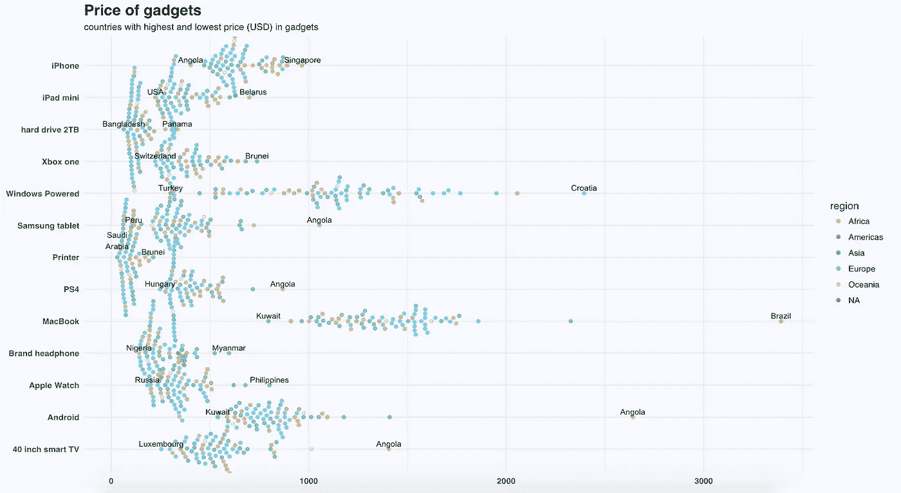
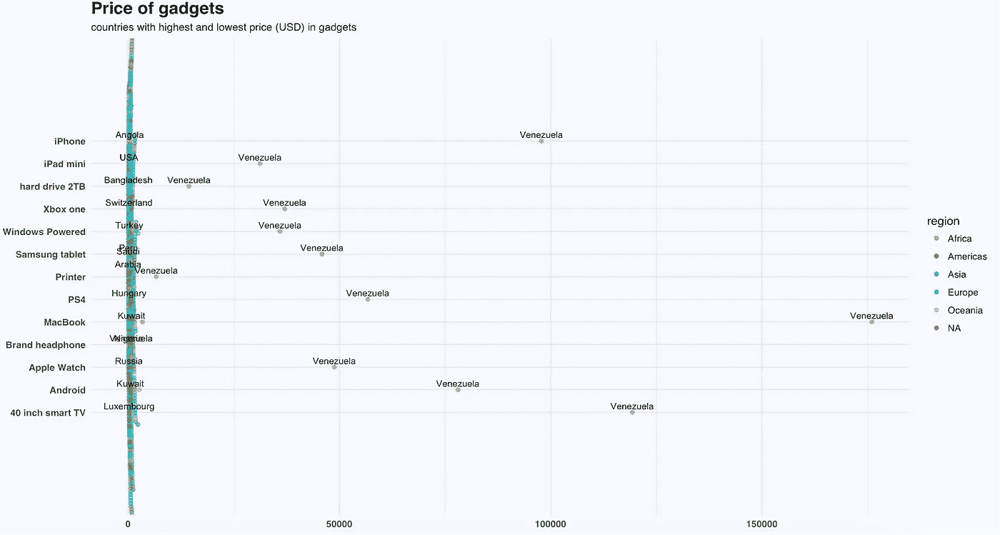
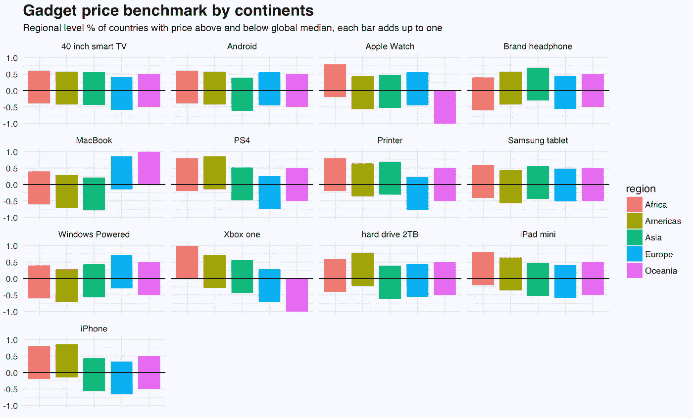
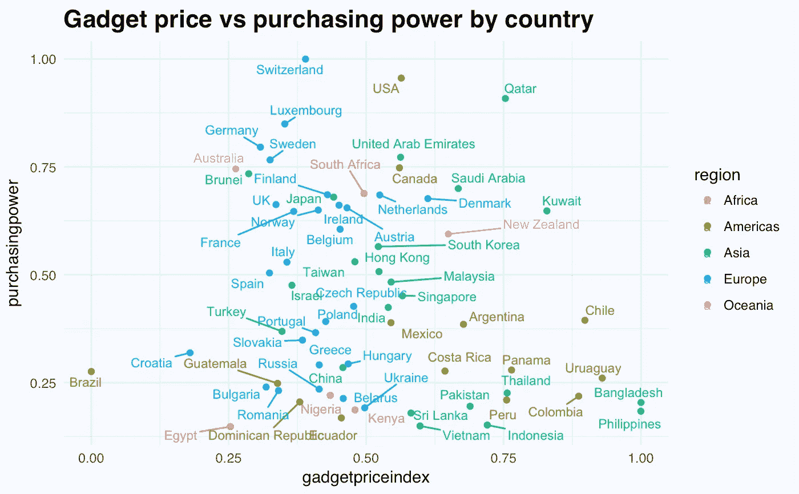

# 购买小玩意最贵和最便宜的国家

> 原文：<https://towardsdatascience.com/best-country-to-buy-gadgets-e5b5cca722f2?source=collection_archive---------4----------------------->

你在哪里可以买到清单上那个小玩意的最优惠价格？使用这个包含 2016-2017 年 72 个国家流行电子设备和品牌成本的数据集，我探索了购买特定小工具最昂贵和最便宜的国家。

gadget price by country and continent (excluding Venezuela)

我们可以进行许多观察，包括但不限于:

*   安哥拉是购买 iphone 的好地方，但不是安卓产品、PS4 或智能电视的好地方
*   孟加拉国在硬盘方面提供很好的交易
*   而在匈牙利，也得到了一台 PS4
*   从俄罗斯买苹果手表可能比从菲律宾买要好

当我第一次看这些数据时，委内瑞拉的物价看起来完全疯了(一部 iphone 可能要 10 万美元),我起初以为有什么问题，直到我读了这篇 [Times](http://time.com/money/3931704/apple-iphone-6-venezuela-inflation/) 的文章，才意识到通货膨胀已经把它的价格吹得不成比例。

如果包括委内瑞拉小配件价格的异常值，图表看起来像这样:

New way to flout your wealth is to buy a gadget in Venezuela

按国家查看后，我们可以探究区域级别的价格。

Gadget price benchmark by region

在区域一级，我们可以看到:

*   大洋洲的 Xbox one 和 Apple Watch 价格更低
*   几乎所有非洲国家苹果产品和游戏设备的价格都高于中值
*   品牌耳机在亚洲有点贵，而 Macbook 在大多数国家价格较低。

除了与全球基准相比，我们还可以与考虑了工资因素的[当地购买力](http://www.nationmaster.com/country-info/stats/Cost-of-living/Local-purchasing-power)相比。这更能说明一个国家的电子产品对当地消费者来说价格过高。

Gadget price is relatively high in several South America and Southeast Asian countries considering purchasing powers

这是我关于数据科学和视觉故事的[# 100 日项目](https://medium.com/@yanhann10)的第 25 天。我的 [github](https://github.com/yanhann10/opendata_viz) 上的全部代码。感谢阅读，欢迎反馈。