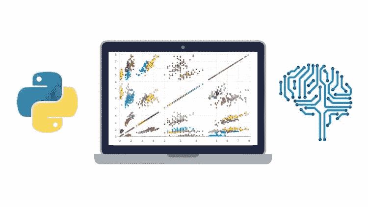
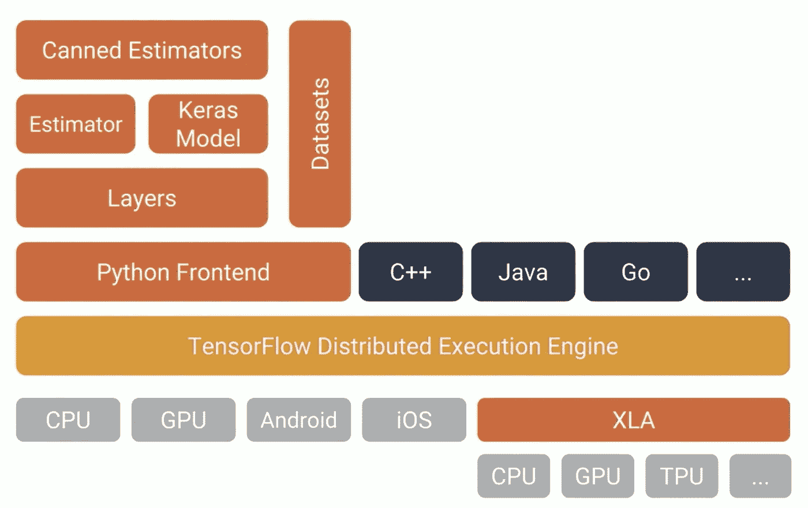
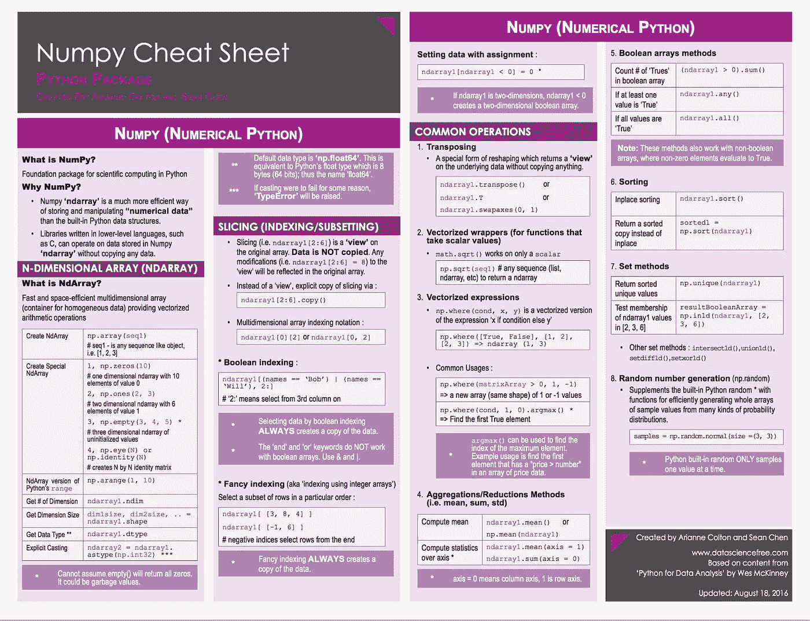

# 机器学习和数据科学的最佳 Python 库:(第 1 部分)

> 原文：<https://towardsdatascience.com/best-python-libraries-for-machine-learning-and-data-science-part-1-f18242424c38?source=collection_archive---------0----------------------->

Python 日渐流行，已经开始取代业界很多流行的语言。Python 受欢迎的主要原因是因为以下原因:

*   Python 因其简单性而被称为初学者语言。
*   Python 有助于开发人员从开发到部署和维护都更加高效。
*   与 Java、C 和 C++相比，Python 的语法非常简单和高级，因此可以用更少的代码行构建应用程序。
*   Python 有大量的库集合。
*   可移植性(当然概率也是 Java 的主要特点)。

## 用于机器学习的 Python:

python 的简单性吸引了许多开发人员建立机器学习和数据科学的库，因为所有这些库，Python 几乎作为数据科学的 R 而流行。一些最好的 Python 机器学习库是:

## 1.张量流:

如果你正在工作或者对机器学习感兴趣，那么你可能听说过这个著名的开源库 Tensorflow。它是由谷歌大脑团队开发的。谷歌几乎所有的应用都使用 Tensorflow 进行机器学习。如果你正在使用谷歌照片或谷歌语音搜索，那么你就间接地在使用 Tensorflow 建立的模型。

Tensorflow 只是一个计算框架，用于表达涉及大量张量运算的算法，因为神经网络可以表示为计算图形，它们可以使用 Tensorflow 作为对张量的一系列运算来实现。张量是代表我们数据的 N 维矩阵。

tensorflow 的主要优势是并行性，这意味着您的计算图形是并行执行的，您可以完全控制执行，并且可以在不同的处理器上调度不同的操作，如 CPU、GPU 等。

Tensorflow 基本上是用 C 和 C++编写的，但有一个复杂的 Python 前端。您的 Python 代码被编译，然后在使用 C 和 C++开发的 Tensorflow 分布式执行引擎上运行。Tensorflow 针对速度进行了优化，它可以利用 XLA 等技术来实现更快的线性代数运算。您可以使用 pip 获取 Tensorflow 或访问该网站获取说明:[https://www.tensorflow.org//?nav=true](https://www.tensorflow.org/install/?nav=true)

详细教程:[https://www . data camp . com/community/tutorials/tensor flow-tutorial](https://www.datacamp.com/community/tutorials/tensorflow-tutorial)

## 2.Numpy:

Numpy 当然是 Python 最伟大的数学和科学计算库之一。Tensorflow 和其他平台在内部使用 Numpy 对张量执行多种操作。Numpy 最重要的特性之一是它的数组接口。

该接口可用于将图像、声波或任何其他原始二进制流表示为 N 维实数数组。Numpy 知识对于机器学习和数据科学非常重要。

## 3.Keras:

Keras 是最酷的机器学习库之一。如果你是机器学习的初学者，我建议你使用 Keras。它提供了一种更简单的表达神经网络的方法。它还提供了一些用于处理数据集、编译模型、评估结果、可视化图表等的工具。

Keras 内部使用 Tensorflow 或 Theano 作为后端。也可以使用其他一些类似 CNTK 的 pouplar 神经网络框架。如果您使用 Tensorflow 作为后端，那么您可以参考本文 Tensorflow 部分显示的 Tensorflow 架构图。与其他库相比，Keras 速度较慢，因为它使用后端基础设施构建计算图，然后使用它来执行操作。Keras 模型是可移植的(HDF5 模型), Keras 提供了许多预处理数据集和预训练模型，如 Inception、SqueezeNet、Mnist、VGG、ResNet 等

Keras 教程:[https://elitedata science . com/keras-tutorial-deep-learning-in-python](https://elitedatascience.com/keras-tutorial-deep-learning-in-python)

Keras 小抄:[https://S3 . Amazon AWS . com/assets . data camp . com/blog _ assets/Keras _ Cheat _ Sheet _ python . pdf](https://s3.amazonaws.com/assets.datacamp.com/blog_assets/Keras_Cheat_Sheet_Python.pdf)

## 4.Theano:

Theano 是一个计算多维数组的计算框架。Theano 类似于 Tensorflow，但其效率不如 Tensorflow，因为它无法适应生产环境。Theano 可以像 Tensorflow 一样用在并行或分布式环境中。

教程:【http://deeplearning.net/software/theano/tutorial/ 

## 更多的库将在下一部分介绍。谢谢你，☺