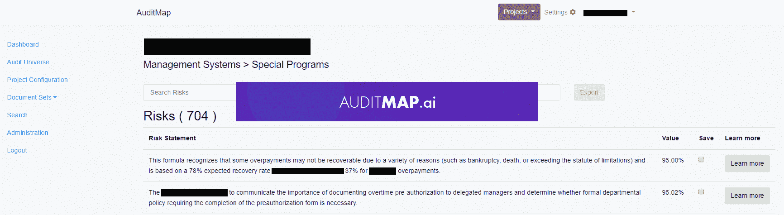
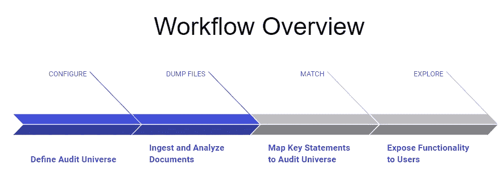
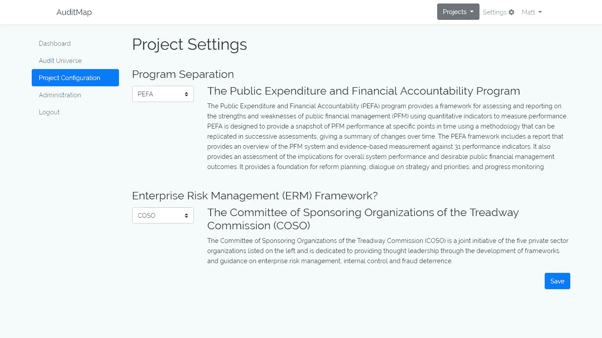
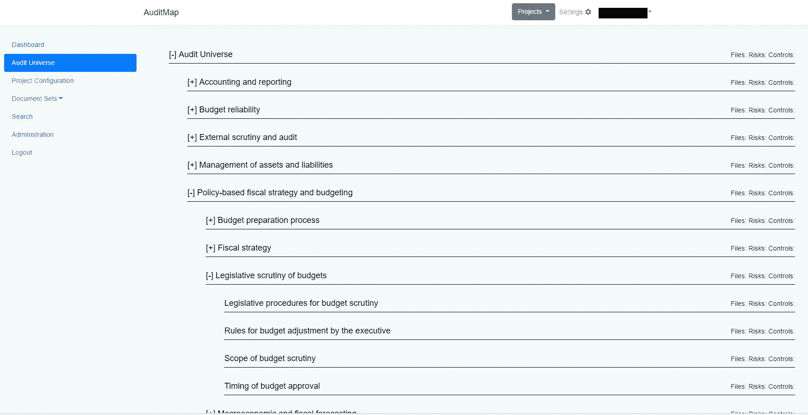

# 利用人工智能实现更好的内部审计

> 原文：<https://towardsdatascience.com/better-internal-audits-with-artificial-intelligence-53b6a2ec7878?source=collection_archive---------5----------------------->

答审核内部报告是一个非常手工的过程。我们看到了利用人工智能改善流程的[机会](https://auditmap.ai)。这篇文章讲述了我们是如何做到这一点的，以及我们将把这项技术带向何方。

让我们从描述什么是真正的**内部审计**开始:

*   内部审计是强制性的
*   ****人类**审查**大型**非结构化数据**文集**寻找**风险和控制****

**这听起来像是一个用人工智能解决的好问题。但是等等……这个复杂的任务有可能自动化吗？**

**是的，没错。**

**本文的其余部分是关于我们如何从对审计一无所知到构建一个审计增强工具，从从主题专家那里收集需求开始，发展到问题陈述，最后到达一个帮助审计员做他们的事情的解决方案。**

****

**The [AuditMap.ai](http://AuditMap.ai) process involves configuring an audit universe, dumping in internal reports and documents, and then using the output of the tool to gain insights on programs, activities, entities, risks, controls, and so forth.**

**我的第一次内审经历是在医疗器械领域([nuraleve.com](http://nuraleve.com))，在那里我们会定期接受 ISO、加拿大卫生部和 ce 的审核。内部审计是全球医疗器械生产和分销过程的标准组成部分，所以马修·勒梅和我已经对内部审计的结构和功能有所了解。在为一家小公司进行医疗器械内部审计时，我们没有看到企业级内部审计的规模。这绝对是巨大的。**

**许多组织的内部审计职能——尤其是上市公司和政府——是庞大的、强制性的，并且不是非常有效。我们与审计专业人员进行了深入的合作，以充分了解问题的范围，并实施解决方案。**

# ****首先要做的事情:通过三个简单的步骤了解内部审计****

**像所有好的项目一样，我们在行业伙伴的帮助下开始简要地创建内部审计的定义。这让我们看到了应用深度学习的用例。**

## **步骤 1:为什么存在内部审计**

**在我们开始深入学习之前，对内部审计的目的有一个基本的了解是一个先决条件。哈哈哈)对于这种高度非结构化的数据。因此，我们首先向内部审计师协会(IIA)寻求澄清:**

> **“内部审计活动应监控和**评估组织风险管理系统的有效性**。”—IIA-标准 2110。一流的**

**文档继续进一步解释:**

> **“内部审计活动应通过识别和评估**重大风险**并促进风险管理和控制系统的改进来帮助组织。”— IIA 标准 2110—风险管理**

**所以基本上 IA 就是来找问题的。既然我们有了 IIA 对内部审计的明确定义，我们就开始从管理和过程两个层面理解审计是如何进行的。**

## **步骤 2:内部审核是如何组织的**

**各种规模的企业如何实现“ ***评估【他们的】风险管理体系的有效性****是通过几个内部评估(“审计”)的执行来获得他们组织运营的各个环节的脉搏。我们对此进行了更深入的研究，概述了这些评估的基本方法和过程，并发现了任何风险管理系统的关键结构:审计领域。每个公司都通过明确识别以下内容来定义其审计领域的组成部分:***

*   ***公司结构和问责制框架***
*   ***内部细分和外部组件***
*   ***操作程序***
*   ***每个计划中的活动***

***从本质上来说，审计领域勾勒出的边界确定了所有能够接受组织监督的事物。所有的内部审核和评估都是在这个审核范围内进行的，因此导致了第 3 步。***

## ***步骤 3:进行内部审计 101***

***内部审计，简单来说，就是评估组织中的某个部分相对于其适当的法规遵从性或策略要求的执行情况。类似 ISO，你说你做的，做你说的，然后验证你做了你说你该做的。由于内部审计对于所有组织/团体的意图和目的都是强制性的，这些活动应该遵守一套标准。规划和承担这些任务需要**人对**大量**非结构化数据进行**审查。这是 AI 擅长的地方。***

***审计人员希望通过几个不同的角度来识别和理解他们被要求审计的业务中的风险和控制。透视中的这些变量用于梳理流程中的潜在问题，并涉及检查实体:***

*   ***通过控制目标、战略目标***
*   ***按风险发生的频率***
*   ***按类型***

***之所以有这些不同的看法，纯粹是为了找问题。值得注意的是，如果一个风险领域被反复确定为多年来一直缺乏控制措施，则应在管理审计报告中作为额外注释予以强调。类似地，如果没有识别出风险或控制，这可以向审核员表明在没有被评估的程序或过程中存在隐藏的风险。***

# ***哦不！内部审计被破坏***

***这种手工进行内部审计的过程已经被打破了。我在上面描述了内部审计应该做的事情。随着我们努力了解内部审计的性质，我们发现流程中出现了越来越多的漏洞，从审计选择和完整性方面的偏差，到人员培训方法不足和高度人工劳动密集型审计流程。***

******

***Today internal audit is a broken window into the risks and controls hiding within mountains of internal reports from across the organization.***

***下面是我们在需求集合中发现的一些例子:***

*   ***无法获得可量化的概述。数字很难生成，因此 **50，000 英尺的视角**经常会产生误导。内容的语料库一般是从**取样的**，因为有太多的文档需要手动分析。***
*   ***该过程依赖于不可量化的人类决策:风险没有得到应有的识别，控制措施没有有效关联。更不用说“人类有感情”这个因素了；背景和经历都有偏见。***
*   *****知识转移**不力——导致知识孤岛和对关键员工的严重依赖。***
*   ***一些**项目被过度评估**，而其他项目很少被审计。例子:信用卡审计太普遍，管理审计太少。如果审计中处理的唯一风险是财务风险，那么其他关键因素，如技术风险。***
*   ***审计功能的目标是展示过程性能和**暴露问题**，而不是仅仅勾选一个框，然后说你做了审计。***
*   ***这份清单还在继续…***

***内部审计的主要难点是审计完整性、更好的报告调查以及确保审计期间的最佳实践。这种进行内部审计的令人厌烦的手动过程需要一些重大的返工，并且显然是一个可以从我们实施深度学习模型中受益的领域。***

******

***Example of how to define the audit universe template and risk management framework within AuditMap.ai***

******

***Example Audit Universe ([Public Expenditure and Financial Accountability](https://pefa.org) Assessment). The full tree is [available here](https://gist.github.com/dcshapiro/2a042dbc0e95487443b4dcf59b89f64e).***

# *****Audit map . ai 如何改进内部审计*****

***在收集了最终用户需求并与主题专家一起确定了 IA 流程中的缺陷后，我们的团队有了改进的机会。简而言之，我们的愿景是，**将深度学习应用于内部审计，在不影响审计质量的情况下带来更好的业务成果。*****

***[AuditMap.ai](http://AuditMap.ai) 是一种自然语言理解工具，使审计人员能够针对已知的行业问题进行评估:审计完整性、更好的报告调查以及确保审计期间的最佳实践。应用深度学习通过解决日常跑腿工作来加速审计功能，这些日常跑腿工作阻碍了审计人员在不影响质量的情况下进行评估和报告的能力。***

***考虑一个激励的例子…***

*****举例——作为导演，知道你在和什么合作*****

***为审计功能描绘一幅高水平的画面应该不难。现在，是的。这是新老审计主管的首要任务。AuditMap.ai 使用数字和交互式审计领域，因此了解情况成为新的标准。比方说，代理审计主管“X”需要对其监管的每个项目相关的风险环境有一个全面的了解。我们的工具提供了以下关键功能:***

1.  ***自动识别所有 audit universe 文档中的风险、控制和其他关键实体。***
2.  ***绘制实体关系的知识图，以伴随风险摘要。***
3.  ***将风险和控制与审计范围内的文档进行映射和关联***
4.  ***将具有高度相似性的风险陈述分段，以努力确定可能提高审计效率的领域，以及***
5.  ***在按项目汇总风险时显示，显示审计范围内没有审计文档或风险陈述的地方，表明审计职能部门忽略了某个项目。***

***AuditMap 提供了可量化的概述，并将总监和她的审计团队置于这样一个位置，即他们的工作重点是了解他们工作发展的领域，并努力交付高管层期望他们完成的工作产品。***

***对评估范围的深刻理解可以带来更多的效率发现，因为越来越多参与规划的人有能力提出类似“如何改进我们的工作？可以简化吗？我们是否可以利用该计划范围之外的方法？”***

***我们的解决方案需要在样本审计报告上标注大量数据，以便为训练模型理解各种类型的句子及其含义奠定基础。应用深度学习非常有利于程序的规划阶段探索的性能。利用以上示例中建议的功能，AuditMap.ai 可以使用深度学习模型来组合由 ai 支持的推理创建的风险和控制报告的结果，这些推理在能够使用语法和/或语义识别感兴趣的文本片段的增强型搜索引擎(ElasticSearch with Kibana)中进行索引。不用说，该解决方案为审计经理带来了业务流程自动化的飞跃，让他们有更多的时间来指导团队和分享知识，而不是一直依赖关键员工来完成普通的文档理解任务。***

# ***结论和未来工作***

***总之，AuditMap.ai 使用深度学习来加速内部审计功能中的大量流程。从高级搜索方法到文档分割，对于需要大量资源密集型工作的环境来说尤其如此。就内部审计而言，应用深度学习为更好、更快地实现业务成果铺平了道路。***

****上面文章中展示的几个例子，以及其他例子，在我们基于人工智能的内部审计解决方案 AuditMap.ai* 中得到了充分的应用和部署***

***我们现在(终于)进入了销售周期，我们的目标市场是审计商店、五大和大型企业客户，它们是早期采用者客户。要了解更多关于 [AuditMap.ai](http://auditmap.ai) 的信息，请联系我，我会帮你联系。或者联系[马修·勒梅](https://medium.com/u/f84a70d8f74?source=post_page-----53b6a2ec7878--------------------------------):***

***发现你的审计图，联系:
**Mathieu Lemay** [**matt @ audit map . ai**](mailto:matt@auditmap.ai)
T:+1–819–923–6288***

***如果你喜欢这篇关于使用人工智能改善内部审计的文章，请点击关注按钮，看看我过去读过的一些文章，比如“[如何雇用人工智能顾问](https://medium.com/towards-data-science/why-hire-an-ai-consultant-50e155e17b39)”除了与业务相关的文章，我还准备了一些关于寻求采用深度机器学习的公司所面临的其他问题的文章，如“[没有云和 API 的机器学习](https://medium.com/@lemaysolutions/locked-in-a-box-machine-learning-without-cloud-or-apis-76cc54e391c8)”***

***——丹尼尔
[丹尼尔@lemay.ai](mailto:daniel@lemay.ai) ←打个招呼。询问 audit map . AI
[LEMAY . AI](https://lemay.ai)
1(855)LEMAY-AI***