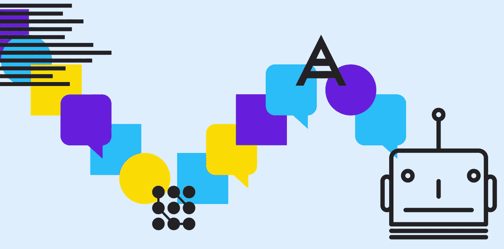
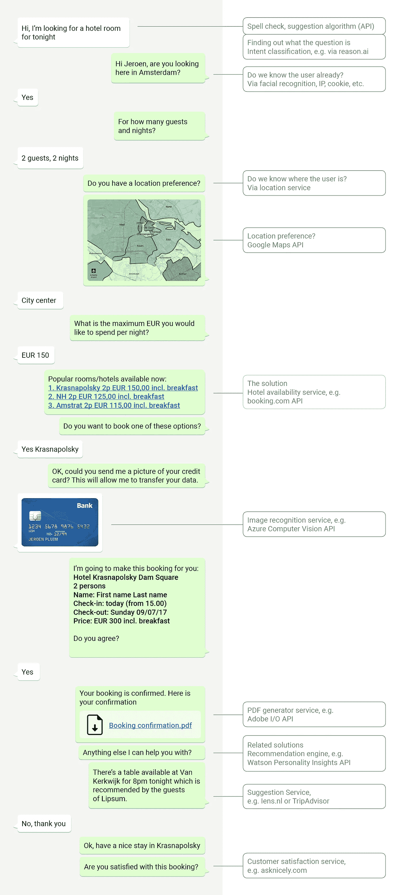
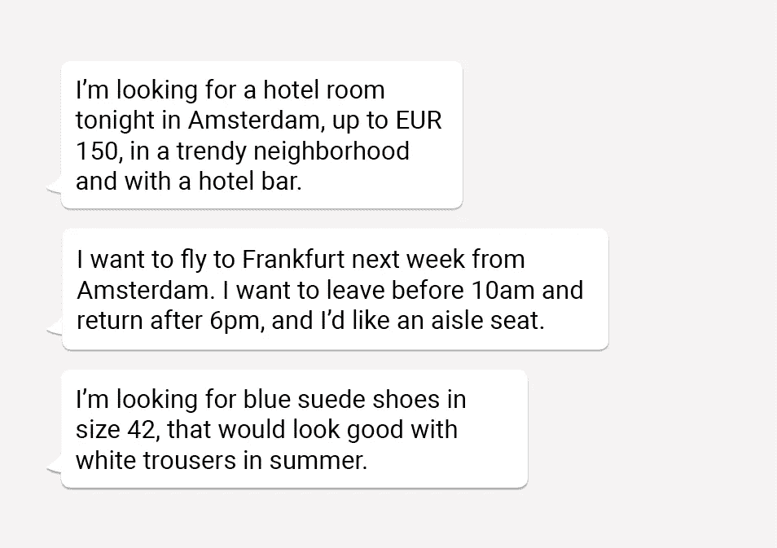
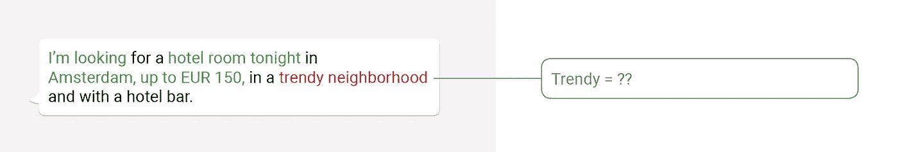
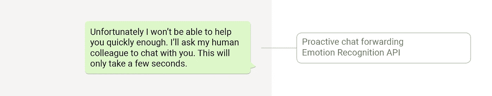
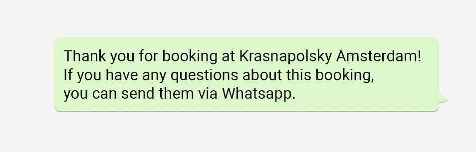
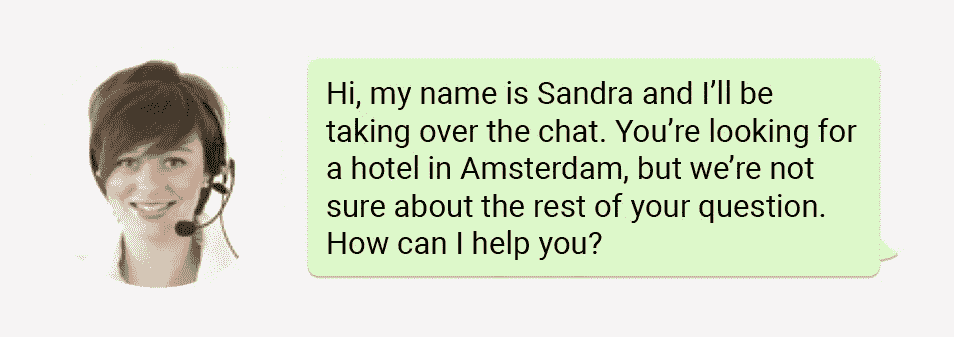
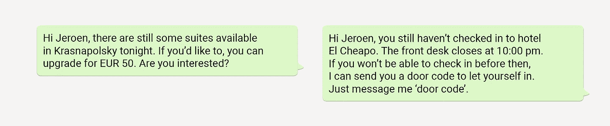
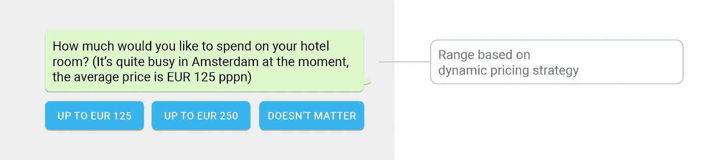

# 超越机器人

> 原文：<https://towardsdatascience.com/beyond-the-bot-b5ee7ebf835b?source=collection_archive---------6----------------------->

由[耶鲁安普鲁伊姆](https://www.edenspiekermann.com/people/jeroen-pluim)

当谈到客户互动的创新时，Messenger 上的 KLM 聊天机器人经常被作为教科书中的例子提及。然而，大多数公司在对话驱动的界面或其背后的文本识别和人工智能技术方面做得不多，或者根本没有做什么。这是一个错过的机会。这么多已经是可能的，如果你想的比聊天机器人更广泛，并且可以将技术、用户需求和营销结合在一起，甚至还有更多待价而沽。

许多公司首先挑选容易摘到的果子，通过他们网站、应用程序或信息平台上的问答服务来自动化频繁出现的对话。这种简单的对话很容易编写并带来快速的利润，但一旦它变得更复杂，你就会发现一些限制，要求使用不同于目前使用的大多数标准机器人软件的软件，具有高级形式的文本和意图识别，以及复杂的对话结构。

# 从机器人到认知服务平台

目前，大约 85%的以目标为导向的聊天机器人对话是成功的，不需要人工干预。如果出现问题，因为聊天机器人不理解问题，员工可以接管对话。但这并不是可能性的终结。将你的机器人连接到具有客户或其他相关数据(CRM、PIM 等)的系统。)提高了成功率，仅仅是因为有更多的信息可以提供正确的答案。机器人可以查找和解释数据，如产品信息、可用性或订单或请求的状态。还可以链接执行某些智能任务的服务，如推荐、预测、情感分析或图像编辑。这就是一个简单的聊天机器人如何成为一个认知系统平台。

# 科技设计

通过众所周知的新技术、人机逻辑、数据和创造力的结合，我们已经可以实现无数创新、可靠和以客户为中心的对话解决方案。这需要一个多学科的专家团队，他们从用户和技术的角度进行思考。举例来说，以下是使用数据和认知服务的机器人对话的一些成分和可能性。

# 有一些简单的原则:

1.  我们认为几乎所有的客户互动都是一种对话。机器人仅仅是一种手段。
2.  客户互动总是有目标的。客户不会通过联系来进行有趣的对话，组织也不会。
3.  与每次谈话一样，目的是快速收集信息(客户想要什么？)以便据此提供答案。
4.  答案以数据或内容的形式保存在系统中，或者以知识的形式保存在组织内外的人们的大脑中。
5.  人工智能可以帮助分析和制定(智能)答案。

对于你下面看到的例子对话，我们每次都回答这两个问题:1。客户的问题(目标)是什么，我们如何把它说清楚？2.最佳答案是什么，在哪里可以找到？

# 示例:

你在阿姆斯特丹旅游，需要一个酒店房间。你和一个旅行社代理人(机器人)开始对话。随后，机器人通过某些步骤和服务。

最大的机遇和挑战在哪里？

# 智能意图分类和实体识别

意图分类是一种帮助从客户的问题中提取其意图的技术。这可能很棘手，因为客户沟通的方式不同，可能会在一句话中提到多件事情。像 RASA(开源)、API.ai(谷歌)或 LUIS(微软)这样的自然语言处理(AI)工具可以用来分析复杂的句子结构，并将它们翻译成一个或多个客户意图。它们还从文本中提取事实信息(实体识别)，例如公司名称、目的地或鞋号。这使用户能够有效地交流信息，而使用 web 表单会花费更多的时间。

# 对话管理

大多数聊天机器人解决方案使用脚本对话(“if-then-else”)。然而，对于更复杂的对话，这缺乏灵活性，并且难以维护。幸运的是,(部分)基于机器学习的解决方案的开发进展很快，对话开发的质量和效率也在提高。

# 自动和监督学习

RASA 的强化学习技术改善了每次对话的文本识别。但是，为了真正提高对话的质量，重要的是，机器人是由人在监督下“手动”训练的。使用机器人不理解的对话，你可以注释用户真正的意思，允许添加概念或意图，并使机器人下次能够提供更好的答案。

# (认知)API

我们可以使用用户提供的信息或我们已经拥有的信息来连接外部服务，以进行拼写(纠正输入)、图像识别(读取信用卡上的文本，或将用户的照片与其姓名相关联)、推荐(如餐馆)、咨询可用性或执行预订。某些“认知”API 甚至可以用来识别情绪，因此在对话不顺利的情况下，用户可以被转发到一个真实的人。

# 无缝多渠道体验

机器人可以通过 Whatsapp 发送通过网站预订的确认，这也可以用于以后进行更改。下一次同一个用户进行预订时，机器人会记住他们的数据(例如通过来电显示)，从而使对话变得更加容易。

# 混合机器人/人类解决方案

如果机器人不能很好地处理对话，我们显然不想惹恼用户。在这种情况下，对话可以传递给人工服务代理。这可以是主动的(参见认知 API)或者当用户请求时。然后，可以对已经可用的信息进行汇总并转发给代理，这样就可以无缝地进行对话。

# 数据分析和主动预警

对话可以由用户发起，也可以由机器人本身发起。例如，机器人可以开始对话，根据数据分析向用户提供相关的见解或建议。

# 内容

机器人不一定只能用文本交流。不同的频道支持使用图像、视频或交互式功能，如提供按钮或动作。

# 所以，这不仅仅是一个机器人

对于支持(对话驱动的)客户交互过程来说,“聊天机器人”是一个过于简化的名字。它基本上是关于建立一个平台，通过使用已经或即将可用的“智能”服务来学习、交流和解决客户的问题。这些服务可以在新设计的和现有的流程中使用，所有这些都是通过具有可用 API 的现代平台的模块化设计实现的。

将智能技术知识与服务设计知识相结合，可以带来更好的客户体验。人类的创造力和机器智能无缝协作。所以，在对话中思考，让设计师、技术人员和顾客都参与进来，魔法一定会发生。

最初发布于 [Emerce](https://www.emerce.nl/best-practice/beyond-the-bot-wat-nog-meer-klantinteracties) (荷兰语)。

由[dori Jan si iko](https://www.edenspiekermann.com/people/dorijan-sisko/)创作的图像。