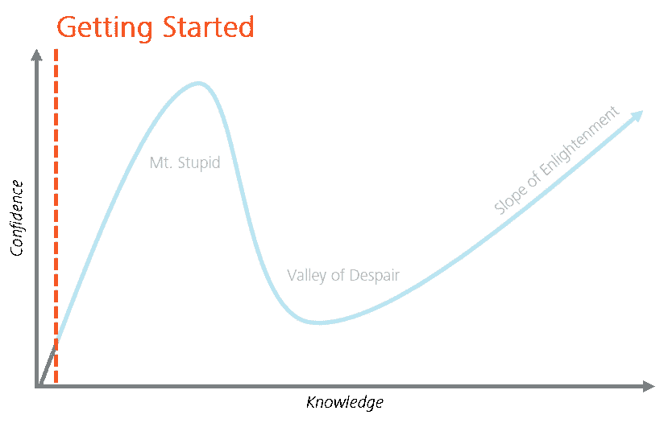
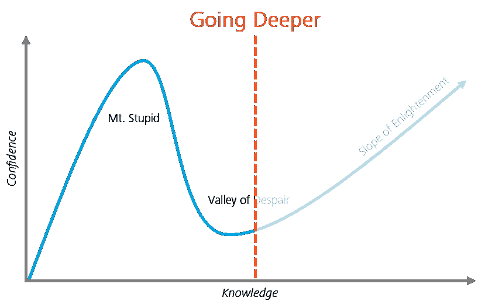

# 超越 MOOC:数据科学书虫指南

> 原文：<https://towardsdatascience.com/beyond-the-mooc-a-bookworms-guide-to-data-science-e87271cb0572?source=collection_archive---------7----------------------->

## 最后更新:2020 年 9 月

[Sylvia Yang](https://unsplash.com/photos/_ar2ENzmqb0?utm_source=unsplash&utm_medium=referral&utm_content=creditCopyText) // [Unsplash](https://unsplash.com/search/photos/books?utm_source=unsplash&utm_medium=referral&utm_content=creditCopyText)

# 介绍

投身数据科学可能是一项艰巨的任务:网上有这么多优秀的(不幸的是，多余的)资源，很难知道把宝贵的时间花在哪里。在沿着同样的道路奋斗并收集了该领域数十位从业者的建议后，我在这篇文章中综合了我最喜欢的资源，希望能有所回报。

# 为什么是课本？

有许多学习编程和机器学习的好方法，其中一种方法不一定比所有其他方法都好。经过多次反复试验，我发现教科书内容的学习时间比其他媒介要高得多，原因如下:

*   **教科书作者通常是教授，他们比典型的 MOOC 制作人或博客作者拥有更深的知识和更强的动机**
*   **阅读时记笔记需要持续的专注；坐在教室里或看在线教程时，人们太容易不去关注**
*   网上有大量令人惊叹的免费教科书，还有有趣的数据集，你可以用它们来学以致用

为了使这个学习过程有效，我强烈建议你在读完每本书后，立即将你的阅读应用到现实世界的挑战或 Kaggle 数据集。这最后一步将确保你已经在精神上消化了你所阅读的内容，并给你一个代码库，如果你将来需要重温这本书的话。[这里有一个简单的例子](http://htmlpreview.github.io/?https://github.com/ntlind/store_forcasting/blob/master/main.html)，是我看完*预测:原理&实践*后写的(见下面我的评论)。

# 开始你的旅程

如果你是这个领域的新手，下面的链接应该是你达到中级水平所需要的。每本书都建立在上一本书的基础上，所以我建议按照列出的顺序浏览它们。*免责声明:为了您的方便，我提供了以下链接；我不通过联盟营销赚任何钱。*

## [**R(ISLR)统计学习简介**](https://www-bcf.usc.edu/~gareth/ISL/)

加雷思·詹姆斯，丹妮拉·威滕，特雷弗·哈斯蒂，罗伯特·蒂布拉尼

这是机器学习的经典介绍，有大量易于理解的可视化和 R 代码，可以帮助您入门并运行。我怎么推荐这本书都不为过:这无疑是我读过的关于统计学或编程的最容易理解的教科书。从这里开始！

## [R 为数据科学](http://r4ds.had.co.nz/)

*加勒特·格罗勒蒙德，哈德利·韦翰*

对于那些想了解 R，[中的数据争论和可视化的人来说，这是一个很好的资源，这两项技能很容易占据你 60%](https://www.forbes.com/sites/gilpress/2016/03/23/data-preparation-most-time-consuming-least-enjoyable-data-science-task-survey-says/#3014395f6f63) 的工作时间。当你通过 ISLR 学习统计学的时候，浏览了 R 之后，这个网站将帮助你提高你的基本编程技能。

## [动手使用 Scikit-Learn & TensorFlow](https://www.amazon.com/Hands-Machine-Learning-Scikit-Learn-TensorFlow/dp/1491962291)

*奥雷连·盖伦*

毫无疑问是我读过的关于 Python 中机器学习的最有用的教材。第 1 章是关于各种 ML 主题的高级 FAQ，是对许多不同领域的特别强有力的概述。你可以在亚马逊上找到它，但我建议你问问你的学校或雇主，他们是否提供免费访问奥莱利的媒体网站。

## [机器学习](https://www.coursera.org/learn/machine-learning)

*吴恩达*

大师亲自出马的经典 MOOC。这门课程告诉我，比起看 MOOCs，我更喜欢看书，但安德鲁迷人的教学风格和深厚的专业知识使这个系列成为必看节目。这门课是用 MATLAB 教授的，所以在尝试之前，你应该先学习编程的基础知识。如果你想测试你新发现的技能，尝试 Python 中的每个作业，并与你在 MATLAB 中的答案进行比较。

# 成长为你的利基

通过上面的资源学习基础知识后，您会希望让您的个人兴趣和用例为您指明学习旅程的下一步。下面列出了一些我最喜欢的深度探索，按主题领域分类。

## 人工智能:一种现代方法

斯图尔特·拉塞尔，彼得·诺维格

由斯坦福和谷歌重量级人物撰写，这本书是一个全面的，写得很好的指导 ML 的构建模块，最有趣的是，强化学习。这本书有 1000 多页，我会有选择地浏览一下，而不是完全阅读。

## 贝叶斯方法:[贝叶斯数据分析](https://www.amazon.com/Bayesian-Analysis-Chapman-Statistical-Science/dp/1439840954)

*安德鲁·盖尔曼*

大量关于贝叶斯的参考资料，并附有 r 语言的代码。理解贝叶斯推理将补充你在这个列表的“入门”部分开发的频率主义观点。再说一遍，这本书更像是一个值得浏览的标题，而不是一本从头到尾阅读的书。对于贝叶斯统计的快速概述，[我们在分析 Vidhya 的朋友已经覆盖了](https://www.analyticsvidhya.com/blog/2016/06/bayesian-statistics-beginners-simple-english/)。

## 因果推断:[大多是无害的计量经济学](https://www.mostlyharmlesseconometrics.com/)

*约书亚·d·安格里斯特，约恩-斯特芬·皮施克*

在这本现代因果推理建模的无障碍指南中，安格里斯特和皮施克探讨了回归如何成为理解因果关系的无价工具。其他感兴趣的主题包括匹配、倾向评分和固定效应模型。在我的“高级阅读”清单中，这本书比 Gelman 和 Hill 的书更容易理解，但它们很好地结合在一起，在不同的粒度水平上涵盖了类似的主题。

## Python 中的数据科学:[机器学习简介](http://shop.oreilly.com/product/0636920030515.do)

*莎拉·圭多，安德烈亚斯·米勒*

作者涵盖了从基本的无监督方法到 Python 中的自然语言处理的所有内容。可以把它看作是 ISLR 的 Python 等价物，更侧重于中间用户。这本书也是免费的，奥莱利订阅了。

## 深度学习:[深度学习](http://www.deeplearningbook.org/)

*伊恩·古德菲勒、约舒阿·本吉奥、亚伦·库维尔*

如果没有深度学习的技术圣经，我们的列表将是不完整的，涵盖了从感知机到卷积神经网络的一切。根据埃隆·马斯克的说法，这本书是“关于这个主题的唯一一本全面的书”,不像这个列表中的其他大量参考书籍，我建议从头到尾读一遍。

## DevOps: [加速:精益软件和 DevOps 的科学](https://www.amazon.com/dp/B07B9F83WM/ref=dp-kindle-redirect?_encoding=UTF8&btkr=1)

妮可·福斯格伦，杰斯·亨布尔，吉恩·金

DevOps 是“您的组织为大规模构建安全、有弹性、快速发展的分布式系统而遵循的流程”。随着我在数据科学旅程中的前进，并开始在生产中部署机器学习系统，我了解到如果没有正确的流程和实践，生活会多么痛苦。在本书中，Nicole 提供了一个基于研究的视角，关于管理和开发最佳实践、敏捷开发以及持续集成/持续交付(CI/CD)的重要性。

## 广义可加模型:[从回归角度的统计学习](https://www.springer.com/gp/book/9780387775005)

*理查德·伯克*

我读过的关于广义可加模型和回归分析的最彻底的教科书。游戏及其可解释性的非常有用的概述，有大量的 R 代码来平滑学习过程。伯克教授还涵盖了更现代的预测技术(例如，助推)，但他深思熟虑的推理建模方法是这本书的必读内容。

## 中级 Python: [流畅 Python](https://www.amazon.com/Fluent-Python-Concise-Effective-Programming/dp/1491946008)

卢西亚诺·拉马尔霍

这本书让我的 Python 技能更上一层楼。如果你花大量的时间在 Python 上，这是一个必读书，尽管拉马尔霍的大多数建议不能很好地推广到其他编程语言。

## 关于编程好:[清理代码](https://www.amazon.com/Clean-Code-Handbook-Software-Craftsmanship/dp/0132350882)

罗伯特·马丁

尽管这本书最初是为软件工程师写的，但对数据科学家来说阅读和理解也同样重要。如果您渴望编写生产就绪的代码，本书提供了许多高层次的建议来指导您的思考。

## 时间序列分析:[预测:原理与实践](https://otexts.org/fpp2/)

罗布·J·海曼，乔治·阿萨纳索普洛斯

R 中关于时间序列预测的很好的读物，有帮助的代码和视觉效果来解释端到端的建模过程。如果你需要一点动力去钻研这篇文字，Hyndman 的 R 库，*预测，* [在 Kaggle 上获得了一个高价值的沃尔玛预测比赛](https://github.com/davidthaler/Walmart_competition_code)。

## 理解“黑箱”模型:[解释性机器学习](https://christophm.github.io/interpretable-ml-book/)

克里斯托夫·莫尔纳尔

Christoph 在捕捉从线性回归到 XGBoost 的可视化最佳实践方面做得非常出色。他的指南简短、实用、引人入胜，作为他的电子书的直接结果，我已经将 Shapley 值、PDP 和 ICE 图添加到我的正常工作流程中。

# 高级阅读

如果你能阅读、理解并运用你从上面列出的书中学到的知识，那么你可能会喜欢我最近喜欢的几本书。**这些推荐都是*极*技术**；如果您正在寻找充满数学符号和代码示例的页面，那么您来对地方了。

## 高级回归:[使用回归和多级/分级模型的数据分析](https://www.amazon.com/Analysis-Regression-Multilevel-Hierarchical-Models/dp/052168689X)

安德鲁·盖尔曼，珍妮弗·希尔

在我听到 Richard McElreath 说“多水平模型应该成为回归的默认模式”之前，我从来没有认真考虑过多水平回归。读完这段文字，我终于明白为什么我们几乎总是喜欢运行多层次模型(线性、逻辑、广义等。)到一个普通的回归。这篇文章非常全面，提供了 R (frequentist)和 Buds (Bayesian)两种语言的实例，但可能比需要的要长 150 页。

## 贝叶斯统计:[统计反思](https://xcelab.net/rm/statistical-rethinking/)

理查德·麦克尔瑞斯

如果你对学习贝叶斯统计很感兴趣，但还没有找到合适的指南，这本写得非常好的教科书应该是你阅读清单的第一位。作者从贝叶斯统计的全面概述开始，然后分享几种技术来帮助改善你的因果推理游戏。

## 分布式计算:[海量数据集的挖掘](http://www.mmds.org/)

Jure Leskovec，Anand Rajaraman，Jeff Ullman

这本书提供了有效处理大量数据的分布式计算系统和技术的详细概述。涵盖的主题包括哈希策略，聚类技术，篮子分析和推荐引擎。这篇文章是为了指导斯坦福大学的 CS246(挖掘大规模数据集)而写的，可以通过上面的链接免费获得。

## 函数式编程:[Scala 中的函数式编程](https://www.amazon.com/Functional-Programming-Scala-Paul-Chiusano/dp/1617290653)

*保罗·丘萨诺，罗纳尔·比雅纳松*

这本书结合了函数式编程的最佳实践和对 Scala 的引人入胜的介绍，Scala 是一种通用编程语言，构成了 Apache Spark 的主干。

## 实用深度学习:[用 PyTorch 进行深度学习](https://pytorch.org/assets/deep-learning/Deep-Learning-with-PyTorch.pdf)

*伊莱·斯蒂文斯，卢卡·安提卡*

深度学习和 PyTorch 库的简单介绍。这本书丰富多彩的插图和直观的代码示例巩固了我对张量、PyTorch 语法和涉及反向传播的线性代数的理解。最重要的是，它可以通过上面的链接免费获得。

## Python 优化: [Python 高性能](https://www.amazon.com/Python-Performance-Programming-Gabriele-Lanaro/dp/1783288450)

*加布里埃尔·拉纳罗*

如果计算性能阻碍了你，我推荐 *Python 高性能*作为高级 Python 编程的直观指南。这篇文章以简洁的方式涵盖了基准测试/分析、矢量化、提前和即时编译、并发性、并行处理和分布式计算，并提供了大量的代码示例来帮助您入门。我也喜欢类似的书*高性能 Python* 中涵盖的所有硬件理论，但是我觉得 Lanaro 用更少的文字和更好的代码示例涵盖了类似的主题。

## 系统设计:[设计数据密集型应用](https://www.amazon.com/Designing-Data-Intensive-Applications-Reliable-Maintainable/dp/1449373321)

马丁·克莱曼

当你的技术技能开始渗透到工程领域时，Kleppmann 写了一本很棒的书来阐明你最喜欢的 web 应用程序是如何大规模运行的。本阅读涵盖系统设计原则、数据模型优化、数据库、微服务架构、流、缓存和分布式计算。

# 总结

关于这个领域，我最喜欢的一点是它发展得有多快。不管我们读了多少，总会有更多的东西需要我们去消化和学习。在完成这个列表后，您将最终为最精彩的部分做好准备:仔细阅读关于 arXiv 的研究论文。激动人心的时刻即将到来！

你最喜欢的数据科学读物有哪些？随时欢迎您的建议和意见。感谢阅读！