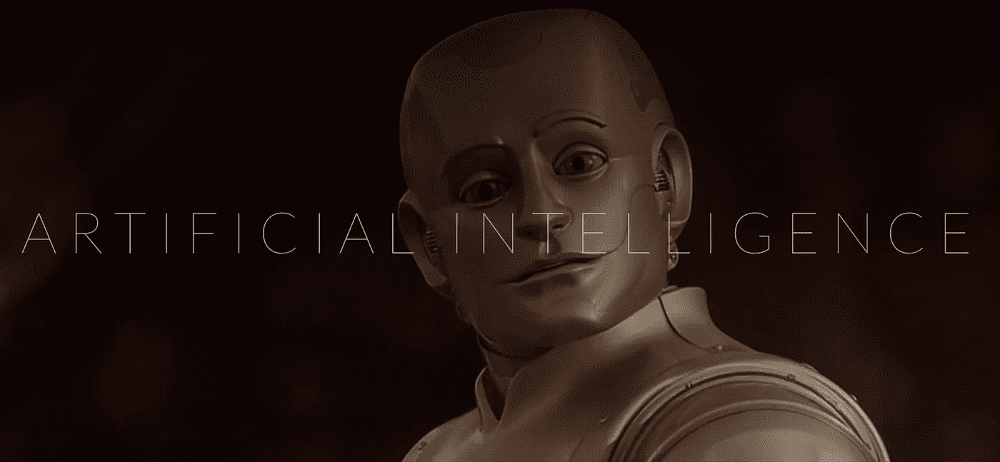

# 超越语音:人工智能和手势控制

> 原文：<https://towardsdatascience.com/beyond-voice-ai-and-gesture-control-869f9a752fbe?source=collection_archive---------0----------------------->

这是我们讨论家庭用户界面及其发展趋势系列的第四部分。本系列基于我们在 2016 年 CEDIA 上的演讲。你可以在这里 *观看现场直播* [*。*](https://youtu.be/FWEtnI9VSqA)

*第一部分:* [*家庭用户界面的演变*](https://medium.com/@joshdotai/the-evolution-of-the-home-user-interface-435285e54139)

*第二部分:* [*为什么现在是家庭语音控制的时候*](https://medium.com/@joshdotai/why-now-is-the-time-for-home-voice-control-85b55134316#.4wc17vvuf)

*Part 3:* [*没有 UI 就是最好的 UI*](https://medium.com/@joshdotai/no-ui-is-the-best-ui-cfeab4cae641#.wis3ivqei)

## 人工智能

就语音之外和我们现在所处位置之外的东西而言，首先要提到的话题是人工智能。我们经常听到这个术语。我们在科幻电影和电视上看到它。它实际上意味着什么？

首先，人工智能是做不同事情的不同技术的集合。这对我们来说意味着使用大数据，使用传感器，使用学习算法，这样家庭就能够在没有编程的情况下变得更加智能。这也意味着创造出能够像人类一样互动的人，无论是通过声音、手势还是其他自然的互动。

一个很好的例子是，如果用户 100%的时间在天黑后回家，她打开车库，然后打开厨房的灯。如果乔希看到她快到家了，他会打开车库，自动打开厨房的灯。这可以通过跟踪和使用大数据来学习，而不是预先编程。

在不久的将来，我们将看到人工智能真正起飞，我认为随着人工智能与语音和其他先进技术的结合，这些技术将结合起来，使体验真正神奇。人工智能是我未来几年密切关注的事情之一。

## 手势控制:已经在这里

接下来是手势控制，也很常见。如果我们是在面对面交谈，我可能会指着一个说话者说“把它关小一点，它真的很吵”或者“你能把它开大一点吗”。关于手势，它确实和声音结合在一起。手势控制是一项 AND 技术，不是 OR 技术。

事实上，我们已经看到了手势。诸如 [Fibaro Swipe](http://www.fibaro.com/us/the-fibaro-system/swipe) 、 [Seven Hugs 智能遥控器](https://remote.sevenhugs.com/)等设备正在制造其中一些产品。他们已经在使用非常棒的传感器和摄像头以及不同的技术来使用手势控制和识别。

再说一遍，所有这些新技术都是一种去除用户界面的方式。你走进去，指着什么东西，它应该会激活，应该会继续。因此，这是另一项我们近期真正看到的新兴技术。

[*继续本系列的第 5 部分，我们将深入探讨虚拟现实和图像识别*](https://medium.com/@joshdotai/beyond-voice-image-recognition-and-virtual-reality-f3039a15aa2#.fdfvbgigf) *。*

这是由 [Josh.ai](http://josh.ai) 的联合创始人兼首席执行官亚历克斯·卡佩塞拉特罗撰写的。此前，亚历克斯是美国宇航局，桑迪亚国家实验室和 NRL 的研究科学家。在此之前，Alex 在 Fisker Automotive 工作，并在 Pool 和 [Yeti](http://yeti.ai) 创立了[。亚历克斯拥有加州大学洛杉矶分校的工程学位，住在洛杉矶，喜欢在推特上发布关于人工智能、创业公司和设计的消息。](http://techcrunch.com/2013/11/07/social-network-at-the-pool-relaunches-on-mobile-with-an-app-to-better-connect-nearby-friends/)

[Josh.ai](http://josh.ai) 是你家的人工智能代理。如果您有兴趣了解更多信息，请访问我们的[**https://Josh . ai**](https://www.josh.ai)。

*喜欢我们上* [*脸书*](http://facebook.com/joshdotai) *，关注我们上* [*推特*](http://twitter.com/joshdotai) *。*