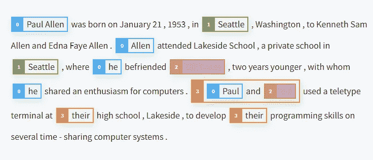
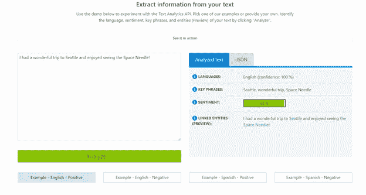
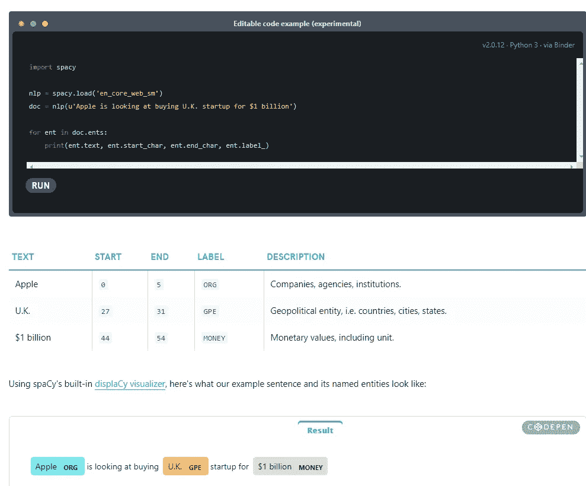
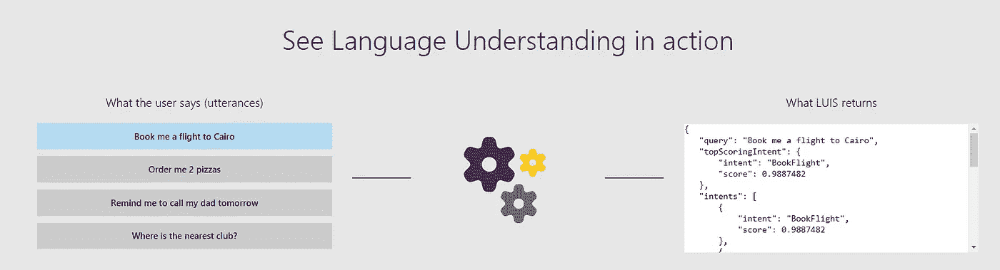
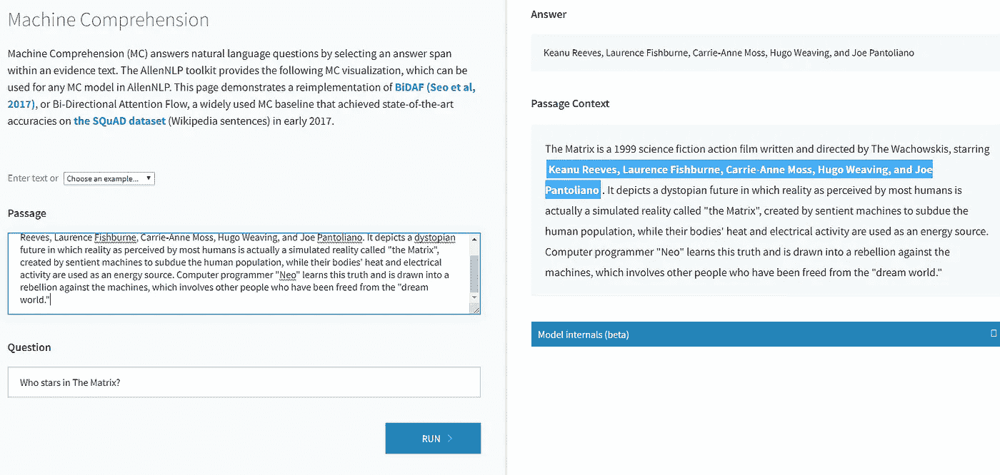
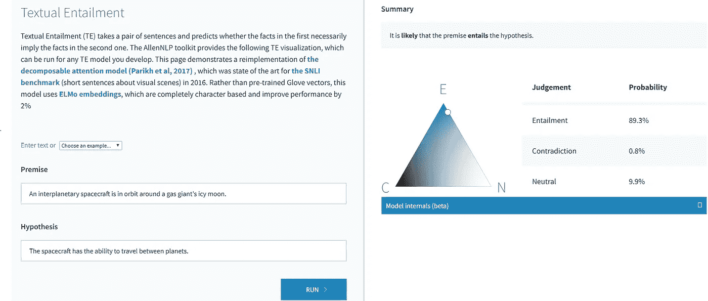
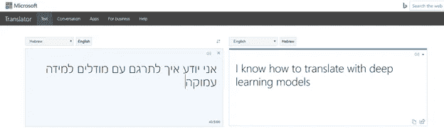
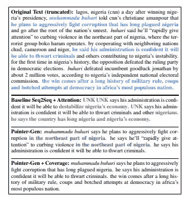

# 超越单词嵌入第 1 部分

> 原文：<https://towardsdatascience.com/beyond-word-embeddings-part-1-an-overview-of-neural-nlp-milestones-82b97a47977f?source=collection_archive---------6----------------------->

神经 NLP 里程碑综述

# TLDR；

自从 [word2vec](https://en.wikipedia.org/wiki/Word2vec) 的出现，神经单词嵌入已经成为在 NLP 应用中封装分布式语义的 goto 方法。本系列将回顾使用预训练单词嵌入的优点和缺点，并演示如何将更复杂的语义表示方案(如语义角色标记、抽象意义表示和语义依赖解析)整合到您的应用程序中。

# **神经自然语言处理里程碑**

在过去的五年里，深度学习的出现在自然语言处理领域带来了一些令人印象深刻的里程碑。

本系列的第一篇文章将重点介绍一些里程碑的例子以及开始使用它们的链接。

## 共参照分辨率

Allen NLP Co-Reference resolution

[共指消解](http://demo.allennlp.org/coreference-resolution)的任务是找出文本中所有指代同一实体的表达式。对于涉及自然语言理解的核心 NLP 任务，如文档摘要、问题回答和信息提取，这是重要的一步。这个任务的两个最好的可用库是 [huggingface](https://huggingface.co/coref/) 和 [Allen NLP](http://demo.allennlp.org/coreference-resolution) 。

## **情感分析**

An example of the [Azure Text Analytics](https://azure.microsoft.com/en-us/services/cognitive-services/text-analytics/?WT.mc_id=blog-medium-abornst) service

这些模型能够检测给定文本的情感。这种功能对于检测社交媒体、客户评论和论坛中的积极和消极情绪非常有用。在基于云的服务中，如 [Azure Text Analytics](https://azure.microsoft.com/en-us/services/cognitive-services/text-analytics/?WT.mc_id=blog-medium-abornst) 内容由您提供；模型和训练数据由服务提供。

## 可训练命名实体识别和范围标记

命名实体识别模型从文本中提取实体，如人员、位置、组织和杂项。 [Azure Text Analytics](https://azure.microsoft.com/en-us/services/cognitive-services/text-analytics/?WT.mc_id=blog-medium-abornst) 提供强大的预训练模型。对于那些喜欢训练自己模型的人来说， [Spacy](https://spacy.io/usage/training#section-ner) 和 [Allen NLP](http://demo.allennlp.org/named-entity-recognition) 都提供了快速训练定制 NER 模型的文档，这些模型可以与 [Azure ML API](https://docs.microsoft.com/azure/machine-learning/service/overview-what-is-azure-ml?WT.mc_id=blog-medium-abornst) 和 [Azure 笔记本服务](https://notebooks.azure.com/?WT.mc_id=blog-medium-abornst)一起使用。

## 意图分类

意图分类系统旨在识别对话中有价值的信息，如 [LUIS 认知服务](https://docs.microsoft.com/azure/cognitive-services/luis/what-is-luis?WT.mc_id=blog-medium-abornst)解释用户目标(意图)并从句子(实体)中提取有价值的信息，以实现高质量、细致入微的语言模型。 [LUIS](https://docs.microsoft.com/azure/cognitive-services/luis/what-is-luis?WT.mc_id=blog-medium-abornst) 与 Azure Bot 服务无缝集成，轻松创建复杂的 Bot。

## **机器阅读理解 BiDAF**

AllenNLP MC Model

**机器理解** (MC)通过在证据文本内选择答案范围来回答自然语言问题。AllenNLP 工具包提供了以下 MC 可视化，可用于 AllenNLP 中的任何 MC 模型。有关机器阅读理解的更多信息，请参见《入门》,这里有一个很棒的关于 [Azure DLVM](https://blogs.technet.microsoft.com/machinelearning/2018/04/25/transfer-learning-for-text-using-deep-learning-virtual-machine-dlvm/) 的演示，它包含了一些最新架构的实现，比如 BiDAF、SynNet、OpenNMT 和 Document QA。

**自然语言推理 SLNI 可分解注意力**

Allen NLP NLI/TE model

文本蕴涵(TE) 获取一对句子，并预测第一个句子中的事实是否必然隐含第二个句子中的事实。文本蕴涵是信息抽取系统的关键组成部分，通常用于通过确保候选答案包含给定的抽取查询来过滤候选答案。AllenNLP 工具包提供了上述 TE 可视化，可以为您开发的任何 TE 模型运行，也可以为您的应用程序中使用的预训练模型运行。

## **神经翻译 NMT**

持续改进翻译很重要。然而，自 2010 年代中期以来，SMT 技术的性能改善一直停滞不前。通过利用微软人工智能超级计算机的规模和能力，像[微软翻译器这样的工具现在提供基于神经的翻译](https://blogs.technet.microsoft.com/machinelearning/2018/04/25/transfer-learning-for-text-using-deep-learning-virtual-machine-dlvm/?WT.mc_id=blog-medium-abornst)，这使得翻译质量的提高进入了一个新的十年。

## 抽象单文档摘要

Example of improvements in neural summarization Abigail See et. all

神经 NLP 也有助于抽象单文档摘要任务中的基准。这项任务使用户能够生成长文档的简短摘要。传统上，这是使用提取方法完成的，提取方法通过从文本中直接引用来生成摘要，但神经 NLP 的进步，如 Abigail See 的[指针生成器网络](https://github.com/mjc92/GetToThePoint)已经能够从长文档中创建可理解的简短抽象摘要。

# 行动呼吁

下面是开始使用上述工具和模型的一些资源。

*   [**【Azure Text Analytics**](https://azure.microsoft.com/en-us/services/cognitive-services/text-analytics/?WT.mc_id=blog-medium-abornst)—Text Analytics API 是一个基于云的服务，提供对原始文本的高级自然语言处理，包括四个主要功能:情感分析、关键短语提取、语言检测和实体链接。
*   [**Azure LUIS**](https://docs.microsoft.com/azure/cognitive-services/luis/what-is-luis?WT.mc_id=blog-medium-abornst) —基于机器学习的服务，为定制意图分类和基本实体提取构建自然语言。
*   [**Allen NLP**](https://allennlp.org/)—Allen NLP 是一个开源的 NLP 研究库，基于 PyTorch 构建，用于开发各种语言任务的最先进的深度学习模型。
*   [**Azure DLVM** 机器阅读理解](https://blogs.technet.microsoft.com/machinelearning/2018/04/25/transfer-learning-for-text-using-deep-learning-virtual-machine-dlvm/?WT.mc_id=blog-medium-abornst)——深度学习虚拟机(Deep Learning Virtual Machine)是数据科学虚拟机(Data Science Virtual Machine，DSVM)的一个特殊配置的变体，可以更直接地使用基于 GPU 的虚拟机实例来训练深度学习模型。DSVM 上有一个很棒的 pyTorch 入门模块，你可以在这里找到。
*   [**SpaCy**](https://spacy.io/)**—SpaCy 是 Python 中自然语言处理的免费开源库。它具有 NER、词性标注、依存句法分析、词向量等功能。**
*   **[**hugging face**](https://github.com/huggingface)——为模型提供空间的扩展，如相互参照和情感分析。**

# **[下一篇文章](https://medium.com/@aribornstein/beyond-word-embeddings-part-2-word-vectors-nlp-modeling-from-bow-to-bert-4ebd4711d0ec)**

**[本系列的下一篇文章](https://medium.com/@aribornstein/beyond-word-embeddings-part-2-word-vectors-nlp-modeling-from-bow-to-bert-4ebd4711d0ec)将回顾用词向量表示和建模的进步是如何推动上述 NLP 系统的进步的。**

**如果你有任何问题、评论或话题想让我讨论，请随时在 [Twitter](https://twitter.com/pythiccoder) 上关注我。如果你觉得我错过了某个里程碑，请让我知道。**

## ****关于作者****

**亚伦(阿里)博恩施泰因(阿里)是一个狂热的人工智能爱好者，对历史充满热情，致力于新技术和计算医学。作为微软云开发倡导团队的开源工程师，他与以色列高科技社区合作，用改变游戏规则的技术解决现实世界的问题，然后将这些技术记录在案、开源并与世界其他地方共享。**