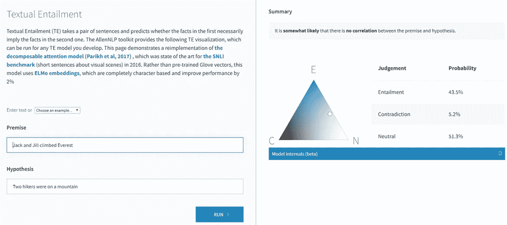
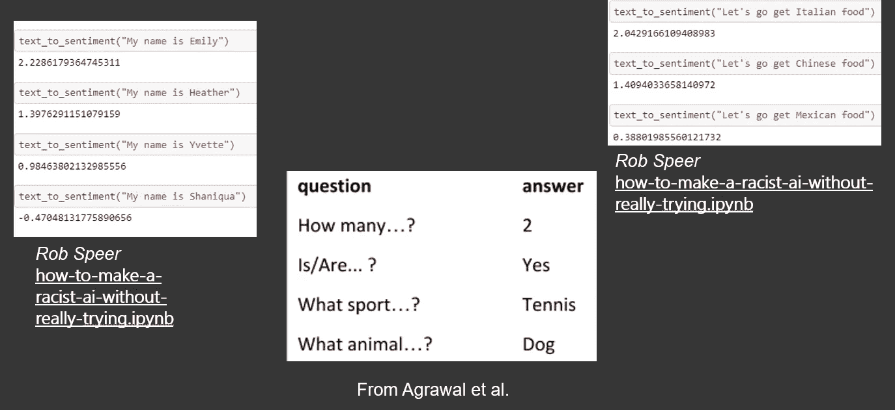
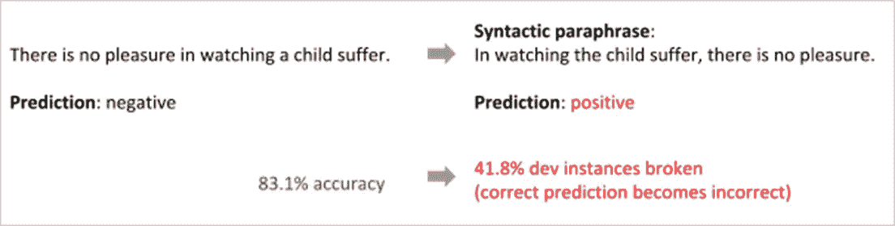

# 超越单词嵌入第 3 部分

> 原文：<https://towardsdatascience.com/beyond-word-embeddings-part-3-four-common-flaws-in-state-of-the-art-neural-nlp-models-c1d35d3496d0?source=collection_archive---------7----------------------->

最先进的神经 NLP 模型中的四个常见缺陷。

# TLDR；

自从 [word2vec](https://en.wikipedia.org/wiki/Word2vec) 的出现，神经单词嵌入已经成为在 NLP 应用中封装分布式语义的常用方法。本系列将回顾使用预训练单词嵌入的优点和缺点，并演示如何将更复杂的语义表示方案(如语义角色标记、抽象意义表示和语义依赖解析)整合到您的应用程序中。

## 介绍

本系列的前几篇文章回顾了最近神经 NLP 中的一些[里程碑](/beyond-word-embeddings-part-1-an-overview-of-neural-nlp-milestones-82b97a47977f)，以及将单词表示为向量的[方法和利用它们的架构进展](/beyond-word-embeddings-part-2-word-vectors-nlp-modeling-from-bow-to-bert-4ebd4711d0ec)。

尽管神经 NLP 已经导致了许多突破，正如在以前的帖子中看到的那样，但是使用预先训练的单词嵌入和注意机制的最新模型仍然存在许多缺陷。神经 NLP 中的这些缺陷对生产系统有着危险的影响，这些生产系统很少甚至没有不精确和不可预测的余地。

这篇文章将深入探究现代最先进的自然语言处理系统的缺陷。

# 缺陷 1:词汇推理

尽管[基于注意力的模型和更好的嵌入](/beyond-word-embeddings-part-2-word-vectors-nlp-modeling-from-bow-to-bert-4ebd4711d0ec)有所改进，但神经 NLP 模型仍难以推断缺失的信息。下面我们来看看神经自然语言推理模型。

这个模型很难识别文本" *Jack 和 Jill 攀登珠穆朗玛峰*"意味着 Jack 和 Jill 是两个徒步旅行者*正在攀登一座*山*，并且错误地声明这两个陈述是中性的。*

NLI 模型未能捕捉到这种关系是反直觉的，因为理论上(*珠穆朗玛峰，山)*和(*徒步旅行者，登山者)*的嵌入空间应该是接近的。在现实中，很难预先准确预测注意力模型将符合什么特征以及为什么要符合 。

与词汇推理相关的另一个挑战是对算术关系 建模的 ***概念，尽管诸如[神经算术逻辑单元](https://arxiv.org/abs/1808.00508) (NLAU)之类的机制的最新发展已经提高了对基本数字关系建模的能力，但是现有技术的模型仍然倾向于与数字概念作斗争，例如识别当 Jack 和 Jill 一起出现时它们应该与单词 2 对齐。***

有关 NALU 的更多信息，请参见:

 [## 神经算术逻辑单元快速介绍

### 经典的神经网络非常灵活，但是它们不太适合某些任务。一些…

towardsdatascience.com](/a-quick-introduction-to-neural-arithmetic-logic-units-288da7e259d7) 

# 缺陷 2:肤浅的相关性

当前最先进模型的另一个挑战是，它们学习数据中的表面相关性，这导致模型捕捉隐含的社会偏见。

下面是几个捕捉这种隐性偏见的模型的例子。

Higher numbers are correlate to positive sentiment where as lower numbers correlate with negative sentiment.

请注意，尽管“*我的名字是 __* ”或“*让我们去吃 ____ 食物*”语句应该都提供几乎相同的情绪，而不管种族如何，但上述神经模型实际上捕捉到了它被训练的数据集的隐含偏差。想象一下，如果这些模型应用于处理简历或模拟保险风险等任务。

最近埃拉泽和戈德堡等人。al 已经做了一些早期的工作，通过对抗训练来消除偏见，然而，尽管在这个领域已经取得了一些进展，它仍然是一个没有解决的问题。

除了偏差的问题，表面的相关性会导致对现有模型性能的夸大估计。在许多大型数据集上，如 SQUAD 或 SNLI，许多神经注意力模型的高性能更多地是学习测试和训练数据集之间的表面相关性的结果，这些数据集实际上并不代表正在解决的问题。

当声称一个模型在测试集上比人类做得更好时，这是一个潜在的原因。表面相关性的一个例子是，仅通过查看前提和假设句子的句子长度，就可以在 [SLNI 数据集](https://nlp.stanford.edu/projects/snli/)上生成强基线。

# 缺陷 3:对抗性评估

表面相关性的一个副产品是，它们将模型暴露在敌对的攻击之下。[以下面的 BiDAF 模型为例，我们看到正确地返回了*布拉格*的问题“特斯拉在 1880 年搬到了哪个城市？”在第一个岗位上。](/beyond-word-embeddings-part-1-an-overview-of-neural-nlp-milestones-82b97a47977f)

当我们在段落末尾添加一个更明确但明显不合适的城市参考时，该城市不是特斯拉搬到的，这导致 BiDAF 模型返回一个不正确的答案*芝加哥。*

From Iyyer and collaborators.

这一点的影响是非常令人震惊的，因为人们可以想象在数字医疗保健、数字保险和数字法律等行业中使用对立的例子来操纵和利用关键的生产 NLP 系统。

# 缺陷 4:语义可变性

在自然语言中，有许多方式或释义可以表达相同的概念、关系或想法。本系列的下一篇文章将深入探讨这一挑战。

表面相关性驱动许多现有技术结果的一个潜在指标是，即使在给定的测试示例上，模型看起来像预期的那样执行，当相同的测试示例用不同的句法结构表达时，现有技术模型可能失败。

下面的例子很好地证明了这一点，尽管句子“*看着孩子受苦没有乐趣*”和“*看着孩子受苦没有乐趣*”表达了相同的情感，用于情感分类的现有技术的树形结构的双 LSTM 模型之一提供了两种完全不同的分类。

Iyyer and collaborators broke the tree-structured bidirectional LSTM sentiment classification model.

为了有一个健壮的模型，它需要超越仅仅记忆与公共句法结构相关的相关性。

# 先天的先验辩论

上面概述的挑战促成了一场正在进行的辩论，即引入结构来指导神经模型是必要的好事还是坏事。

> “结构是必要的善还是恶？."

Yann Lecun and Christopher Manning

这场辩论中的两位主要人物是来自斯坦福大学自然语言处理实验室的克里斯多佛·曼宁和来自脸书研究实验室的扬·勒昆。

虽然 Manning 和 Lecun 都认为引入更好的结构对于减轻上面展示的神经 NLP 系统中的一些缺陷是必要的，但是他们在引入结构的本质上有分歧。

[曼宁](https://nlp.stanford.edu/manning/)认为引入结构偏差是一个*必要的*好处，可以从更少的数据和高阶推理中实现更好的概括。他认为，许多研究使用神经方法来表示结构的方式简化为“美化的最近邻学习”，这阻碍了研究人员构建需要更少数据的更好的架构学习系统。

[另一方面，LeCun](http://yann.lecun.com/) 认为在神经模型中引入结构是一种*【必要的邪恶】*迫使模型设计者做出某些假设是有局限性的。他认为结构仅仅是*“优化工作所需的元级基础”，*并且随着更具代表性的数据集和更强的计算能力，更简单的模型应该能够直接从数据中获得同样强有力的概括。

有关这场辩论的更多信息，请参见:

 [## 深度学习、结构和先天优势

### 本月早些时候，我得到了一个令人兴奋的机会，主持了 Yann LeCun 教授和…

www.abigailsee.com](http://www.abigailsee.com/2018/02/21/deep-learning-structure-and-innate-priors.html) 

# [下一篇文章](https://medium.com/@aribornstein/beyond-word-embeddings-part-4-introducing-semantic-structure-to-neural-nlp-96cf8a2723fb)

事情的真相很可能介于勒村和曼宁这两个温和的极端之间。与此同时，该领域的大多数 NLP 研究人员都同意，为了解决这篇文章中概述的挑战，需要更好的机制来建模和合并语义理解。

NLP 中的大多数最新模型顺序处理文本，并试图隐式地对数据中的复杂关系进行建模。虽然人类的确是按顺序阅读文本的，但是个体之间的关系、单词之间的关系并不是按顺序的。

虽然通过计算来表示语言结构的形式对于该领域来说并不新鲜，但是在过去，形式化规则和注释关系的成本非常昂贵。由神经 NLP 提供的[顺序解析的进步为这些系统的实际应用和开发提供了新的途径。](http://tbd)

不管你在隐性和结构性学习的辩论中站在哪一边，将语义结构和更好的隐性文本表示相结合的趋势是解决当前艺术系统的陷阱的一个有希望的工具。

如果你站在 LeCun 一边，希望随着更一般化的动态和数据驱动的形式的开发，它们将为如何构建更好的隐式模型提供更好的见解；如果你站在 Manning 一边，目标是使用建模来创建更健壮的语义形式，以便用更少的数据实现更好的建模。

在本系列的下一篇文章中，我们将会看到一些有前途的建模语义结构的方法以及将这些信息整合到实际的 NLP 应用中的演练工具。

# 行动呼吁

下面是一些有助于更好地理解上述挑战的资源。

*   [在 Azure DLVM 上开始使用 pyTorch 和 Docker](https://docs.microsoft.com/en-us/learn/modules/interactive-deep-learning/?WT.mc_id=blog-medium-abornst)
*   Vered Shwartz " [获取词汇语义知识](https://www.youtube.com/watch?v=B_dceOuiw44)
*   NLP 的泛化问题，以及研究人员如何解决它
*   [深度学习、结构和先天先验:Yann LeCun 和 Christopher Manning 之间的讨论](http://www.abigailsee.com/2018/02/21/deep-learning-structure-and-innate-priors.html)
*   [如何不用真正尝试就制造出一个种族主义的人工智能:一个警示故事](https://gist.github.com/rspeer/ef750e7e407e04894cb3b78a82d66aed)
*   [“从文本数据中对抗性删除人口统计属性”Yanai Elazar 和 Yoav Goldberg](https://github.com/yanaiela/demog-text-removal)

如果您有任何问题、评论或希望我讨论的话题，请随时在 [Twitter](https://twitter.com/pythiccoder) 上关注我。如果您认为我错过了某个里程碑，请告诉我。

## 关于作者

[**亚伦(阿里)博恩施泰因**](https://www.linkedin.com/in/aaron-ari-bornstein-22aa7a77/) 是一个狂热的人工智能爱好者，对历史充满热情，致力于新技术和计算医学。作为微软云开发倡导团队的开源工程师，他与以色列高科技社区合作，用改变游戏规则的技术解决现实世界的问题，然后将这些技术记录在案、开源并与世界其他地方共享。