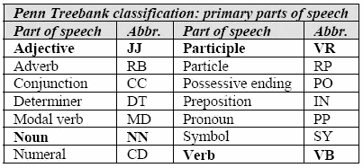
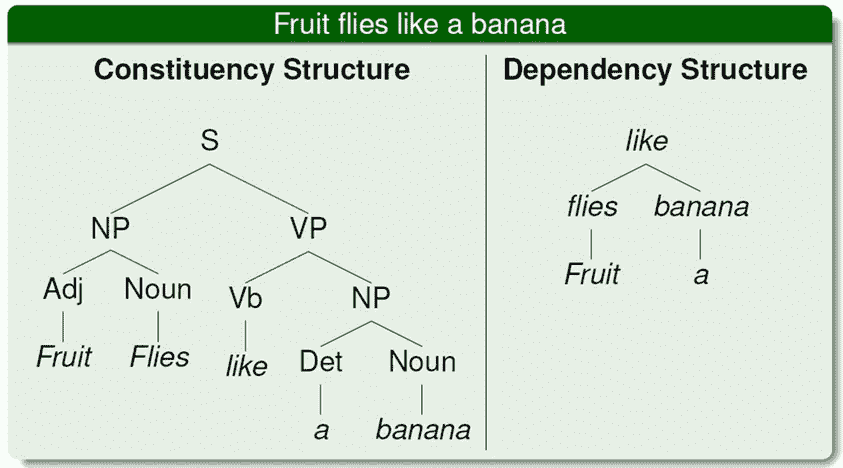
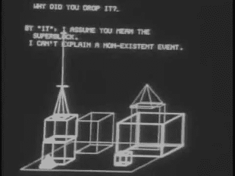
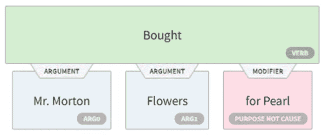
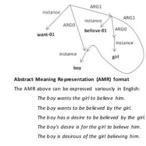
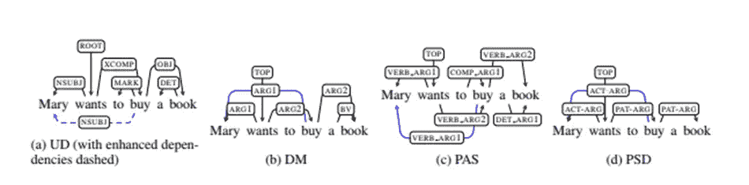
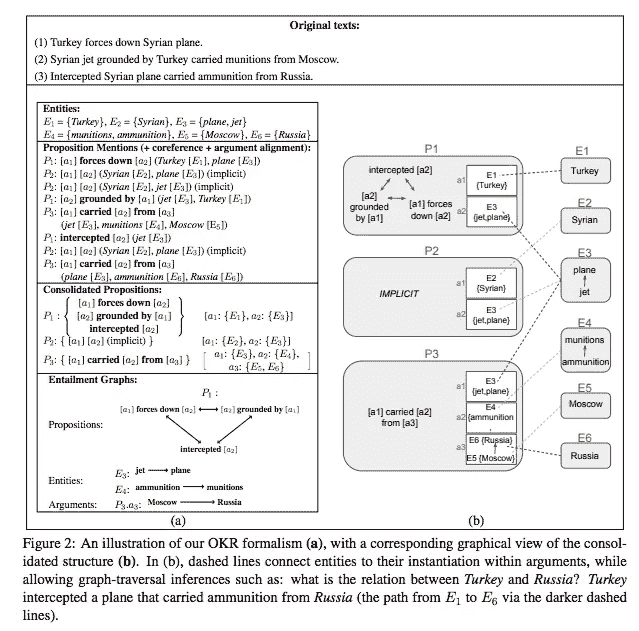
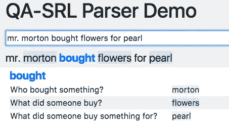

# 超越单词嵌入第 4 部分

> 原文：<https://towardsdatascience.com/beyond-word-embeddings-part-4-introducing-semantic-structure-to-neural-nlp-96cf8a2723fb?source=collection_archive---------9----------------------->

将语义结构引入神经自然语言处理

# TLDR；

自从 [word2vec](https://en.wikipedia.org/wiki/Word2vec) 的出现，神经单词嵌入已经成为在 NLP 应用中封装分布式语义的常用方法。本系列将回顾使用预训练单词嵌入的优点和缺点，并演示如何将更复杂的语义表示方案(如语义角色标记、抽象意义表示和语义依赖解析)整合到您的应用程序中。

## 介绍

本系列的最后几篇文章回顾了神经 NLP 中的一些[最近的里程碑](/beyond-word-embeddings-part-1-an-overview-of-neural-nlp-milestones-82b97a47977f)，将单词表示为向量的[方法和利用它们的架构进展](/beyond-word-embeddings-part-2-word-vectors-nlp-modeling-from-bow-to-bert-4ebd4711d0ec)，以及现有神经 NLP 系统的常见[陷阱](/beyond-word-embeddings-part-3-four-common-flaws-in-state-of-the-art-neural-nlp-models-c1d35d3496d0)。

正如我们在之前的文章中所看到的，尽管诸如 attention 等先进的神经技术有助于建立更强大的 NLP 模型，但它们仍然无法捕捉对语言的牢固理解，从而导致了经常意想不到的结果。

这篇文章将关注于将语言结构整合到自然语言处理应用中的形式主义的发展。

正如我们在上一篇文章中所看到的，自然语言有两个特性使得建模变得很困难，模糊性和可变性。我非常感谢[BIU NLP 实验室](https://www.linkedin.com/in/ayal-klein-33298a61/)[的 Ayal Klein](http://u.cs.biu.ac.il/~nlp/) 和 [Ido Dagan](http://u.cs.biu.ac.il/~dagan/) 对这篇文章的帮助。

## **歧义**

根据出现的上下文，某些单词或短语可以有多种不同的词义。例如，句子“像苹果一样的果蝇”有两种模糊的潜在含义。这个短语可能指的是一种喜欢吃 T21 苹果的飞行昆虫，也可能指的是如果一个人穿过一个水果，它会像苹果一样飞行。

The 6th Century BCE linguist [Pāṇini](https://en.wikipedia.org/wiki/Pāṇini)

自公元前 6 世纪的耶斯卡和 Pāṇini 以来，语言学家们已经认识到某些自然单词表现出共同的句法模式和相关的语义属性。为了解决歧义，语言学家定义了某些语法语言属性，如 ***词性、语态和时态*** 来帮助区分歧义短语。

虽然句法属性如**词性**有助于区分单个单词的预期含义，但它们无法捕捉单词之间的关系。

## **句法** **语法**

随着 20 世纪 50 年代早期计算机的发展，为了处理文本，对解析单词表示之间的关系的形式化技术重新产生了兴趣。

借鉴前人的正式数学著作，语言学家诺姆·乔姆斯基创造了**短语结构语法**，其中单个单词用 [**终结符**表示，它们的词性为**非** **终结符** **规则**](https://en.wikipedia.org/wiki/Terminal_and_nonterminal_symbols) ，可以用更复杂的**成分结构**如名词短语来构建。

With parts of speech a linguist can easily differentiate between the two potential ambiguous meaning of the above phrase. Constituent structures help formalize part of speech identification by

在实践中，为这些系统创建规则是一项艰苦的工作，而且非常脆弱，因为我们对语言的理解不是决定性的。虽然这些系统取得了一些早期的成功，如 SHRDLU，但这些系统并不比玩具程序多多少。

[SHRDLU in action](https://www.youtube.com/watch?v=bo4RvYJYOzI)

## **可变性**

虽然近年来神经系统的**出现有助于关于词性标注和成分分析和**的**和*的最新技术成果，但是它们仍然不能有效地概括共享语义的不同句法短语。***

为了更好地理解这一点，认识到自然语言可以以多种形式表达是有帮助的。

让我们回到[之前帖子](http://tbd)中的例子，其中两个句子，如“*看着孩子受苦没有乐趣*”和“*看着孩子受苦，没有乐趣*”具有不同的句法结构，但仍然嵌入了相同的语义关系，如*孩子、受苦、观看、乐趣*和*没有*。

以下章节将涵盖一些不同的语义结构，这些语义结构有助于统一出现在不同句法上下文中但保持相同语义的单词之间的关系，不仅有助于更好地理解上下文，还有助于更好地理解词汇推理。

# 语义结构

## **语义角色标注(SRL)**

SRL 旨在恢复一个句子的**动词** **述元结构**，如谁对谁做了什么，何时，为何，何地以及如何。

For a relatively enjoyable introduction to [predicate argument structure](https://www.youtube.com/watch?v=Erc4S60eeTI) see this classic video from school house rock

将 ***谓词视为函数*** ，将 ***语义角色视为类类型化参数*** 。AllenNLP 提供了一个最新的 SRL 标记器，可以用来映射动词谓词和论元之间的语义关系。

Allen NLP SRL model

语义角色标注的一个挑战是，虽然更容易解析，但它只映射给定句子的动词谓语论元信息，因此这种表示本质上无法捕捉副词和形容词之间的重要上下文关系。此外，谓词\处理复杂事件共指需要消除歧义。

## **抽象意义表征**

AMR 是从句子结构中抽象出关系的语义表示，例如在下图中，三个句子在同一个 AMR 图中表示。

[Convcomp2016: Verso la “chat intelligente”: la ricerca in Natural Language Processing e Machine Learning](https://www.slideshare.net/convcomp2016/verso-la-chat-intelligente-la-ricerca-in-natural-language-processing-e-machine-learning)

AMR 图是有根的、有标签的、有向的、无环的图( [DAGs](https://en.wikipedia.org/wiki/Directed_acyclic_graph) )，包括整个句子。AMR 代表偏向于英语——它并不意味着作为一种国际辅助语言。虽然 AMR 到文本生成很有前途，但是准确解析 JAMR 仍然是一个公开的问题。JAMR 解析器是一个既能解析又能生成 AMR 语句表示的解析器。

## 语义依赖分析(SDP)

SDP 任务类似于上面的 SRL 任务，除了目标是捕获一个句子中所有实词的**谓词-论元**关系。艾尔。, 2014).这些关系是由不同的语言学派生的语义语法定义的。

Example Semantic Dependency Grammars

与 SRL 不同，SDP 解析考虑了所有实词之间的所有语义关系，而不仅仅是动词和名词谓词。因此，它们不需要谓词意义歧义消除，并且能够表示更广泛的语义现象。

此外，与 AMR 语义依赖解析不同，SDP 与句子标记对齐，这意味着它们更容易与神经 NLP 序列模型一起解析，同时仍然保持语义泛化。

语义依赖解析任务已经有了稳步的改进，对于这个任务，最好的开源工具之一是 call NeurboParser。然而，由于 NeurboParser 是用 C++编写的，安装和使用起来很棘手，所以我冒昧地为这个工具编写了一个 python 包装器和 docker 环境，可以在这里找到。

 [## aribornstein/pyNeurboParser

### NeurboParser 的 python 包装器。通过在…上创建帐户，为 aribornstein/pyNeurboParser 的开发做出贡献

github.com](https://github.com/aribornstein/pyNeurboParser) 

未来的帖子将记录如何开始使用 pyNeurboParser。

## 开放知识表示 OKR

上述语义表示只映射到句子级标记。在现实世界的实际应用中，表示跨多个句子、段落和文档的数据之间的关系是很重要的。

一个早期的尝试是提供一个统一的知识表示来链接语义分析与事件和实体相互引用，这就是 T2 OKR:一个统一的多文本开放知识表示。

Ori Shapira 的一个演示应用于[事件新闻推文的交互式抽象摘要](https://orishapira.files.wordpress.com/2017/08/2017emnlp_ias2.pdf)任务，OKR 将多条推文映射为语义摘要[在此](http://u.cs.biu.ac.il/~shapiro1/okr/)可以找到。

# 总结和未来工作

上述语义表示的一个关键挑战是它们是由语言学家在特定领域语料库上开发的，并且它们可能是复杂的和难以理解的。

目前有许多 NLP 实验室，如华盛顿大学、巴尔-伊兰大学、脸书人工智能研究所和艾伦人工智能研究所，它们正在致力于生成新的语义自然语言语法，这些语法是由解析它们的文档驱动的。

QA- SRL demo learned relations from natural text [http://qasrl.org/](http://qasrl.org/)

这项工作的一个例子是 QA-SRL，它试图对自然语言符号之间的关系提供更容易理解和动态的解析。

 [## 质量保证-SRL |浏览数据

### 编辑描述

demo.qasrl.org](http://demo.qasrl.org/) 

# 行动呼吁

下面是一些资源，可以更好地理解上面概述的语义解析工具。

**工具**

*   [pyNeurboParser](https://github.com/aribornstein/pyNeurboParser) SDP 解析器
*   [在 Azure DLVM 上开始使用 pyTorch 和 Docker](https://docs.microsoft.com/en-us/learn/modules/interactive-deep-learning/?WT.mc_id=blog-medium-abornst)
*   [艾伦 NLP SRL 解析器](http://demo.allennlp.org/semantic-role-labeling)
*   [JAMR 解析器和文本生成器](https://github.com/jflanigan/jamr)
*   [OKR](https://github.com/vered1986/OKR)
*   [质量保证-SRL](http://qasrl.org/)
*   [英特尔 Nervana 交叉文档共同参考](http://nlp_architect.nervanasys.com/cross_doc_coref.html)

**资源**

*   [https://docs . Google . com/presentation/d/192 dbohga 078 dcupoz 10-dja 0 tqevwg _ JcfY _ et 33e 90/edit？usp =共享](https://docs.google.com/presentation/d/192DBohgA078dcupoz10-DJA0TQEvwG_JcfY_et33e90/edit?usp=sharing)
*   [https://medium . com/hugging face/learning-meaning-in-natural-language-processing-the-semantics-mega-thread-9c 0332 dfe 28 e](https://medium.com/huggingface/learning-meaning-in-natural-language-processing-the-semantics-mega-thread-9c0332dfe28e)
*   [http://blog.jacobandreas.net/meaning-belief.html](http://blog.jacobandreas.net/meaning-belief.html)
*   [https://www . Mn . uio . no/ifi/studier/masteroppgaver/ltg/semantic-dependency-parsing . html](https://www.mn.uio.no/ifi/studier/masteroppgaver/ltg/semantic-dependency-parsing.html)

# 下一篇帖子

在这个系列中，我们已经讨论了自然语言处理中除嵌入之外的一些最新发展和趋势。未来的帖子将涵盖相关的进步和代码示例，说明如何随着领域的发展使用这些工具。我还对与计算机视觉、时间序列处理和机器学习操作化相关的主题感兴趣，并将尝试涵盖这些主题。

如果你有任何问题、意见或话题想要我讨论，请随时在推特上关注我。

*关于作者* 亚伦(阿里)博恩施泰因是一个狂热的人工智能爱好者，对历史充满热情，致力于新技术和计算医学。作为微软云开发倡导团队的开源工程师，他与以色列高科技社区合作，用改变游戏规则的技术解决现实世界的问题，然后将这些技术记录在案、开源并与世界其他地方共享。