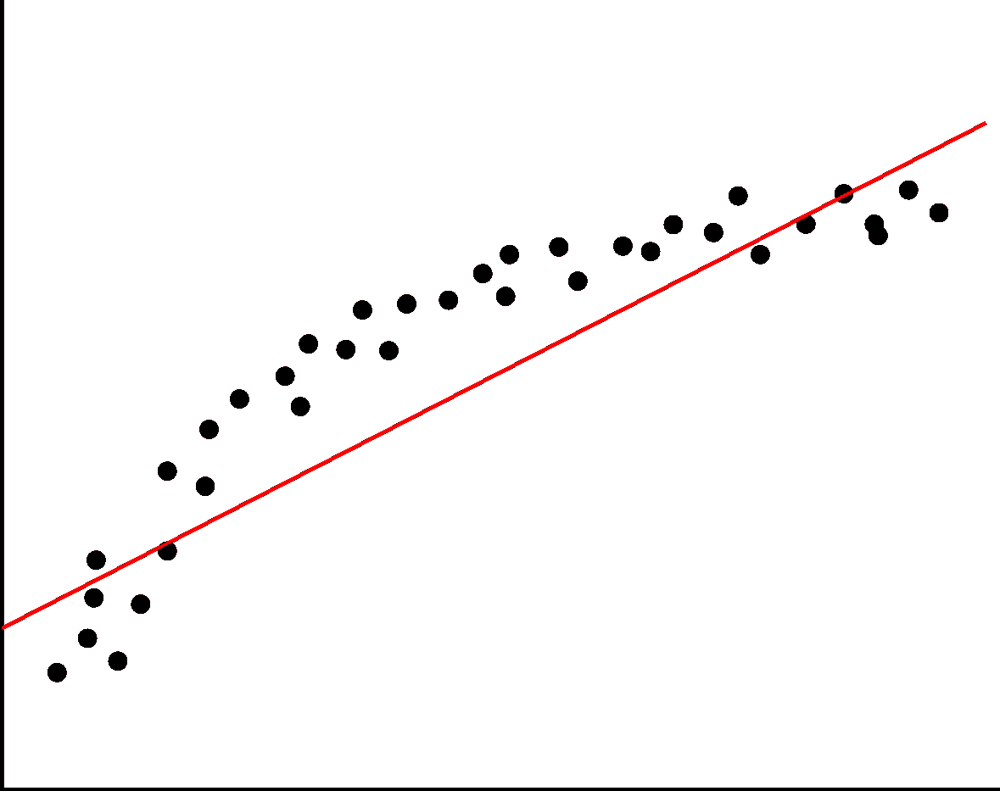
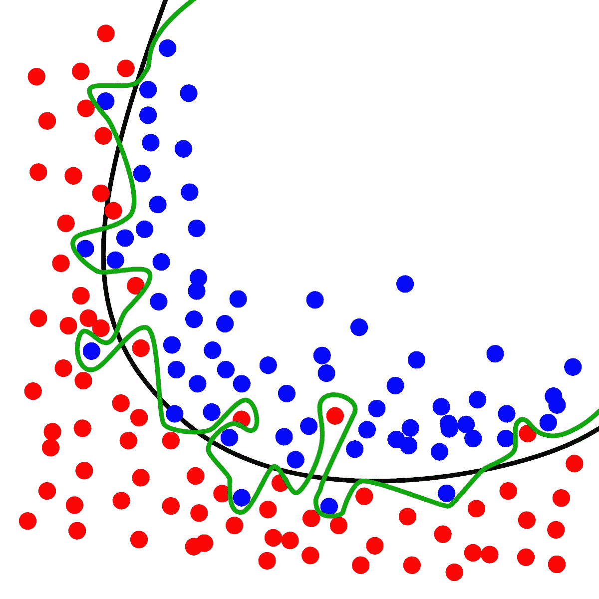
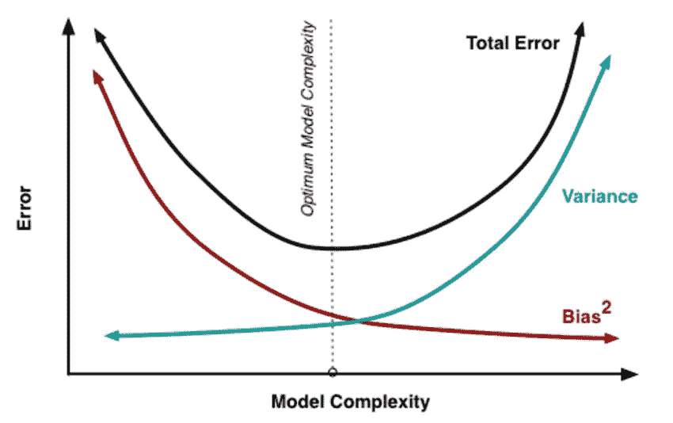
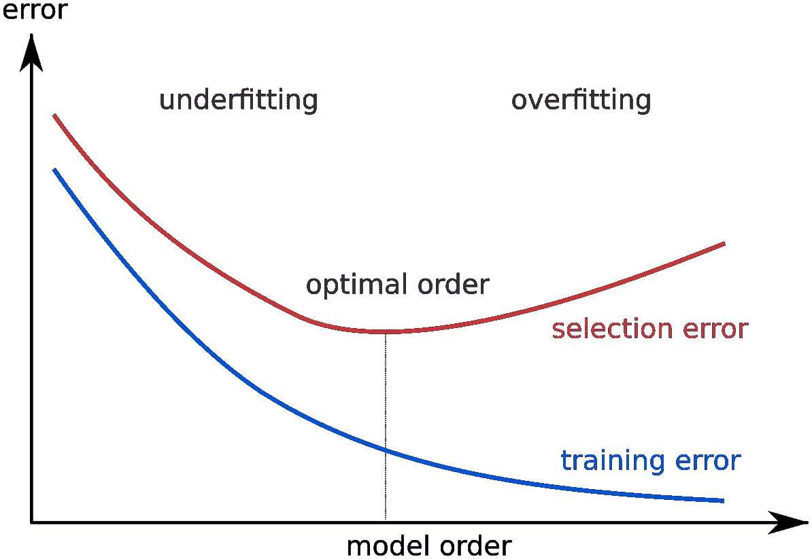

# 偏差-方差困境？

> 原文：<https://towardsdatascience.com/bias-variance-dilemma-74e5f1f52b12?source=collection_archive---------17----------------------->

偏差-方差困境与监督机器学习相关。这是一种通过分解预测误差来诊断算法性能的方法。有三种类型的预测误差:偏差、方差和不可约误差。

*   **偏差误差**:由于偏差造成的误差，即模型的预期(或平均)预测值与试图预测的真实值之间的差异。当然，只有一个模型，所以谈论预期或平均预测值可能看起来有点牵强。然而，如果它不止一次地重复模型构建过程:每次收集新的数据并运行新的分析来创建新的模型。由于基础数据集中的随机性，生成的模型将具有一系列预测。偏差通常衡量这些模型的预测与正确值的差距。假设对具有非线性模式的数据集进行线性回归拟合:

High bias model(underfitting).

无论收集了多少更多的观察值，线性回归都无法对这些数据中的曲线进行建模！这就是所谓的欠拟合。

*   **方差误差**:方差引起的误差是给定数据点的模型预测的可变性。再一次，想象有可能多次重复整个模型构建过程。方差是给定点的预测在模型的不同实现之间的变化程度。例如，有一种算法可以使一个完全不受约束的灵活模型适合数据集。

High variance (overfitting)

如上图所示，这个无约束模型已经基本记住了训练集，包括所有的噪声。这就是所谓的过度拟合。

*   **不可约误差**是真实关系中任何模型都无法从根本上减少的噪声项。它通常来自固有的随机性或不完整的功能集。

从根本上说，处理偏差和方差实际上就是处理欠适应和过适应。**偏差**减少，而**方差**相对于模型复杂度增加。例如，线性回归中的多项式项越多，生成的模型就越复杂。换句话说，偏差具有负的一阶导数以响应模型的复杂性，而方差具有正的斜率。

The relation between bias and variance.

## 为什么在偏差和方差之间有一个权衡？

低方差(高偏差)算法变得不太复杂，具有简单或严格的底层结构。这些模型包括线性或参数算法，如回归和朴素贝叶斯。

另一方面，低偏差(高方差)算法变得更加复杂，具有灵活的底层结构。这些模型包括非线性或非参数算法，如决策树和最近邻算法。

复杂度的权衡是偏差和方差的权衡，一个算法不能同时变得更复杂和更简单。

*Understanding the Bias-Variance Tradeoff, by Scott Fortmann-Roe.*

## 总误差是多少？

然后，总误差可以分解为偏差、方差和不可约误差分量:

Bias-Variance card by Chris Albon.

## 如何检测过拟合和欠拟合，有什么解决方案？

过拟合导致低训练误差和高测试误差，而欠拟合导致训练和测试集中的高误差。

然而，当数据点相对较少而算法需要许多数据点时，测量训练和测试误差是困难的。在这种情况下，一个很好的选择是使用一种叫做**交叉验证**的技术。

这是我们把整个数据集分成 k 个组的地方。对于每个 k 组，我们在剩余的 k-1 组上进行训练，并在第 k 组上进行验证。这样，我们可以最大限度地利用我们的数据，本质上就是获取一个数据集并在其上训练 k 次。

Cross-validation

至于检测到问题后怎么办？高偏差是一个足够简单的模型的症状。在这种情况下，最好的办法就是选择一个更复杂的模型(获取更多的要素或尝试添加多项式要素)

高方差的问题更有趣一点。减少高方差的一个简单方法是使用更多的数据。理论上，对于复杂的模型，随着样本数趋于无穷大，方差趋于零。然而，这种方法是幼稚的，因为方差减小的速率通常相当慢，并且大数据问题几乎总是很难遇到。

减少方差的更好的解决方案是使用**正则化**。它很好地模拟了训练数据，惩罚它变得太复杂。本质上，正则化通过告诉模型不要变得太复杂而将偏差注入模型。常见的正则化技术包括 lasso 或 ridge 回归、神经网络的丢弃和软边界支持向量机。

> 或者，你可以[获得 5 美元/月的中等订阅。](https://medium.com/@dataakkadian/membership)如果你使用这个链接，它会支持我。