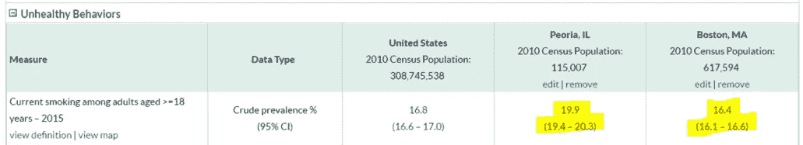
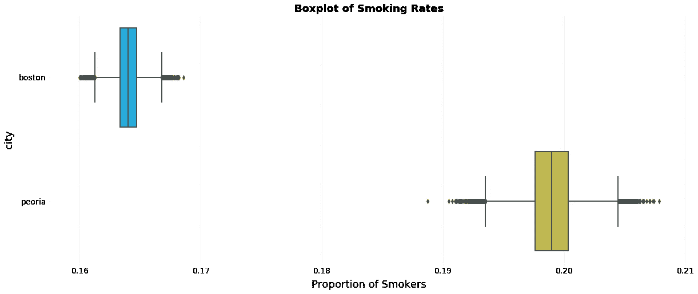
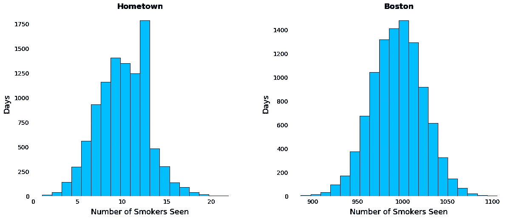
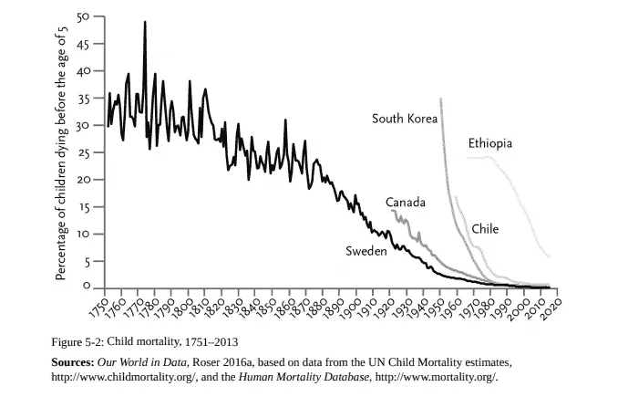
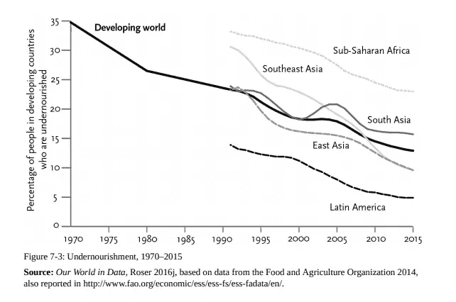
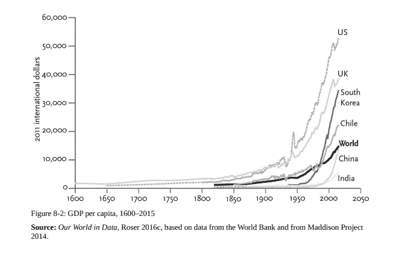
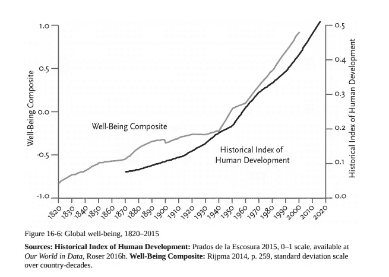
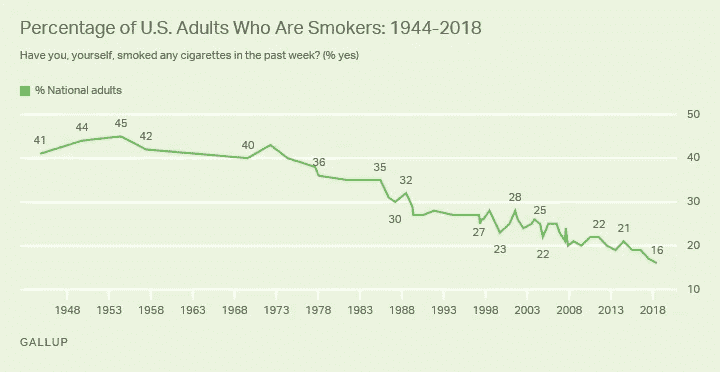

# 用数据克服你的偏见

> 原文：<https://towardsdatascience.com/biases-and-how-to-overcome-them-692c8c35f4a5?source=collection_archive---------17----------------------->

[(Source)](https://www.pexels.com/photo/gray-stone-near-sea-837932/)

## 我们不擅长客观地看待世界。数据可以有所帮助。

有一个广为流传的神话——也许是经济学课程教给你的——人类是理性的。[传统观点](https://en.wikipedia.org/wiki/Rational_choice_theory)是我们客观地分析世界，得出准确的结论，并做出符合我们最大利益的决策。虽然很少有人[完全接受这种观点](https://hbr.org/2009/07/the-end-of-rational-economics)，但我们仍然经常意识不到自己的[认知偏差](https://en.wikipedia.org/wiki/List_of_cognitive_biases)，结果是我们投票、花钱、形成基于扭曲世界观的观点。

我最近的一次亲身经历——由于认知错觉——让我严重误判了现实——让我明白了这一点，并证明了检查我们对世界的看法的重要性。虽然这种情况没有负面后果，但它提醒我们，我们都受到强大的偏见的影响，个人意见不能代替检查数据。

搬到波士顿后不久，我注意到一个惊人的现象:很多人吸烟。几天后，在我看来，每个街角都挤满了点燃香烟的人。我来自中西部的一个小镇，在那里很少看到有人吸烟，我很沮丧:也许大城市鼓励了我最终会染上的不良恶习，或者更糟的是，吸烟率在全国范围内都在上升。

几十年前，我别无选择，只能要么坚持这一信念，要么费力地在图书馆寻找人口统计数据，而现在我能够在几秒钟内从疾病控制和预防中心找到经过验证的数据。令我惊讶的是，我发现下表比较了离我的小镇最近的大都市地区(伊利诺伊州皮奥里亚)和波士顿的吸烟率，这大大打击了我对自己的理性看法:

[Source](https://nccd.cdc.gov/500_Cities/rdPage.aspx?rdReport=DPH_500_Cities.ComparisonReport&Locations=1759000,2507000&rdRequestForwarding=Form): CDC

正如不重叠的 95%置信区间所示，我不仅错了，而且*明显*错了。(尽管我们倾向于关注单个数字，[考虑不确定性估计是至关重要的](http://berkeleysciencereview.com/importance-uncertainty/)，尤其是在处理现实世界的人口统计数据时)。为了直观地展示我是多么的错误，甚至考虑到不确定性，我做了下面的吸烟率箱线图:

Boxplot of Smoking Rates

为什么我错了？我坚信[分析你的错误，这样你就不会再犯](https://medium.com/p/590ab40d1995?source=user_profile---------3------------------)在这个过程中，我总结出三个理由:

1.  [**可用性启发式**](https://thedecisionlab.com/bias/availability-heuristic/) **:** 我们通过记忆中某件事出现的次数来判断它发生的可能性有多大。
2.  [**证实偏差**](https://thedecisionlab.com/bias/confirmation-bias/) **:** 一旦我们有了一个信念，我们就会无意识地寻找证实它的证据，而忽略与之相矛盾的证据。
3.  [**分母忽略**](https://www.askattest.com/blog/home/denominator-neglectcdr) **:** 我们只看分子——吸烟者的数量——而忽略分母——我们一天中看到的总人数。

这些都是[认知偏差](https://en.wikipedia.org/wiki/Cognitive_bias)的例子——推理中的错误和对理性决策的偏离——或者[启发式](https://en.wikipedia.org/wiki/Heuristics_in_judgment_and_decision-making)——我们用来快速做出判断的心理捷径(经验法则)。虽然这些在我们进化的过去很好地服务了我们，但在今天的世界它们经常让我们失望。我们现在需要[处理许多具有复杂交互因素的信息流](https://www.tech21century.com/the-human-brain-is-loaded-daily-with-34-gb-of-information/),而我们快速的直觉并不适合这个目的。

(关于认知偏差以及如何克服它们的权威参考，请阅读丹尼尔·卡内曼的杰作 [*思考，快与慢*](https://en.wikipedia.org/wiki/Thinking,_Fast_and_Slow) *。*学习这些的一个不那么吓人的格式是 [*你没那么聪明播客*](https://youarenotsosmart.com/podcast/) )。

纠正我们先天不足的最简单的方法之一就是检查我们自己。尤其是在一个有如此多准确信息可自由获取的时代，坚持错误信念是没有借口的。不要从个人经历/轶事中推理，而是去查实际数字！

此外，除了找出正确的答案，思考我们为什么会出错也很重要。我们永远无法摆脱认知偏见，但我们可以学会识别它们何时出现以及如何克服它们。例如，我应该注意到不吸烟的人*(分母)，或者想想我每天在我的小镇上看到的总人数与我在波斯顿观察到的人数相比。*

*在最后一点的基础上，虽然看数据本身是有用的，但试图理解它在你的生活中意味着什么可能更有帮助。这就是一些[统计和基本数据操作大有用武之地的地方。](https://www-bcf.usc.edu/~gareth/ISL/)*

*在我的家乡，平均每天，我可能会看到大约 50 人在附近散步(好吧，在中西部没有人散步，但和我在一起)，相比之下，波士顿的人数可能是 5000 人的 100 倍。知道了吸烟率和我期望看到的总人数，我模拟了 10，000 天，以找出与我的家乡相比，我在波士顿一天期望看到多少吸烟者。([GitHub 上有 Jupyter 笔记本](https://github.com/WillKoehrsen/Data-Analysis/blob/master/statistics/Investigating%20Data.ipynb))。*

**

*Simulation results for 10,000 days in my hometown versus Boston.*

*尽管我的家乡吸烟者的比例在统计上更高，但就原始数据而言，平均每天我会看到大约 100 倍于波士顿的吸烟者。这些图表，加上我对分母的忽略，显示了为什么我如此容易受到可用性启发的影响。*

# *为什么这很重要*

*虽然这个小例子无伤大雅，但我们偏见的普遍影响是普遍的，而且往往是有害的。例如，由于负面新闻占主导地位(体现在可用性启发中)，人们普遍认为世界正在变得更糟。事实上，从几乎所有的客观标准来看，我们正生活在人类历史上最好的时期，情况正在改善。(所有图表均来自[启蒙运动现](https://www.penguinrandomhouse.com/books/317051/enlightenment-now-by-steven-pinker/9780525427575/)作者史蒂芬·平克)。*

********

*Graphs showing positive gains in numerous measures worldwide.*

*这具有现实世界的含义:人们投票给承诺回到更好时代的领导人，因为他们没有看数据，没有意识到现在是最佳时机！离开政治，想想你的个人生活:有没有一段你花了太长时间的感情，一份你一直坚持的消极工作，或者甚至是一本书，尽管你不喜欢，但你还在继续读？那么你就成了[沉没成本谬误](https://www.smithsonianmag.com/science-nature/mice-and-men-struggle-to-abandon-their-best-laid-plans-180969675/)的受害者，我们继续在努力上浪费时间，因为我们已经付出了努力。*

*再举一个例子，如果你发现自己在担心航空旅行，不要去读那些微不足道的飞机坠毁事件，看看显示飞行是最安全旅行方式的[数据。](http://mentalfloss.com/article/543985/airplanes-safest-way-to-travel)*

*我试图为自己采纳两条简单的规则来减轻认知偏差:*

1.  ***查找相关数据:**尝试寻找多个可靠的来源，考虑不确定性估计，并在可能的情况下自己探索数据*
2.  *[**寻找不确定的证据**](https://fs.blog/2017/05/confirmation-bias/) **:** 当你读的所有东西都证实了你的信念时，很可能是时候读点别的了。*

*遵循这些指导方针不会让我变得完美，但是它们会帮助我逐渐变得少犯错。我不相信总有一个客观真理，但我确实认为事实比我们的主观判断好得多。*

*以一个令人高兴的消息结束这篇文章，这里有一个图表显示了美国吸烟率的下降(尽管我有误解)！*

**

*National Smoking Rates in the United States ([Source: Gallup](https://news.gallup.com/poll/237908/smoking-rate-hits-new-low.aspx)). There’s no substitute for accurate data.*

*一如既往，我欢迎反馈和建设性的批评。可以通过 Twitter [@koehrsen_will](http://twitter.com/@koehrsen_will) 或者通过我的网站 [willk.online](https://willk.online) 找到我。*