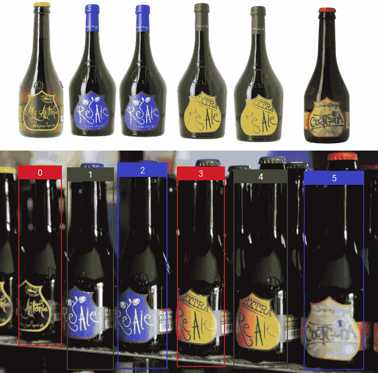
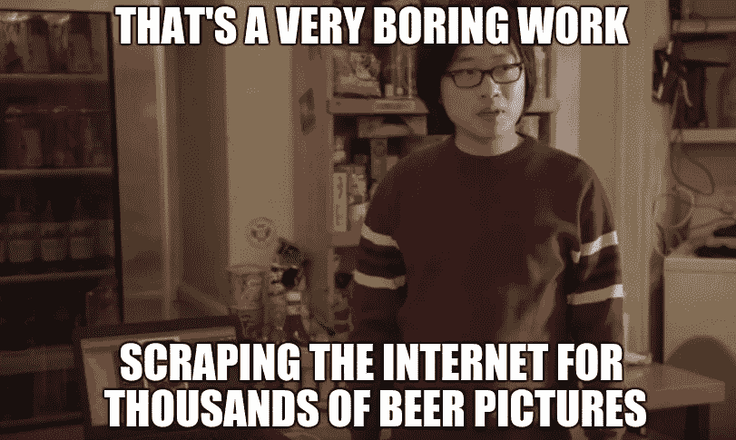
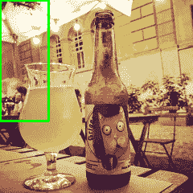
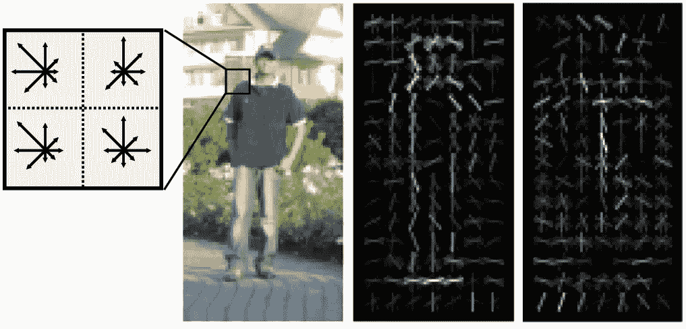
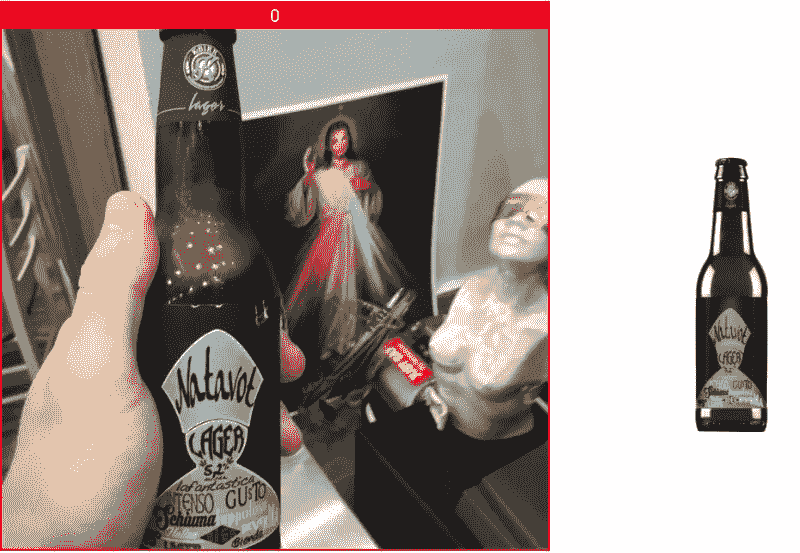
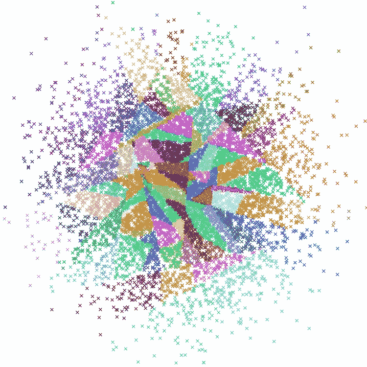
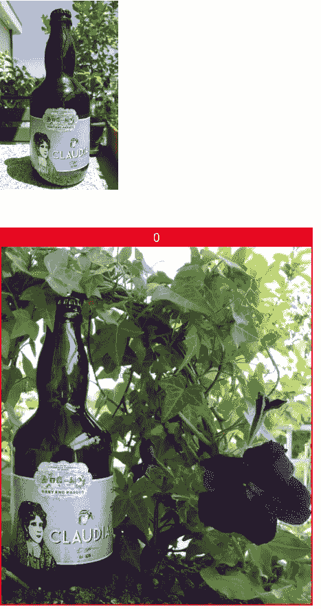

# BiBirra:啤酒标签识别

> 原文：<https://towardsdatascience.com/bibirra-beer-label-recognition-8546c233d6f4?source=collection_archive---------4----------------------->

几周前，我和我的女朋友在超市，我们被邀请去吃饭，我们想带酒。我们都不是葡萄酒专家，但她有一张绝妙的王牌，她拿出手机，拍了一张葡萄酒标签的照片，立即得到了对那瓶酒的描述和评论。那个应用程序的强大给我留下了深刻的印象(它被称为 [ViVino](https://www.vivino.com/) ),她要求我开发类似的东西。

我接受了这个挑战，但加入了一些个性化的内容:

*   因为比起葡萄酒，我更喜欢啤酒，所以我想做一个啤酒识别应用程序
*   我想比维维诺做得更好，甚至能从一张照片上认出多个瓶子。

这就是我如何想出 BiBirra (birra 是啤酒的意大利语)

# 擦

我们需要构建啤酒识别器的第一件事是啤酒图像的数据库。据我所知，没有这样的数据库存在，所以我们只能做一件事:

That’s not exactly [what Jian Yang said](https://www.youtube.com/watch?v=FNyi3nAuLb0)

幸运的是，网络上充斥着卖啤酒的网店，我已经开发了[一个名为 Raschietto](https://hackernoon.com/raschietto-a-simple-library-for-web-scraping-46957c6aa5b7) 的小型网络抓取图书馆。这个库让我可以非常快速地编写刮刀，不到一天我就可以从网上收集到大约 2300 张啤酒瓶图片以及它们的基本信息(名称、类型、颜色、酒精体积、苦味……)。

关于每种啤酒的信息到处都有一些缺失的数据(主要是因为一些商店不包含太多关于啤酒的信息)，清理这些数据以获得像 ViVino 一样的完美结果真的很耗时，需要大量的手工工作。我的目标是创建一个工作原型和图像，所以我决定继续下一阶段。

# **瓶子检测**

在进行实际的啤酒识别之前，我们首先需要检测图像中的每个瓶子。由于瓶子的形状非常独特，这很容易做到。一种方法是训练二元(两类:啤酒或非啤酒)分类器，然后应用滑动窗口方法来检测每个瓶子。具体来说，这意味着在整个输入图像的不同位置和尺度上应用分类器，然后应用[非最大抑制](https://www.pyimagesearch.com/2014/11/17/non-maximum-suppression-object-detection-python/)来移除重叠的边界框。

An example of sliding window

可以使用经典的 HOG+SVM 组合来构建分类器，这在检测形状没有太多变化的对象(例如[人](https://lear.inrialpes.fr/people/triggs/pubs/Dalal-cvpr05.pdf))方面非常好。我们只需要从每个训练图像中提取一个[梯度方向直方图(HOG)](https://en.wikipedia.org/wiki/Histogram_of_oriented_gradients)

然后在转换后的数据上训练线性[支持向量机(SVM)](https://en.wikipedia.org/wiki/Support_vector_machine) 。

这种历史悠久的方法非常强大，但训练这样的分类器非常耗时，尤其是当我们考虑到我们可以免费且几乎立即获得一个基于现代深度学习的现成模型时。

## 单发探测器

为了检测，我决定使用一种特殊类型的 CNN ( [卷积神经网络](https://medium.com/@ageitgey/machine-learning-is-fun-part-3-deep-learning-and-convolutional-neural-networks-f40359318721))称为单次检测器。这种神经网络直接输出一组包围盒和类来实现检测，而不使用滑动窗口。

这种架构的一个很大的优点是输入图像的每个像素只被提供给模型一次(与使用滑动窗口时的多次相比),这意味着我们不会浪费资源多次重新计算局部特征。这个观察激发了一个著名的探测模型的名字:YOLO ( [你](https://arxiv.org/abs/1506.02640) [只看](https://arxiv.org/abs/1612.08242) [一次](https://pjreddie.com/darknet/yolo/))。类似的机型还有很多: [SSD](https://arxiv.org/abs/1512.02325) ， [R-CNN](https://arxiv.org/abs/1311.2524) ，[更快的 R-CNN](https://arxiv.org/abs/1506.01497) 。

我决定使用这里介绍的[模型](https://www.pyimagesearch.com/2017/09/11/object-detection-with-deep-learning-and-opencv/)，它是 [MobileNet](https://arxiv.org/abs/1704.04861) 架构和单次检测器框架的组合，可以检测:飞机、自行车、鸟、船、**瓶子**、公共汽车、汽车、猫、椅子、牛、餐桌、狗、马、摩托车、人、盆栽、羊、沙发、火车和电视监视器。这个使用 MobileNet 架构的模型是轻量级的，但是仍然有很好的性能。

我只需要 bottle 类，所以这个模型可能有点过了，但它工作得很好(识别算法对检测错误很健壮)，很快，随时可以使用，所以我决定采用它。

An example of detection failure but correct recognition (I know, the background is quite strange but this is what I’ve found on the internet)

# 啤酒识别

算法的关键部分来了，给定一个瓶子的图像，我们需要拿出一个啤酒标签。如果我们把这个问题看作一个分类问题，我们有 2300 个类，每个类有 1 或 2 个例子，这是一个不可能的问题。更好的方法是把它看作一个[基于内容的图像检索(CBIR)](https://en.wikipedia.org/wiki/Content-based_image_retrieval) 问题:给定一张啤酒的图片，我们需要在数据库中找到最相似的图像。我们需要做的唯一事情是定义(或学习)一个相似性度量，并使用它来比较查询图像和我们数据库中的所有图像，并选择最相似的一个。检索过程可分为两步:

1.  嵌入:我们需要从每张图片中提取出其内容的简洁表示。然后，我们使用这种表示来计算两幅图像之间的相似性。嵌入的一个例子可能是计算[颜色直方图](https://en.wikipedia.org/wiki/Color_histogram)或使用由[自动编码器](https://en.wikipedia.org/wiki/Autoencoder)学习的潜在表示。
2.  **索引**:给定查询图像的嵌入，我们将需要一种从数据库中检索最相似图像的有效方法。索引算法帮助了我们，允许我们进行快速的最近邻查询。

## 筛选/冲浪功能

每个啤酒标签都是独一无二且固定不变的(除了视角和光线的变化)，因此使用[筛选](https://en.wikipedia.org/wiki/Scale-invariant_feature_transform)(或[冲浪](https://en.wikipedia.org/wiki/Speeded_up_robust_features))描述符可以获得良好的代表性。这些描述符所做的是找到图像上的一组关键点(连同它们的比例和方向)，然后用浮点向量表示每个关键点(例如 SIFT 产生长度为 128 的向量)。这些描述符被设计为对比例、旋转和光照的变化具有鲁棒性。

对于像 SIFT 或 SURF 这样的局部描述符，可以使用许多方法:

*   使用一个[视觉单词包](https://en.wikipedia.org/wiki/Bag-of-words_model_in_computer_vision)方法，用描述符频率的直方图表示每个图像，然后比较这些直方图，在数据库中找到与查询图像最相似的图像。
*   使用本地描述符和 [RANSAC](https://en.wikipedia.org/wiki/Random_sample_consensus) 来尝试将查询图像与 DB 中的每个图像对齐，然后选择最匹配的一个。如论文中提出的“[手机酒标识别](https://pdfs.semanticscholar.org/f6c6/d26851cd0df13592e5e0b8c0752789ca2c09.pdf)”。
*   给定一个查询图像，对于每个描述符，从数据库中找到最相似的描述符，并给相应的图像一些点。在使用所有描述符后，选择得分最高的图像作为匹配。

我发现后一种方法(我认为是我发明的)在这种情况下更好，所以我决定采用它。请注意，这种方法不需要任何对齐阶段，因此比论文中提出的方法更快，并且通过同时查询所有图像，允许使用索引来加速查询。

为了进一步提高查询速度，我使用 [PCA](https://en.wikipedia.org/wiki/Principal_component_analysis) 将描述符压缩到 16 维。这种压缩不影响准确性(它删除了许多不重要的功能)，但大大减少了空间和时间需求。

A visualization of the structure used by Annoy

## 用 airy 近似最近邻

为了获得快速的最近邻居查询，我决定使用[骚扰](https://github.com/spotify/annoy)(由 Spotify 开发)

> aroy([Approximate Nearest Neighbors](http://en.wikipedia.org/wiki/Nearest_neighbor_search#Approximate_nearest_neighbor)Oh Yeah)是一个 C++库，使用 Python 绑定来搜索空间中靠近给定查询点的点。它还创建了基于文件的大型只读数据结构，这些数据结构被[映射](https://en.wikipedia.org/wiki/Mmap)到内存中，以便许多进程可以共享相同的数据。

在引擎下，airy 创建了一个二叉树森林，每个二叉树都是通过用随机超平面分割数据来构建的。每个查询将返回一组近似的最近邻。由 aroy 产生的结果只是近似的，不能保证得到最接近的点，但这是减轻维数灾难和获得良好性能的代价。

# 结果

我收集了一个非常小的测试集，由 45 张啤酒图片组成，我达到了 100%的准确率。如此小的测试集在统计上并不显著，但这一结果无疑是良好性能的标志。

让我们来看看算法的运行情况:

The algorithm works also in case of detector failure (left) and in presence of occlusion (right)

你可以在我的网站[https://Matteo . ronche tti . XYZ](https://matteo.ronchetti.xyz)上找到更多关于我的信息，我所有的项目和我所有的帖子

我写的关于计算机视觉的其他文章:

 [## 用 Python 和 OpenCV 创作点彩画

### 我最喜欢的绘画技巧之一是点彩画，这是一种用小的不同颜色点…

hackernoon.com](https://hackernoon.com/https-medium-com-matteoronchetti-pointillism-with-python-and-opencv-f4274e6bbb7b)