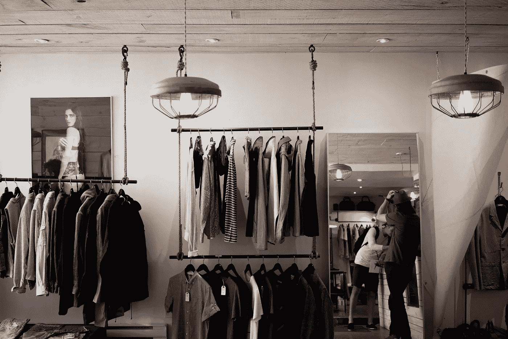
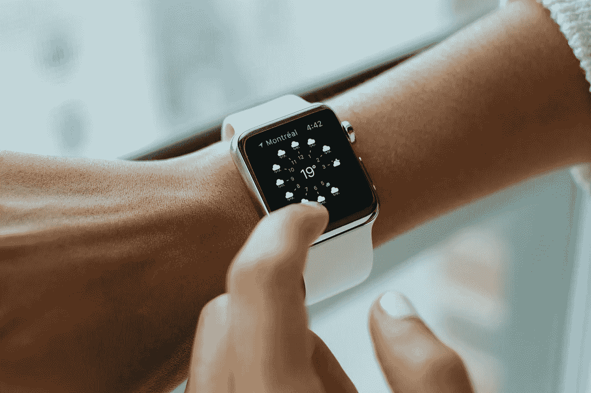
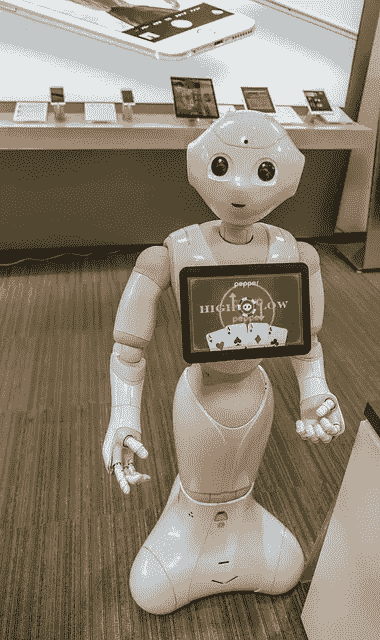

# 大数据分析和零售—未来会怎样？

> 原文：<https://towardsdatascience.com/big-data-analytics-and-retail-what-does-the-future-have-in-store-e2afd5a7d1e4?source=collection_archive---------0----------------------->

多亏了互联网，今天大多数人都有能力跟上当前的市场趋势和新兴技术。联网设备的无处不在、不断发展的技术环境和不断增长的人均收入是普通消费者期望值大幅提高的部分原因。因此，B2C 公司一直在努力满足消费者的奇思妙想。

例如，出于同样的原因，零售业多年来经历了许多经营变革。大数据分析解决方案在帮助零售商实现上述变化方面一直发挥着关键作用。因此，随着越来越多的零售商不断致力于增强供应链运营、改善营销活动、提高客户满意度和忠诚度，以实现高水平的[零售成功](http://bridgei2i.com/blog/big-data-analytics-for-big-retail-success/)，分析解决方案的采用稳步增长。

我写的另一篇[文章](http://bridgei2i.com/blog/technological-innovations-driving-retail-industry/)探讨了一些主要的技术创新，这些创新目前正在帮助零售业的一些分析操作。现在，让我们来看看可能会塑造未来零售业的一些技术。

## 可穿戴技术

很久以前，使用智能手机、平板电脑和个人电脑进行零售交易已经变得司空见惯。然而，与可穿戴设备相关的进步可能会在不久的将来进一步提升购物体验。例如，Apple Pay 是一款在零售领域掀起波澜的应用。Apple Pay 是一种数字钱包或移动支付服务，由苹果公司于 2014 年推出。

除了 iPhone、iPad 和 Mac 设备，这项服务也适用于 Apple Watch。这项服务使消费者能够在零售店进行简单安全的支付。双击手表侧面的按钮，调出保存的借记卡/信用卡。然后消费者只需将手表靠近商家终端，几秒钟内就完成了支付。

可穿戴设备的类似应用可能会被开发出来，这不仅会节省消费者和零售商的时间，还会促进大数据分析操作的数据收集。

## 虚拟现实

由于虚拟现实(VR)技术，今天的几家零售商能够提供身临其境的购物体验。例如，阿迪达斯推出了基于微软 Kinect 技术的 BodyKinectizer，为顾客提供数字零售体验。

BodyKinectizer 是一款低成本的人体扫描仪，可以对客户进行精确的 3D 扫描。然后，该系统会根据顾客的身体尺寸给出尺寸建议。该系统还包括一个交互式触摸屏界面，允许他们打扮自己的虚拟自我。这有助于顾客想象自己穿着他们选择的服装，从而提供丰富的零售体验。

随着技术变得更加可扩展和可访问，零售行业对 VR 的采用将会增加。

## 无人机和卫星

Orbital Insight(地理空间大数据公司)首席执行官詹姆斯·克劳福德(James Crawford)透露，深度学习人工智能神经网络可用于确定到达零售店的车辆数量。可以看出周模式，这有助于零售商了解购物者的行为。这些见解还有助于实时规划和衡量销售活动。

此外，与商店往返客流量相关的数据有助于衡量不同天气条件下的销售业绩。

## 人工智能

根据德勤关于 2016 年零售趋势的报告，机器人帮助下的自动化在商店中越来越普遍。例如，沃尔玛正在与五行机器人公司合作开发一款名为 Dash 的机器人购物车，它将帮助客户找到商品，同时减轻他们推着沉重的购物车时的压力。购物车也有助于方便支付。

另一个例子是零售连锁店 Lowe's，它最近与 Fellow Robots(一家技术公司)合作推出了 LoweBot。LoweBot 是一个五英尺高的自主服务机器人，具有自主导航、库存审计、语音识别和避障等功能。

LoweBot 主要服务于两个目的:库存管理和客户协助。机器人能够扫描库存并保存相关数据。这些数据有助于零售商做出更快的商业决策。该机器人使用 3D 扫描来检测人体框架，并通过语音识别与客户交流。它帮助顾客在商店内导航并找到所需的商品。

(representative image)

显然，零售业正在快速发展，消费者的行为也随着技术的进步而改变。率先采用新兴技术的零售商将会出现在新闻中，因此也是相关的。此外，他们更有可能吸引新客户，并保留现有的客户群。

相反，抵制变革的企业将很快被遗忘。随着越来越多的零售商采用最新技术，有效利用大数据分析解决方案将成为获得竞争优势的关键。

沃尔特·勒布在一篇文章中写道，后千年人口，通常被称为 Z 世代，将极大地影响零售业未来的发展。58%的人说他们喜欢在实体店购物。

在尝试新产品和在社交媒体上分享信息方面，Z 世代似乎也很热情。这种消费者行为至关重要，因为实体和在线零售商都在不断尝试寻找新的方式来提供差异化服务。此外，零售商意识到了社交媒体评论的重要性，以及它们会如何影响或破坏自己的商业声誉。

在这方面，看看零售业的影响者和专业人士在 2017 年 1 月在纽约市举行的全球领先的年度零售活动-零售大展(NRF 年度会展)上说了些什么:

***

*这篇报道最早出现在* [*BRIDGEi2i 博客*](http://bridgei2i.com/blog/big-data-analytics-and-retail-what-does-future-have-in-store/) *上。*