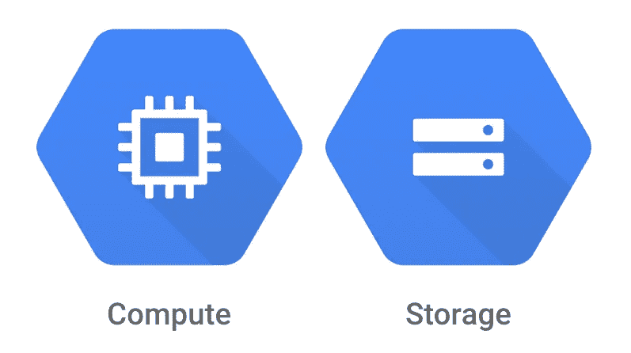
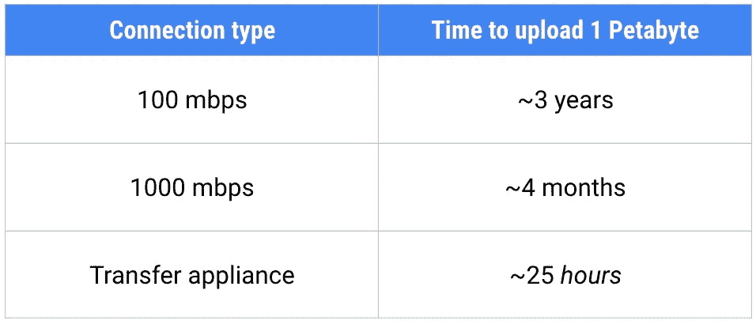

# 云端训练模型的大数据

> 原文：<https://towardsdatascience.com/big-data-for-training-models-in-the-cloud-32e0df348196?source=collection_archive---------6----------------------->

当我们的训练数据太大而不适合我们的机器时，或者训练模型开始需要几个小时时，会发生什么？我们当然要上云！

当您拥有大量数据，以致无法在本地计算机上合理地运行培训，或者数据的大小超过了您的硬盘容量时，就该考虑其他选择了。

# 上云

一个可靠的选择是将机器学习培训转移到另一台具有更多存储空间的计算机上，从而释放您的硬盘空间，并允许您在培训进行时处理其他事情。

Don’t let data limits hold back your stream

让我们具体分析一下哪些部分需要迁移到云中。将我们的培训视为需要两种主要资源是有益的:计算和存储。

有趣的是，我们并不需要像你一开始期望的那样将它们紧密地联系在一起。我们可以将它们解耦，这意味着我们可以利用两者的专用系统。在处理大数据时，这可以带来规模效益。

计算负载的转移非常容易，但是大型数据集的转移可能会更加复杂。然而，如果你的数据确实很大，结果*是*值得努力的，因为它允许数据被许多机器并行访问，在你的机器学习训练工作中工作。

# 将数据移动到云

Google Cloud Platform 有几种简单的方法将这些抽象联系在一起。首先，我们要确保我们在谷歌云存储(GCS)上的数据。我们可以使用各种工具来完成这项工作。

## `gsutil`

对于中小型数据集，只需使用`[gsutil](https://cloud.google.com/storage/docs/gsutil)`。这是一个命令行工具，专门用于与谷歌云存储交互，并支持一个`-m`选项，允许并行发送多个流，从而加快传输速度。

## 谷歌传输设备

如果您的数据太大而无法通过网络发送，请使用 [Google Transfer Appliance](https://cloud.google.com/transfer-appliance/) ，这是一台运送到您的数据中心的物理机器，可以安全地捕获和传输高达 1pb 的数据。

在典型的 100 兆比特每秒的网络带宽下，通过网络上传 1pb 的数据需要 3 年时间！即使你有一个 1gb 的连接，它仍然需要 4 个月！谁愿意等那么久！？另一方面，transfer appliance 可以在短短的 25 小时(T2)内捕获 1pb 的数据。太快了！

# 接下来

现在我们的数据在云中，我们已经准备好大规模地进行我们的机器学习训练。但那是一个完整的话题！别担心，我们下一集会讲到。

利用有限的计算和存储资源，在大型数据集上训练机器学习模型可能具有挑战性，但事情不一定是这样的！通过使用`gsutil`或 Transfer Appliance 将数据移动到云中，您可以在大型数据集上进行训练，而不会出现任何问题。

感谢阅读这一集的[云人工智能冒险](https://goo.gl/UC5usG)。如果你喜欢这个系列，请为这篇文章鼓掌让我知道。如果你想要更多的机器学习动作，一定要关注 Medium 上的[me](https://medium.com/@yufengg)或订阅 YouTube 频道来观看未来的剧集。更多剧集即将推出！

但现在，请记住:当你需要在大数据集上进行机器学习时，请将数据放在云中。