# 大数据集成

> 原文：<https://towardsdatascience.com/big-data-integration-9a2fb2d78529?source=collection_archive---------9----------------------->

# 1.介绍

数据集成是一组用于从不同来源检索数据并将其组合成有意义和有价值的信息的过程。一个完整的数据集成解决方案可以提供来自各种来源的可信数据[5]。传统的数据集成技术主要基于 ETL(提取、转换和加载)过程来摄取和清理数据，然后将其加载到数据仓库中。

如今，大量的数据是从许多异构数据源收集的，这些数据源实时生成不同质量的数据，这就是所谓的大数据。大数据集成非常具有挑战性，尤其是在传统的数据集成技术无法处理大数据之后。

我们可以说，大数据集成在许多方面不同于传统的数据集成:数量、速度、多样性和准确性，这些是大数据的主要特征:

*   体量:这是大数据的原始属性。如今，联网设备和人员的数量比以前更多，这极大地影响了世界范围内的数据源数量和数据量。
*   速度:随着数据源数量的增加，数据生成的速度随着时间的推移而大大提高，尤其是在社交媒体和 IOT 出现之后。
*   多样性:更多的数据源意味着我们存储数据的格式有更多的多样性。我们有高层次的结构化和非结构化数据。每种类型都有大量的格式:文本、图像、声音、xml、文档、空间数据等等。
*   准确性:上面列出的特征导致我们有不同的数据质量，所以我们可以找到不确定或不精确的数据，特别是社交媒体和博客允许用户传播这种数据。

在本文中，我们试图概述大数据集成技术和挑战，并展示该领域的一些最新研究。

本文主要基于 X. L. Dong 和 D. Srivastava 撰写的令人惊叹的《大数据集成》[2]一书。

# 2.传统数据集成

要跨混合应用程序环境集成数据，您需要将数据从一个数据环境(源)获取到另一个数据环境(目的)。在传统的数据仓库环境中，提取、转换和加载(ETL)技术已经被用来完成这一任务。[1]

ETL 工具结合了从一个数据环境获取数据并将其放入另一个数据环境所需的三个重要功能。

*   提取:从源数据库中读取数据。
*   转换:转换提取数据的格式，使其符合目标数据库的要求。(转换通过使用规则或将数据与其他数据合并来完成。)
*   Load:将数据写入目标数据库

传统上，ETL 在数据仓库环境中与批处理(rest 上的数据)一起使用。

数据仓库为业务用户提供了一种方法来整合不同来源的信息，以分析和报告与其特定业务焦点相关的数据。ETL 工具用于将数据转换成数据仓库所需的格式。在将数据装载到数据仓库之前，转换实际上是在中间位置完成的。

许多软件供应商，包括 Oracle、Microsoft、IBM、Informatica、Talend 和 Pentaho，都提供了传统 ETL 软件工具。

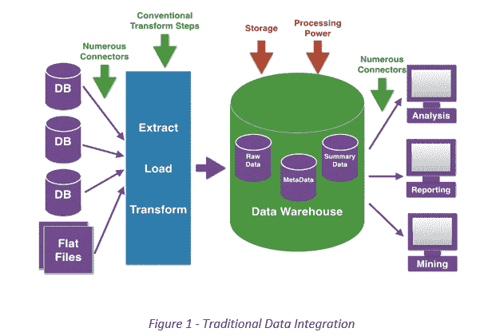

Image Source: [www.neiltortorella.com/hadoop-data-warehouse/impressive-hadoop-data-warehouse-5-traditional-data-warehouse-systems-data-integration-or-etl-systems](http://www.neiltortorella.com/hadoop-data-warehouse/impressive-hadoop-data-warehouse-5-traditional-data-warehouse-systems-data-integration-or-etl-systems/)

大数据出现后，传统的数据仓库系统无法处理它，这增加了改进和使用更高效和强大的技术的需求。

# 3.大数据集成

与传统的关系数据库相比，大数据平台的元素以新的方式管理数据。因为管理结构化和非结构化数据需要可伸缩性和高性能。从 Hadoop 到 NoSQL 数据库，大数据生态系统的所有组件都有自己的方法来提取、转换和加载数据。

此外，传统的 ETL 工具正在发展，以处理新的大数据特征。虽然传统形式的集成在大数据世界中有了新的含义，但集成技术需要一个支持数据质量和分析的通用平台。

正如我们在上一节中提到的，传统的数据集成是使用批处理来执行的(关于其余部分的数据)，而大数据集成可以实时或通过批处理来完成。这使得 ETL 阶段被重新排序，在某些情况下成为 ELT，因此数据被提取出来，加载到分布式文件系统中，然后在使用之前进行转换。

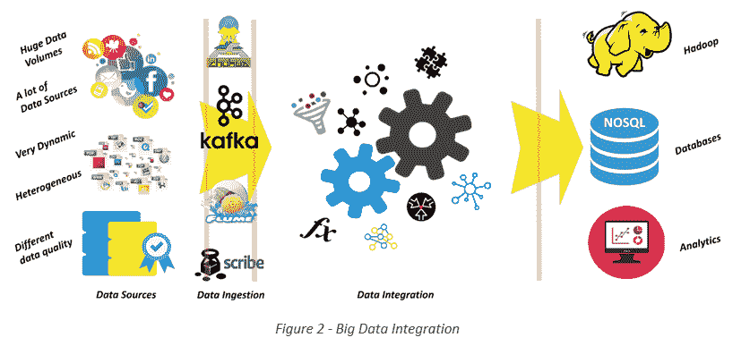

为了根据大数据分析做出良好的业务决策，数据需要得到组织所有级别的信任和理解。它需要在整个企业中以可信、可控、一致和灵活的方式交付给业务部门。为了实现这一目标，使用了三种基本技术:

*   模式映射
*   记录链接
*   数据融合

模式映射和记录链接用于传统的数据集成，但它们包含在 ETL 过程中，它们不像集成大数据时那样具有挑战性。在接下来的章节中，我们将描述这些技术中的每一种，并展示将这些技术应用于大数据集成的最新研究成果。

# 4.模式映射

# 4.1.模式映射基础

在大数据分析的初始阶段，您对数据定义的控制水平可能不如对运营数据的控制水平。然而，一旦您确定了与您的业务最相关的模式，您就需要能够将数据元素映射到一个公共定义。然后，这个通用定义被带入到运营数据、数据仓库、报告和业务流程中。

模式映射可以被认为是由两个阶段组成的过程。首先，创建一个中介(全局)模式，然后识别数据源的中介模式和本地模式之间的映射，以确定哪些(组)属性包含相同的信息。[2]

例如，假设我们正在收集关于“板球”运动员的数据。[17]

我们有三个数据来源:S1、S2 和 S3。每个数据源包含不同的属性，如表 1 所示。

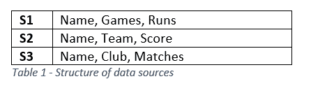

首先，我们确定了我们希望在中介模式中包含的四个属性，即姓名、比赛次数、总分和球队。然后，我们进行中介模式和数据源模式之间的映射，如表 2 所示。

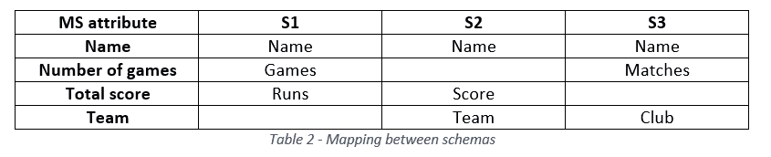

映射完成后，我们可以查询所有数据源，因为它们是一个逻辑数据源。图。图 3 显示了一个例子，说明在搜索名为“Allan Border”的玩家时，我们如何收集数据。

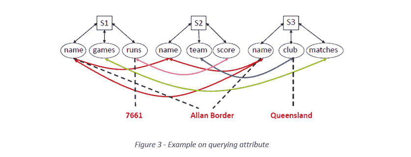

# 4.2.文献评论

## 4.2.1.概率模式对齐

为了处理属性含义的模糊性，Das Sarma 等人提出了在属性匹配和模式映射中增加概率。 [19]对从五个域中抓取的 web 表进行评估，每个域包含大约 50-800 个 web 表。此外，它给出了比确定性方法更好的结果。

## 4.2.2.集成 Deep Web 数据

“Deep web”术语用于描述搜索引擎无法到达的网页。为了提供对 deep web 的访问，*的马德哈万等人提出了一种算法。*【20】并在 50 万个 HTML 表单的样本上进行测试，实现了对底层数据库的良好覆盖。

## 4.2.3.集成 Web 表格

“网络表格”是存储在 HTML 中的不同种类的表格形式的数据；它没有一个清晰而精确的模式。 *Cafarella 和 al 提出了一种基于 Web 表的关键字搜索方法。* [21]基于两种排序方法特征排序和模式排序。

*达斯萨尔马和阿尔。*【22】提出了一个框架来检索与给定表格相关的 web 表格。他们在维基百科的表格上试验了这个框架，结果很好。

为了从 Web 表中提取知识， *Limaye 和 al。*【23】提出了一种基于图形模型的 Web 表格标注方案，他们的实验表明图形模型比传统模型获得了更高的准确率。

# 5.记录链接

# 5.1.记录链接基础

记录链接是一项任务，在这项任务中，我们可以识别不同数据源中引用相同逻辑实体的记录，尤其是当多个数据源之间不共享公共标识符时(比如人员的 SSN)。在传统的数据集成中，它只处理链接结构化数据。

在大数据集成中，数据源在结构上是异构的，并且是从提供非结构化文本数据的许多来源(社交媒体、传感器日志等)收集的，并且数据源是动态的和不断发展的[2 ],这使得该技术非常具有挑战性。

举一个非常简单的例子来说明记录链接意味着什么，如果我们从不同的医院收集病人的数据。假设我们正在收集一个名为“Mohammad Hassan”的病人的数据，他出生于 1953 年。

我们在表 3 和表 4 中找到了来自两家医院 A 和 B 的两个记录。

在映射模式属性之后进行比较，通过一些比较，我们可以发现这些行属于同一个患者的概率。图。4 显示了比较的假设。

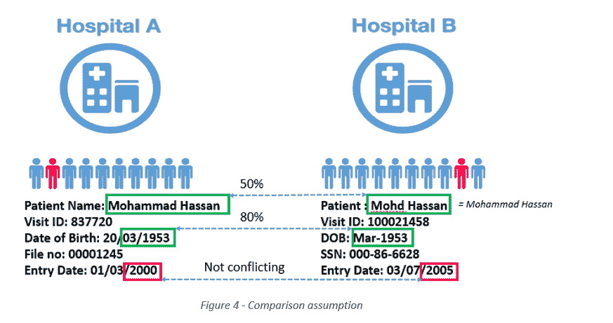

图 4。显示首先比较两个名字的概率是 50%，然后比较出生年份的概率是 80%。此外，我们可以从输入日期中发现这些行并不冲突。因此，我们可以 80%的概率假设这些行属于同一个患者。

在记录链接中，使用了许多技术:

*   成对匹配:这种技术用于比较一对记录，以检查它们是否属于同一个逻辑实体。
*   集群:这种技术用于对适当的记录分区做出全局一致的决定，以确保每个分区属于不同的实体。
*   分块:这种技术用于将输入记录划分为多个块，以便只允许成对匹配同一块中的记录。

# 5.2.文献评论

## 5.2.1.使用 MapReduce 并行化阻塞

## 5.2.1.1.MapReduce 简要描述

Hadoop MapReduce [14]是一个分布式计算的编程模型，它基于两个重要的任务 Map 和 Reduce。正如 IBM analytics [25]所描述的，Map task 获取一组数据并将其转换为另一组数据，其中各个元素被分解为元组(键/值对)。Reduce 任务将地图的输出作为输入，并将这些数据元组组合成一个更小的元组集。reduce 作业始终在地图作业之后执行。

映射器负责使用 *Map()* 函数，减速器负责 *Reduce()。*

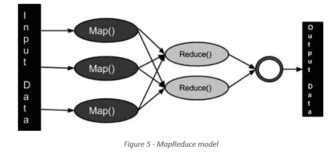

Image Source: [www.tutorialspoint.com/hadoop/hadoop_mapreduce](https://www.tutorialspoint.com/hadoop/hadoop_mapreduce)

## 5.2.1.2.这个提议

使用 MapReduce 的记录链接基本方法易受服务负载不平衡的影响，这是由于倾斜的块大小会降低性能。

科尔布和艾尔。[26]提出了两种策略(BlockSplit 和 PairRange)用于 reducers 之间的负载平衡。此外，在真实数据集上对各种负载均衡策略进行了实验评估，并与基本方法进行了比较，结果表明该方法具有更好的鲁棒性和效率。

## 5.2.2.元分块:修剪成对匹配

帕帕达基斯和艾尔。[27]提出了*元分块*代替*多重分块键*的方法，以解决在处理大规模异构数据时表现出的一些低效率。此外，他还做了实验来评估剪枝方案，以表明*元阻塞*提高了阻塞效率。

## 5.2.3.增量记录链接

Whang 和 Garcia-Molina 关注的是成对匹配规则随时间的演变，并确定了可以执行增量记录链接的一般增量条件[28] [29]。格伦海德和艾尔。[30]提出了一些比批量链接和旧的增量记录链接算法更有效的增量技术。

## 5.2.4.将文本片段链接到结构化数据

Cortez 和 da Silva [31]建议在使用链接技术之前，使用非结构化数据上的信息提取技术来获得结构化数据。

为了将成千上万的产品报价与结构化产品信息联系起来，Kannan 和 al。[32]提出了一种将文本片段链接到结构化数据的新方法，该方法主要基于:

1.  使用标记、合理解析和最佳解析技术对文本片段进行语义解析
2.  返回记录间匹配概率分数的匹配函数。

## 5.2.5.时间记录链接

李和艾尔。[33]提出了一种使用实体随时间演变的模型来识别过时属性值的技术，该模型允许在时间记录上进行链接。

蒋和艾尔通。[34]开发了详细的概率模型，以更好地捕捉实体演化，并提出了更快的时态记录链接算法。此外，他们在真实世界数据集上进行实验，包括 DBLP(计算机科学文献数据集)数据集，以评估他们的工作，他们在 DBLP 的困难案例上取得了良好的结果。

## 5.2.6.具有唯一性约束的记录链接

郭和艾儿。[35]提出了一种记录链接技术，该技术在存在错误数据和同一属性值的多种表示的情况下显示了有希望的结果。

他们提出了记录链接和数据融合的组合来识别错误的属性值，并将其与正确值的替代表示区分开来。

# 6.数据融合

# 6.1.数据融合基础

当非结构化和大数据源与结构化运营数据集成时，您需要确信结果是有意义的。

数据融合是多种技术的结合，旨在解决来自一系列来源的冲突，并找到反映真实世界的真相。这是最近出现的一个新领域。它的动机正是数据的准确性:网络使得发布和传播来自多个来源的虚假信息变得很容易，这使得剔除小麦和谷壳成为呈现高质量数据的关键。[2]

数据融合中使用了三种技术:拷贝检测、投票和源质量。

*   复印检测:检测复印机源并减轻其重量
*   投票:检测每个属性最常见的值。
*   来源质量:在投票后，我们给予知识渊博的来源*(具有最高数量的共同属性)*更多的权重

例如，假设我们有五个数据源 S1 … S5，它们具有相同的五个属性 Att1 … Att5，如表中所示。5

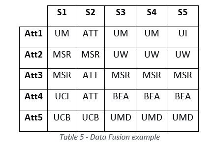

如图所示。首先我们搜索复印机来源，在查看 S3、S4 和 S5 之后，我们发现 S3 和 S4 是相同的。另外，和 S5 的区别只有一个。因此，减轻了 S4 和 S5 的重量。

之后，是投票阶段，我们为每个属性寻找最常见的值，如图所示。6 *(红色数值是最常见的数值)*

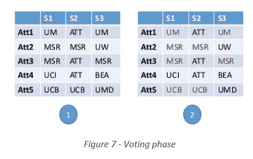

在最后一个阶段，源质量我们发现 S1 具有最高数量的公共属性，所以我们给它更多的权重。

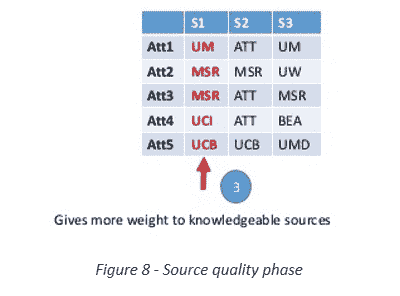

# 6.2.文献评论

## 6.2.1.真理发现

人们做了许多努力来衡量消息来源的可信度。[36]提出了一个由 3 个阶段组成的数据融合过程:真相发现、可信度评估和拷贝检测。在这之后，许多研究人员为每个阶段提出了一些扩展。[37] [38] [39]

## 6.2.2.在线数据融合

在许多领域中，在线数据会随着时间的推移而变化，在许多情况下，需要对其进行实时评估。针对这个问题刘和周虎。[40]提出了一种在线数据融合技术，其中在离线模式下评估源准确性和复制关系，并且在查询回答时评估真相发现。该技术通过在图书数据集上的实验进行了评估，并显示了较高的效率。

## 6.2.3.动态数据融合

在线数据集通常是动态的，在很多情况下数据会高速变化，这给静态数据融合技术带来了问题。针对这个问题，董和艾儿。[41]提出并评估了一种动态数据融合算法。

# 7.讨论

正如我们在前面几节中看到的，有许多提议的算法和技术来解决大数据集成挑战，但这些提议中没有考虑到许多事情。首先，所有建议都考虑到数据是格式良好的，并且数据预处理(提取、转换)已经完成，但是当我们谈论在线数据时，我们谈论的是由多种语言数据源生成的数据，即使该语言被很好地识别，它也可能是俚语。

此外，唯一考虑的非结构化数据类型是文本，但也经常实施其他类型，例如:社交媒体上的帖子可以包含视频、音频、图像、地图和其他类型。此外，在整合来自社交媒体(博客、推文、帖子……)的数据时，数据的质量大多非常低，因为这些数据是由普通用户提供的，他们可能不具备基本的计算和写作技能。因此，提取有用的信息是非常具有挑战性的。

此外，所有提案都要求首先离线构建模型，然后在线填充。这在现实世界中并不总是能做到。当涉及到数据的准确性和多样性时，我们不能总是离线分析数据源。有时我们需要在线分析，这是非常具有挑战性的，尤其是如果我们考虑到上述问题。

此外，当谈到数据融合时，在 Truth discovery 中，基于哪些数据源包含最高投票值(由最大数量的数据源提供的值)来评估数据源。然而，在许多情况下，特别是在谈到网络宣传时，虚假信息以很高的速度广泛传播，所以由最大数量的来源提供的价值并不总是真实的。

# 8.数据集成工具

大数据整合使用的工具有很多。其中一些用于传统的集成流程，并得到了增强和发展，以适应大数据需求。此外，它们还可以分为商业软件和开源软件。下表包含了其中的一些工具。

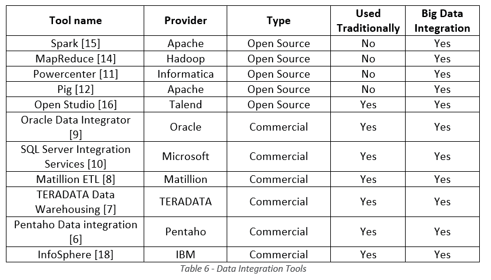

# 9.摘要

在本报告中，我们简要介绍了传统的数据集成技术。然后，我们讨论了大数据集成的挑战，并描述了该领域中使用的三种技术:模式映射、记录链接和数据融合。

此外，我们还列举了该领域的一些最新研究课题。最后，我们展示了一些可以使用的工具。

# 10.参考

*   [1] J. Hurwitz 和 A. Nugent 以及 F. Halper 和 M. Kaufman，“虚拟数据”，发布日期:2013 年 4 月 5 日
*   [2] X. L. Dong 和 D. Srivastava，“大数据集成”，出版日期:2017–08–26
*   [3]什么是“数据集成定义”，URL:[http://whatis.techtarget.com/definition/data-integration](http://whatis.techtarget.com/definition/data-integration)，检索日期:2017–12–30
*   [4] Pentaho，“什么是数据集成”，网址:【http://www.pentaho.com/faq/what-is-data-integration】T2，检索日期:2017–12–30
*   [5] IBM，“数据集成”，网址:【https://www.ibm.com/analytics/data-integration ，检索日期:2017–12–30
*   [6] Pentaho，《Pentaho 数据集成(Kettle)教程》，网址:[https://wiki . Pentaho . com/display/EAI/Pentaho+Data+Integration+(Kettle)+教程](https://wiki.pentaho.com/display/EAI/Pentaho+Data+Integration+(Kettle)+Tutorial)，检索日期:2017–12–30
*   [7] Teradata，“Teradata 产品”，网址:【https://www.teradata.com/Products】T2，检索日期:2017–12–30
*   [8] Matillion，“Matillion ETL 产品概述”，网址:[https://redshiftsupport . Matillion . com/customer/en/portal/articles/1975 061-Matillion-ETL-Product-Overview](https://redshiftsupport.matillion.com/customer/en/portal/articles/1975061-matillion-etl-product-overview)，检索日期:2017–12–30
*   [9] Oracle，" Oracle Data Integrator "，URL:[http://www . Oracle . com/tech network/middleware/Data-Integrator/overview/index . html](http://www.oracle.com/technetwork/middleware/data-integrator/overview/index.html)，检索日期:2017–12–30
*   [10]微软，“SQL Server 集成服务”，URL:[https://docs . Microsoft . com/en-us/SQL/Integration-Services/SQL-Server-Integration-Services](https://docs.microsoft.com/en-us/sql/integration-services/sql-server-integration-services)，检索日期:2017–12–30
*   [11] Guru99，“什么是 Informatica？完整介绍”，网址:[https://www.guru99.com/introduction-informatica.html](https://www.guru99.com/introduction-informatica.html)，检索日期:2017-12-30
*   【12】阿帕奇猪，“欢迎来到阿帕奇猪！”，网址:[https://pig.apache.org/](https://pig.apache.org/)，检索日期:2017-12-30
*   [13] Apache sqoop，“Apache sqoop”，网址:[http://sqoop.apache.org/](http://sqoop.apache.org/)，检索日期:2017 年 12 月 30 日
*   [14] Hadoop Mapreduce，《Mapreduce 教程》，网址:[https://hadoop.apache.org/docs/r1.2.1/mapred_tutorial.html](https://hadoop.apache.org/docs/r1.2.1/mapred_tutorial.html)，检索日期:2017–12–30
*   [15]数据砖块，“什么是 Apache Spark？”，[https://databricks.com/spark/about](https://databricks.com/spark/about)，检索日期:2017-12-30
*   [16] Talend，“用于数据集成的 Talend 开放工作室”，URL:[https://www . Talend . com/products/Data-Integration/Data-Integration-Open-Studio](https://www.talend.com/products/data-integration/data-integration-open-studio)，检索日期:2017–12–30
*   [17] X. L. Dong 和 D. Srivastava，《大数据集成小教程》，网址:[http://www . research . att . com/~ divesh/papers/BDI-icde 2013 . pptx](http://www.research.att.com/~divesh/papers/bdi-icde2013.pptx)，检索日期:2017–12–15
*   [18] IBM，“用于数据集成的 IBM 信息服务器”，网址:[https://www . IBM . com/us-en/market place/Information-server-for-data-integration，](https://www.ibm.com/us-en/marketplace/information-server-for-data-integration,)检索日期:2018–01–10
*   [19] Anish Das Sarma、Xin Luna Dong 和 Alon Y. Halevy，“引导现收现付数据集成系统”，第 861-874 页，出版日期:2008 年。
*   [20]贾扬特·马德哈万、戴维·科、卢贾·科特、维格内什·甘帕尼斯特、亚历克斯·拉斯姆森和阿隆·哈勒维。，“谷歌的深层网络爬行”，出版日期:2008 年
*   [21]迈克尔·j·卡法雷拉、阿龙·y·哈勒维、黛西·王哲、尤金纽和张旸，“网络桌:探索网络桌的力量”，出版日期:2008 年。
*   [22] Anish Das Sarma，Lujun Fang，Nitin Gupta，Alon Y. Halevy，Hongrae Lee，，Reynold Xin 和，“寻找相关表格”。，第 817-828 页，出版日期:2012 年
*   [23] Girija Limaye，Sunita Sarawagi 和 Soumen Chakrabarti。“使用实体、类型和关系标注和搜索 web 表格”，出版日期:2010 年
*   [24]阿帕奇风暴，“阿帕奇风暴”，网址:【http://storm.apache.org/, 检索日期:2018–01–12
*   [25] IBM analytics，“什么是 MapReduce？”，网址:[https://www.ibm.com/analytics/hadoop/mapreduce,](https://www.ibm.com/analytics/hadoop/mapreduce,)检索日期:2018–01–13
*   26 Lars Kolb、Andreas Thor 和 Erhard Rahm。“基于 mapreduce 的实体解析的负载平衡”，第 618–629 页，出版日期:2012 年。
*   [27]乔治·帕帕达基斯、乔治亚·库特里卡、西米斯·帕尔帕纳斯和沃尔夫冈·奈杰尔。“元阻塞:将实体解析提升到一个新水平”，出版日期:2014 年
*   [28]史蒂文·艾荣·黄和埃克托·加西亚·莫利纳。《规则不断演变的实体解决方案》，出版日期:2010 年
*   [29]史蒂文·艾荣·黄和埃克托·加西亚·莫利纳。《规则和数据的增量实体解析》，出版日期:2014 年
*   [30] Anja Gruenheid、Xin Luna Dong 和 Divesh Srivastava。《增量记录链接》，出版日期:2014 年
*   [31]伊莱·科尔特斯和阿尔蒂格兰·苏亚雷斯·达席尔瓦。“通过文本分割进行无监督信息提取”，出版日期:2013 年
*   [32] Anitha Kannan，Inmar E. Givoni，Rakesh Agrawal 和 Ariel Fuxman。“将非结构化产品报价与结构化产品规格相匹配”，出版日期:2011 年。
*   [33] Pei Li，Xin Luna Dong，Andrea Maurino 和 Divesh Srivastava。《连接时态记录》，出版日期:2011 年
*   [34]蒋月轩、安海多安和杰弗里·f·诺顿。“时态记录匹配的实体演化建模”，出版日期:2014 年
*   [35]、Xin Luna Dong、Divesh Srivastava 和雷米·扎亚茨。“具有唯一性约束和错误值的记录链接”，出版日期:2010 年
*   [36]辛鲁纳·东、劳雷·贝蒂-埃奎莱和迪韦什·斯利瓦斯塔瓦。“整合冲突数据”，出版日期:2009 年
*   [37] Alban Galland、Serge Abiteboul、Am elie Marian 和 Pierre Senellart。《来自不同观点的佐证信息》，出版日期:2010 年
*   38 杰夫·帕斯捷尔纳克和丹·罗斯。《知道该相信什么(当你已经知道某事时)》，出版日期:2010 年
*   [39]肖鑫·尹、韩家伟和菲利普·s·于。“网上多个冲突信息提供者的真相发现”，出版日期:2007 年
*   [40]、辛露娜·董、和迪韦什·斯利瓦斯塔瓦。《在线数据融合》，出版日期:2011 年
*   [41] Xin Luna Dong、Berti-Equille 和 Divesh Srivastava。“动态世界中的真理发现和复制检测”，出版日期:2009 年