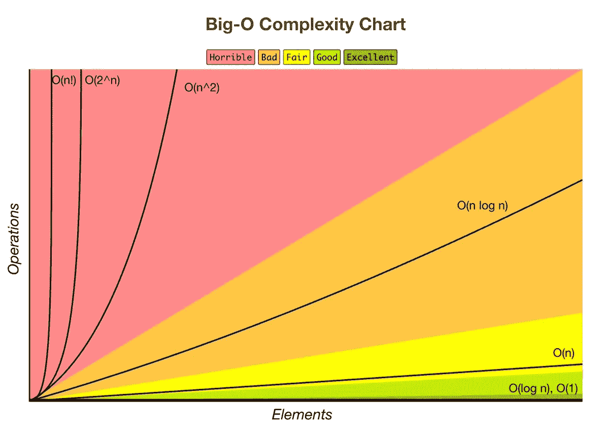

# 大 O

> 原文：<https://towardsdatascience.com/big-o-d13a8b1068c8?source=collection_archive---------8----------------------->



在准备我的编码面试的过程中，我阅读了许多教程和建议，关于我们应该把时间集中在什么上。我可以肯定地说，大 O 符号的概念是永远不会消失的。大 O 符号说明了一个算法如何根据其输入大小来扩展复杂度。它描述了函数增长的上限。大 O 符号中常见的一个误解是，它谈论算法执行的速度。有可能在不影响算法复杂度的情况下，使算法**显著加快**。大 O 表示当输入变大时，一个算法还需要做多少“工作”。

所以现在你可能想知道，大 o 到底是什么，让我们给它一个正式的定义。

在数学中，维基百科对大 O 的定义是:

> 大 O 符号是一种数学符号，它描述了当自变量趋向特定值或无穷大时函数的极限行为。它是保罗·巴赫曼、埃德蒙·朗道等人发明的记数法家族中的一员，统称为巴赫曼-朗道记数法或渐近记数法。

更具体地说，这篇文章将计算机科学中的大 O 定义为:

> 在计算机科学中，大 O 符号用于根据算法的运行时间或空间需求如何随着输入大小的增长而增长来对算法进行分类。在解析数论中，大 O 符号通常用于表示算术函数和更好理解的近似之间的差的界限；

实际上，还有一些其他符号与大 O 符号密切相关，例如ω和θ。

大ω有两个广泛存在且不相容的定义。出于本文的考虑，我们将把大ω定义为渐近下限，或者换句话说，最好的情况。例如，如果我们对一个数组进行排序，最好的情况是数组已经排序了。另一个例子是，如果我们在一个数组中搜索一个数字，它是我们检查的第一项。

另一方面，大θ指的是算法的平均运行时间。一个算法在平均输入量下会有怎样的表现？

虽然在为特定解决方案选择最佳算法时考虑最佳运行时间或平均运行时间是件好事，但最好总是考虑最坏的情况。如果我们总是为最坏的情况做准备，我们可以肯定地说，我们的算法将总是比一些阈值执行得更好。

那么我们如何计算一个算法的大 O 呢？

让我们从一个简单的例子开始:

```
int sumTwoNumbers(int a, int b) {
    return a + b
}
```

让我们再想想大 O 是什么意思；这是一个算法的复杂性如何随着它的输入增加而增加，或者换句话说，当我们给它越来越多的输入时，一个算法还会做多少“工作”。

现在花点时间想想这个例子中的大 O 是什么…

不，真的尝试一下…

想想…

想想…

如果你说 O(1)，你是对的。不管我们给这个函数一个多大的数，它总会做一次加法。我们称之为恒定时间，因为我们的复杂性总是恒定的。

让我们看另一个例子:

```
void printMatrix(int a)    {
    for(int i=0; i <= a; i++)    {
        for(int j=0; j <= a; j++)    {
            cout << j// Prints out a square matrix
        }
    }
}
```

在这个例子中，我们有嵌套循环，**对于外部循环的每次**迭代，我们将遍历**整个内部循环**。因此，对于我们的第一次外循环迭代，我们的内循环，假设`a`是任意数，比如 4，它将打印:

```
1234
```

在我们的下一次迭代中(i = 1 ),它将打印:

```
1234
1234 
```

跳到最后我们得到:

```
1234
1234
1234
1234
```

所以我们把 4 个字符打印了 4 次，换句话说就是 4 个。如果使用`a = 8`，您预计我们的代码片段会打印多少个数字。我们将为每次迭代打印 8 个字符，总共 8 个，所以是 8。你能看出模式吗？因此，对于这个片段，我们得到 O(n ),因为无论输入的大小如何，我们都将打印 n 次。

虽然这是一个非常简单的例子，但我希望它能让你对什么是大 O 以及它是如何计算的有所了解。如果您想了解更多关于 Big O 的信息，请查看以下资源:

[大 O 的定义](https://en.wikipedia.org/wiki/Big_O_notation)

[大 O 上的 HackerRanks 视频](https://www.youtube.com/watch?v=v4cd1O4zkGw&t=10s)

感谢阅读！

**如果您喜欢这篇文章，请在底部留下评论* *