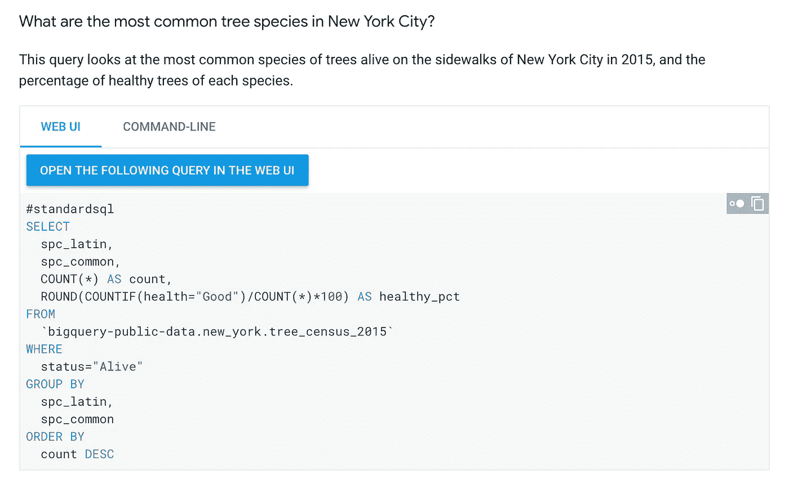
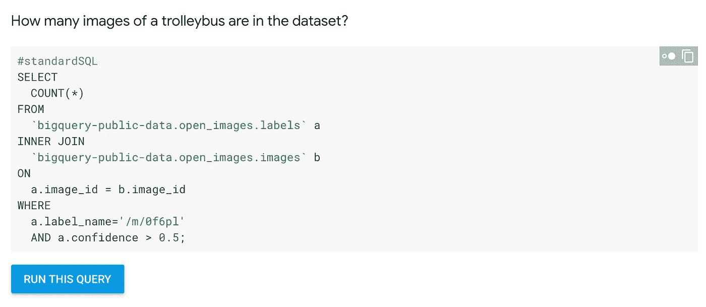

# BigQuery 公共数据集

> 原文：<https://towardsdatascience.com/bigquery-public-datasets-936e1c50e6bc?source=collection_archive---------4----------------------->

Kauai, HI

唯一比数据好的就是*大*数据！但是获取大型数据集并不容易。从笨拙的存储选项到难以让分析工具正确运行数据集，大型数据集在实际使用它们做一些有用的事情时会导致各种各样的困难。数据科学家要做什么？

在《人工智能历险记》的这一集，我们将去看看 BigQuery 公共数据集，探索开放数据的神奇世界！

# BigQuery 公共数据集

> …有一个[每月 1 TB 的免费层](https://cloud.google.com/bigquery/pricing#pricing_summary)，让入门变得超级简单。

我们都爱数据。最好是多多益善！但是随着文件大小的增长和复杂性的增加，实际使用这些数据变得非常困难。
[BigQuery 公共数据集](https://cloud.google.com/bigquery/public-data)是 Google BigQuery 为您托管*的数据集，您可以访问并将其集成到您的应用程序中。*

这意味着谷歌为这些数据集的存储付费，并通过你的云项目提供对数据的公共访问。您只需为对数据执行的查询付费。此外，还有一个每月 1TB 的免费层，让入门变得超级简单。

## 那么…我如何访问所有这些数据呢？

查看 [BigQuery 公共数据集页面](https://cloud.google.com/bigquery/public-data/)，我们可以看到有将近 40 个公共数据集。每个数据集又有许多表。来自世界各地数百个项目的数千个查询正在利用这些庞大的公共数据集。

> 你可以在网上找到关于图像的最紧迫问题的答案

真正有趣的是，这些数据集中的每一个都带有一些解释文本，帮助您开始查询数据并理解其结构。

## 树木普查、开放图像和无轨电车

例如，这是纽约市的树木普查。该页面向我们展示了如何轻松找到诸如“纽约市最常见的树种是什么？”以及“自 1995 年以来，纽约市的树种有什么变化？”。这些都可以从直接进入 BigQuery 界面的 docs 页面中点击一下来访问！

If you want to run it yourself, the query is here: [https://bigquery.cloud.google.com/savedquery/1057666841514:052da8fe3c014d169752e86b7cc2eaf5](https://bigquery.cloud.google.com/savedquery/1057666841514:052da8fe3c014d169752e86b7cc2eaf5)

另一个非常惊人的数据集是[开放图像数据集](https://cloud.google.com/bigquery/public-data/openimages)。它包含大约 900 万个图像的 URL 和元数据，这些图像被标注了超过 6000 个类别的标签！

你可以在网上找到关于图像的最紧迫问题的答案，比如“数据集中有多少张无轨电车的图像？”(*剧透预警*:超过 3000 了！)

If you want to run it yourself, the query is here: [https://bigquery.cloud.google.com/savedquery/1057666841514:d6d5d8ed6b5449498326f724cbce3091](https://bigquery.cloud.google.com/savedquery/1057666841514:d6d5d8ed6b5449498326f724cbce3091)

但是我跑题了。 [BigQuery 开放数据集](https://cloud.google.com/bigquery/public-data)是探索公共数据和练习数据分析技能的好方法。结合像[云数据实验室](https://cloud.google.com/datalab/)、 [Facets](/visualize-your-data-with-facets-d11b085409bc) 和 [TensorFlow](https://www.tensorflow.org/) 这样的工具，你可以做一些真正令人敬畏的数据科学。你还在等什么？前往公共数据集页面，让您的分析尽情发挥吧！

有关更多细节和示例，请查看 [BigQuery 的公共数据集文档页面](https://cloud.google.com/bigquery/public-data/)并开始查询！

感谢阅读本集[云 AI 冒险](https://goo.gl/UC5usG)。如果你喜欢这个系列，请为这篇文章鼓掌让我知道。如果你想要更多的机器学习动作，一定要关注 Medium 上的 [me 或者订阅 YouTube 频道，以便在未来的剧集出现时观看它们。更多剧集即将推出！](https://medium.com/@yufengg)