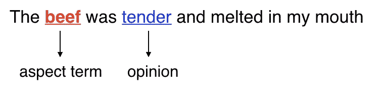
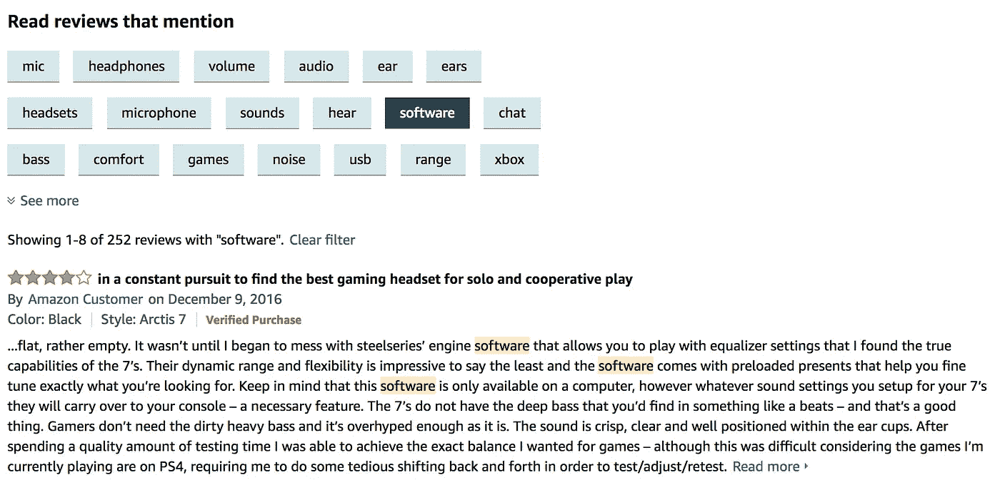
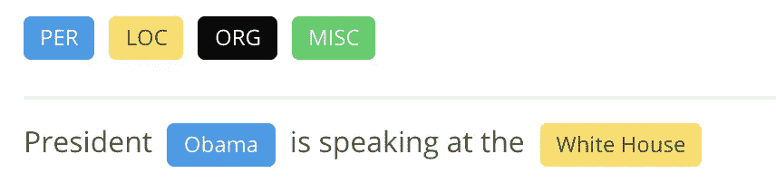
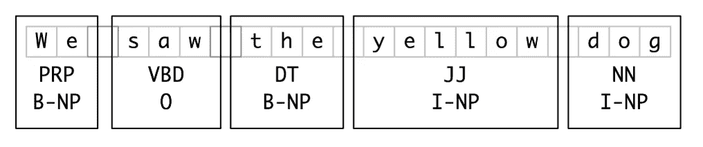
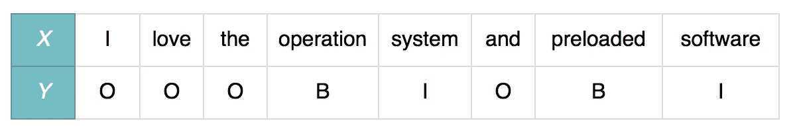
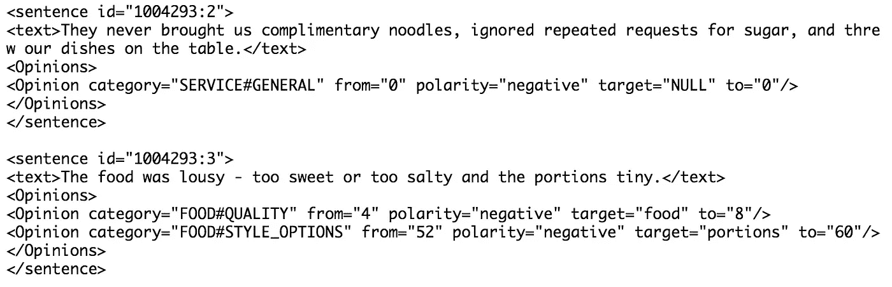
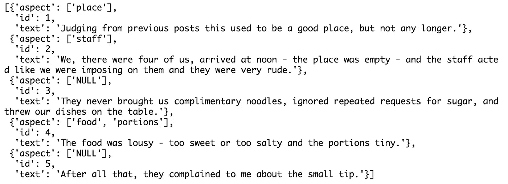
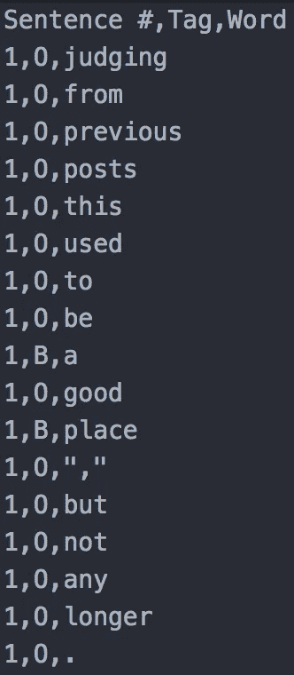
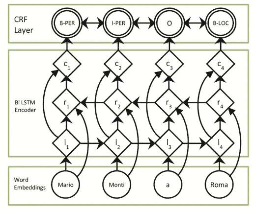

# 用于方面术语抽取的 BiLSTM-CRF

> 原文：<https://towardsdatascience.com/bilstm-crf-for-aspect-term-extraction-87630406573a?source=collection_archive---------4----------------------->

本文组织如下。首先，我们将谈论体术语提取的背景。其次，我会给你一个构建 BiLSTM-CRF 模型来提取方面术语的教程。

*   1 背景
*   1.1 什么是特征术语抽取
*   1.2 我们为什么需要 ATE
*   1.3 如何提取方面术语
*   2 数据准备
*   2.1 数据定义
*   2.2 数据集创建
*   3 BiLSTM-CRF
*   3.1 模型定义
*   3.2 培训

# 1 背景

在这一部分中，你将有一个关于方面术语抽取的概述知识。

**1.1 什么是方面术语提取**

方面术语抽取是基于方面的情感分析中的一个关键子任务，旨在从在线用户评论中抽取明确的方面表达。那么，体貌术语是什么呢？方面术语是**意见的目标**。比如这里有一个评论，“牛肉很嫩，在我嘴里融化了”。在这篇综述中，体术语是“牛肉”，观点术语是“嫩”。

**1.2 为什么我们需要 ATE**

这里我们展示一个亚马逊的例子。还有[无线耳机](https://www.amazon.com/SteelSeries-Lag-Free-Wireless-Headset-Headphone/dp/B01LYNEIEI)。考虑到这种情况，一个客户有多台不同 OS 的设备，就像两台分别装有 iOS 和 Android 的智能手机，MacBook Pro，Surface Pro 等等。所以这位客户想知道这款耳机是否可以连接多个设备。但是要从成百上千的评论中找到有用的评论会花费太多的时间。幸运的是，有一个部分叫做“阅读评论”。客户可以通过单击软件按钮找到关于该软件的所有评论。这可以帮助顾客快速找到他们想要的东西。你可以从下图中得到这个想法。

但是我们可以看到这个实现只是从文本中提取相同的单词，这不是一个聪明的方法。为了比较，我从中国最大的电子商务网站淘宝上拍了一张照片。

After I clicked the ‘服务好’(Good Service), the below part showed all reviews related to ‘Good Service’. And we can see the aspect terms/phrases are not just the same with ‘Good Service’.

至于真正的实现，我从产品团队找到了答案。

1.  根据类别特征，提取相关评论，进行分词和词频统计。
2.  用 LDA 对词进行聚类，用本体对词进行分类。
3.  将观点词分配给体貌词，决定句子的情感。(我想这里他们可能会使用依赖解析)
4.  给体词附加感情，标出体词在句子中的位置。
5.  在搜索引擎中建立方面情感和位置标记。

下面是[中文版答案](https://www.zhihu.com/question/20905103/answer/16584249)。

**1.3 如何提取方面术语**

ATE 任务可以被视为序列标记问题。传统的序列模型如条件随机场(CRF)、长短期记忆网络(LSTMs)和分类模型如支持向量机(SVM)已经被应用于处理 ATE 任务并取得了合理的性能。

这些现有工作的一个缺点是它们没有利用这样的事实，即根据任务定义，方面术语应该与意见指示词一起出现。因此，上述方法倾向于在非意见性句子中对那些频繁使用的方面项输出误报，例如，“餐馆开始时挤满了人，所以我们等了 20 分钟”中的单词“餐馆”，该单词不应该被提取，因为该句子不传达对它的任何意见。

有一些工作在处理 ATE 任务时考虑了观点项，如递归神经条件随机场(RNCRF)、耦合多层注意(CMLA)等。这里就不多说了。

如题，这次我们将使用 BiLSTM-CRF 来做 ATE 任务。BiLSTM-CRF 已被证明是一个强大的序列标注模型，如命名实体识别(NER)、词性标注和浅层句法分析。如果你正在做与序列标记任务相关的工作，这是丰富你的技能集的必备工具。

# 2 数据准备

我们将 ATE 任务视为序列标记任务，它非常类似于命名实体识别(NER)，即定位文本中的命名实体并将其分类到预定义的类别中，如人名、组织名、位置名、时间表达式等。例如，我们输入句子，“奥巴马总统正在白宫发表演讲”，其中的“奥巴马”应标记为“人”，“白宫”应标记为“地点”。可以试试 [anaGo](https://anago.herokuapp.com/) 的试玩

简而言之，如果我们遵循 NER 使用的数据格式，我们可以通过使用序列标记模型来容易地处理 ATE。说到 NER 使用的数据格式，它遵循了 [IOB 格式](https://en.wikipedia.org/wiki/Inside%E2%80%93outside%E2%80%93beginning_(tagging))的惯例。 *B* 、 *I* 和 *O* 分别表示**开始、内侧和外侧**。

IOB 标签已经成为表示块结构的标准方式。你可以在 [2.6 表示组块:标签 vs 树](https://www.nltk.org/book/ch07.html)中找到更多信息。

*   *PRP* 、 *VBD* 、 *DT* 、 *JJ* 、 *NN* 是每个词的词性标签。
*   B 和 I 标签以组块类型作为后缀，例如 B-NP、I-NP。
*   *NP* 是一种组块类型，意思是名词短语组块，或 NP-chunking。

至于 ATE 任务，格式将变得更简单，因为只有一种组块类型，即方面术语。我们可以用下面的例子来表示每个句子。 *B* 、 *I* 和 *O* 分别表示方面跨度的开始、内部和外部。

在我们准备好数据集之后，我们可以使用 BiLSTM-CRF 模型进行训练。

# 2.2 数据集创建

为了将 ATE 任务视为序列标记任务，我们首先需要将数据格式从 XML 转换为 CSV。可以在这里找到 SemEval 2016 餐厅的 XML 原文: [semeval-2016](https://github.com/BrambleXu/aspect-term-extraction/tree/master/raw-data/semeval-2016) 。XML 数据格式如下所示。

这个 XML 脚本包含三个句子。在每个句子块中，它包含三个部分，句子 id、文本、观点。在意见部分，目标是体项。以第一句为例，它只有一个体项。所以我们需要为单词“place”分配标签“B ”,为其他单词分配“O”。

因为我们把它当作一个序列标注问题，所以在预处理部分，我们只把单词转换成小写。我们不删除停用词和词条。所以数据清理部分相当简单。

在最后一步，我们将数据保存为 CSV 文件。每行将包含句子 id、单词和标签。

**1 将 XML 数据读取到 BeautifulSoup**

这里我们使用 BeautifulSoup 来读取 XML 文件。

`sentence_nodes`看起来像是:

**2 将 soup 对象转换为字典列表**

在这一步中，我们将 soup 对象转换为字典列表。每个字典包含三个关键字:

*   ‘方面’:一个列表包含一个句子中的方面术语
*   ' id ':句子 id
*   ' text ':字符串包含审阅文本

`sentences`看起来像:

**3 创建数据帧**

**3.1 将文本拆分成文字**

用空格分割字符串并保留标点符号。

**3.2 带 IOB 格式的 taggin word**

给句子中的每个单词分配 IOB 标签。

**3.3 将字典列表转换为数据帧**

**3.4 总结一下**

获得 DataFrame 对象后，我们将其保存到 CSV 文件中。

对于测试数据集，再次遵循上述步骤。最后，数据如下图所示。

# 3 BiLSTM-CRF 模型

在实现之前，我们先简单介绍一下 BiLSTM-CRF 模型。下图显示了 BiLSTM-CRF 的架构。

*   [单词嵌入](https://www.analyticsvidhya.com/blog/2017/06/word-embeddings-count-word2veec/)。这一层将把每个单词转换成一个固定尺寸的向量。通常没有必要自己训练单词向量。已经有很多预先训练好的单词嵌入数据可供使用，我们使用[手套](https://nlp.stanford.edu/projects/glove/)。
*   [BiLSTM 编码器](https://datascience.stackexchange.com/questions/25650/what-is-lstm-bilstm-and-when-to-use-them)。该编码器包含两个 LSTM 层，它可以从上下文中学习信息。
*   [CRF 层](https://createmomo.github.io/2017/09/12/CRF_Layer_on_the_Top_of_BiLSTM_1/)。该层可以向最终预测的标注添加一些约束，以确保它们是有效的。在训练过程中，CRF 层可以从训练数据集中自动学习这些约束。

# 3.2 培训

在模型构建方面，BiLSTM 很容易用 Keras 实现，关键是 CRF 层的实现。

有两种方法。一种是使用 keras-contrib 中的 CRF 层，另一种是使用 anaGo 库。我实现了这两种方法。keras-contrib 实现获得了 0.53 f1 微分，anaGo 获得了 0.58 f1 微分。所以在这里我将介绍如何使用 anaGo。但是你可以找到两个实现笔记本。

*   [具有 keras-contrib 的 bil STM-CRF](https://github.com/BrambleXu/aspect-term-extraction/blob/master/notebooks/bi-lstm-crf-embedding.ipynb)
*   [含 anaGo 的 bil STM-CRF](https://github.com/BrambleXu/aspect-term-extraction/blob/master/notebooks/anago-embedding.ipynb)

anaGo 的源代码写的很好，构造的也很好，包括如何读取嵌入文件，加载嵌入权重。仔细看看代码是值得的。这次我们使用 *glove.840B.300d.txt* 文件，这意味着 8400 亿个单词，220 万个词汇，每个单词表示为 300 个维度。记号表示语料库中“单词”的总数，vocab 是唯一的单词。

anaGo api 易于使用，您可以通过几行代码实现 BiLSTM-CRF 模型。另一方面，学习后面的实现对使用没有好处。作者 Hironsan 自己实现了 CRF 层，代码写得很好。我强烈建议您先阅读本文，然后再看 anaGo 实现。

正如 anaGo 的文档所示，样本的输入格式是单词列表，标签应该是 IOB 标签列表。

这里我们写一个函数将数据帧转换成输入格式。

然后我们就可以写出整个过程了。

看，实现部分只需要 4 行。在训练过程中，它会显示每个时期的 f1 分数。在这里，我们将 epoch 设置为 50，以使其过拟合，并查看多少个 epoch 是合适的。

**总结一下**

最后，我们将所有代码加在一起。

这是实现 BiLSTM-CRF 的简单方法。您可以在下面找到两个实施笔记本。

*   [BiLSTM-CRF 与 keras-contrib](https://github.com/BrambleXu/aspect-term-extraction/blob/master/notebooks/bi-lstm-crf-embedding.ipynb)
*   [BiLSTM-CRF 与 anaGo](https://github.com/BrambleXu/aspect-term-extraction/blob/master/notebooks/anago-embedding.ipynb)

> ***查看我的其他帖子*** [***中等***](https://medium.com/@bramblexu) ***同*** [***分类查看***](https://bramblexu.com/posts/eb7bd472/) ***！
> GitHub:***[***bramble Xu***](https://github.com/BrambleXu) ***LinkedIn:***[***徐亮***](https://www.linkedin.com/in/xu-liang-99356891/) ***博客:***[***bramble Xu***](https://bramblexu.com)