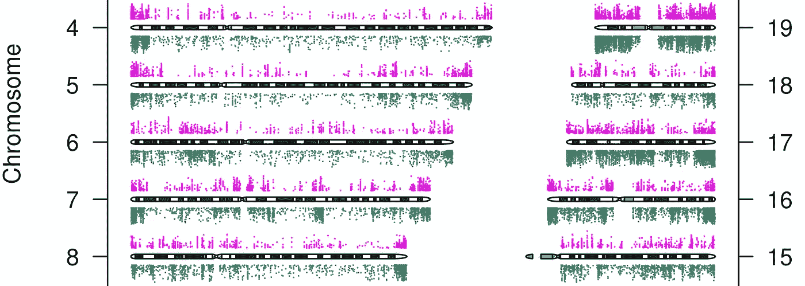

# 生物信息学和数据科学

> 原文：<https://towardsdatascience.com/bioinformatics-and-data-science-431899ddd552?source=collection_archive---------4----------------------->

## 生物信息学家可以轻松转换到数据科学角色吗？他们应该期待什么样的挑战？他们的技能组合是否足以满足数据科学的需求？

Differentially methylated CpGs from [https://doi.org/10.1371/journal.pgen.1002781](https://doi.org/10.1371/journal.pgen.1002781)

近来，生物学和医学科学界对数据科学产生了浓厚的兴趣。来自这些领域的研究人员正在生成大量数据，自然，正如任何可以访问大型数据集的领域一样，人们对“数据科学”能够提供什么感兴趣。希望数据科学家将处理和过滤这些大型数据集，并通过应用统计学和机器学习模型产生有意义的生物/医学见解。当我听到这样的事情时，我会说“等等！！这不就是我们这些年一直在做的生物信息学吗？”。简短的回答是“部分”。在整个医学科学中，研究人员拥有更加多样化的数据集(成像、病历等。)相比我们日常处理的那些，但数据分析方法的核心、数据的规模和方法是相似的，无论数据集如何。在这方面，我一直将“数据科学”视为我所称的“生物信息学”的一般化版本。如果这是真的，生物信息学家可以轻松地转换到数据科学角色吗？他们应该期待什么样的挑战？最重要的是，他们的技能组合是否足以胜任数据科学角色？为了回答这些问题，除了广泛的 google-fu 和个人经验之外，我还与数据科学家进行了交谈。

## 什么是生物信息学？

我首先要澄清我所说的生物信息学是什么意思。对我来说，以下术语描述了非常相似(如果不是完全相同)的领域:“生物信息学”、“计算基因组学”和“基因组数据科学”。虽然会有人试图区分这些术语，但它们对我来说代表着相似的东西。这些领域要求您处理和分析大规模基因组数据集，并提出生物学见解。为了在这些领域发挥作用，你需要能够处理大规模的原始数据(通常是测序或某种形式的组学数据)，对处理后的数据进行质量检查和转换。然后，您将需要根据您的问题应用机器学习或统计模型。您最有可能做一些降维和聚类，然后进行可视化。根据分析的初始结果，您可能需要重复所有这些步骤或采取不同的方法。你将写报告和做演示，以传达你的数据驱动的故事。除此之外，他们还需要适应不断变化的数据生成技术、文件格式以及新的统计和机器学习方法。在 [Coursera](https://www.coursera.org/specializations/genomic-data-science) 上[“基因组数据科学”课程](https://www.coursera.org/lecture/introduction-genomics/what-is-genomic-data-science-xS5Ox)的教师对生物信息学的定义持有类似的观点。

## 生物信息学技能集

现在，让我描述一下生物信息学的技能。这些技能组合期望适用于[我们的实验室](http://bioinformatics.mdc-berlin.de)。生物信息学家的任务和要求可能各不相同。除了技术技能，人们还需要有科学好奇心、心态和动力来解决与生物学和医学相关的问题。但是这些更多的是品质而不是技能。这就是他们不在名单中的原因。在我看来，生物信息学家需要具备以下知识和技能，或者至少在他们完成时获得这些知识和技能。他们不需要样样精通，但至少应该有一些实践经验。

*   特定领域的数据处理和质量检查
*   常规数据转换和过滤
*   应用统计学和机器学习
*   特定领域的统计工具和数据可视化
*   通用数据可视化和报告工具
*   特定领域的数据集成:这可能需要使用 API、数据库和/或平面文件
*   能够为数据分析任务编写带有版本控制的代码。代码应该是可重用的，高效的和文档化的。我们实验室的很多人都需要编写 python/R 包。
*   能够通过出版物、海报和演示文稿交流数据驱动的见解/故事

## **数据**科学**技能集**

根据 [udacity](https://blog.udacity.com/2014/11/data-science-job-skills.html) 的说法，数据科学家的基本技能是:

*   编程；编排
*   机器学习
*   统计数字
*   数据争论:数据处理、格式化和转换
*   数据可视化和通信
*   数据直觉(这个有点不太清楚，我猜他们指的是数据分析相关问题的故障排除，知道当事情出乎意料时要检查和测试什么。)

你可能在网上看到的其他列表可能会列出大数据处理技术堆栈(Hadoop、spark 等。)或者对线性代数和微积分有深入的理解。但是这些技能，尤其是技术，很可能是组织特有的。“数据直觉”可能是你多年来在处理数据分析问题时形成的。由于定义模糊，我在这里做一个假设。我们也可以看看数据科学家的招聘广告，然后[得出类似的所需技能列表](/the-most-in-demand-skills-for-data-scientists-4a4a8db896db)。

我意识到成为所有这些领域的专家非常困难，很明显[公司在“数据科学”下有不同的角色，他们并不总是希望雇用多面手](https://link.medium.com/Nh50poQsHR)，但他们希望在上述每个领域都有一定程度的精通。

## 比较

如果您从生物信息学技能集中移除特定领域的要求，您将剩下大部分数据科学技能集以及更多。从生物信息学转向数据科学的人很可能需要适应他们雇主的数据组织和分发环境。这些问题来自不同的领域，所以他们也需要适应。但至少在某种程度上，数据科学家在不同雇主之间转换工作也是如此。

在我看来，一个定期进行从原始数据到洞察的端到端数据分析的生物信息学家在“数据科学”职位上不会有问题，我应该强调，我并不是说任何生物信息学家都可以在数据科学职位上表现出色。他们可能需要学习新的领域特定知识或技术堆栈(hadoop、spark 等)。)与公司的数据组织相关，但学习新方法并实施它们是他们在博士培训和博士后工作期间的例行工作。我认为，如果你具备上述核心技能，并愿意适应和学习，你可以在任何数据分析相关领域表现出色。

## 从生物信息学转行的数据科学家的见解

我的网络中有十几个人已经从生物信息学转向了数据科学。我问了一些他们的经历。一位联系人表示，转向数据科学的人应该意识到，优先事项和文化与工业界的学术界不同。在工业界，更多的是以客户和产品为导向的思维。你的方法的故障安全、可伸缩性和健壮性可能与最酷的方法同等重要，甚至更重要。他还补充说，团队合作、团队间和客户互动也越来越多。交流和建立交互协议非常重要。所以，转变也需要调整心态。

另一位联系人，Markus Schüler ，现任数据科学负责人，前生物信息学家，同意行业中的思维模式是不同的。他也承认产品导向思维的必要性。这些模型需要是健壮的和可维护的。这并不是说你做了一个模型，然后就让它这样。此外，他还分享了这样一个观点，即你并不总是追求最酷和最好的模型，其他因素，如运行时间、实现需求、可伸缩性和架构适合度，以及模型本身的可解释性，在面向产品的思维中也同样重要。但就技能而言，他补充说，生物信息学和数据科学即使不完全相同，也非常相似。尽管在工业中，数据集越大，数据处理就需要越专业、越快速的工具，如 [Spark](https://spark.apache.org/) 。

## 一锤定音

如果核心技能相似性的论点成立，来自数据科学的人在获得一些特定领域的技能和知识后，应该能够在生物信息学职位上表现。我有第一手资料。我们实验室的前数据科学家、现生物信息学博士生 [Jonathan Ronen](https://www.linkedin.com/in/jonathan-ronen-6372a148) 在这个新领域做得非常好，将他的技能应用于单细胞基因组学[和癌症基因组学](https://f1000research.com/articles/7-8/v2)[的问题。](https://www.biorxiv.org/content/early/2018/11/12/464743)

总而言之，这两个领域所需的技能是相似的，具有我上面描述的技能集的生物信息学家可以在行业中的数据科学角色中表现，前提是他们可以调整自己的心态以适应行业。