# 毕晓普的 PRML 书:回顾和见解，第 4-6 章

> 原文：<https://towardsdatascience.com/bishops-prml-book-review-and-insights-chapters-4-6-eb2a2a33c939?source=collection_archive---------4----------------------->

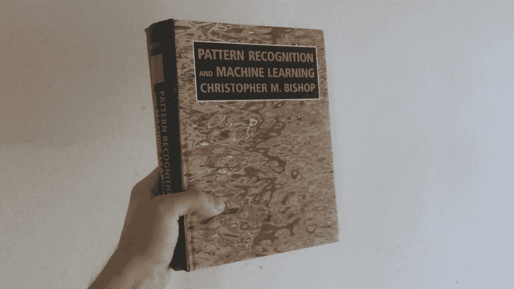

大家好！在[的上一篇文章](https://techburst.io/bishops-prml-book-review-and-insights-chapters-1-3-528bb5cfaade)中，我发表了一份关于 Bishop 的《模式识别和机器学习》一书前三章的简短简历，在这本书里，我将继续写下一章。

对于更注重实践、正在寻找如何提高理论背景的数据科学家，对于那些想要快速总结一些基础知识的人，或者对于刚刚起步的初学者来说，这可能会很有趣。

# 4.分类的线性模型

在第三章中，我们发现了线性回归的一个推广形式为 *f(w，x)= w0+w1 * x1*到*w0+w1 *фI(x)+…+фn(x)，*，其中 *ф(x)* 称为基函数。我想，这里几乎每个人都知道，要应用这个模型进行分类，我们需要把我们的 *w_i * x* 传递给一个激活函数: *y(x) = f(w_i * x)。*

首先，我们想知道，如何做 N 类分类，其中 N > 2。例如，在 [scikit-learn](http://scikit-learn.org/) 中，我们可以选择以“一对一”或“一对一”模式训练二进制分类器，但这些方法存在一些模糊区域，我们不知道如何做出决策，并且构建这些模型需要更多时间:

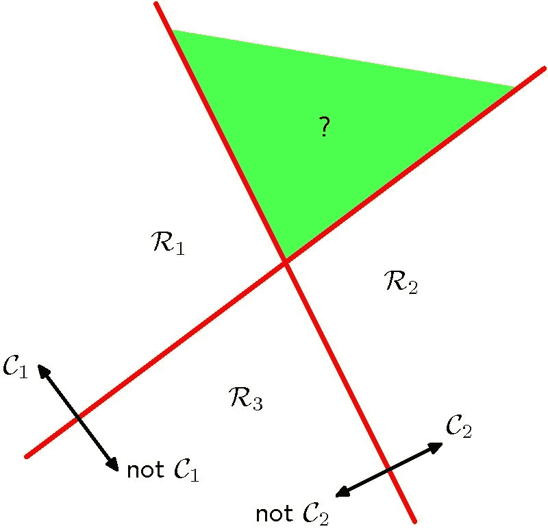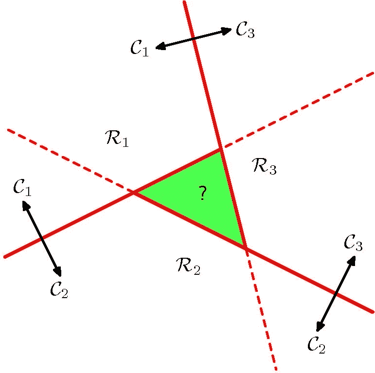

Ambiguity regions for “one vs one” or “one vs all” approaches

相反，我们有三种主要策略来构建判别函数:

*   **最小二乘法** —直接求解矩阵方程，但对异常值不太好。
*   **Fisher 线性判别式** —我们希望找到一种投影，使类别分离最大化，例如，类别均值。使用类间和类内方差和类的均值，我们建立 Fisher 判别式，我们稍后使用它来建立方程，类似于最小二乘法。
*   **感知器**——非常类似于逻辑回归，我将在下面描述，或者你可以在这里阅读。

逻辑回归的推导非常简单，通过最大似然法，我们得到了我们最喜欢的二元交叉熵:

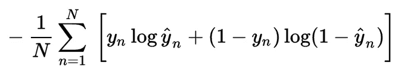

cross-entropy loss

对于逻辑回归，还展示了迭代算法，基于 Hessian ( **Newton-Raphson** )以最小化损失，并针对不同应用进行扩展，其中 softmax 或逻辑函数不适合(如二元变量)——**概率单位回归**。例如，让我们考虑 2 类问题，其中我们可以有一些给出阈值*θ*的激活函数，并且我们基于 if *w_i * x* 高于或低于*θ*来分配类。主要思想是θ是有噪声的，例如从一些 PDF 中提取的，并且该 PDF 的参数将被估计。

本章继续介绍**拉普拉斯近似法**，其目的是在一组连续变量上找到 PDF 的高斯近似法。我们主要在贝叶斯推理应用中需要它，在这种情况下使用高斯分布很方便:

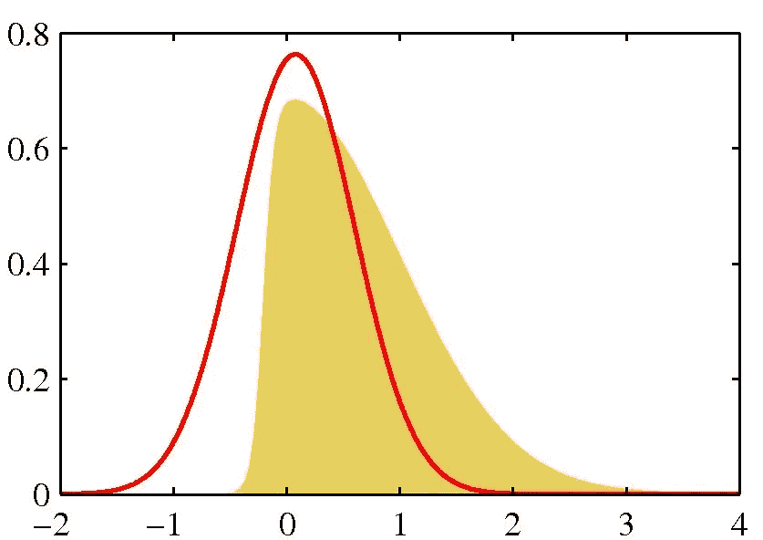

visualization of PDF (yellow) and Laplace approximation (red)

本章最后是模型比较和贝叶斯逻辑回归与地图，高斯近似和预测分布。值得一提的是**贝叶斯信息准则** (BIC)。有了 *{M_i}* 模型、 *{W_i}* 参数和数据 *D* 对于每个模型，我们可以定义似然 *p(D|W_i，M_i)* ，并从中定义模型证据 *p(D|M_i)* 。对于后者我们计算*ln(p(D))~ ln(p(D | W _ map))—M * ln(N)*，其中 *M* —参数个数， *N* —数据点个数。正如我们所看到的，BIC 惩罚模型有太多的参数。

# 5.神经网络

我想读者已经对 NNs 有了很多了解，我将只提到一些有趣的时刻。

首先，这里引入神经网络作为具有基函数的模型，基函数是预先固定的，但是它们必须是自适应的。有趣的是，**跳过连接**中使用的[resnet](https://arxiv.org/abs/1512.03385)在本书中有显示:

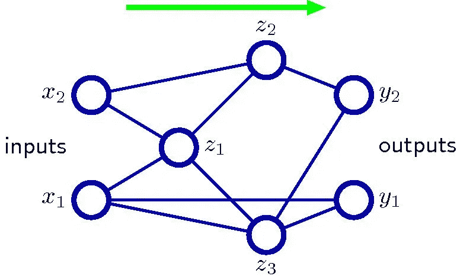

skip connections in neural networks

这本书的很大一部分致力于反向传播和衍生品。它展示了如何:

*   用 BP 计算**雅可比矩阵**
*   用 BP 及其逆运算计算 **Hessian 矩阵**(对角线，外积近似)

神经网络的正则化也在这里讨论。首先，[弹性](https://en.wikipedia.org/wiki/Lasso_(statistics)#Elastic_net)正则化项被提出，因为具有正则**权值衰减**的神经网络是**不变的线性变换**。

我们都知道，例如，对于计算机视觉，我们做了很多数据增强，但通常我们认为这是对初始数据集的放大。使用**切线传播**也可以更“正确”地完成。主要思想是，我们将这些变换形式化为一些流形 M 上的向量，并且我们对它们的方向导数进行反向传播:

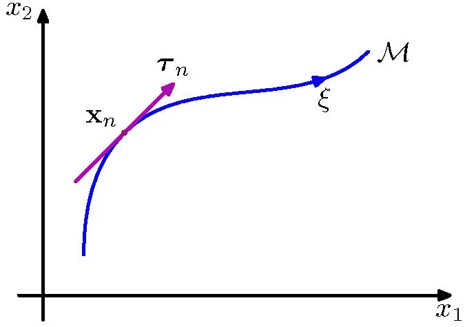

tangent of x on a manifold M

NNs 的另一个很酷的应用是**密度近似**，其中从数据 *{X_i}* 我们预测经验分布的均值和方差为高斯混合。

本章以贝叶斯神经网络结束。我们设定目标分布和权重的先验，我们可以用拉普拉斯近似后验分布。

# 6.核心方法

大多数线性模型可以用等价的**“对偶表示”**来表示，其中预测是基于在数据点评估的核函数的线性组合来完成的。

对偶表示可以从损失函数中得到。例如，正则化均方损失 *J(w)* 后，我们通过导数计算最佳参数值，在表达式中，我们将得到类似于 *w^t * ф_i(x)的结果。*我们可以称之为 a_n，并重新表示最小二乘 *J(a)* ，因为我们为这个 *a* 求解，并得到一个具有 Gram 矩阵 *K，*的解，其中*K _ nm =ф_ I(x _ n)*ф_ I(x _ m)= K(x _ n，x _ m)——*这是我们的核。

我们可以将核构造为多项式、高斯函数或逻辑函数:

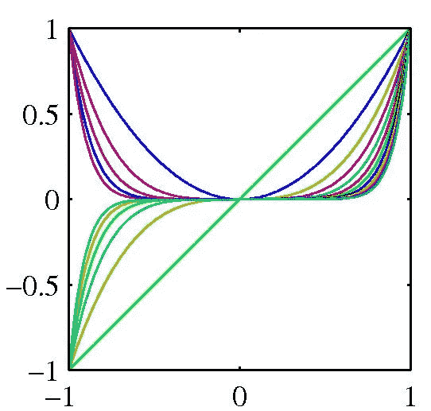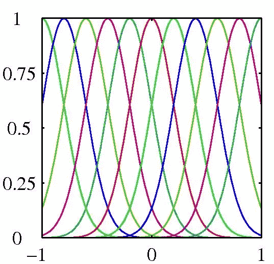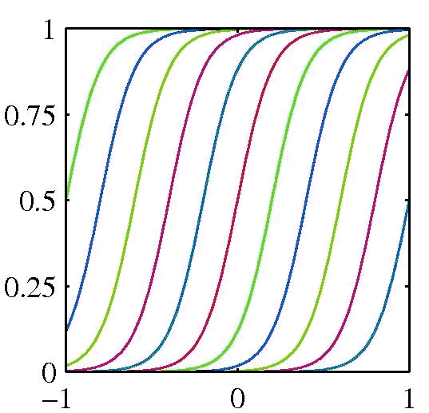

polys, Gaussians and logistic functions as kernels

有很多不同的方法来构建内核:从内核的加法和乘法组合开始，到像 Fisher 内核这样的专用版本，它测量 x 和 x '之间的相似性。

另一个有趣的算法是**径向基函数网络**。当输入噪声过大时，它适用于插值问题。内核(根据 NNs 的激活函数)与 **Nadaraya-Watson 模型**中的相同。在这个模型中，我们希望将期望 E(Y|X)建模为某个函数 y(X), Naradaya 和 Watson 建议将 y(X)估计为某个加权平均值，并且核应该起到加权函数的作用。

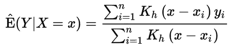

Nadaraya-Watson estimator

在这一章的最后有一类非常重要的算法，特别是对于时间序列——**高斯过程**。如果在贝叶斯线性或逻辑回归中我们设置了权重分布的先验，为什么在 *f(w，x) = w_0 + w_1*x_1* 到 *w_0 + w_1 * ф_i(x) + … + ф_n(x)* 中我们不能直接定义函数 *f* 的概率分布？事实上我们可以。高斯过程的优点是它们可以通过期望和协方差函数来定义，后者可以用核来表示，这就是它们与核方法相关的原因。下图是不同的高斯过程，取决于不同的协方差函数。

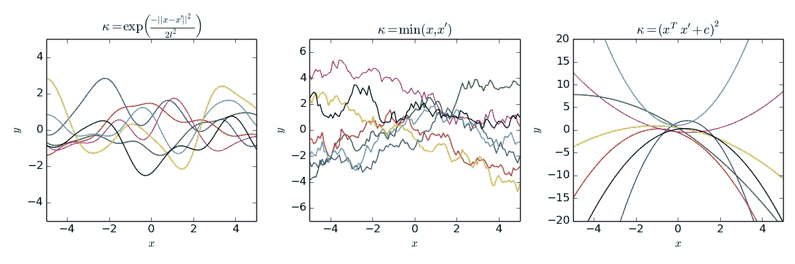

different Gaussian processes

必须学习协方差函数的超参数。为了将高斯过程应用于分类问题，我们有三种主要策略:

*   变分推理
*   期望传播
*   拉普拉斯近似

附言
关注我还可以在[脸书](https://www.facebook.com/rachnogstyle.blog)看到太短的人工智能文章，在 [Instagram](http://instagram.com/rachnogstyle) 看到个人资料，在 [Linkedin](https://www.linkedin.com/in/alexandr-honchar-4423b962/) ！