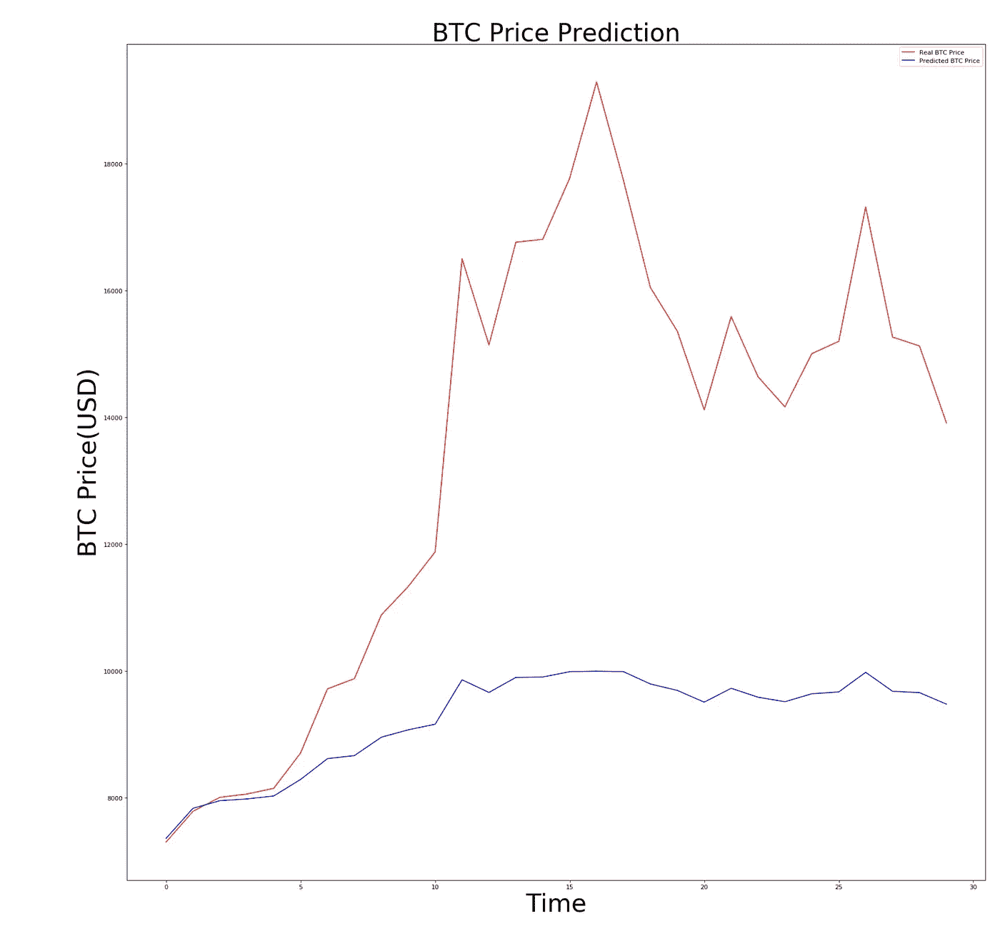

# 使用 LSTM 预测比特币价格

> 原文：<https://towardsdatascience.com/bitcoin-price-prediction-using-lstm-9eb0938c22bd?source=collection_archive---------2----------------------->

2017 年 11 月围绕比特币的激烈讨论吸引了我的注意力，我决定深入了解这到底是什么。我阅读了一堆论文，几本书和许多关于这个话题的观点，以便对它在当前市场中的价值有一个像样的了解。

你可能听说过比特币，但如果你想完全承认它的存在，我推荐阅读[安德烈亚斯的书——《货币的互联网](https://www.amazon.com/Internet-Money-Andreas-M-Antonopoulos-ebook/dp/B01L9WM0H8)。

当然，最吸引绝大多数人的是这种资产的价格波动。比特币价格在短时间内大幅上涨/下跌是一个有趣的现象，根本无法预测。然而，我认为在这个价格上看到任何强大的机器学习模型的效果都会很好。

所以我选择了一个[递归神经网络](/learn-how-recurrent-neural-networks-work-84e975feaaf7)和一组比特币价格来预测这种金色加密货币的未来。

从 01/02/2009 到今天，我每天都使用[比特币的收盘价](https://blockchain.info/charts/market-price)以及[这个奇妙的 Kaggle 内核](https://www.kaggle.com/microtang/predicting-btc-price-using-rnn/notebook)的一点帮助。

## #1.开始实施

让我们首先定义我们的库:

我们将使用`keras`来训练模型。

> Keras 是一个高级神经网络 API，用 Python 编写，能够在 [TensorFlow](https://github.com/tensorflow/tensorflow) 、 [CNTK](https://github.com/Microsoft/cntk) 或 [Theano](https://github.com/Theano/Theano) 之上运行。

我们还声明了`numpy`(矩阵操作)`panda`(定义数据结构)`matplotlib`(可视化)和`sklearn`(标准化我们的数据)

## #2.准备数据

我们的下一步将是准备数据。这包括从第三方来源获取、清理并分成培训和测试。

[这里的](https://blockchain.info/charts/market-price)是访问一个*的绝佳链接。带价格的 csv* 文件。

*   加载数据并删除未使用的字段(在本例中为“日期”)

我们使用`pandas`来读取*。csv* 文件并删除无用的列。

*   分为培训和测试

这里所做的决定只是为了本教程的目的。在真实的项目中，**你应该总是将你的数据分成训练、验证、测试**(通常是 80%、20%、20%)。我们已经将培训设置为 30 天，这意味着我们将在最后一个月测试我们的模型。

*   正常化并准备培训

我们使用`fit_transform`来确定数据的中心，使其具有 0 个平均值和 1 个标准误差。我推荐阅读[这篇 Stackoverflow 回答](https://datascience.stackexchange.com/questions/12321/difference-between-fit-and-fit-transform-in-scikit-learn-models)来澄清。然后，我们将数据分为`x_train`和`y_train`。本质上，这是因为我们使用了递归神经网络。我们的模型将从`x_train`获取第 0 个元素，并尝试从`y_train`(即`x_train`的第一个元素)预测第 0 个元素。这样我们就创建了一个序列——这正是 rnn 训练所需要的。如果你需要更多关于这些奇妙网络如何工作的信息，你可能会发现我的一篇文章很有用。

最后，我们重塑`x_train`数据，以匹配使用`keras`进行训练的需求(见下文)。

## #3.火车模型

现在我们需要使用上述数据来训练我们的模型。有了`keras`，这个过程就变得极其容易理解。你不需要知道任何运算背后的数学原理就能产生像样的结果。不过，如果你有兴趣钻研方程和算法，你可以在这里 (LSTM 网)找到更多信息[，在这里](http://colah.github.io/posts/2015-08-Understanding-LSTMs/) (GRU 网)找到[。](/understanding-gru-networks-2ef37df6c9be)

我们正在构建如下模型:

*   第 1 行:用于 LSTM 单元的单位数(输出态的维数)。
*   第 2 行:用于 LSTM 电池的[激活功能](/activation-functions-neural-networks-1cbd9f8d91d6)(在我们的例子中为[s 形](https://en.wikipedia.org/wiki/Sigmoid_function))。
*   第 3 行:用于最小化损失函数的优化器(在我们的例子中是[亚当](https://machinelearningmastery.com/adam-optimization-algorithm-for-deep-learning/))。
*   第 4 行:在调整网络的权重和偏差时我们需要最小化的损失函数(在我们的例子中是[均方误差](https://en.wikipedia.org/wiki/Mean_squared_error))。
*   第 5 行:神经网络通常是分批训练的，这意味着在每次迭代中，我们从训练集中挑选 5 个例子，并使用它们进行训练。
*   第 6 行:历元的数量决定了我们需要进行多少次迭代。

在解释了每个超参数的含义后，我们开始训练模型:

*   第 9 行:定义堆叠所有层(输入、隐藏和输出)的[顺序模型](https://keras.io/getting-started/sequential-model-guide/)
*   第 12 行:将 LSTM 单元添加到我们的模型中。这里很好地解释了它在 Keras 中是如何工作的。
*   第 15 行:添加输出层——是一个简单的[密集](https://keras.io/layers/core/),具有默认的线性激活函数和维度 1。
*   第 18 行:这是实际训练前的最后一步。我们需要设置上面指定的优化器和损失函数。
*   第 21 行:使用输入`x_train`和标签`y_train`训练模型。

## #4.预测价格

我们终于到了期待已久的预测价格的时刻。我们有 2 个步骤:预测价格，并绘制价格图，与真实结果进行比较。

*   预测下个月的价格

正如你已经看到的，Keras 让一切变得如此简单。这里的情况是一样的:

第 1–6 行:我们做的和训练集完全一样。使用`min_max_transform`来缩放数据，然后为预测重塑数据。

第 7 行:预测。

第 8 行:重新调整预测数据以匹配其真实值(美元价格)

*   可视化结果

最后，我们将使用下面的代码片段绘制测试价格和预测价格:

结果碰巧真的很有趣。当然，预测的准确性并不出色，但仍然很酷:

> 更多 AI 内容，[在 LinkedIn 关注我](https://www.linkedin.com/in/simeonkostadinov/)。

## 感谢您的阅读。如果你喜欢这篇文章，给它一些掌声👏。希望你有一个伟大的一天！