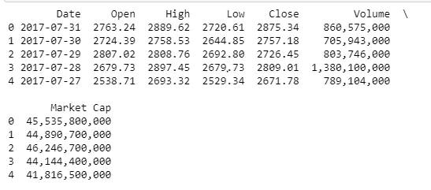
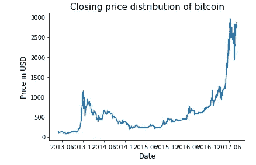
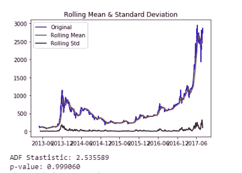
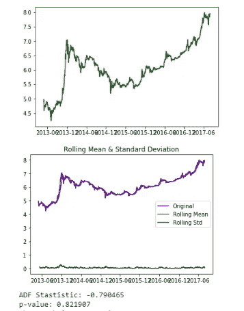
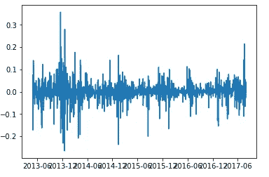
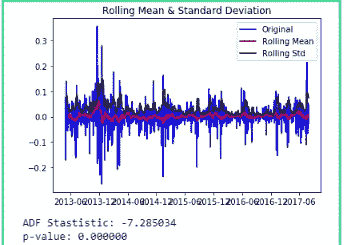
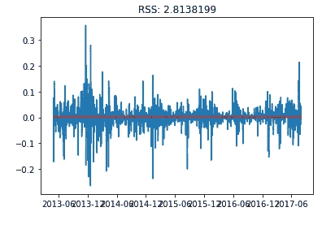
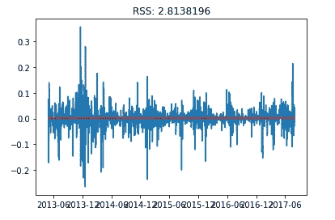
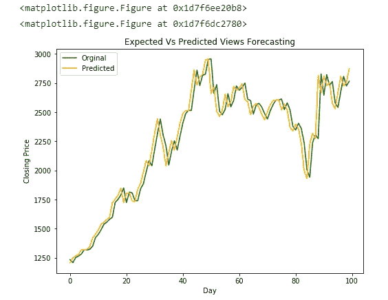

# 使用时间序列预测的比特币价格预测

> 原文：<https://towardsdatascience.com/bitcoin-price-prediction-using-time-series-forecasting-9f468f7174d3?source=collection_archive---------3----------------------->


这篇文章是关于使用时间序列预测来预测比特币价格的。时间序列预测与其他机器学习模型非常不同，因为-

1.它依赖于时间。因此，线性回归模型的基本假设，即观察值是独立的，在这种情况下不成立。

2.除了增加或减少的趋势，大多数时间序列都有某种形式的季节性趋势，即特定时间范围内的变化。

因此，简单的机器学习模型无法使用，因此时间序列预测是一个不同的研究领域。本文采用 AR(自回归模型)、MA(移动平均模型)和 ARIMA(自回归综合移动平均模型)等时间序列模型对比特币价格进行预测。

该数据集包含 2013 年 4 月至 2017 年 8 月比特币的开盘价和收盘价

# 导入必要的库

```
**import** **pandas** **as** **kunfu**
**import** **numpy** **as** **dragon**
**import** **pylab** **as** **p**
**import** **matplotlib.pyplot** **as** **plot**
**from** **collections** **import** Counter
**import** **re**

*#importing packages for the prediction of time-series data*
**import** **statsmodels.api** **as** **sm**
**import** **statsmodels.tsa.api** **as** **smt**
**import** **statsmodels.formula.api** **as** **smf**

**from** **sklearn.metrics** **import** mean_squared_error 
```

数据从 csv 文件加载到列车数据帧中。这是我们数据的前五行看起来的样子。



# 绘制时间序列

以日期为索引，x 轴为日期，y 轴为收盘价。

```
data = train['Close']
Date1 = train['Date']
train1 = train[['Date','Close']]
*# Setting the Date as Index*
train2 = train1.set_index('Date')
train2.sort_index(inplace=**True**)
print (type(train2))
print (train2.head())
plot.plot(train2)
plot.xlabel('Date', fontsize=12)
plot.ylabel('Price in USD', fontsize=12)
plot.title("Closing price distribution of bitcoin", fontsize=15)
plot.show()
```



# **测试平稳性**

**增强迪基富勒测验:**

扩展的 Dicky Fuller 检验是一种称为单位根检验的统计检验。

单位根检验背后的直觉是，它决定了趋势对时间序列的定义有多强。

单位根检验有许多种，ADF 是应用最广泛的一种

**1。** **零假设(H0):** 检验的零假设是时间序列可以用一个非平稳的单位根来表示。

2.**备选假设(H1):** 检验的备选假设是时间序列是平稳的。

**p 值的解释**

**1。** **p 值** > **0.05:** 接受零假设(H0)，数据有单位根，非平稳。

**2。** **p 值** < = **0.05:** 拒绝零假设(H0)，数据是平稳的。

```
**from** **statsmodels.tsa.stattools** **import** adfuller

**def** test_stationarity(x):

    *#Determing rolling statistics*
    rolmean = x.rolling(window=22,center=**False**).mean()

    rolstd = x.rolling(window=12,center=**False**).std()

    *#Plot rolling statistics:*
    orig = plot.plot(x, color='blue',label='Original')
    mean = plot.plot(rolmean, color='red', label='Rolling Mean')
    std = plot.plot(rolstd, color='black', label = 'Rolling Std')
    plot.legend(loc='best')
    plot.title('Rolling Mean & Standard Deviation')
    plot.show(block=**False**)

    *#Perform Dickey Fuller test* 
    result=adfuller(x)
    print('ADF Stastistic: **%f**'%result[0])
    print('p-value: **%f**'%result[1])
    pvalue=result[1]
    **for** key,value **in** result[4].items():
         **if** result[0]>value:
            print("The graph is non stationery")
            **break**
         **else**:
            print("The graph is stationery")
            **break**;
    print('Critical values:')
    **for** key,value **in** result[4].items():
        print('**\t%s**: **%.3f** ' % (key, value))

ts = train2['Close']      
test_stationarity(ts) 
```



由于 p 值大于 0.05，时间序列是非平稳的。到目前为止，我们测试了这个系列，它不是稳定的。因此，这里需要做一些工作。所以现在我们用变换使级数平稳。

# **测井转换系列**

日志转换用于对高度扭曲的数据进行去扭曲。从而有助于预测过程。

```
ts_log = dragon.log(ts)
plot.plot(ts_log,color="green")
plot.show()

test_stationarity(ts_log)
```



由于 p 值仍然大于 0.05，所以序列仍然是非平稳的，所以我们需要做进一步的变换。让我们继续做差分。

# 通过差异消除趋势和季节性

在差分以使时间序列稳定的情况下，当前值与先前值相减。由于这一点，平均值是稳定的，因此时间序列的平稳性的机会增加。

```
ts_log_diff = ts_log - ts_log.shift()
plot.plot(ts_log_diff)
plot.show()
```



```
ts_log_diff.dropna(inplace=**True**)
test_stationarity(ts_log_diff)
```



由于我们的时间序列现在是平稳的，因为我们的 p 值小于 0.05，因此我们可以应用时间序列预测模型。

# **自回归模型**

自回归模型是一种时间序列预测模型，其中当前值依赖于过去值。

```
*# follow lag*
model = ARIMA(ts_log, order=(1,1,0))  
results_ARIMA = model.fit(disp=-1)  
plot.plot(ts_log_diff)
plot.plot(results_ARIMA.fittedvalues, color='red')
plot.title('RSS: **%.7f**'% sum((results_ARIMA.fittedvalues-ts_log_diff)**2))
plot.show()
```



# 移动平均模型

在移动平均模型中，序列依赖于过去的误差项。

```
*# follow error*
model = ARIMA(ts_log, order=(0,1,1))  
results_MA = model.fit(disp=-1)  
plot.plot(ts_log_diff)
plot.plot(results_MA.fittedvalues, color='red')
plot.title('RSS: **%.7f**'% sum((results_MA.fittedvalues-ts_log_diff)**2))
plot.show() 
```



# 自回归综合移动平均模型

它是 AR 和 MA 模型的结合。它通过差分过程使时间序列本身平稳。因此，对于 ARIMA 模型，不需要明确地进行差分

```
**from** **statsmodels.tsa.arima_model** **import** ARIMA
model = ARIMA(ts_log, order=(2,1,0))  
results_ARIMA = model.fit(disp=-1)  
plot.plot(ts_log_diff)
plot.plot(results_ARIMA.fittedvalues, color='red')
plot.title('RSS: **%.7f**'% sum((results_ARIMA.fittedvalues-ts_log_diff)**2))
plot.show()
```


因此，我们看到，RSS(残差平方和)误差是最小的 ARIMA 模型。因此，ARIMA 模型是三个模型中最好的，因为它利用了对滞后值和误差项的依赖性。因此，它进一步用于计算均方差。在下面的代码片段中，数据集分为训练和测试。

对于测试中的每个值，我们应用 ARIMA 模型，然后计算误差，然后在迭代测试集中的所有值后，计算预测值和期望值之间的平均误差。

```
size = int(len(ts_log)-100)# Divide into train and test
train_arima, test_arima = ts_log[0:size], ts_log[size:len(ts_log)]history = [x **for** x **in** train_arima]predictions = list()
originals = list()
error_list = list()

print('Printing Predicted vs Expected Values...')
print('**\n**')# We go over each value in the test set and then apply ARIMA model and calculate the predicted value. We have the expected value in the test set therefore we calculate the error between predicted and expected value **for** t **in** range(len(test_arima)):
    model = ARIMA(history, order=(2, 1, 0))
    model_fit = model.fit(disp=-1)

    output = model_fit.forecast()

    pred_value = output[0]

    original_value = test_arima[t]
    history.append(original_value)

    pred_value = dragon.exp(pred_value)

    original_value = dragon.exp(original_value)

    # Calculating the error
    error = ((abs(pred_value - original_value)) / original_value) * 100
    error_list.append(error)
    print('predicted = **%f**,   expected = **%f**,   error = **%f** ' % (pred_value, original_value, error), '%')

    predictions.append(float(pred_value))
    originals.append(float(original_value))

# After iterating over whole test set the overall mean error is calculated.   
print('**\n** Mean Error in Predicting Test Case Articles : **%f** ' % (sum(error_list)/float(len(error_list))), '%')plot.figure(figsize=(8, 6))
test_day = [t
           **for** t **in** range(len(test_arima))]
labels={'Orginal','Predicted'}
plot.plot(test_day, predictions, color= 'green')
plot.plot(test_day, originals, color = 'orange')
plot.title('Expected Vs Predicted Views Forecasting')
plot.xlabel('Day')
plot.ylabel('Closing Price')
plot.legend(labels)
plot.show()
```

预测= 2513.745189，预期= 2564.060000，误差= 1.962310 %
预测= 2566.007269，预期= 2601.640000，误差= 1.369626 %
预测= 2604.348629，预期= 2601.990000，误差= 0.090647 %
预期= 2372.560000，误差= 6.258791 %
预测= 2379.066829，预期= 2337.790000，误差= 1.765635 %
预测= 2348.468544，预期= 2398.840000，误差= 2.099826 %
预测= 2405.2999999 误差= 12.841677 %
预测= 2238.150016，预期= 2318.880000，误差= 3.481421 %
预测= 2307.325788，预期= 2273.430000，误差= 1.490954 %
预测= 2272.890197，预期= 2817.60000 误差= 0.899246 %
预测= 2763.766195，预期= 2576.480000，误差= 7.269072 %
预测= 2580.946838，预期= 2529.450000，误差= 2.035891 %
预测= 2541.493507，预期= 2671.7800000

预测测试用例文章的平均误差:3.593133 %



因此，原始时间序列和预测时间序列的平均误差为 3.59%。因此，我们能够使用不同的转换和模型来预测比特币的收盘价。

如果你读到最后，谢谢你。这是我关于数据科学的第一篇文章，以后还会有更多文章。如果您发现任何错误或有任何建议，请做评论。如果你喜欢这个帖子，请不要忘记鼓掌！谢谢你。