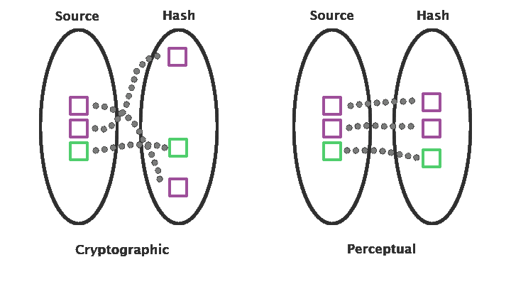
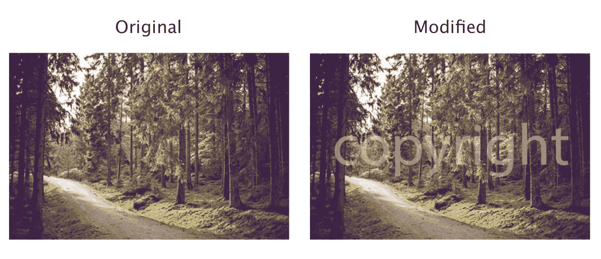
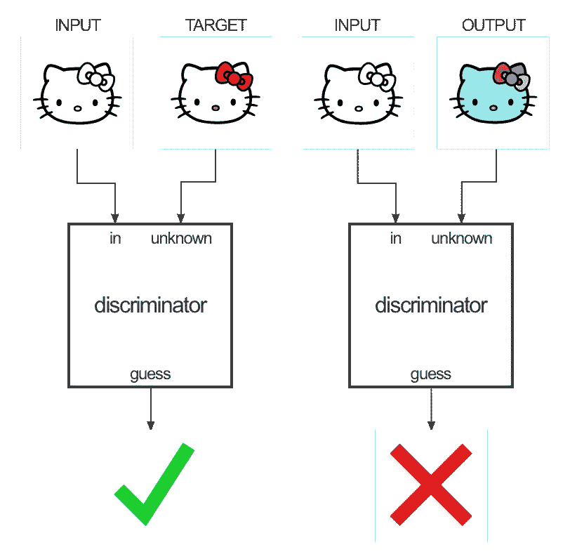
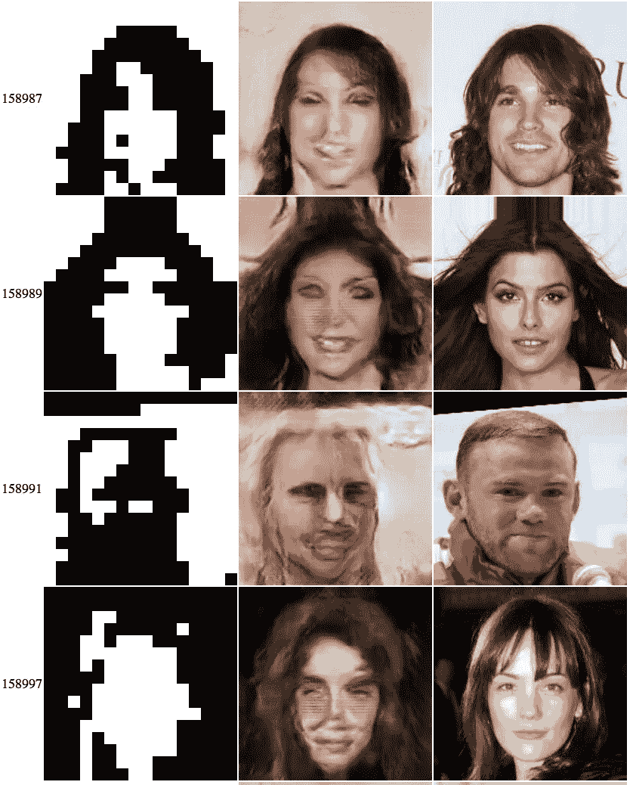
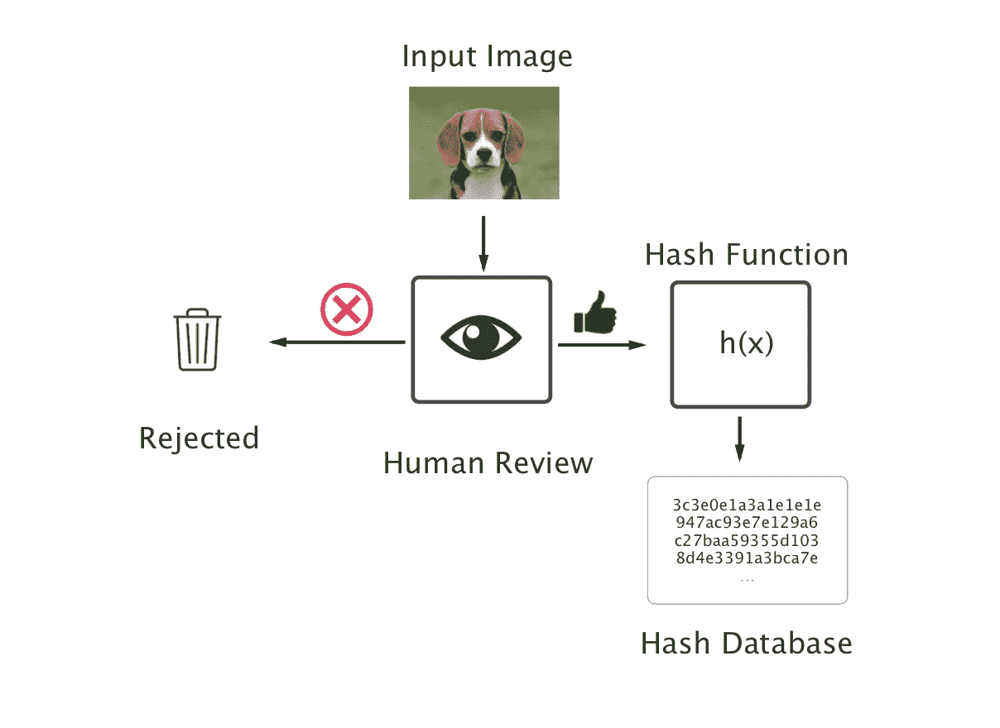
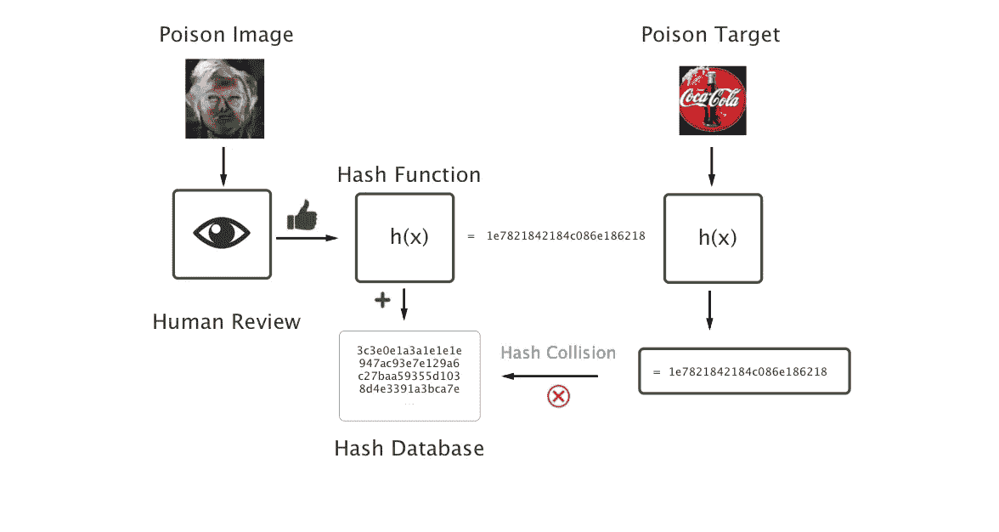
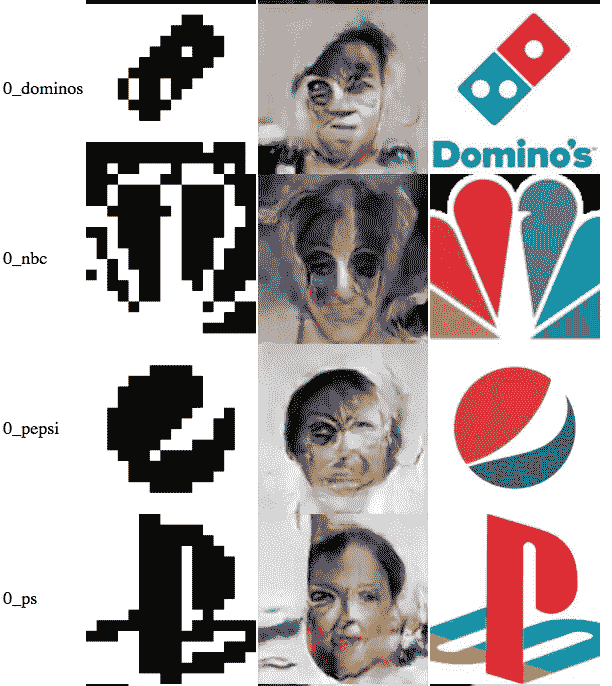

# 利用 GANs 对感知图像哈希的黑盒攻击

> 原文：<https://towardsdatascience.com/black-box-attacks-on-perceptual-image-hashes-with-gans-cc1be11f277?source=collection_archive---------2----------------------->

**tldr:** 这篇帖子演示了 GANs 能够以两种关键方式破解图像哈希算法:(1) **反转攻击**:从哈希合成原始图像(2) **中毒攻击**:合成任意自然图像分布的哈希冲突。



Diagram illustrating difference in hash space properties. [Image Credit](http://bertolami.com/index.php?engine=blog&content=posts&detail=perceptual-hashing), Joe Bertolami

## 感知图像哈希背景

感知图像哈希(PIH)是基于图像外观的短十六进制字符串(例如“00081 c 3c 181818”)。感知图像散列，尽管是散列，但不是加密安全的散列。**这是设计上的**，因为 PIHs 的目标是对图像的微小变化(旋转、裁剪、伽玛校正、添加噪声、添加边框)保持平滑不变。这与加密散列函数形成对比，加密散列函数被设计用于非平滑性，并且如果任何单个比特改变，则完全改变。

以下图片的感知散列仅因文本修改而略有改变，但它们的 md5 散列完全不同。



[Image Credit](https://github.com/jenssegers/imagehash), Jens Segers

```
a_hash(original) = 3c3e0e1a3a1e1e1e
a_hash(modified) = 3c3e0e3e3e1e1e1emd5(original) = 8d4e3391a3bca7...
md5(modified) = c27baa59355d10...
```

我不会过多地探究这些算法如何工作的细节:更多信息见([此处](https://www.hackerfactor.com/blog/?/archives/432-Looks-Like-It.html))。

尽管 PIHs 在加密方面并不可靠，但它仍被广泛用于隐私敏感的应用程序中。

## 哈希反转攻击

因为感知图像散列具有将输入与输出相关联的平滑属性，所以我们可以用神经网络来建模这个过程及其逆过程。GANs 非常适合这个生成任务，特别是因为单个图像散列中有许多潜在的图像。gan 允许我们学习图像流形，并使模型能够探索这些不同但有效的图像分布输出。

我训练 **Pix2Pix** 网络( [paper](https://arxiv.org/abs/1611.07004) ， [github](https://github.com/affinelayer/pix2pix-tensorflow) )来转换使用来自标准 python 哈希库的`a_hash`函数计算的感知图像哈希，**image hash**([github](https://github.com/jenssegers/imagehash))。对于这个演示，我在 **celebA** faces 数据集上进行训练，尽管黑盒攻击是通用的，并且适用于其他数据集、图像分布和哈希函数。我将由`a_hash`产生的图像散列排列到一个 2d 数组中，作为 pix2pix 模型的输入图像。



Pix2Pix Model Setup. [Image Credit](https://affinelayer.com/pix2pix/) , [*Christopher Hesse*](https://twitter.com/christophrhesse)

下面是这种哈希反转攻击的一些结果。在许多情况下，攻击能够生成与原始图像相似的人脸，即使在失败的情况下，也常常代表原始图像的正确性别、发型和种族。注意:脸部纹理并不完美，因为模型没有完全收敛。这是使用谷歌的 [*Colab*](https://colab.research.google.com/) *工具在有限的计算资源上训练的。*



Left: 2D representation of the hash, Middle: Reconstructed Image, Right: Original Image

许多应用程序认为这些散列是保护隐私的，但是上面的这些结果表明它们是可以逆转的。任何声称通过存储敏感图像哈希来保证安全的服务都是在误导用户，并存在遭受此类攻击的潜在风险。

## 哈希中毒攻击

哈希中毒攻击与以下场景相关:

> 一个系统，允许用户提交照片到一个图像数据库，以禁止。一个人审查图像，以确保它是一个值得禁止的图像(并且图像是说，不是可口可乐的标志)。如果获得批准，该散列将被添加到数据库中，并在每次上传新图像时进行检查。如果这个新图像的哈希与被禁止的哈希冲突，图像将被阻止上传。



如果一个恶意用户以某种方式欺骗人类审查员接受可口可乐标志作为一个被禁图像，数据库可能会因包含本应共享的图像散列而“中毒”。事实上，我们只需要人类审查员接受一个与可口可乐标志有哈希冲突的图像！这个愚弄人类的任务可以通过我们学习到的生成模型来完成。

## 哈希循环丢失，更强地保证哈希冲突

在所描述的模型中，我们可以将散列转换成其原始图像的近似值。然而，这些生成的图像并不总是精确地散列回原始散列。为了成功地应用这种攻击，我们必须稍微修改 pix2pix 目标，以确保操作是正确可逆的，并将原始图像散列回真正的原始散列。

我在标准的 pix2pix 损失中增加了一个额外的哈希循环损失项。这将计算生成图像的哈希，并计算真实哈希和生成图像哈希之间的像素交叉熵损失。在有限的实验中，这个额外的损失项将生成的哈希冲突率从大约 30%提高到大约 80%。

## 哈希碰撞攻击模型



上图展示了我们的网络生成一张与可口可乐标志有哈希冲突的脸的图像。这些共享相同的哈希，并允许用户毒化哈希数据库，并阻止公司徽标上传到平台。这里有一些更多的公司标志与生成的脸是哈希碰撞。



## 建议

不要在隐私或内容敏感的应用中使用感知图像哈希！或者至少不要在没有一些额外安全措施的情况下存储它们。

更安全的方案是为图像生成许多潜在的哈希(应用图像转换来创建新的哈希)，将这些哈希通过类似于`md5`的可证明安全的哈希函数，并将这些哈希存储在您的数据库中，以便在匹配未来图像时进行检查。

一个潜在的解决方案是不公开正在使用哪个散列函数。但这是**默默无闻的安全**。它不能防止有权访问数据库或代码库的人逆转存储的散列或用详细的攻击毒害散列池。

## 笔记

感谢 [*邓肯·威尔逊*](http://www.duncanwilson.com/) ， [*伊桑·古尔拉贾尼*](https://github.com/igul222) ， [*卡尔蒂克·纳拉西姆汉*](http://people.csail.mit.edu/karthikn/) *，* [*哈里尼·苏雷什*](http://harinisuresh.com) *，* [*爱德华多·德莱昂*](https://github.com/Edeleon4) 对本工作的反馈和建议。感谢[*Christopher Hesse*](https://twitter.com/christophrhesse)为伟大的 pix2pix 库，感谢 [*延斯塞格斯*](https://github.com/jenssegers/imagehash) 为 imagehash python 库。

# 喜欢这篇文章吗？

*如果你喜欢这篇文章，请用**拍手* *或分享告诉我。*