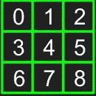
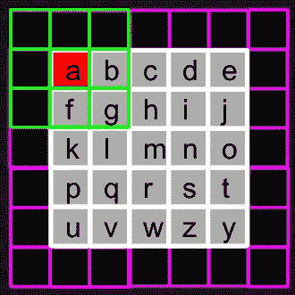
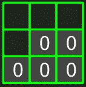
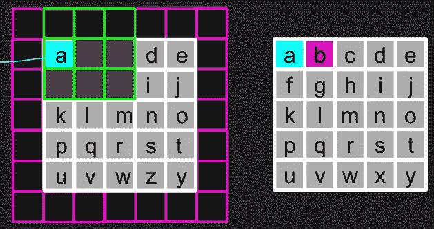
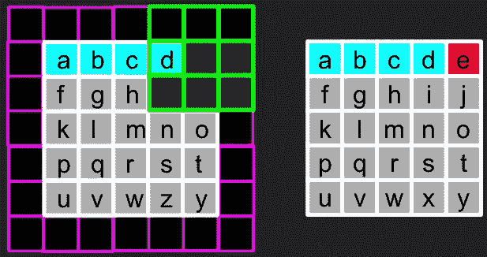
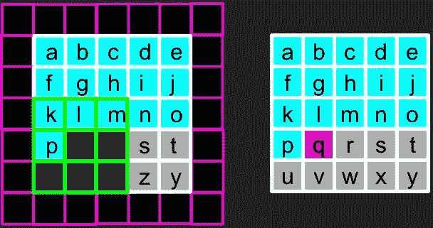
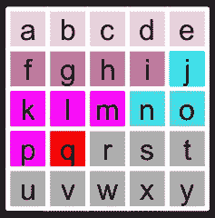

# PixelCNN 中的盲点问题

> 原文：<https://towardsdatascience.com/blind-spot-problem-in-pixelcnn-8c71592a14a?source=collection_archive---------2----------------------->

在上一篇关于 PixelRNN 研究论文[摘要的帖子中，我们了解了 PixelCNN。](https://medium.com/@nehamuthiyan/summary-of-pixelrnn-by-google-deepmind-7-min-read-938d9871d6d9)

# PixelCNN 概述-

行和对角线 LSTM 层覆盖了图像中像素之间的长程相关性。由于 LSTM 层的复杂性质，学习长程相关性需要计算成本。标准卷积层可以捕捉一个有界感受域，并同时计算所有像素位置的特征。PixelCNN 减少了行 LSTM 和对角线 BLSTM 中所需的计算成本，但是存在盲点问题。

B lind spot 问题基本上是，不包括上下文/历史中所有以前的像素用来计算一个像素的隐藏状态。根据 PixelRNN 的研究论文，一个像素的值取决于所有先前预测的像素。因此，盲点可以被定义为广义的信息丢失。

Figure 1: 3x3 filter (each element is a weight)

Figure 2: 5x5 zero padded image(pink portion is the zero padding)

在图 2 中，红框表示要预测的值/像素。要预测的像素总是在滤波器的中心。

Figure 3: filter to predict the value ‘a’ in image

注意:不为零的过滤器元素是零填充的一部分。(过滤器(绿色)中的深灰色方框表示“归零”的未来值。

Figure 4: Filter(in green) to predict the value ‘b’

值“b”(红色)表示要预测的值，青色表示先前预测的值。这里，已经预测了“a ”,并且过滤器(图 4 中的左图)包括先前预测的像素值“a ”,并且不包括未来的像素。因此,“红色”像素的值取决于先前的像素。

Figure 5: Filter(in green) to predict the value ‘e’

在图 5 中，要预测的像素(“e”)在其滤波器中包括像素“d”。‘d’依赖于‘c’；c 依赖于 b，b 依赖于 a。因此，“e”直接或间接地依赖于“a”，“b”，“c”，“d”。

Figure 6: Filter to predict the value ‘q’

如图 6 所示，值为“q”的像素位于过滤器的中心。未来值/像素(包括“q”)已经通过将那些像素的权重设为 0 而被置零。“q”处像素的预测值取决于“k”、“l”、“m”、“p”。k '，' l '，' m '，' p '依次依赖于 f，g，h，I，它们依次依赖于 a，b，c，d，e

Figure 7: Blind Spot in predicting the pixel ‘q’

如图 7 所示，“q”处的像素依赖于除“j”、“n”、“o”之外的所有先前预测的像素。青色的像素不用于“q”的预测。

这就是所谓的‘盲点’。使用 PixelCNN 预测的像素不依赖于所有先前的像素，这是不可取的。

为了解决盲点问题，引入了“门控像素 CNN ”,这将在后面介绍。