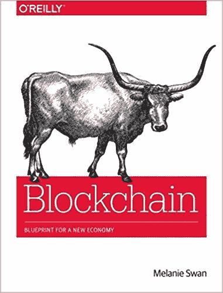
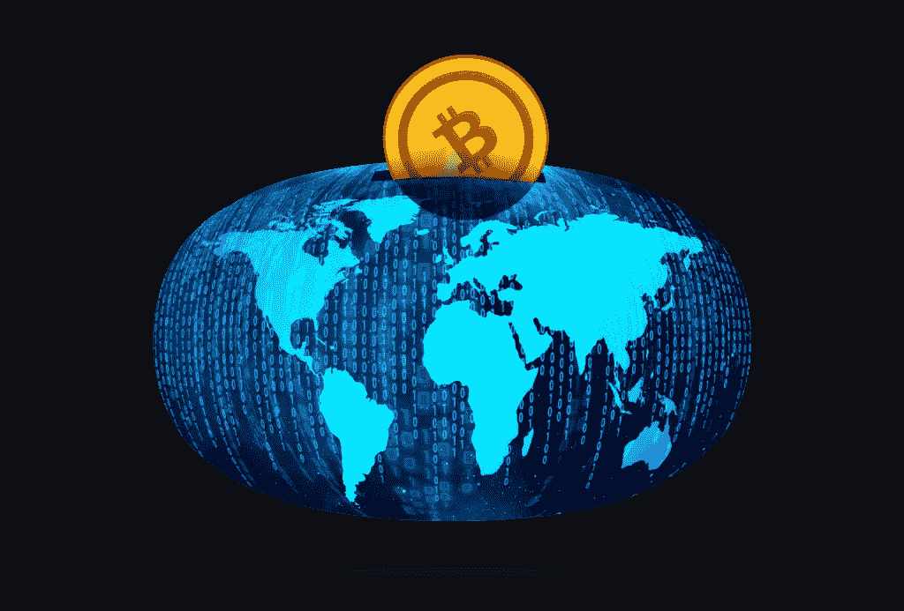

# 区块链:新经济的蓝图

> 原文：<https://towardsdatascience.com/blockchain-blueprint-for-a-new-economy-by-melanie-swan-book-review-5538a7f45e3f?source=collection_archive---------5----------------------->

前几天，我对一个朋友说，虽然我很理解比特币区块链，但从商业角度来看，我并不完全理解它的价值。坦率地说，我得到了这项技术，并发现它有趣而迷人，虽然我*知道*它有用，但我并不完全明白*如何*它有用。我的朋友评论说，这是技术人员的通病——我们了解技术，但不了解业务。很公平。

我偶然看到了 Melanie Swan 的《区块链:新经济蓝图》这本书。这本书被描述为“带你超越货币(“区块链 1.0”)和智能合约(“区块链 2.0”)，展示区块链如何成为继大型机、个人电脑、互联网和移动/社交网络之后的第五种颠覆性计算范式。”听起来不错，而且这是一本奥莱利的书，所以我决定读一读。

这篇帖子是对*区块链*的总结和回顾，本质上是区块链用例的列表，都是在非常高的水平上讨论的。虽然作者没有触及事物或实现的技术方面，但我发现这是一个有用的快速阅读。

作者从比特币的高度概述开始。Swan 说术语“比特币”实际上指的是三样东西:区块链、协议和货币。介绍了区块链 1.0、2.0 和 3.0 的概念。介绍中讨论了区块链 1.0，即区块链在分散式货币和支付中的应用。她指出，区块链是一种“推送技术”，即用户将特定交易的相关信息推送到网络上，而信用卡是一种“拉取技术”，即用户的个人信息随时存档，供任何授权交易提取。作为一种推送技术，避免了在网络上存储用户信息的需要，进而意味着区块链不容易受到黑客身份盗窃攻击。斯万还在很高的层面上讨论了钱包，以及截至本文撰写之日比特币的监管状况。介绍的还行，但是我觉得层次有点太高了。如果能对挖掘和分散式交易验证的重要性有所了解，那就更好了。然而，这是我第一次读到比特币/传统银行是一种推/拉技术，所以得分！

第 2 章是对区块链 2.0 的讨论，区块链 2.0 是一般市场的去中心化和通过区块链转移货币以外的资产。Swan 说，关键的想法是区块链的分散化功能，这导致登记、确认和转移所有形式的合同和财产的能力。用例包括金融服务，如[外汇](https://ripple.com/)和[支付](https://bitspark.io/)，博彩，以及通过 ICO 进行众筹。在这里，作者似乎将众筹和 ico 混为一谈，但[它们是截然不同的](https://cointelegraph.com/news/crowdfunding-vs-ico-experts-question-legitimacy-and-guarantees-of-initial-coin-offerings)。众筹和 ico 的一个主要区别是，在传统的众筹活动中，投资者完全了解产品以及预计何时完成，更重要的是，他们可以将其与现有产品进行比较，以确定其价值。另一方面，ICO 为一家通常不完全确定的公司提供资金，因此 ICO 后公司的价值并不完全确定。我怀疑这就是为什么这么多 ico 失败的原因。反正我跑题了。在提到众筹和 ico 之后，Swan 继续讨论智能财产和智能合同，以及智能合同在 DApp 和 DAO/DAC 或分散自治组织/公司中的使用，其中 DApp/DAO/DAC 本质上是由智能合同管理的应用程序/组织/公司。更彻底地说，智能合同本质上是双方之间的区块链编码协议，它将在某些给定条件下自动执行，不需要双方之间的信任。

接下来以“区块链 3.0:超越货币、经济和市场的正义应用”，或者说超越货币和资产的概念去中心化，来讨论区块链 3.0。这是这本书开始变得更像一个列表的地方。给出了几个区块链 3.0 用例。通过将大数据预测分析与区块链相结合，可以促进预测任务自动化。区块链可用于分布式抗审查组织模型、数字身份验证和数字资产保护。讨论了“个人思维区块链”的想法，其中一个人的想法被记录在区块链上，用于中风后的记忆恢复，我认为这很疯狂，但也很棒。提到了一个政治用例，即区块链治理服务，其中居民可以以定制的“星巴克咖啡订单”方式为政府服务付费。

Blockchain will change the world!!!! Woo!

关于区块链 3.0 的讨论在第四章继续，作者讨论了区块链使用的效率，如果你对这个主题相当了解，这并不太令人兴奋。

后面一章的标题是“高级概念”(顺便说一句，讽刺的是并没有那么高级)，讨论了什么是货币——存储价值、交换媒介、记账单位——和滞期费，我觉得这很有趣，因为我不是经济学家，以前也没听说过。斯旺描述说，“滞期费货币”是通货紧缩和刺激行动的，因为它鼓励人们在货币贬值之前花掉它，从而鼓励经济活动。保证基本收入被用作滞期费加密货币威力的一个例子。为了减少收入囤积，可以发放一种只能在发行的那一周使用的 GBI 代币。

最后一章，在这个总结中我将跳过的结论之前，讨论了区块链的局限性，并与前面五个唯心主义章节形成了鲜明的对比。这一章类似于讨论效率的那一章，因为如果你对比特币了解很多，就没有什么新东西了。

我喜欢这本书。这让我对区块链技术的力量感到兴奋。然而，我觉得这本书有点太玄幻了，更像是所有可能的区块链应用的宣言，很少甚至没有提到局限性。当然，有整整一章是关于局限性的，但如果这本书是一个人，那会是有人大喊“区块链是最好的！它什么都能做！”小声说“顺便说一句，这可能行不通。”事实上，这是相当乌托邦。所以虽然我很享受，但我不确定我到底从中获得了什么。讨论应用程序和实现会更有用，让它看起来更真实一点，或者用一章讨论常见的误用。实际上，我可以说我更好地理解了区块链的商业价值，但我仍然不清楚如何实际使用它。

**区块链评分:新经济蓝图:** 3 分，满分 5 分。如果它不那么令人愉快，我想我会给它打 2 分。

*原载于我的* [*博客*](http://serena.mcdonnell.ca) *。*