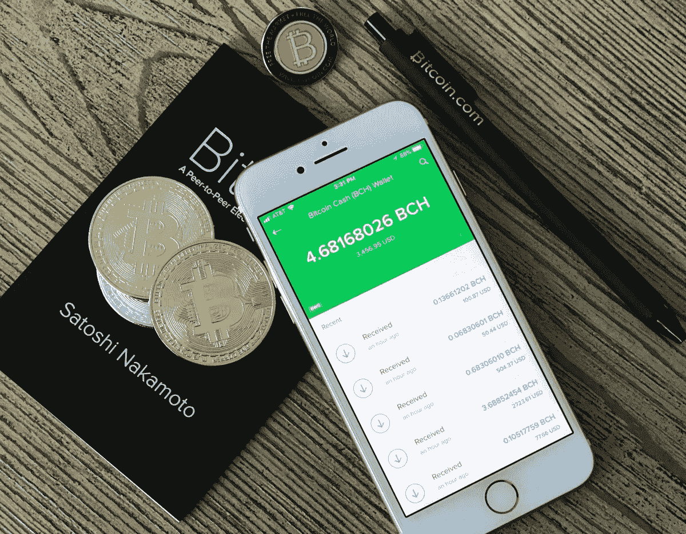

# 区块链可以成为网络的新范式

> 原文：<https://towardsdatascience.com/blockchain-can-be-the-new-paradigm-of-the-net-7c3efb3a0d7a?source=collection_archive---------17----------------------->

## 区块链的普及并不依赖于用户对其操作的理解，而是依赖于解决实际问题的友好有效的应用程序的存在。

Photo: [David Shares](https://unsplash.com/photos/4_41-79dHvE) (edited)

从历史上看，互联网的每一种模式都有其杀手级应用:在网络出现之前，它是电子邮件，最初的网络是谷歌，社交网络是社交网络。

**区块链代表了价值的范式(与之前的信息和网络相比)**，但仍然缺乏一个透明的应用程序来促进其大规模采用。

区块链技术拥有配置网络新范式的所有元素，尽管**它的未来将取决于它变得可扩展和实时响应用户需求的能力。**

**当用户群增长时，注册和验证操作的速度**，以及交易的**安全性**，将是决定其可行性的关键因素。

尽管区块链最初是为了支持加密货币(比特币)而开发的，但其潜力涵盖了超越货币的一系列活动，并投射到法律、政治、创造、安全和管理等领域。

有了区块链，就有可能**通过加密技术**取代信任，使其有能力去中介化，保证和保护所有类型的交易。

加密货币和代币是在全球范围内代表和管理价值的新方式，没有中央权威机构，并保护用户的身份。从这个意义上说，这是一种适合犯罪用途的模式，这在互联网技术发展史上并不新鲜。

当前的挑战，和许多其他技术创新一样，是**保护社会不受其不正当用途的影响，但又不妨碍它们带来的变革潜力**。

*Jose Luis Orihuela 是一名教授、演说家和作家，出生于阿根廷，现居西班牙。他是纳瓦拉大学(潘普洛纳)通信学院的教员。26 个国家的访问学者和演讲者。作家和博客作者关注互联网对媒体、通信和文化的影响。他的最新著作有:《乳齿象手册》(2023 年)、《数字文化》(2021 年)、《互联网时代》(2015 年)、《推特世界》(2011 年)、《未来的 80 克拉维斯》(2011 年)和《博客革命》(2006 年)。从 2002 年开始在 eCuaderno(eCuaderno . com)发布，从 2007 年开始在 Twitter since)发布，从 2022 年开始在 mastosdon(mastosdon . social/@ jlo ri)发布。*