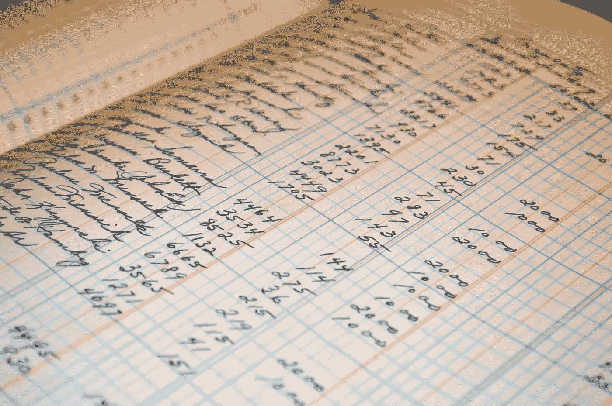

# 用 7 个 Python 函数解释区块链

> 原文：<https://towardsdatascience.com/blockchain-explained-in-7-python-functions-c49c84f34ba5?source=collection_archive---------3----------------------->



我认为对于很多人来说，区块链就是这种现象，很难让你理解。我开始看视频和阅读文章，但对我个人来说，直到我编写了自己的简单区块链，我才真正理解它是什么以及它的潜在应用。

我认为区块链是一个公开的加密数据库。如果你是亚马逊，你想使用这项技术来跟踪你的库存水平，使用区块链有意义吗？可能不会，因为你的客户不想花费他们的资源来验证你的区块链，因为他们在他们的网站上说，“只剩一个了！”，反正。

我会让你考虑未来的应用。所以，事不宜迟，让我们设置我们的 7 个功能！

```
def hash_function(k):
    *"""Hashes our transaction."""* if type(k) is not str:
        k = json.dumps(k, sort_keys=True)

    return hashlib.sha256(k).hexdigest()
```

区块链的核心是哈希函数。没有加密，区块链将很容易被操纵，交易将能够被欺骗性地插入。

```
def update_state(transaction, state):
    state = state.copy()

    for key in transaction:
        if key in state.keys():
            state[key] += transaction[key]
        else:
            state[key] = transaction[key]

    return state
```

“国家”是谁拥有欲望的记录。例如，我有 10 枚硬币，我给了 1 枚给 Medium，那么状态将是下面字典的值。

```
{‘transaction’: {‘Tom’: 9, ‘Medium’: 1}}
```

需要注意的重要一点是，透支是不能存在的。如果只有 10 枚硬币存在，那么我就不能给别人 11 枚硬币。下面的函数验证我们尝试进行的交易确实有效。此外，交易必须平衡。我不能给 5 个硬币，而让接受者收到 4 个硬币，因为这将允许硬币的破坏和创造。

```
def valid_transaction(transaction, state):
    *"""A valid transaction must sum to 0."""* if sum(transaction.values()) is not 0:
        return False

    for key in transaction.keys():
        if key in state.keys():
            account_balance = state[key]
        else:
            account_balance = 0

        if account_balance + transaction[key] < 0:
            return False

    return True
```

现在，我们可以走了。读取来自前一个块的信息，并用于将其链接到新的块。这也是区块链思想的核心。看似有效的事务可以被尝试欺骗性地插入到区块链中，但是解密所有先前的块在计算上(几乎)是不可能的，这保持了区块链的完整性。

```
def make_block(transactions, chain):
    *"""Make a block to go into the chain."""* parent_hash = chain[-1]['hash']
    block_number = chain[-1]['contents']['block_number'] + 1

    block_contents = {
        'block_number': block_number,
        'parent_hash': parent_hash,
        'transaction_count': block_number + 1,
        'transaction': transactions
    }

    return {'hash': hash_function(block_contents), 'contents': block_contents}
```

下面是一个小的帮助函数，用于检查前一个块的哈希:

```
def check_block_hash(block):
    expected_hash = hash_function(block['contents'])

    if block['hash'] is not expected_hash:
        raise

    return
```

一旦我们把所有的东西都组装在一起，就到了创建积木的时候了。我们现在将更新区块链。

```
def check_block_validity(block, parent, state):
    parent_number = parent['contents']['block_number']
    parent_hash = parent['hash']
    block_number = block['contents']['block_number']

    for transaction in block['contents']['transaction']:
        if valid_transaction(transaction, state):
            state = update_state(transaction, state)
        else:
            raise

    check_block_hash(block)  # Check hash integrity

    if block_number is not parent_number + 1:
        raise

    if block['contents']['parent_hash'] is not parent_hash:
        raise

    return state
```

在我们结束之前，必须验证链条:

```
def check_chain(chain):
    *"""Check the chain is valid."""* if type(chain) is str:
        try:
            chain = json.loads(chain)
            assert (type(chain) == list)
        except ValueError:
            # String passed in was not valid JSON
            return False
    elif type(chain) is not list:
        return False

    state = {}

    for transaction in chain[0]['contents']['transaction']:
        state = update_state(transaction, state)

    check_block_hash(chain[0])
    parent = chain[0]

    for block in chain[1:]:
        state = check_block_validity(block, parent, state)
        parent = block

    return state
```

最后，需要一个事务函数，它将上述所有内容联系在一起:

```
def add_transaction_to_chain(transaction, state, chain):
    if valid_transaction(transaction, state):
        state = update_state(transaction, state)
    else:
        raise Exception('Invalid transaction.')

    my_block = make_block(state, chain)
    chain.append(my_block)

    for transaction in chain:
        check_chain(transaction)

    return state, chain
```

现在我们有了 7 个函数。我们如何与之互动？嗯，首先我们需要从一个 *Genesis 模块开始我们的链。*这就是我们新硬币(或股票库存等)的诞生。为了这篇文章的目的，我会说我，汤姆，将从 10 个硬币开始。

```
genesis_block = {
    'hash': hash_function({
        'block_number': 0,
        'parent_hash': None,
        'transaction_count': 1,
        'transaction': [{'Tom': 10}]
    }),
    'contents': {
        'block_number': 0,
        'parent_hash': None,
        'transaction_count': 1,
        'transaction': [{'Tom': 10}]
    },
}

block_chain = [genesis_block]
chain_state = {'Tom': 10}
```

现在，看看当我给 Medium 一些硬币时会发生什么:

```
chain_state, block_chain = add_transaction_to_chain(transaction={'Tom': -1, 'Medium': 1}, state=chain_state, chain=block_chain)
```

状态会更新以显示谁拥有什么:

```
{'Medium': 1, 'Tom': 9}
```

区块链看起来像这样:

```
[{'contents': {'block_number': 0,
               'parent_hash': None,
               'transaction': [{'Tom': 10}],
               'transaction_count': 1},
  'hash': '064d0b480b3b92761f31831d30ae9f01954efaa62371b4b44f11465ec22abe93'},
 {'contents': {'block_number': 1,
               'parent_hash': '064d0b480b3b92761f31831d30ae9f01954efaa62371b4b44f11465ec22abe93',
               'transaction': {'Medium': 1, 'Tom': 9},
               'transaction_count': 2},
  'hash': 'b4ae25f0cc0ee0b0caa66b9a3473e9a108652d53b1dc22a40962fef5c8c0f08c'}]
```

我们的第一个新事务已经被创建并插入到堆栈的顶部。现在，我希望我已经激起了您的好奇心，并对复制代码并使用它感兴趣。在我看来，这是学习新技术的最好方法——深入其中。

玩代码，做你自己的硬币。如果你试着给更多的硬币会发生什么？如果你继续创造新的受款人，州政府会怎么样？

你能想到区块链未来的应用吗？欢迎在评论中问我任何问题，我会尽力帮助你。