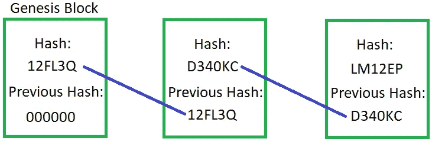
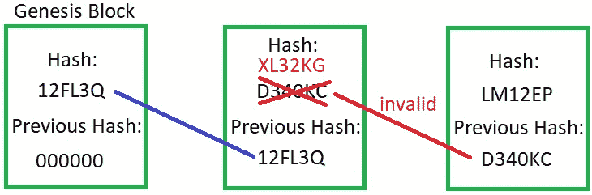
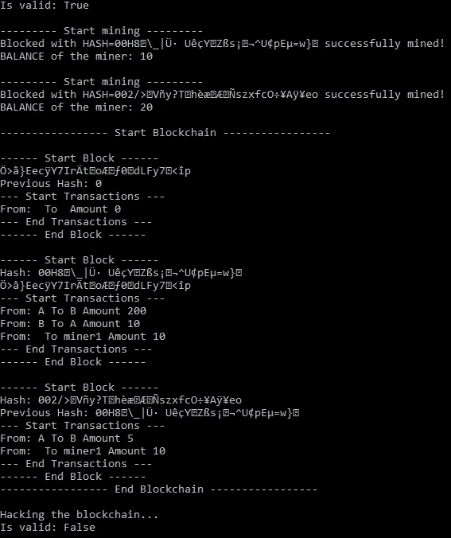

# 用 C#实现解释区块链

> 原文：<https://towardsdatascience.com/blockchain-explained-using-c-implementation-fb60f29b9f07?source=collection_archive---------4----------------------->


Image by <a href=”[https://pixabay.com/users/mmi9-1424200/?utm_source=link-attribution&amp;utm_medium=referral&amp;utm_campaign=image&amp;utm_content=3277335](https://pixabay.com/users/mmi9-1424200/?utm_source=link-attribution&amp;utm_medium=referral&amp;utm_campaign=image&amp;utm_content=3277335)">mmi9</a> from <a href=”[https://pixabay.com/?utm_source=link-attribution&amp;utm_medium=referral&amp;utm_campaign=image&amp;utm_content=3277335](https://pixabay.com/?utm_source=link-attribution&amp;utm_medium=referral&amp;utm_campaign=image&amp;utm_content=3277335)">Pixabay</a>

# 总结:

正如我所承诺的，下一个主题是**区块链**。在这篇文章中，我想解释一下**的主要思想**，我将给**一个简单的区块链**的 C#实现。这篇文章将有后续，在这篇文章中，我将解释如何使用**比特币。Net** 和我将给出**解决现实世界问题的代码示例**。

# “区块链是未来！”

我不这么认为！当人们在讨论区块链时，他们总是抛出诸如**信任和透明、成本效益、牢不可破、可用性、简化业务和去中心化**之类的词汇和短语。当你想推销某样东西时，这些是可以使用的时髦词，每个人都想要信任、廉价服务、安全等等。但这些只是流行语，不要中了美丽谎言的圈套。我不想争辩说区块链非常有用，是一个聪明的“东西”，但是你不能把它用在所有事情上。

区块链有**优势**也有**劣势**，但如果你阅读文章或观看科技新闻，你肯定会听说它的优势，因为有人可以赢得很多钱，因为比特币和其他加密货币都是基于区块链的。

在接下来的段落中，我将展示区块链的一些缺点，但首先让我们看看什么是区块链，它是如何工作的。

# 区块链解释

好了，了解区块链的第一步就是要明白**区块链并不等同于比特币**或者其他任何加密货币。区块链获得普及，是因为比特币，你可以把这两样东西**想成是生金，是区块链，硬币(或者珠宝)是比特币**。

基本上**区块链是一种数据结构**，就像你在学校或工作中所学的数组、列表、树或其他数据结构一样。这个数据结构的酷之处在于两个事实。

第一个事实是**任何块中的更改都会使其后的每个块失效**，这意味着(在加密货币的情况下)你不能篡改历史交易。

第二件很酷的事情是，只有当你和其他人在同一个链条上工作时，你才会得到奖励，所以每个参与者都有动力去达成共识。

遵守规则在数学上是强制的——没有政府或警察需要进来告诉你你记录的交易是假的。是的，这是一个非常强大的想法，但没有什么是完美的，你会在下一章看到！

# 作为数据结构的区块链

假设我们想要实现自己的区块链(只是出于教育目的)。第一步是定义块的含义。用 OOP 来说，**块就是一个对象，它有多个属性**。这个对象的基本属性是**数据**(可以是任何东西，但是对于加密货币来说，数据是交易和历史的时间戳)、块的**散列(我们将看到如何计算这个散列)和前一个块**的**散列。在我们的实现中，我们将添加另一个有趣的属性，在文献中称为 **nonce** ，它用于挖掘新块(我们将看到如何实现)。**

如你所见，这是一个线性数据结构，就像一个链表，有两个重要的属性**，hash 和 previous hash** 。您可以将块的散列想象成一个指纹，它唯一地标识了块的内容。如果你改变了块中的某些东西，将会导致散列值的改变(改变检测)。前面的散列创建了一个块链，使区块链变得安全。如果你改变一个块，这个块的 hash 也会改变，所以下一个块会有无效的前一个 hash。所以改变一个块会让后面的所有块无效。第一个块是一个特殊的块，因为它不能有有效的前一个散列(没有前一个块)。这个块被称为 **Genesis 块**，之前的 hash 被设置为一个或多个 0 的字符串。

举个例子吧！如果我们有下面的链



我们在第二个块中修改了一些东西，哈希也会改变，如下图所示。



这种轻微修改的效果是，后面的块将具有无效的先前散列，因此所有后面的块都将无效。但这不足以防止篡改。你可以说，在改变块之后，我们将重新计算后面块的所有散列。是的，这将是一个解决方案，这就是为什么区块链的创造者发明了一些规则，使得重新计算有效的哈希值变得困难和耗时。

为了使哈希计算成为一项艰苦的工作，区块链的发明者引入了所谓的**工作证明**。基本上，工作证明只是一个发明的约束，使计算更加困难。这个约束表明**每个块的散列必须以 X 个零开始**。这使得计算非常困难，因为你**没有比暴力破解更好的解决方案，猜猜看**。所以你必须检查所有的可能性来找到一个有 X 个前导零的散列。这是另一个例子，当我们使用非常困难的计算来保护某物时。这就是为什么当第一台真正的量子计算机出现时，区块链将没有任何价值(量子计算机将有能力比经典计算机更快地重新计算所有散列，见我另一篇关于量子计算的文章)

区块链保护自己的另一种方式是被分配。它使用一个 P2P 网络，每个人都可以加入。当你加入这个网络时，你会收到一份完整的区块链副本(目前比特币的区块链大约有 200GB)。当有人创建一个新的块时，它将被发送给所有的对等体。**每个对等体将验证块** **没有被篡改**，如果没有，那么它将被添加到链中，否则它将被拒绝。这样，为了向链中添加块，51%的对等体必须同意该块未被篡改。

所以为了“黑掉”这个链，你不仅要**重新计算所有的散列**，还要**欺骗超过 50%的同行**。这(目前)是不可能的。这就是区块链如此安全的原因，它不是由政府或其他党派来保障的，而是由困难的数学问题来保障的，这很好，但并不总是如此。

区块链在不断发展。最重要的发展之一是智能合约。简而言之，这些合同是存储在区块链上的简单程序，可以用来自动交换加密货币。

# 用 C#实现的简单区块链

然而，不建议实现你自己的区块链，而是使用现有的，在这一节我将实现一个简单的区块链**只是为了教育的目的**。在下一篇文章中，我将向您展示如何在中使用现有的比特币区块链。Net(使用 NBitcoin)。

第一步是定义块的结构。**模块**的代码如下:

```
public class Block
{
    private readonly DateTime _timeStamp; private long _nonce; public string PreviousHash { get; set; }
    public List<Transactions> { get; set; }

    public string Hash { get; private set; }

    public Block(DateTime timeStamp, List<Transactions> transactions, string previousHash = "")
    {
        _timeStamp = timeStamp;
        _nonce = 0; Transactions = transactions;
        PreviousHash = previousHash;
        Hash = CreateHash();
    } public void MineBlock(int proofOfWorkDifficulty)
    {
        string hashValidationTemplate = new String('0', proofOfWorkDifficulty);

        while (Hash.Substring(0, proofOfWorkDifficulty) != hashValidationTemplate)
        {
            _nonce++;
            Hash = CreateHash();
        } Console.WriteLine("Blocked with HASH={0} successfully mined!", Hash);
    } public string CreateHash()
    {
        using (SHA256 sha256 = SHA256.Create())
        {
            string rawData = PreviousHash + _timeStamp + Transactions + _nonce; byte[] bytes = sha256.ComputeHash(Encoding.UTF8.GetBytes(rawData));
            return Encoding.Default.GetString(bytes);
        } 
    }
}
```

在我的实现中，我使用了以下属性:

1.  _timestamp:块创建的时间(有历史记录)
2.  PreviousHash:包含链中前一个块的哈希
3.  哈希:基于块的所有属性计算的块的哈希(更改检测)
4.  事务:这是存储在块中的数据；这里我使用了一个交易列表，只是为了有一个类似于加密货币的例子
5.  **_nonce** :为了挖掘一个块，我们有一个关于散列的规则(工作证明)，**一个有效块的散列必须以 x 个零开始**。这个只能靠蛮力计算，所以尝试所有的可能性。为了拥有不同的散列，我们必须修改散列函数的输入数据。显然**我们不能修改事务列表、之前的散列或时间戳**，所以我们必须添加一个人工属性，它可以在每一步中被修改。为了简单起见，我添加了一个长值，它将在每一步中递增。这个值将被添加到散列函数的输入数据中，这样我们将在每一步中得到不同的散列。

在该类的**构造函数**中，我们初始化所有属性，并使用 CreateHash 方法根据块的所有属性计算块的散列。这样，如果块内有任何变化，它将有一个不同的散列，因此可以很容易地检测到变化。

在 **CreateHash** 方法中，我们使用 SHA256 根据块的所有属性创建一个散列。

矿工将使用 **MineBlock** 方法创建新的有效区块。输入参数定义了计算新散列的难度。此参数定义了哈希的开头必须有多少个零。这是指数增长的，所以你要谨慎选择这个数字。如果你选择一个非常大的数字，计算一个散列值需要几周、几个月或几年的时间。对于我们的例子，我们将使用 proofOfWorkDifficulty = 2。在这个方法中，我们有一个简单的 while，它将一直运行，直到我们找到一个散列，它的前导零的数量等于 proofOfWorkDifficulty。在每一步中，我们增加 _nonce 的值并重新计算散列。

**重要:****事务列表必须是私有变量**，我将它用作公共变量，只是因为我想访问它，以修改事务，**这种方式演示了变化检测和链有效性/无效性**。

**事务**类看起来是这样的:

```
public class Transaction
{
    public string From { get; }
    public string To { get; }
    public double Amount { get; } public Transaction(string from, string to, double amount)
    {
        From = from;
        To = to;
        Amount = amount;
    }
}
```

从属性的**标识钱的**发送方**,**到**属性标识钱的**接收方**,**金额**代表发送的**金额**。**

最后一个类是区块链的**类，参见下面的代码。**

```
public class BlockChain
{
    private readonly int _proofOfWorkDifficulty;
    private readonly double _miningReward; private List<Transaction> _pendingTransactions; public List<Block> Chain { get; set; } public BlockChain(int proofOfWorkDifficulty, int miningReward)
    {
        _proofOfWorkDifficulty = proofOfWorkDifficulty;
        _miningReward = miningReward;
        _pendingTransactions = new List<Transaction>();
        Chain = new List<Block> {CreateGenesisBlock()};
    } public void CreateTransaction(Transaction transaction)
    {
        _pendingTransactions.Add(transaction);
    } public void MineBlock(string minerAddress)
    {
        Transaction minerRewardTransaction = new Transaction(null, minerAddress, _miningReward);
        _pendingTransactions.Add(minerRewardTransaction); Block block = new Block(DateTime.Now, _pendingTransactions);
        block.MineBlock(_proofOfWorkDifficulty); block.PreviousHash = Chain.Last().Hash;
        Chain.Add(block); _pendingTransactions = new List();
    } public bool IsValidChain()
    {
        for (int i = 1; i < Chain.Count; i++)
        {
            Block previousBlock = Chain[i - 1];
            Block currentBlock = Chain[i]; if (currentBlock.Hash != currentBlock.CreateHash())
                return false; if (currentBlock.PreviousHash != previousBlock.Hash)
                return false;
        } return true;
    } public double GetBalance(string address)
    {
        double balance = 0; foreach (Block block in Chain)
        {
            foreach (Transaction transaction in block.Transactions)
            {
                if (transaction.From == address)
                {
                    balance -= transaction.Amount;
                } if (transaction.To == address)
                {
                    balance += transaction.Amount;
                }
            }
        } return balance;
    } private Block CreateGenesisBlock()
    {
        List transactions = new List<Transaction> {new Transaction("", "", 0)};
        return new Block(DateTime.Now, transactions, "0");
    }
}
```

在这个类中，我们将有一个代表区块链(链属性)的块列表。

因为事务必须由挖掘器处理(通过挖掘新的有效块)，所以我们将有一个未决事务的列表(_pendingTransactions 属性)。挖掘器将未决事务添加到新块中，这样从未决事务过渡到已处理事务。

这里我们还将**定义开采新区块的难度**(_ proofOfWorkDifficulty property)和**奖励**，该奖励**将获得创建新区块的矿工**。这是一个固定的奖励，但实际上还有一个由发送者定义的奖励。通过这种方式，发送者将说服矿工优先将他/她的交易包括在挖掘过程中。选择合适的奖励也是一件棘手的事情。如果您选择了过低的奖励，您的交易将在稍后添加。另一方面，如果你选择了过高的奖励，你的交易还是会被追加到后面，因为矿工会认为你的交易非常耗时。他们将尝试完成所有当前的处理，所以在完成所有当前的事务之前，他们不会切换到您的事务上。但是选择合适的奖励是另一个话题。

在构造函数中，我们初始化所有的属性，并使用 CreateGenesisBlock 方法创建 Genesis 块。这将创建一个块，其中以前的哈希设置为零，事务列表为空。

我们定义了**矿块**方法，矿工可以用它来开采新的矿块。在这个方法中，我们首先添加一个新的事务，对挖掘者的奖励，然后我们调用这个块的挖掘方法，为这个块计算一个有效的散列。当我们已经有一个有效的块时，我们将它的前一个散列设置为最后一个块的散列，这样就创建了一个有效的链。最后，我们清除挂起的事务，因为那些事务已经被添加到一个块中，所以那些事务成功完成。

**注意:**这不是一个分布式实现，所以当块的处理完成时，我们立即将它添加到链中，而不需要进一步检查。实际上，在分布式系统中，有许多矿工，所以多个矿工将在一个块上工作。在更新我们的链之前，我们应该进行另一次有效性检查。规则是**总是接受最长的链**，所以如果多个矿工向我们提供可能的链，我们将接受最长的，奖励将发送给赢得这场游戏的矿工。

下一个方法是 **IsValidChain** ，用来检查链的有效性，确保链没有被黑客攻击，没有被篡改。这是一个非常简单的检查，对于每个块，我们重新计算它的哈希，**如果当前计算的哈希与创建**时添加到块中的哈希不同，那么很明显**块中的数据被修改了**。另一个检查是将**当前块的先前散列属性与先前块的散列属性**进行比较。如果有**差异**，那么很明显**链条被篡改**。否则，我们的链是有效的，我们可以肯定它没有被黑客攻击。

最后一个方法是 **GetBalance** 方法，用于计算区块链用户的余额。用户可以通过他/她的地址来识别。为了计算当前余额，我们将遍历所有块和所有事务。如果**发送方**是我们正在计算余额的用户，那么我们将**从余额**中减去该金额，否则如果用户是**接收方**，那么我们**将该金额加到余额**中。

**注意:**您可以将各种业务逻辑添加到区块链中，例如，在发送之前，您可以检查发送者是否有足够的资金，如果发送者没有足够的资金，您可以拒绝交易，或者您可以定义任何符合您当前业务的逻辑。

最后一步是实际测试我们的代码。下一段代码包含用于创建区块链、创建事务、检查区块链的有效性、尝试破解区块链并打印区块链的内容以验证其结构是否正确的主程序

```
class Program
{
    static void Main()
    {
        const string minerAddress = "miner1";
        const string user1Address = "A";
        const string user2Address = "B"; BlockChain blockChain = new BlockChain(proofOfWorkDifficulty: 2, miningReward: 10);
        blockChain.CreateTransaction(new Transaction(user1Address, user2Address, 200));
        blockChain.CreateTransaction(new Transaction(user2Address, user1Address, 10)); Console.WriteLine("Is valid: {0}", blockChain.IsValidChain()); Console.WriteLine();
        Console.WriteLine("--------- Start mining ---------");
        blockChain.MineBlock(minerAddress); Console.WriteLine("BALANCE of the miner: {0}", blockChain.GetBalance(minerAddress)); blockChain.CreateTransaction(new Transaction(user1Address, user2Address, 5)); Console.WriteLine();
        Console.WriteLine("--------- Start mining ---------");
        blockChain.MineBlock(minerAddress); Console.WriteLine("BALANCE of the miner: {0}", blockChain.GetBalance(minerAddress)); Console.WriteLine();
        PrintChain(blockChain); Console.WriteLine();
        Console.WriteLine("Hacking the blockchain...");
        blockChain.Chain[1].Transactions = new List<Transaction> { new Transaction(user1Address, minerAddress, 150)};
        Console.WriteLine("Is valid: {0}", blockChain.IsValidChain()); Console.ReadKey();
    } private static void PrintChain(BlockChain blockChain)
    {
        Console.WriteLine("----------------- Start Blockchain -----------------");
        foreach (Block block in blockChain.Chain)
        {
            Console.WriteLine();
            Console.WriteLine("------ Start Block ------");
            Console.WriteLine("Hash: {0}", block.Hash);
            Console.WriteLine("Previous Hash: {0}", block.PreviousHash); Console.WriteLine("--- Start Transactions ---");
            foreach (Transaction transaction in block.Transactions)
            {
                Console.WriteLine("From: {0} To {1} Amount {2}", transaction.From, transaction.To, transaction.Amount);
            }
            Console.WriteLine("--- End Transactions ---"); Console.WriteLine("------ End Block ------");
        }
        Console.WriteLine("----------------- End Blockchain -----------------");
    }
}
```

正如您在这段代码中看到的，我创建了一个区块链，然后创建了两个事务。为了完成交易，我开始开采一个区块，之后我打印出矿工的余额，只是为了看看矿工是否收到了奖励。之后，我添加了另一个事务，并挖掘了另一个块。在那之后，我打印出了链的结构，在最后几行，我修改了区块链的一个块，我检查了链的有效性。

运行该程序后，我们得到以下结果:



从图中我们可以看到，每开采一个区块后，**矿工都得到了奖励，所以奖励制度是正确的**。我已经打印出了区块链的结构，如你所见，**这些块是正确的，它们包含了所有的交易，与它们在代码**中被添加的顺序相同。这些块还包含用于向矿工发送奖励的交易。如果我们检查先前的哈希和块的哈希，**我们可以看到我们有一个有效的链，每个哈希以两个零开始，正如我们在 proofOfWorkDifficulty 字段**和**中定义的那样，每个块的先前哈希包含先前块的哈希**。所以块**有效**。(有效性检查的结果在第一行)。

在下一步中，我已经**尝试黑掉链**，但是如你所见，在修改块的内容后，**有效性检查失败，所以我们成功地检测到篡改我们的区块链**的企图。

# 有利有弊

每个人都在谈论区块链的优势，但如果这些优势实际上是劣势呢？那么区块链的主要问题是什么呢？

**信任和透明**

对于几乎任何人们想要有效的东西，区块链都被作为一种解决方案提出来了。篡改存储在区块链上的数据确实很难，但区块链是创建具有完整性的数据的好方法这一说法是错误的。好的，让我们用例子来解释。当你想从网上商店买东西时，你只是希望卖家真的会把产品寄给你。在传统系统中，你相信 Visa 或亚马逊或任何你使用的东西，卖家会把你买的产品发给你。所以你信任第三方来执行交易并实际接收购买的产品。在区块链没有第三方，所以你真的会相信人性的善良，卖家不会对你撒谎，他/她会把买的东西送过来。我认为这不是一个非常值得信任的系统，我不信任人，主要是当我们谈论陌生人、生意和金钱的时候。

另一个很好的例子:

“把你的投票记录保存在一个不为任何人所有的防篡改存储库中”*听起来*没错——然而你的阿富汗村民会从一个广播节点下载区块链并从他的 Linux 命令行解密 Merkle root 来独立地验证他的投票已经被计算在内吗？或者他会依赖一个可信任的第三方的移动应用——比如非营利或开源联盟[管理选举](https://qz.com/1234268/sierra-leone-blockchain-election-election-commission-denies-use-of-blockchain/)或提供软件？(见本文:[蹩脚的区块链](https://medium.com/@kaistinchcombe/decentralized-and-trustless-crypto-paradise-is-actually-a-medieval-hellhole-c1ca122efdec))

**牢不可破**

是的，但这只是一个理想的情况(就像共产主义一样，这个想法是伟大的，每个人都应该平等，但每个人都是不同的，所以我们怎么能平等呢？但这是另一个要讨论的话题，我会有另一个帖子类别，在其中我会谈论**哲学**)，但在现实中，有很多因素可以使区块链变得脆弱。想想看，在区块链世界，个人不是依靠**信任或监管**，而是**有意为自己的安全防范措施负责**。并且**如果他们使用的软件是恶意的或者有缺陷的**，那么就会有**漏洞来攻击**那个特定的个人。举个愚蠢的例子，一个简单的用户，没有编程知识，会把他虚拟钱包的**私钥**存储在他的电脑上。**单点故障**，黑客会黑他/她的电脑，偷走密钥。实际上黑客并没有黑掉区块链，他/她只是用偷来的私钥创建了一些有效的交易。在这种情况下，谁将帮助您回滚事务？不要忘记你不能改变区块链的历史！在传统的系统中，银行为他们的客户提供安全保障，如果安全被破坏，他们会把偷来的钱还给你。每家银行都有保险，所以你不会失去你一生努力的所有钱。所以你怎么想，你会相信你自己的技能有完美的安全和使用区块链还是你会相信银行和保险公司或其他安全专家？

我不认为这个想法很棒，是的，这是一个很好的非常有用的概念，我喜欢**内置的变化检测**，它是**很容易检测到黑客攻击** **链的历史**，它是**分布式的**，这非常有用，**安全**，**在区块链没有单点故障**，**增加了可用性**并且它基于**共识没有中间人(这有时会非常痛苦和危险，你会因为一个罪犯利用区块链进行交易而信任他吗？).但是正如你所看到的，太多的自由，太多的控制对于不知情或没有准备的用户来说是非常危险的！**

[](https://ko-fi.com/zozoczako)

我真的很喜欢咖啡，因为它给了我写更多文章的能量。

如果你喜欢这篇文章，那么你可以请我喝杯咖啡来表达你的欣赏和支持！

**成为媒介上的作家:**https://czakozoltan08.medium.com/membership

# 参考

1.  [蹩脚的区块链](https://medium.com/@kaistinchcombe/decentralized-and-trustless-crypto-paradise-is-actually-a-medieval-hellhole-c1ca122efdec)
2.  [比特币实际上是如何运作的](https://www.youtube.com/watch?v=bBC-nXj3Ng4)
3.  [创建一个区块链](https://www.youtube.com/watch?v=zVqczFZr124&list=PLzvRQMJ9HDiTqZmbtFisdXFxul5k0F-Q4)
4.  [区块链讲解](https://www.bitdegree.org/tutorials/blockchain-explained/)

**订阅我的博客**，因为在下一篇文章中我会谈到如何**在中使用比特币。Net** (使用 NBitcoin)之后我将开始一个**系列文章，使用**非常直观和容易理解的例子**解释所有流行的人工智能算法**。将来我会讨论像**软件设计**、**设计模式**、**并行计算**、**云**这样的话题，我还会有一个**哲学**的类别，讨论关于世界的**有趣想法，关于宇宙**和关于人性**的**。