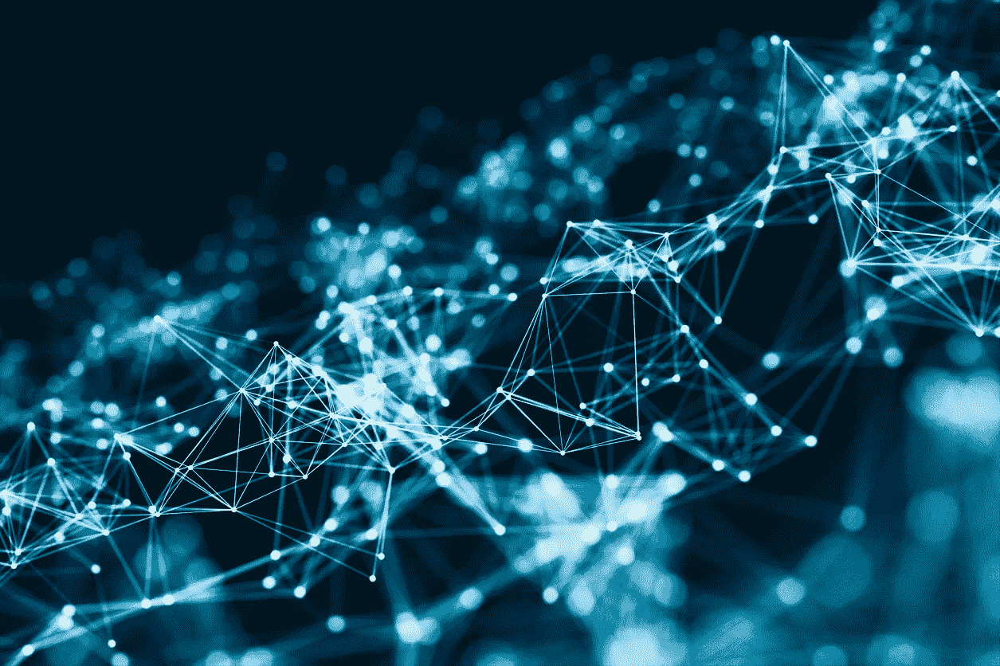

# 区块链对大数据的影响

> 原文：<https://towardsdatascience.com/blockchain-impact-on-big-data-39b38da7f4a5?source=collection_archive---------10----------------------->

区块链被认为是自互联网以来最大的技术突破，有着无尽的使用案例，它成为科技界的热门话题是很自然的。在众多区块链应用中，大数据是一个特别有趣的应用。

为了简洁起见，区块链革命的作者 Don & Alex Tapscott 将区块链定义为“经济交易的廉洁数字账本，可以通过编程不仅记录金融交易，而且记录几乎所有有价值的东西。”

[Oracle](https://www.oracle.com/index.html) 将大数据定义为更复杂的数据集，尤其是来自新数据源的数据集。这些数据集非常庞大，传统的数据处理软件根本无法管理它们。大数据是更大、更复杂的数据集，尤其是来自新数据源的数据集。这些数据集非常庞大，传统的数据处理软件根本无法管理它们。

**区块链与大数据的结合**

“[可以说是信息技术领域最重大的发展](http://bigdata-madesimple.com/why-blockchain-what-can-it-do-for-big-data-2/)在过去几年中，区块链有潜力改变世界对待大数据的方式，增强的安全性和数据质量只是使用中本聪里程碑式技术的企业所能获得的两大好处。”

尽管大数据面临诸多挑战，但区块链的潜在用途提供了以下优势。

**验证数据**

通过区块链生成的数据需要较少的审查，因为操纵这种数据的可能性极低。区块链结合了哈希和加密技术来创建存储在一系列区块中的数据，这些数据几乎是不可变的，因为操纵区块的原始状态需要巨大的[计算能力](https://medium.com/cybertrustbank/the-cost-of-hacking-the-bitcoin-network-8172f41d1620)。

一个在组织层面进行数据验证的好的[用例](https://bitrazzi.com/lenovo-use-blockchain-technology-validation-documents/)是，联想使用区块链来验证文档。[根据联想](https://www.coindesk.com/lenovo-seeks-blockchain-patent-document-validation-system/)的说法，数字签名被编码在物理文档中，可以被计算机和其他机器处理，以验证文档的合法性。

该流程可作为有效的文件、资产登记等欺诈检测系统。

**数据安全和隐私**

世界上最大的组织是数据公司，使数据成为世界上交易量最大的商品。集中存储的数据不安全，有几份[报告称](https://www.vircom.com/blog/biggest-cyber-attacks-of-2017/)数据遭到黑客攻击，集中存储的数据受到黑客和其他恶意实体的控制，这一点很明显。

好消息是，区块链打算将权力交还给用户，随着区块链的应用，大数据存在无限的机会。理想的世界是数据可以由生成数据的个人来管理。用户能够管理他们的数据的可能性提供了一个很好的回报，导致用户更有动力提炼和控制他们生成的数据。

通过区块链产生的大数据将在常规大数据之上蓬勃发展，最终将成为产生数据的新方式。

**大数据组织采用区块链**

由于区块链技术的影响，已经有更多的大型组织采用了这种技术，其中一些[组织](https://www.techrepublic.com/article/5-companies-using-blockchain-to-drive-their-supply-chain/)正在寻找有趣的方法让区块链为他们工作。

其他一些有趣的区块链解决方案有， [BigchainDB](https://www.bigchaindb.com/) ， [blockcrypto](https://blockcrypto.io/) ， [fluree](https://flur.ee/) ， [blockstack.io](https://blockstack.org/) ，[区块链铸造](https://www.blockchainfoundry.co/)，[占卜](https://www.augur.net/)。

**机遇**

数据生成报告预计，到 2025 年，每年将产生约 180 吉字节的数据(一吉字节等于一万亿吉字节)，而 2013 年仅为 4.4 吉字节。

一份 VentureBeat 的报告引用道:“如果说区块链有一个‘甜蜜点’，那很可能就是将见解和问题转化为资产的能力。”

通过使用旨在过滤和提炼数据的专用应用程序，大数据可以很容易地成为可交易资产。这个机会将催生更多的数据挖掘公司。

我们还会看到更多需要分析洞察力的加密货币活动。

**结论**

拥有大数据的区块链将成为大型和小型企业的强大工具。不断增长的数据和最近的数据黑客攻击强烈表明，区块链是一项非常重要的技术，它补充了大数据，并将重新定义我们处理数据的方式。如果生命就是时间，时间就是金钱，那么数据就是新的生命。