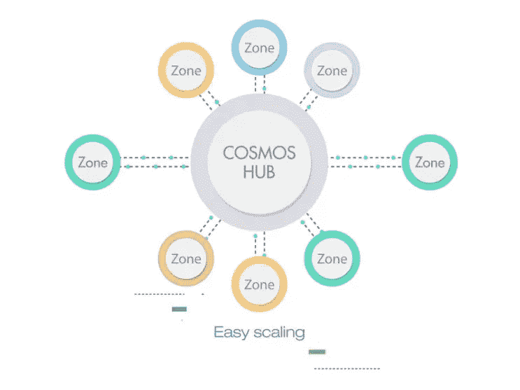
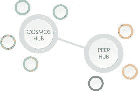
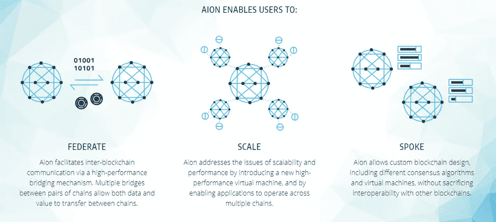
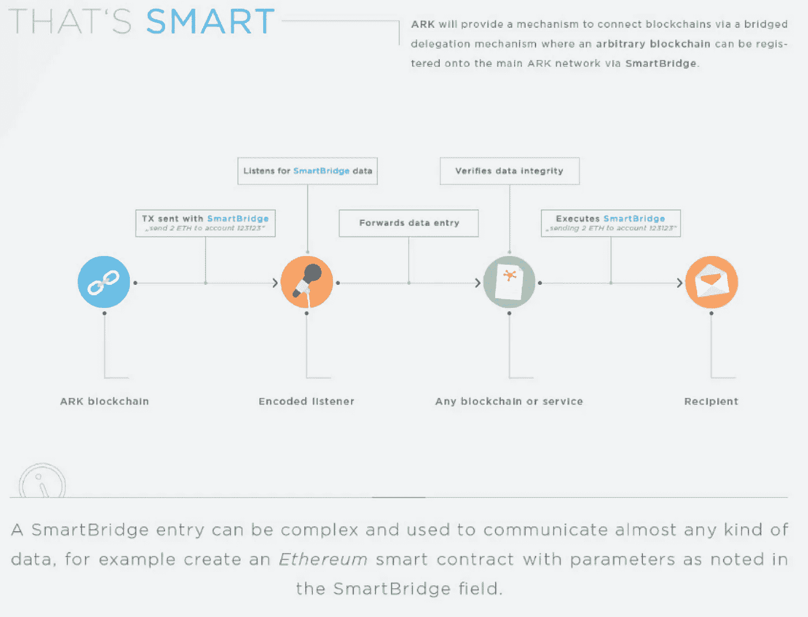

# 区块链互通

> 原文：<https://towardsdatascience.com/blockchain-interoperability-33a1a55fe718?source=collection_archive---------7----------------------->

由于区块链科技经常寻求移除中介，具有讽刺意味的是，用户无法在区块链之间轻松转移价值，通常必须使用中介。举个例子，有人持有比特币，希望在以太坊环境中进行交易。用户必须完成至少三个步骤:在加密货币交易所注册，将 BTC 兑换为以太网，并在以太坊环境中注册以使用其功能(例如，购买天然气或签订智能合同)。

这是因为大多数大型公共区块链都是作为独立环境运行的，彼此之间互不相连。

然而，提高区块链之间的互操作性正成为一个重要的区块链趋势，将有助于区块链技术发挥其全部潜力。

**什么是互操作性？**

互操作性是跨区块链系统轻松共享信息和进行交易的能力。在一个完全可互操作的环境中，如果一个来自另一个区块链的用户在你的区块链上给你发送了一些东西，你将能够毫不费力地阅读、理解、互动或回复它。

互操作性有三个级别:

1.  **基础级:**允许系统间的数据交换，无需系统解释数据。
2.  **结构层:**允许系统之间以定义的结构或格式进行数据交换，数据在其中统一移动。这个级别允许解释信息，但不允许与信息交互或使用信息。
3.  **语义层:**允许系统之间以允许数据被解释和使用的方式进行数据交换。

**侧链**

侧链是一种区块链机制，允许使用双向栓将单独的链连接到主区块链。这使得主区块链和侧链之间能够交换数字资产。

Sidechains 最初是为了帮助用户在将应用部署到主区块链之前，在更小、更易管理的环境中测试他们的应用而开发的。侧链功能是迈向互操作性的一步。

**宇宙**

Tendermint 团队的宇宙网络项目允许多个区块链相互交流。它由“拜占庭容错 Tendermint 协议”提供支持。宇宙网络上的独立区块链被称为“区域”。由于区域通过中央 Cosmos Hub 相互连接，一个区域中的用户可以与任何其他区域进行交互。

宇宙使用利害关系的证据。它的原生令牌被称为“原子”，它对验证器的奖励被称为“光子”。

比特币和以太坊等单个区块链目前没有被纳入宇宙网络的区域。将它们添加为区域可以实现它们之间的互操作性。

**永恒之塔**

Nuco 的 Aion 网络允许多个区块链存在，并在彼此之间移动价值和逻辑，消除了对中介的需要。永恒之塔将向私营和公共部门组织开放。Aion 网络还将允许用户定制自己的私人或公共区块链，并选择发布、治理、参与和共识机制。

**方舟**

ARK 是区块链的一个生态系统，通过“智能桥”连接起来，实现互操作性。企业可以在方舟网络中创建自己的区块链。SmartBridge 充当不同区块链之间的中介，方便通过网络传输数据、功能和硬币。ARK 用户可以使用网络以多种货币和代币进行交易，包括 ARK 的本地货币。

ARK 使用授权的股权证明。这个共识机制不涉及挖矿。相反，用户投票选择一小组验证者来伪造程序块并维护系统的完整性。方舟网络中的每个令牌持有者在决策过程中都有相应的发言权。ARK 目前支持 Python、Ruby、Java、Elixir 和其他语言。

截至本文撰写之时，在 ARK 网络上创建一个新的 block 需要 8 秒钟，速度快得令人难以置信。(作为参考，在比特币区块链上创建一个新区块需要 10 分钟。)

ARK 还提供按钮区块链部署，允许用户以最小的努力创建和运行区块链。新创建的区块链将使用智能桥连接到方舟生态系统，并具有与主区块链相同的功能。因此，对于希望部署自己的可互操作区块链的人来说，该平台是一个用户友好的选择。

**结论**

一旦实现了主要公共区块链之间的互操作性，一个主要公共区块链上的用户将能够很容易地在其他主要公共区块链上进行交易。这将释放多样化的功能，包括支付、智能合约和数据存储。每个区块链的安全协议、采矿机制和经济将如何与其他区块链互动和融合还有待观察。一个真正可互操作的区块链基础设施可能成为互联网的新支柱。

—

[沙安雷](http://www.shaanray.com/)

关注媒体上的 Lansaar Research ，了解最新的新兴技术和新的商业模式。