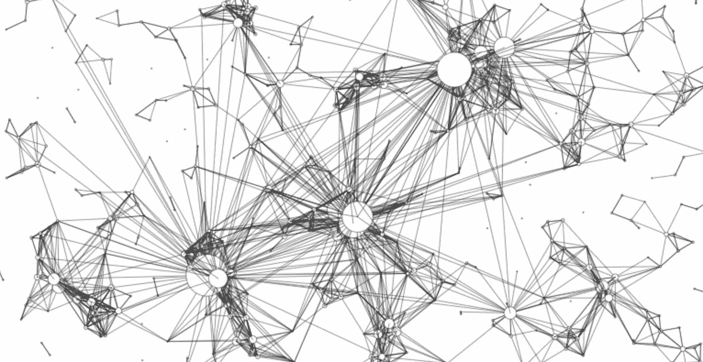
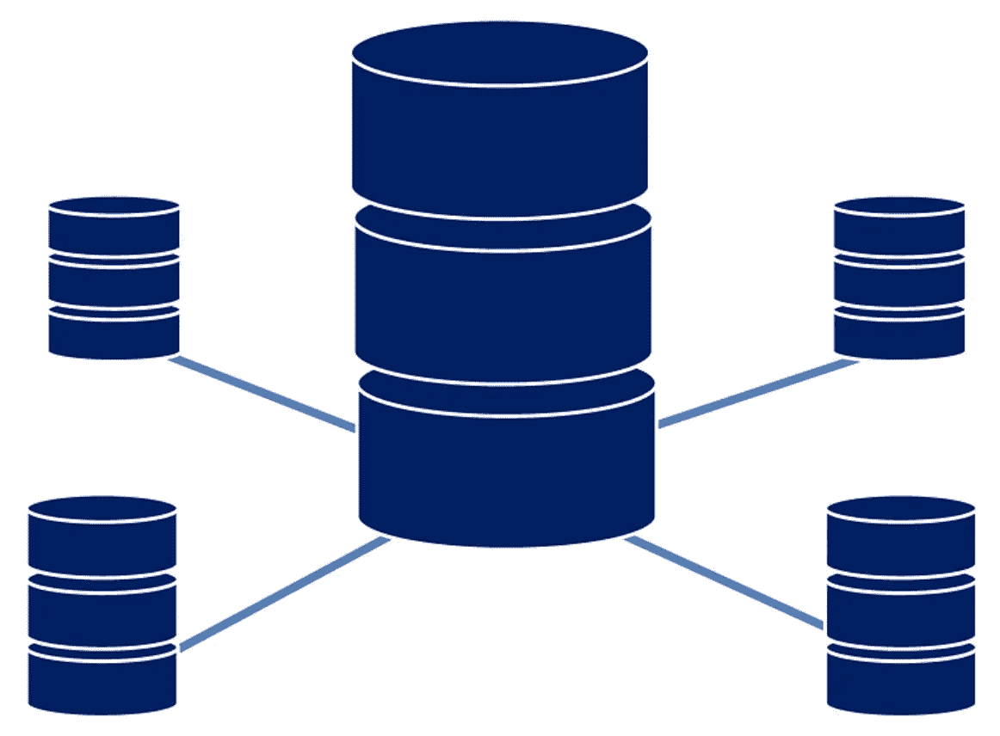
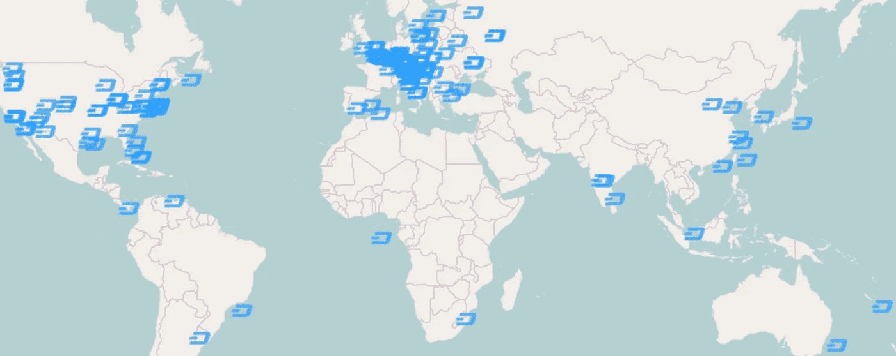
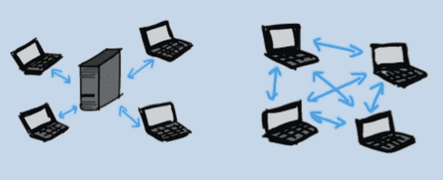

# 区块链与传统数据库

> 原文：<https://towardsdatascience.com/blockchains-versus-traditional-databases-e496d8584dc?source=collection_archive---------2----------------------->

为了理解区块链和传统数据库之间的区别，有必要考虑一下它们是如何设计和维护的。

Distributed nodes on a blockchain.

**传统数据库**

传统数据库使用客户机-服务器网络体系结构。在这里，用户(称为客户端)可以修改存储在中央服务器上的数据。对数据库的控制仍然由指定的机构负责，该机构在提供对数据库的访问之前验证客户端的凭证。由于该机构负责数据库的管理，如果该机构的安全性受到损害，数据可能被更改，甚至被删除。

Traditional Databases.

**区块链数据库**

区块链数据库由几个分散的节点组成。每个节点都参与管理:所有节点都验证区块链的新增内容，并能够向数据库输入新数据。对于要添加到区块链的节点，大多数节点必须达成共识。这种共识机制保证了网络的安全性，使其难以被篡改。

在比特币中，共识是通过挖掘(解决复杂的哈希难题)达成的，而以太坊则寻求使用利害关系证明作为其共识机制。要了解更多关于这两种共识机制的区别，请阅读[**我之前的帖子**。](https://hackernoon.com/what-is-proof-of-stake-8e0433018256)

**诚信和透明**

区块链技术区别于传统数据库技术的一个关键属性是公共可验证性，这是由完整性和透明性实现的。

*   完整性:每个用户都可以确保他们正在检索的数据从被记录的那一刻起就没有被破坏和更改过
*   透明度:每个用户都可以验证区块链是如何随着时间的推移而附加的

A map of Dashcoin masternodes distributed across the world.

**CRUD vs Read &写操作**

在传统数据库中，客户端可以对数据执行四种功能:创建、读取、更新和删除(统称为 CRUD 命令)。

区块链被设计成一个只追加的结构。用户只能以附加块的形式添加更多数据。所有以前的数据被永久保存，不能更改。因此，与区块链相关的操作只有:

*   读取操作:这些操作从区块链中查询和检索数据
*   写操作:这些操作会向区块链添加更多数据

**验证和写入**

区块链允许两个功能:事务的验证和新事务的写入。事务是改变区块链上数据状态的操作。虽然区块链中过去的条目必须始终保持不变，但新条目可以改变过去条目中的数据状态。例如，如果区块链记录了我的比特币钱包里有 100 万 BTC，那么这个数字就会永久保存在区块链里。当我花了 200，000 BTC 时，那笔交易记录在区块链上，使我的余额达到 800，000 BTC。然而，由于区块链只能被追加，我的交易前余额 100 万 BTC 也永久保留在区块链上，供那些愿意看的人使用。这就是为什么区块链经常被称为不可变的分布式账本。

Centralized vs. peer to peer.

**简而言之，不同的是分散控制**

分散控制消除了集中控制的风险。任何对中央数据库有足够访问权限的人都可以破坏或损坏其中的数据。因此，用户依赖于数据库管理员的安全基础设施。

区块链技术使用分散的数据存储来回避这个问题，从而将安全性构建到其结构中。

尽管区块链技术非常适合记录某些类型的信息，但传统数据库更适合记录其他类型的信息。对于每个组织来说，在选择一个数据库之前，了解它想要从数据库中得到什么，并根据每种数据库的优势和弱点来衡量这一点是至关重要的。

[沙安雷](http://www.shaanray.com/)

请关注 [Lansaar Research](https://medium.com/lansaar) 关于媒体的报道，了解最新的新兴技术和新的商业模式。

 [## 沙恩·雷

### 来自 Shaan Ray 的最新推文(@ShaanRay)。创造新价值和探索新兴技术| ENTJ | #科学…

twitter.com](https://twitter.com/shaanray)