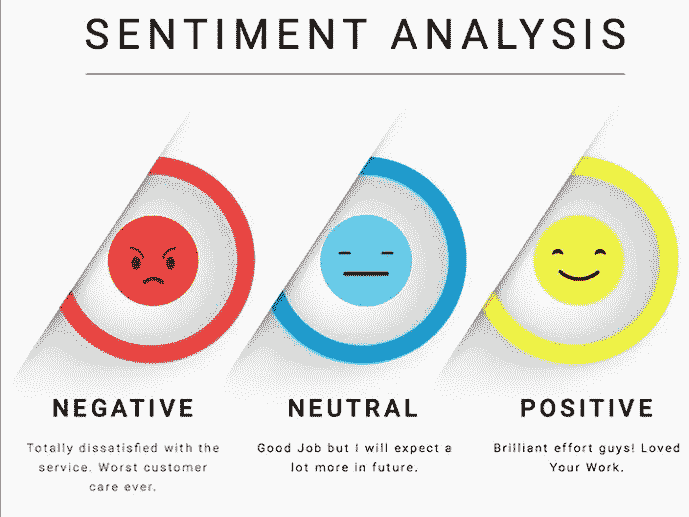
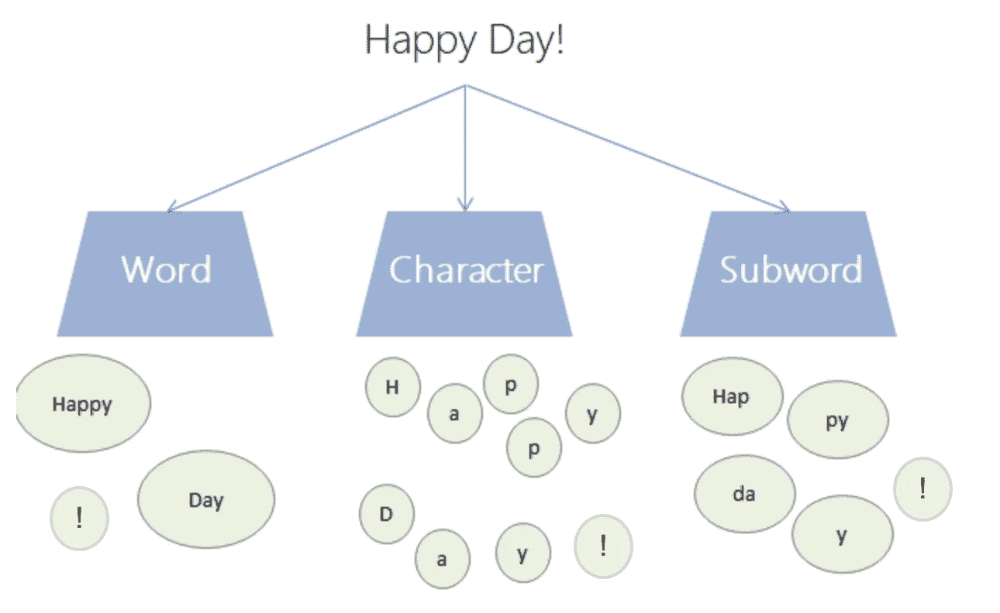
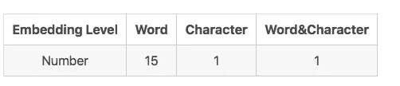
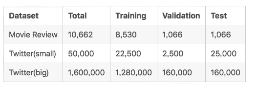
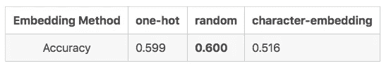
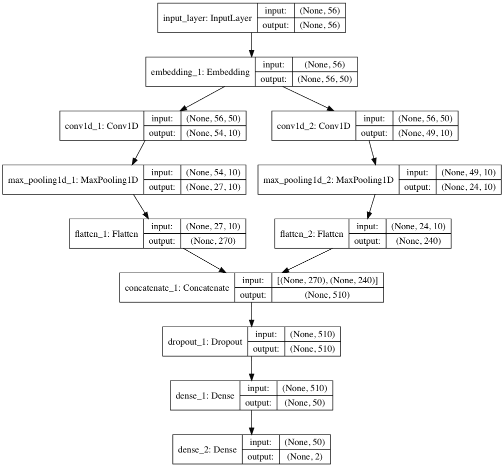
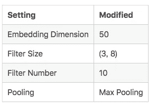
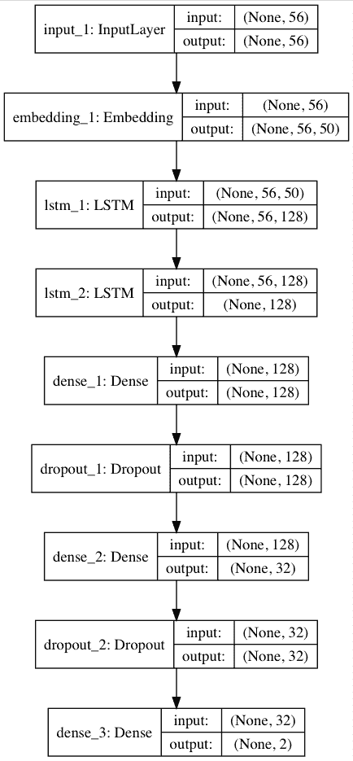
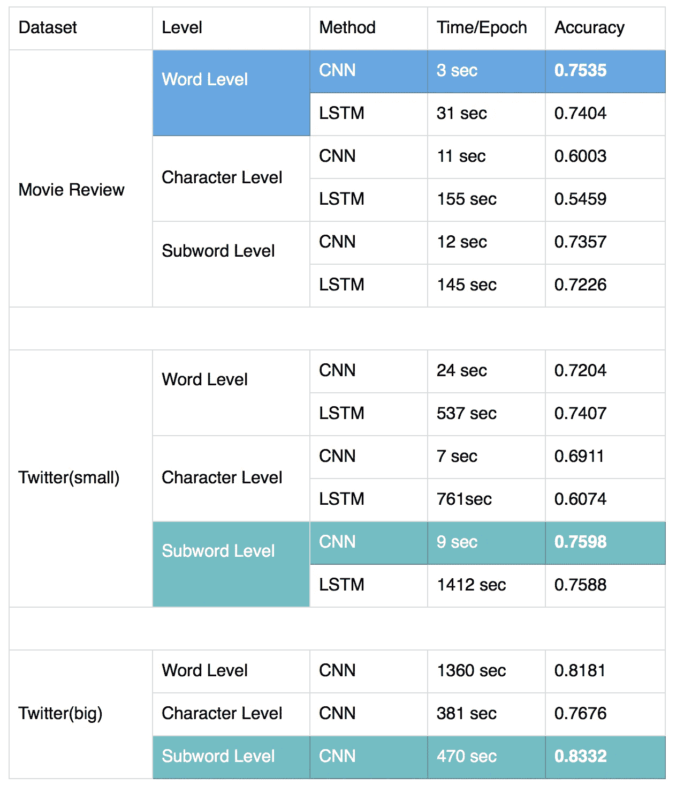

# 情感分类的最佳嵌入方法

> 原文：<https://towardsdatascience.com/blog-md-34c5d082a8c5?source=collection_archive---------13----------------------->

image from [http://houseofbots.com/news-detail/2491-4-5-things-you-need-to-know-about-sentiment-analysis-and-classification](http://houseofbots.com/news-detail/2491-4-5-things-you-need-to-know-about-sentiment-analysis-and-classification)

# 1.背景

你可能认为单词级表示是情感分类任务最有效的特征。但是，这是真的吗？我将展示一个有趣的实验结果，让你大吃一惊。

如果你不想读整篇文章，这里有一样东西你可以带走。如果数据集有许多非正式单词，子单词级嵌入方法对于情感分类是有用的。

本文的其余部分组织如下。

*   情感分析中使用的嵌入方法适用于 ACL 2018
*   讨论为什么单词级嵌入如此广泛地用于情感分析
*   实验设置和结果

你可以在这里找到所有代码:[情绪比较](https://github.com/BrambleXu/nlp-beginner-guide-keras/tree/master/sentiment-comparison)

# 2.ACL 2018 中情感分析的嵌入方法

计算语言学协会(ACL)是一个非常著名的 NLP 会议。如果你扫了一眼 ACL 2018 中的情感分析相关作品，你可能会注意到大部分作品都选择了词级嵌入方法。

单词嵌入方法已经被证明是一种有效的自然语言处理技术。但是除了单词嵌入之外，还有另外两种嵌入方法，字符级嵌入和子单词级嵌入。

word/character/subword representations

我计算 ACL 2018 关于情感分析任务的长论文和短论文。这表明了词级嵌入在情感分析中的广泛应用。

共有 12 篇长论文，5 篇短论文，标题包含关键词“情绪”。根据我们的调查，有 15 篇论文是基于单词级嵌入的，1 篇是基于字符级嵌入的，1 篇是字符级和单词级相结合的。

我在下面列出了所有等级分类的论文。 *SP* 的意思是短纸。

**A .字级**:

Word2Vec

*   为跨领域情感分类识别跨领域的可转移信息
*   SemAxis:一个轻量级框架，用于描述情感之外的特定领域词汇语义
*   情绪自适应的端到端对话系统
*   双语情感嵌入:跨语言情感的联合投射
*   (SP)利用文档知识进行方面级情感分类
*   幽默识别中的情感关联建模

手套

*   援助之手:用于深度情感分析的迁移学习
*   冷启动感知用户和产品对情感分类的关注
*   面向情感分类的目标敏感记忆网络。
*   面向目标的情感分类转换网络
*   具有目标领域特定信息的跨领域情感分类
*   基于特征的门控卷积网络情感分析

组合 Word2Vec，手套

*   (SP)用于改进情感分类的领域适应单词嵌入

学习单词级情感信息

*   学习领域敏感和情感感知的单词嵌入

无预训练模型(随机生成)

*   不成对的情感到情感的翻译:一种循环强化学习方法

**B .人物等级**

*   (SP)用未标记的对话数据预训练情感分类器

**C .字级和词级结合**

*   用于情感分类的多情感资源增强注意网络

# 3.为什么词级嵌入在情感分析中如此受欢迎？

也许我们应该改变这个问题，为什么大多数研究人员不考虑情感分析任务的其他嵌入方法？对于机器翻译、命名实体识别、语言建模等自然语言处理任务，字符级嵌入和子词级嵌入已经显示出巨大的改进。但是对于情感分析任务，这些嵌入方法似乎被忽略了。

我们知道字符级表示和子词级表示的最大优势是处理词汇外(OOV)问题。这是否意味着 OOV 词对于情感分析任务并不重要？

在某种程度上，是的。在情感分类问题中，我们希望提取情感特征来预测一个句子是肯定的还是否定的。但通常情况下，未登录词并不包含有用的情感信息。直观地，情感特征可以在词级表示中被充分提取。这就是为什么情感词典方法可以获得很好的性能。例如，`'happy'`是一个正面词，词级嵌入方法很容易从上下文中学习到这个情感信息。

至于字符级表示，即使它解决了 OOV 问题，我们也很难说从文本中提取情感特征是容易的。例如，我们可以将`'happy'`表示为`'h', 'a', 'p', 'p', 'y'`。情感词被拆分成字符，从这种上下文中提取情感特征变得越来越困难。因为单个字符很难传达情感信息。

子词级表示怎么样？我们可以将子词级的`'happy'`表示为`'hap', 'py'`，这看起来像是字符级的表示，没有太多的意义。但是，如果我们处理一些包含许多未知单词的数据集，情况可能会有所不同。考虑到这些词`'coooool'`和‘呜哇’。即使我们知道这些单词包含强烈的情感信息，它们也会在单词级表示的预处理过程中被去除。另一方面，如果我们在子词级表示这些词，`'co', 'ooo', 'ol'`和`'wo', 'oooo', 'ow'`，子词级表示可以从`'oooo'`中捕获情感信息。这些非正式词汇在 Twitter 和 Reddit 等社交网络短信中非常常见。

单词级表示非常紧凑，但存在 OOV 问题，而字符级表示过于稀疏，但不存在 OOV 问题。子词级别的表示法似乎很好地平衡了这两者。因此，如果一个数据集有许多非正式的词，我们认为**子词级别的表示能够足够好地捕捉情感特征**。为了证明我们的假设，我们进行了一些实验。

# 4.实验对比

我们选择两个数据集进行比较。对于每个数据集，我们选择三个表示级别。对于每个级别，我们实现了两个深度学习模型，CNN 和 LSTM

*   两个数据集:电影评论，推特
*   三个表示级别:单词、字符、子单词
*   两个深度学习模型:CNN，LSTM

# 4.1 实验设置

# 数据集

我们使用两个数据集进行实验。两个数据集都是关于二元情感分类的。一个是[影评数据集](http://www.cs.cornell.edu/people/pabo/movie-review-data/)，可以从[句子极性数据集 v1.0](http://www.cs.cornell.edu/people/pabo/movie-review-data/rt-polaritydata.tar.gz) 下载。还有一个是 [Twitter 数据集](http://help.sentiment140.com/for-students)，你可以从网页下载。

使用 LSTM 来训练整个 Twitter 数据集将花费太长时间(一个纪元 9 个小时！)，所以我们取 50，000 个样本作为小数据集，用于 CNN/LSTM 比较，并在整个数据集上训练 CNN。

# 嵌入方法

对于每个数据集，我们将在单词/字符/子单词三个嵌入级别上进行实验。

word/character/subword representations

## A.单词级嵌入

在这一级，我们将预先训练的单词嵌入(手套嵌入)作为单词向量。单词级的数据预处理非常简单。首先我们用`data_helpers.load_data_and_labels` ( [源代码](https://github.com/BrambleXu/nlp-beginner-guide-keras/blob/master/cnn-text-classification/data_helpers.py#L31))加载和清理数据，然后用 keras 函数对文本进行分词和填充。在我们知道最大长度之后，我们在填充过程中将`maxlen`设置为 56。

Jupyter 笔记本:[单词级-预处理-电影](https://github.com/BrambleXu/nlp-beginner-guide-keras/blob/master/sentiment-comparison/word-level/preprocess_word_mv.ipynb)

对于 Twitter 数据集的预处理，清理有更多的步骤。

*   HTML 解码
*   删除@提及
*   删除 URL 链接
*   拉丁 1 BOM(字节顺序标记)，用`?`替换签名字符``
*   删除标签和数字

我们将清理后的数据集保存为`clean_tweet.csv`

Af 首先我打算使用拼写校正来预处理文本，但是[拼写校正算法](http://norvig.com/spell-correct.html)的输出似乎不够好，所以我没有使用拼写校正。如果你对拼写校正感兴趣，那么[文本块](https://github.com/sloria/TextBlob/blob/dev/textblob/blob.py#L113)已经实现了我上面提到的拼写校正算法。你可以在 beblow notebook 中找到拼写纠正的输出。

Jupyter 笔记本:[单词级-预处理-twitter](https://github.com/BrambleXu/nlp-beginner-guide-keras/blob/master/sentiment-comparison/word-level/preprocess_word_twitter_1.ipynb)

## B.字符级嵌入

因为我们使用字符级表示，所以电影评论数据集的预处理非常简单。

我们总共有 70 个角色:

> abcdefghijklmnopqrstuvwxyz 0123456789，；。！？:'\"/\\|_@#$%^&*~`+-= <> ()[]{}

在这一关，我们采用三种不同的方法为每个角色分配向量。首先是**一键编码**。我们给每个字符分配一个热点向量。我们需要将`embedding_weights`传递给嵌入层。`embedding_weights`是包含每个字符的所有向量的矩阵。

如果您不熟悉 one-hot 编码，这里有一篇很棒的文章适合您。[如何用 Python 对序列数据进行热编码](https://machinelearningmastery.com/how-to-one-hot-encode-sequence-data-in-python/)。

第二种方法是我们**生成随机值**作为每个字符的向量。当初始化嵌入层时，我们不会将`embedding_weights`传递给`weights`参数。

第三种方法是我们使用**预训练字符嵌入**。这里我用手套字嵌入生成字符嵌入。这个脚本可以帮助我们完成这项工作， [create_embeddings.py](https://github.com/minimaxir/char-embeddings/blob/master/create_embeddings.py) 。然后我们会得到一个包含字符嵌入的文件。在初始化嵌入层时，我们用其他字符嵌入的平均值手动设置空格字符，用随机值设置未知字符。

我用 CNN 模型对电影评论数据集实现了这三种方法。结果表明，随机初始化方法的性能最好。所以我对所有角色级别的实验都使用随机初始化。

你可以在[这个目录](https://github.com/BrambleXu/nlp-beginner-guide-keras/tree/master/sentiment-comparison/char-level)中找到三种嵌入方法。

Jupyter 笔记本:[字符级-预处理-电影](https://github.com/BrambleXu/nlp-beginner-guide-keras/blob/master/sentiment-comparison/char-level/preprocess_char_mv.ipynb)

至于角色级表示的 Twitter 数据集，预处理比电影评论数据集简单。字符级表示可以处理未知单词和非正式单词。因此，没有必要删除标点符号和纠正拼写。

我们将清洗后的数据集保存为`clean_tweet_char.csv`经过预处理后，有些样本可能会变成 NAN，所以在加载数据集时，我们应该删除 NAN 样本。

Jupyter 笔记本:[字符级-预处理-推特](https://github.com/BrambleXu/nlp-beginner-guide-keras/blob/master/sentiment-comparison/char-level/preprocess_char_twitter_1.ipynb)

## C.子字级嵌入

至于子词级预处理，我们从 [BPEmb](https://github.com/bheinzerling/bpemb) 下载 vocab 和预训练的子词嵌入格式。我选择合并操作为 25000 和 50 dims。下面是一个简单的脚本，用于将句子分割成子单词级别的表示， [bpe.py](https://github.com/bheinzerling/bpemb/blob/master/bpe.py)

朱庇特笔记本:

*   [子词级预处理电影](https://github.com/BrambleXu/nlp-beginner-guide-keras/blob/master/sentiment-comparison/subword-level/preprocess_subword_mv.ipynb)
*   [子词级预处理推特](https://github.com/BrambleXu/nlp-beginner-guide-keras/blob/master/sentiment-comparison/subword-level/preprocess_subword_twitter.ipynb)

# 4.1.3 深度学习模型

对于每个级别，我们采取两种深度学习模型。一个是 CNN，我们实现了 Kim 的 CNN [卷积神经网络的修改版本，用于句子分类](http://arxiv.org/abs/1408.5882)。你可以在这里查看我的实现，[CNN-text-class ification](https://github.com/BrambleXu/nlp-beginner-guide-keras/tree/master/cnn-text-classification)。

下面列出了修改版本的超参数。

设置修改的嵌入维度 50 过滤器大小(3，8)过滤器数量 10 池化最大池化

第二个模型是 LSTM，我们堆叠了两个 LSTM 层。

# 4.2 实验结果

我们将结果总结在下表中。

# 4.3 观察和分析

对于情感分类的不同组合有一些观察。

*   在 Twitter 数据集中，子词级表示比词级表示具有更好的性能。这和我们的假设是一样的。如果数据集包含少量非正式单词并且预处理良好，则单词级嵌入确实在情感分类中实现了最佳性能。但是，如果数据集包含太多的非正式单词，子单词级嵌入可以获得比单词级嵌入更好的结果。
*   CNN 比 LSTM 好。在小型 Twitter 数据集上，子词级表示获得了最佳性能。尽管 CNN 和 LSTM 的准确率非常接近，但考虑到 CNN 的训练速度非常快，毫无疑问，CNN 是比 LSTM 更好的选择。
*   字符级表示在三个表示级别中准确性最低。原因可能是字符嵌入缺少良好的预训练字符向量。CNN/LSTM 很难从人物层面捕捉情感信息。

# 5.摘要

这一次，我没有在优化超参数上花费太多时间。LSTM 模式可能过于简单。但是这个实验仍然表明子词级表示对于情感分类是有用的，特别是对于非正式文本。所以对于情感分析分类来说，子词-词嵌入是一个很好的选择。

你可以在这里找到所有代码:[情感对比](https://github.com/BrambleXu/nlp-beginner-guide-keras/tree/master/sentiment-comparison)

> ***查看我的其他帖子*** [***中等***](https://medium.com/@bramblexu) ***同*** [***一分类查看***](https://bramblexu.com/posts/eb7bd472/) ***！
> GitHub:***[***bramble Xu***](https://github.com/BrambleXu) ***LinkedIn:***[***徐亮***](https://www.linkedin.com/in/xu-liang-99356891/) ***博客:***[***bramble Xu***](https://bramblexu.com)