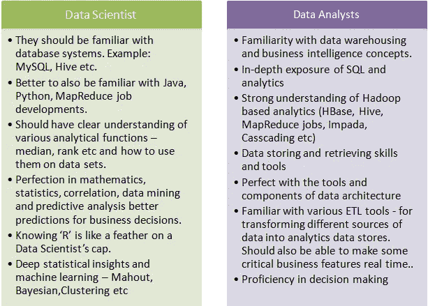

# 模糊的界限:数据分析师 vs 数据科学

> 原文：<https://towardsdatascience.com/blurred-lines-data-analytics-vs-data-science-12ff92a3bd4e?source=collection_archive---------5----------------------->

在数据呈指数级增长的世界里，公司正转向两种工作来解决一些最大的问题，数据分析师(或 BI 工程师)和数据科学。然而，越来越明显的是，商业世界不确定如何恰当地定义范围和区分这些角色。数据科学家连续三年被列为美国第一职业，这并不奇怪。分析经理排在第十位。数据科学和分析已经存在了一段时间，但这些角色是为大公司保留的，主要是那些拥有大量数据的公司(如脸书、谷歌、通用电气、投资银行等)。)如今，几乎所有公司都在以某种形式收集数据，但他们没有梳理数据所需的专家。这些公司的高管很可能听说过数据科学家和分析的时髦词汇，对这些角色的实际工作只有粗略的了解。

如果你看看这些天的就业公告板，全美有数千个职位空缺。更常见的是，你看到的不是数据科学家的工作描述，而是最接近分析师角色的定义。相反的情况也是如此，但这种情况更为罕见。

让我们理清思路，将数据科学家和数据分析师区分开来。

**数据科学家，真正的独角兽。**

对于那些没有听说过这一点的人来说，这是对该领域所用角色的常见描述。真正的数据科学家具备这些技能:

1.  强——商业头脑
2.  强—数学/统计
3.  强——计算机科学/甩代码的能力

独角兽是在这三方面都很完美的人。这种情况很少发生。最有可能的情况是某人缺乏或在三者之一上较弱。

**数据分析师，让我看看我的生意。**

数据分析非常相似，他们拥有以下技能:

1.  强——商业头脑
2.  中等—数学/统计
3.  中等——计算机科学/甩代码的能力

如您所见，数据科学需要在这三个方面都具备很强的技能。然而，这两个角色需要相同的技能。最大的区别是他们如何应用这些技能。让我们澄清误解。

**数据科学家与数据分析责任**

*数据科学家-*

1.  探索性数据分析
2.  清理脏数据
3.  使用无监督机器学习识别数据趋势
4.  使用监督机器学习，根据数据趋势进行预测
5.  编写代码来帮助数据探索和分析
6.  向技术/工程部门提供代码，以便在产品中实施

*数据分析师-*

1.  探索性数据分析
2.  清理脏数据
3.  管理数据仓库和 ETL(提取转换负载)
4.  制定 KPI 以评估绩效
5.  通过使用 BI 平台(即 Tableau、DOMO、Sisense、Looker 等)开发数据的可视化表示。)

你能看出最大的不同吗？数据科学家利用他们强大的统计知识来创建趋势识别，并对某些事情做出预测。他们需要具备真正理解数据中肉眼无法识别的元素的技能。数据科学家测试数据上的多个假设，以确定数据中的相关性或趋势是随机的还是显著的，谁知道 P 值？另一方面，数据分析师必须理解数据，净化数据，然后向业务决策者提供数据的可视化表示。

以下是其他一些差异，主要是每个角色所需的工具

[https://www.edureka.co/blog/difference-between-data-scientist-and-data-analyst/](https://www.edureka.co/blog/difference-between-data-scientist-and-data-analyst/)

我发现，在实践中，许多数据分析师并不具备工作所需的技能。数据分析师需要统计知识(IMHO)。如果没有这方面的知识，KPI 或可视化数据表示可能会被错误陈述和误导。相关性并不意味着因果关系。这句话应该深深印在每个数据分析师的记忆中。招聘数据分析师时，争取那些有良好数学或统计背景的候选人。这很关键。

我希望这篇文章能够帮助那些目前在这些领域工作的人，以及那些希望招聘这些职位的人。这两者都需要几乎相同的技能，但是这两个角色之间有一个关键的区别。企业需要确保他们不会模糊界限。

如果你有任何反馈或想法，请在评论中分享。