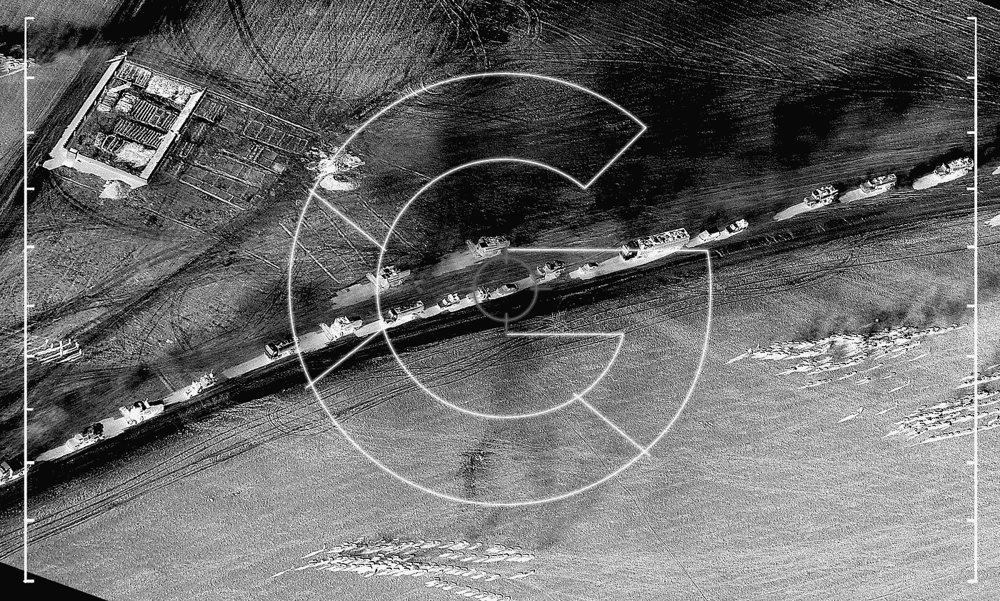
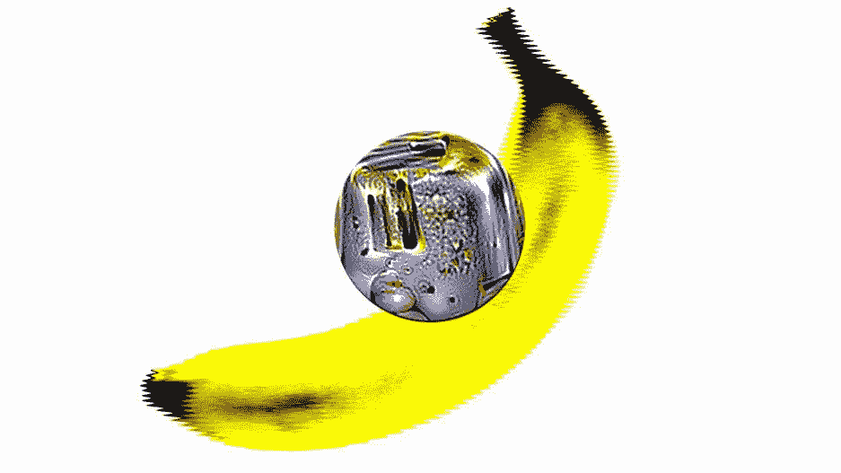

# 宝马机器学习周刊—第 3 周

> 原文：<https://towardsdatascience.com/bmw-machine-learning-weekly-414a2519363c?source=collection_archive---------0----------------------->

## 2018 年 3 月 1 日至 3 月 7 日

*关于机器学习(ML)、人工智能(AI)及相关研究领域的新闻。*

# ML 使新的欧盟数据隐私法规的影响复杂化

将于 2018 年 5 月 25 日生效的关于个人数据的欧盟新法规[通用数据保护法规](https://www.dataprotection.ie/docs/GDPR/1623.htm) (GDPR)，可能很难与 ML 技术相结合。该法规的关键主题是每个人都拥有自己的数据。因此，任何公司都必须明确请求允许使用任何个人数据，并解释为什么要这样做，以及使用多长时间。后来，这种许可可以随时撤销。令人担忧的是，要解释普通消费者的个人数据如何被用来训练算法以推断其他人的结果，可能会变得很成问题。即使消费者同意，消费者也可以在任何时候获得这种许可，这在技术上可能需要 ML 算法来“忘记”(从而忘记)个人的特定数据如何适应算法的学习。

[继续阅读……](https://www.irishtimes.com/business/innovation/machine-learning-complicates-effects-of-new-eu-rules-on-personal-data-1.3415626)

# 美国军方的军情六处

谷歌与美国国防部合作，帮助该机构开发人工智能算法，使用 TensorFlow 分析无人机镜头。根据五角大楼的消息,“Maven”项目的最初目标是为军方提供先进的计算机视觉，能够自动检测和识别由无人机的全运动摄像机捕捉的多达 38 类物体。Maven 为该部门提供了跟踪来自不同地点的个人的能力。这项合作在这个技术巨头的员工中引发了一场轩然大波，因为该项目提出了关于 ML 开发和使用的重要伦理问题。

[继续阅读……](https://gizmodo.com/google-is-helping-the-pentagon-build-ai-for-drones-1823464533)

# 当香蕉看起来像烤面包机

(或者，[服用致幻剂的人工智能](https://www.technologyreview.com/s/609762/google-and-others-are-building-ai-systems-that-doubt-themselves/))越来越成为一个问题。对抗性的例子是特别设计的视错觉，欺骗计算机认为它们认识到了一个物体的某些东西，而这个东西并不是。例子从[把步枪的图片误认为直升机](https://www.wired.com/story/researcher-fooled-a-google-ai-into-thinking-a-rifle-was-a-helicopter/)到[把香蕉误认为烤面包机](https://www.fastcodesign.com/90156089/trippy-stickers-trick-computers-into-thinking-a-banana-is-a-toaster)在香蕉上贴了一个标签后，混淆了计算机视觉系统。
研究人员——包括生成对抗网络(GANs)的创始人 Ian good fellow——发表了一篇[论文](https://www.technologyreview.com/s/609762/google-and-others-are-building-ai-systems-that-doubt-themselves/)，他们在论文中透露，他们已经能够生成第一批[照片](https://www.technologyreview.com/the-download/610399/human-brains-can-be-hacked-like-computers-with-adversarial-examples/)，这些照片可以愚弄人类和计算机视觉算法。寻找无法欺骗人类大脑的改变图像的研究对于自动驾驶等现实生活中的用例非常重要。一个系统能看到每一个停车标志是必要的，不管它被改变了多少。

[继续阅读……](https://spectrum.ieee.org/the-human-os/robotics/artificial-intelligence/hacking-the-brain-with-adversarial-images)

# 值得注意的

*   **将汽车变形为直升机**
    日内瓦车展:意大利设计公司、空中客车公司和奥迪公司合作展示了一款双座智能汽车大小的单体车，它可以像普通汽车一样在轮子上行驶，或者在一个巨大的无人机模块的帮助下，被吊到空中进行垂直飞行。[阅读更多…](https://www.theverge.com/2018/3/7/17087608/airbus-audi-flying-car-concept-geneva-motor-show-2018)
*   将人工智能带到机场
    科技公司 [SITA 透露了让人工智能接管机场行李管理的计划](https://economictimes.indiatimes.com/industry/transportation/airlines-/-aviation/artificial-intelligence-to-revolutionise-baggage-management-sita/articleshow/63172422.cms)。目的是最大限度地减少行李丢失和处理不当的数量。同样，Unisys 软件正在[将 ML 算法引入边界控制](https://findbiometrics.com/unisys-software-ai-to-border-control-502062/)。
*   **再见绿屏，你好 AI！谷歌将专业水平的视频编辑技术引入手机，用 IA 工具取代绿色屏幕。目前，该工具处于有限的测试模式。[阅读更多…](https://www.engadget.com/2018/03/02/youtube-green-screen-app/)**
*   **探索历史*生活*照片**
    使用人工智能对数百万张历史*生活*照片进行分类，谷歌发布了一个漂亮的[工具](https://artsexperiments.withgoogle.com/lifetags/)来创建一个新的、可搜索的*生活*照片档案。[阅读更多…](https://www.theverge.com/2018/3/7/17091392/google-ai-photo-tagging-life-archive)