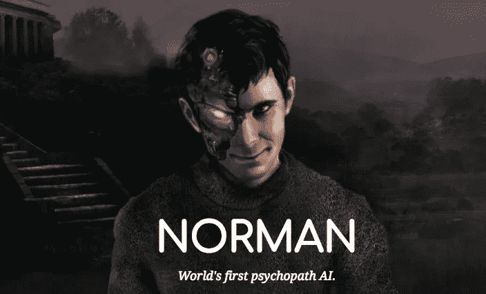
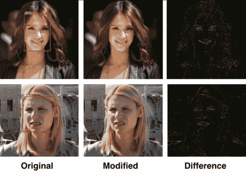
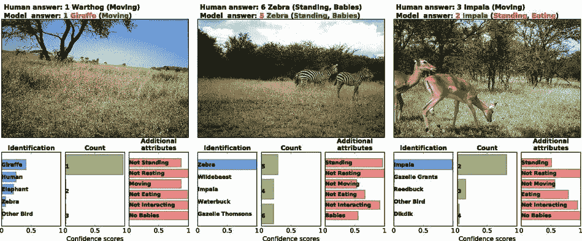

# 宝马机器学习周刊—第 11 周

> 原文：<https://towardsdatascience.com/bmw-machine-learning-weekly-week-11-8bb37cc821b3?source=collection_archive---------9----------------------->

## 2018 年 5 月 24 日至 6 月 6 日

*关于机器学习(ML)、人工智能(AI)及相关研究领域的新闻。*

# 认识一下诺曼:世界上第一个精神病 AI

根据一项新的研究，麻省理工学院的科学家训练了一种被称为“[诺曼](http://norman-ai.mit.edu/)”的人工智能算法，使其成为一名精神病患者，只需将其暴露于可怕的死亡和暴力的可怕 Reddit 图像。以阿尔弗雷德·希区柯克 1960 年电影*惊魂记*中安东尼·博金斯的角色命名，这个人工智能在接受[罗夏墨迹测试](https://www.bbc.com/news/magazine-18952667)之前，只被输入了连续的暴力图像流。(罗夏墨迹测验的基本思想是，当一个人看到一个模糊的、无意义的图像时，大脑会努力给图像赋予意义。这被认为是一种性格测试。)诺曼探测到的图像产生了对电击和超速汽车死亡的怪异解释，而标准的人工智能只会看到雨伞和婚礼蛋糕。麻省理工学院研究的目标是证明用于教授 ML 算法的输入方法可以极大地影响其后来的行为。科学家们认为，当算法被指责有偏见或不公平时，比如脸书新闻或谷歌照片的高调案例，“罪魁祸首往往不是算法本身，而是输入其中的有偏见的数据。”

[继续阅读……](http://www.newsweek.com/mit-norman-psychopath-rorschach-ai-inkblot-test-psycho-reddit-artificial-962045)

# 照片的隐私过滤器

随着对社交网络上隐私和数据安全的担忧日益加剧，多伦多大学的研究人员创造了一种算法，可以动态扰乱面部识别系统。由于隐私是一个现实问题，随着面部识别变得越来越好，这种反面部识别系统可以有利于打击这种能力。他们的解决方案利用了一种叫做对抗训练的深度学习技术，这种技术让两种人工智能算法相互对抗。设计了两组神经网络:第一组用来识别人脸，第二组用来扰乱第一组的人脸识别任务。这两者不断斗争和相互学习，建立了一个持续的人工智能军备竞赛。除了禁用面部识别，新技术还会破坏基于图像的搜索、特征识别、情感和种族估计，以及所有其他可以自动提取的基于面部的属性。接下来，该团队希望通过应用程序或网站公开隐私过滤器。

[继续阅读……](https://www.sciencedaily.com/releases/2018/05/180531114620.htm)

# 人工智能可以像人类一样准确地识别野生动物

从印度的老虎到非洲的土豚，运动传感器摄像机越来越多地被用于追踪全球的野生动物。但是梳理这些系统捕获的数百万张图像是一项耗时的任务。现在，科学家们发现，人工智能在识别这些基本上未开发的照片库中的物种方面，与人类志愿者一样有效，而且更快。在本周发表在美国国家科学院 学报 [*上的一项新研究中，由怀俄明大学计算机科学家 Mohammad Sadegh Norouzzadeh 领导的一个研究小组测试了一种称为深度神经网络的人工智能是否能够正确识别和计数物种，确定动物的年龄，并对它们的行为进行分类。他们使用快照塞伦盖蒂数据集的 320 万张图像分析了人工智能的能力，该数据集包含自 2011 年以来坦桑尼亚塞伦盖蒂国家公园 225 个相机陷阱的照片。*](http://www.pnas.org/content/early/2018/06/04/1719367115)

[继续阅读……](https://e360.yale.edu/digest/artificial-intelligence-can-identify-wildlife-as-accurately-as-humans)

# 值得注意的

*   微软将一堆服务器沉入苏格兰海岸的海里以保持冷却。这个想法是利用海水作为自然冷却剂，帮助减少运行中心所需的能源。[阅读更多…](https://www.technologyreview.com/the-download/611374/microsofts-throwing-its-servers-in-the-sea-to-keep-them-cool/)
*   **弹琴:机器还是人**
    [听听](https://www.technologyreview.com/video/611321/humans-versus-machines-chopin-edition/)由机器和人演奏的肖邦。
*   **用自然语言处理(NLP)预测股票市场**
    微软的一个研究团队[试图用 NLP](https://www.microsoft.com/developerblog/2017/12/04/predicting-stock-performance-deep-learning/?utm_source=twitter&utm_medium=cpc&utm_campaign=twitter-mobile-post-stock-target-open-source-low) 来预测股票表现，以解释收益发布，并采取措施通过删除停用词、标点符号和其他昙花一现的词语来净化输入。然后，该模型试图找出新闻稿的语言内容与随后对股价的影响之间的关系。[阅读更多…](https://hackaday.com/2018/05/30/stock-market-prediction-with-natural-language-machine-learning/)
*   葡萄酒商店 Bright Cellars 正在将同样的概念应用到葡萄酒上，就像 Spotify 和网飞对音乐和电影所做的那样:他们的葡萄酒配对算法通过让会员参加一个简单的测试，将会员与他们理想的葡萄酒匹配起来。[阅读更多…](https://www.sciencealert.com/sciencealert-deal-this-service-uses-machine-learning-to-match-wines-with-you)