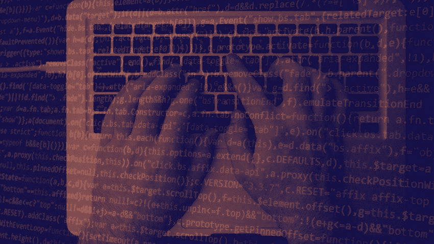
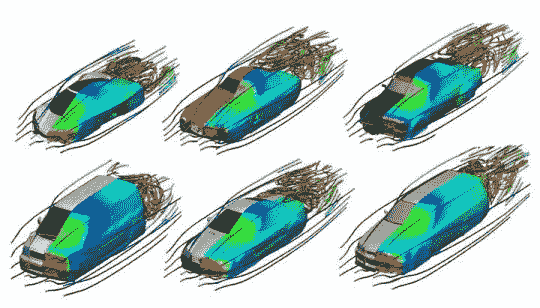

# 宝马机器学习周刊—第 16 周

> 原文：<https://towardsdatascience.com/bmw-machine-learning-weekly-week-16-2cdcbb01cbf?source=collection_archive---------15----------------------->

## 2018 年 8 月 2 日至 8 月 22 日

*关于机器学习(ML)、人工智能(AI)及相关研究领域的新闻。*

# 区块链和美国中期选举

西弗吉尼亚州的投票变得更加高科技:美国第一个允许一些选民使用智能手机应用程序提交联邦大选选票，这是主要涉及海外服役军人的试点项目的一部分。西弗吉尼亚州官员计划使用区块链来应对网上投票的风险。他们认为，这是一种更方便、更安全的网上投票方式，可以提高投票率。该项目遭到了选举安全专家的严厉批评，他们认为，按照设计，该系统几乎没有解决在线投票固有的问题。宾夕法尼亚大学的密码学和安全研究员马特·布雷泽认为区块链并不坏。这是因为它们引入了新的安全漏洞，而保护投票计数免受欺诈“比其他方法更容易、简单和安全。”

[继续阅读……](https://www.technologyreview.com/s/611850/why-security-experts-hate-that-blockchain-voting-will-be-used-in-the-midterm-elections/)

# 网络安全的人工智能和人工智能

使用 ML 和 AI 来帮助自动化威胁检测和响应可以减轻员工的负担，并有可能比其他软件驱动的方法更有效地识别威胁。尽管如此，黑客可以通过瞄准他们训练的数据和他们寻找的警告标志来挫败安全算法。许多正在推出的网络安全产品涉及“监督学习”，这要求公司选择和标记算法训练的数据集——例如，通过标记恶意代码和干净代码。潜在的风险是，网络安全公司急于将其产品推向市场，因此没有彻底清除异常数据点；进入安全公司系统的黑客可以通过交换标签来破坏数据，从而将一些恶意软件标记为干净的代码；或者黑客可以找出模型用来标记恶意软件的代码特征，然后从他们自己的恶意代码中删除这些特征，这样算法就不会发现它。

[继续阅读……](https://www.technologyreview.com/s/611860/ai-for-cybersecurity-is-a-hot-new-thing-and-a-dangerous-gamble/)

# ML 工具使汽车设计更符合空气动力学

当工程师或设计师想要测试汽车、飞机或其他物体的新设计形状的空气动力学特性时，他们通常会通过让计算机求解一组复杂的方程来模拟物体周围的空气流动，这一过程通常需要几个小时甚至一整天。来自 Autodesk research(现在在东京大学)的 Nobuyuki Umetani 和来自奥地利科学技术研究所(奥地利 IST)的 Bernd 比克尔现在大大加快了这一过程，使流线和参数实时可用。他们的方法是第一个使用 ML 来模拟连续可编辑 3D 对象周围的流动，并能够显示流线以及交互式可变形形状表面上的颜色编码压力。

[继续阅读……](https://www.sciencedaily.com/releases/2018/08/180814101454.htm)

# 值得注意的

*   **上周今晚**
    [观看](https://www.youtube.com/watch?time_continue=2&v=etkd57lPfPU)约翰·奥利弗谈美国关税对宝马的影响。
*   瓦尔多在那里，你知道这个游戏吗？现在有一个机器人，配备了视觉相机套件，可以使用谷歌的 AutoML 面部识别服务识别瓦尔多。[观看](https://youtu.be/-i7HMPpxB-Y) *还有瓦尔多*和[阅读更多…](https://www.theverge.com/circuitbreaker/2018/8/8/17665268/wheres-waldo-finding-robot-google-cloud-automl-ai)
*   **ML 有助于减少毒性化疗**
    麻省理工学院的研究人员正在采用 ML 技术，通过减少胶质母细胞瘤(最具侵袭性的脑癌形式)的毒性化疗和放疗剂量，来改善患者的生活质量。[阅读更多…](http://news.mit.edu/2018/artificial-intelligence-model-learns-patient-data-cancer-treatment-less-toxic-0810)