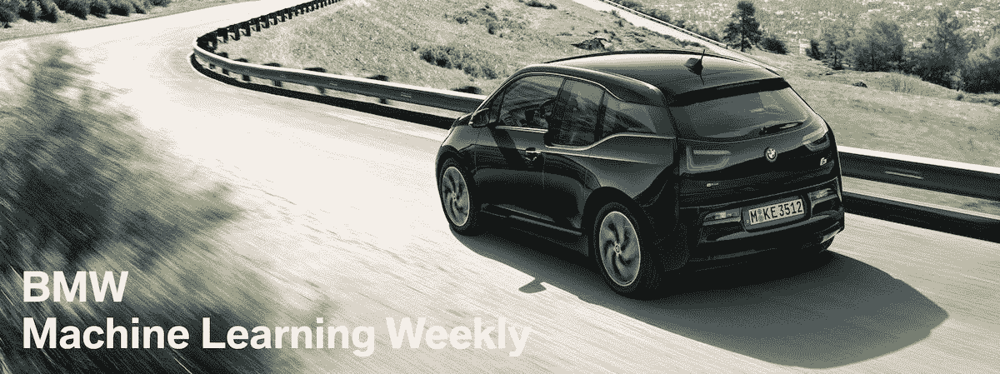
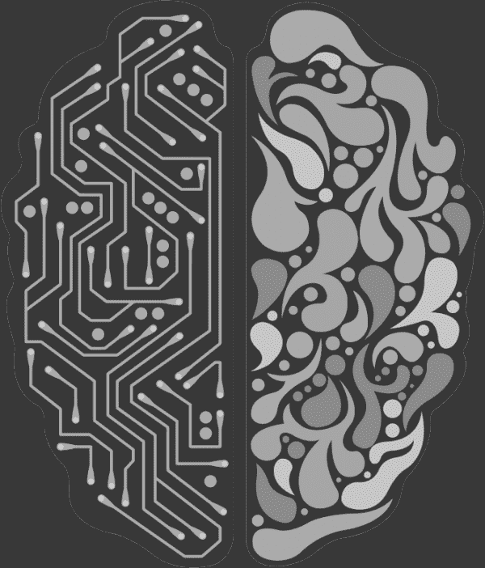
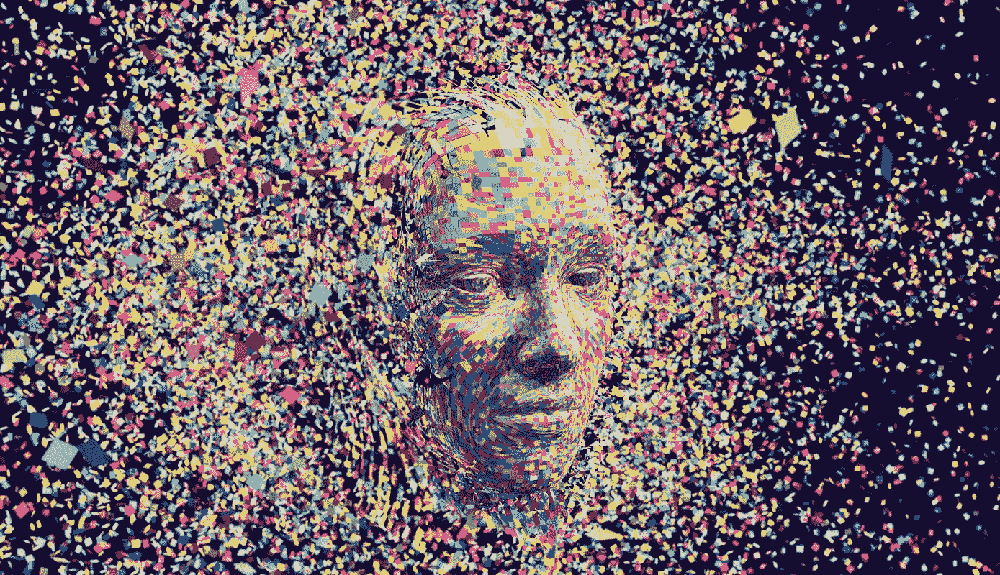

# 宝马机器学习周刊—第 4 周

> 原文：<https://towardsdatascience.com/bmw-machine-learning-weekly-week-4-1d9ac5a8f26?source=collection_archive---------18----------------------->

## 2018 年 3 月 8 日至 3 月 14 日

*关于机器学习(ML)、人工智能(AI)及相关研究领域的新闻。*

# 大赦国际的法律责任

法律学者越来越多地讨论哪些法律应该适用于 AI 犯罪。英国布莱顿大学的研究员约翰·金斯顿最近发表了一篇[论文]( https://arxiv.org/abs/1802.07782)，描绘了这一法律领域的前景。他的分析提出了一些汽车、计算和法律界应该认真应对的重要问题(如果他们还没有这么做的话)。这场辩论的核心在于，人工智能系统是否可以为其行为承担刑事责任。Kingston 说，以色列 Ono 学院的 Gabriel Hallevy 已经详细研究了这个问题。本文讨论了适用于人工智能系统的三种不同的法律场景:(i) *通过另一个实施者，*适用于由精神有缺陷的人实施的犯罪，因此被认为是无辜的，(ii) *自然可能的后果，*发生在人工智能系统的普通行为可能被不适当地用于实施犯罪行为时，以及(iii) *直接责任，*要求行为(例如，人工智能采取导致犯罪行为的行为)和意图(更难确定)

[继续阅读……](https://www.technologyreview.com/s/610459/when-an-ai-finally-kills-someone-who-will-be-responsible/)

# 测试人工智能的常识

一项新的测试可能有助于表明，Siri 和 Alexa 等人工智能系统需要一种根本不同的方法来真正掌握语言。由西雅图非营利组织[艾伦人工智能研究所](http://allenai.org/) (AI2)的研究人员开发的 [AI2 推理挑战赛](http://data.allenai.org/arc/) (ARC)将提出小学水平的多项选择科学问题(见[论文](http://ai2-website.s3.amazonaws.com/publications/AI2ReasoningChallenge2018.pdf))。每个问题都需要对世界如何运转有所了解。例如，一个问题可以是*“下面哪个项目不是由自然生长的材料制成的？a)棉衬衫 B)木椅 C)塑料勺子 D)草篮。”*这样的问题对于任何知道塑料不是长出来的东西的人来说都很容易。这个答案触及了一个连小孩子都有的常识性的世界图景。这项新测试是 AI2 向人工智能系统灌输这种对世界的理解的举措的一部分。这一点很重要，因为确定一个语言系统理解它所说的东西的能力是很棘手的。

[继续阅读……](https://www.technologyreview.com/s/610521/ai-assistants-dont-have-the-common-sense-to-avoid-talking-gibberish/)

# 不付款

当谈到获得负担得起的机票，价格比较网站都很好，但他们并没有真正解决价格不断变化的事实。这意味着，尽管你在预订时可能已经买到了周三 10 点从洛杉矶飞往纽约的最便宜的航班，但不能保证在接近起飞时间时仍然是最便宜的航班。
机器人律师网站提供的最新服务 [DoNotPay]( https://www.donotpay.com/travel/) (最出名的是[让数千人免于停车罚单]( https://www.digitaltrends.com/cool-tech/robot-lawyer-housing/))声称是有史以来第一个在你预订机票后降低机票价格的服务。它与所有美国航空公司和旅游预订服务兼容，迫使公司在机票价格下降时向客户付费。它是通过遵守法律细则来做到这一点的，法律细则要求航空公司给予客户修改预订的选择权——但很少有人真正这么做。

[继续阅读……](https://www.digitaltrends.com/cool-tech/robot-lawyer-airfares/)

# 值得注意的

*   **持续关注:SXSW 2018**
    美国得克萨斯州奥斯汀市西南偏南会议目前正在举行。[engage et](https://www.engadget.com/2018/03/14/sushi-robot-jetpack-ai-piano-sxsw-show-floor-video/)在一段视频中总结了一些想法，如寿司制作机器人、人工智能钢琴和人工智能驱动的 Gochan 吉祥物。也看一下[埃隆马斯克在大会上回答几个问题](https://www.youtube.com/watch?v=kzlUyrccbos)。
*   欧洲人工智能联盟欧盟委员会正在寻求建立一个欧洲人工智能联盟。它将包括起草基于欧盟基本权利的人工智能的道德发展和使用指南等任务。[阅读更多…](https://financefeeds.com/european-commission-seeks-build-european-ai-alliance-robots-conquer-new-areas/)
*   **变得更快的旧电脑**
    谷歌研究人员[公布了一个项目的](https://arxiv.org/pdf/1803.02329.pdf)细节，该项目可以让笔记本电脑或智能手机随着时间的推移使用深度学习更好更快地做事情。[阅读更多…](https://www.technologyreview.com/s/610453/your-next-computer-could-improve-with-age/)
*   微软[宣布它达到了一个历史性的里程碑，使用人工智能来匹配人类将新闻从中文翻译成英文的表现。微软正在其最著名的专业领域之一——深度学习神经网络——与谷歌展开较量，以创造翻译技术，使全球各地的人们更容易获得外国新闻和信息。这个人工智能已经在一个开源测试集上进行了测试，中文新闻报道的测试集将很快被整合到微软的翻译软件中。]( https://blogs.microsoft.com/ai/machine-translation-news-test-set-human-parity/)[阅读更多…](https://www.techradar.com/news/microsofts-new-ai-translates-chinese-to-english-as-well-as-a-human-translator)