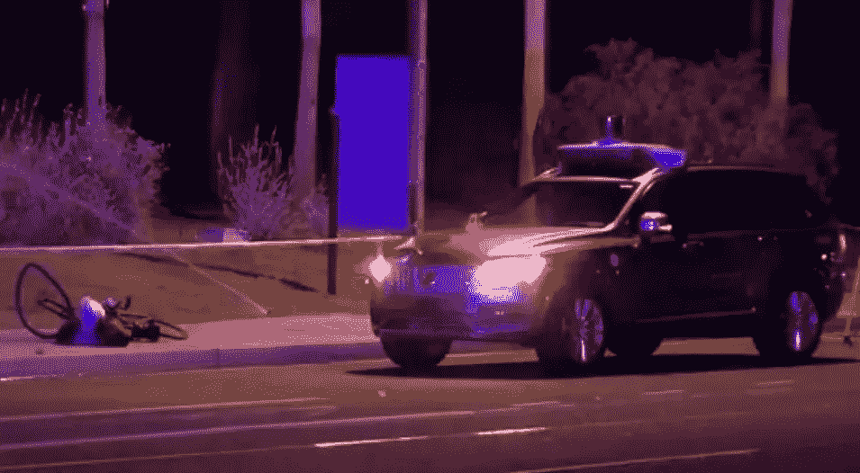
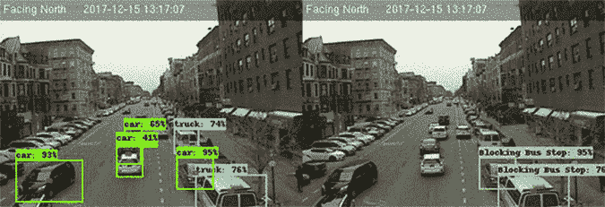

# 宝马机器学习周刊—第 5 周

> 原文：<https://towardsdatascience.com/bmw-machine-learning-weekly-week-5-c8a167698add?source=collection_archive---------4----------------------->

## 2018 年 3 月 15 日至 3 月 21 日

*关于机器学习(ML)、人工智能(AI)及相关研究领域的新闻。*

# 人工智能可以帮助发现老年痴呆症

目前，没有简单的方法来诊断阿尔茨海默氏症。不存在单一的测试，单靠大脑扫描不能确定某人是否患有该病。此外，当患者处于疾病的早期阶段时，它并不总是明显的。在人们开始经历困惑和记忆丧失之前，大脑的变化会导致行为和睡眠模式的微妙变化。研究人员认为，人工智能可以早期识别这些变化，并识别出处于发展最严重疾病风险中的患者。麻省理工学院计算机科学和人工智能实验室的 Dina Katabi 和她的团队开发了一种微妙的白色平板设备，可以识别动作，如踱步和徘徊，这可能是阿尔茨海默氏症的迹象。这个设备知道一个人什么时候起床，穿衣服，走到窗前，或者去洗手间。它可以判断他们是在睡觉还是摔倒了。它通过使用低功率无线信号来绘制他们的步态速度，睡眠模式，位置，甚至呼吸模式。所有这些信息都被上传到云端，在那里 ML 算法从每天数以千计的动作中发现模式。装有这种算法的设备可以安装在人们的家中或长期护理设施中，以监测那些处于危险中的人。对于已经确诊的患者，这种技术可以帮助医生调整他们的治疗。

[继续阅读……](https://www.technologyreview.com/s/609236/ai-can-spot-signs-of-alzheimers-before-your-family-does/)

# 优步的致命事故

周日晚上，一名女子在亚利桑那州坦佩被优步驾驶的自动驾驶汽车撞死。这被认为是第一起与自动驾驶技术有关的行人死亡事件。事故涉及一辆沃尔沃，优步为其配备了雷达、摄像头和其他传感器以及计算机设备，使其能够在没有驾驶员输入的情况下导航。虽然当时一名安全驾驶员在车内，但当它撞上并杀死骑车人时，它处于自动模式。可以在[这里]( https://www.nytimes.com/interactive/2018/03/20/us/self-driving-uber-pedestrian-killed.html)观看车辆内部和外部摄像头拍摄的(相当清晰的)视频。《麻省理工技术评论》发表了一篇文章，反思了致命事故的潜在影响，得出结论说，到目前为止，公众(出人意料地)没有表现出反对自动驾驶技术的迹象，即使在此类事件发生后。尽管如此，丰田等汽车制造商决定暂时停止自动驾驶汽车上路。

[继续阅读……](https://www.technologyreview.com/s/610574/what-ubers-fatal-accident-could-mean-for-the-autonomous-car-industry/)

# 将深度学习应用于纽约市的交通

当试图使当局相信某些法律没有得到充分执行时，洗钱在证明一个恰当的案例方面非常有用。例如，纽约市 30 岁的计算机科学家亚历克斯·贝尔(Alex Bell)创建了一个深度学习算法(一种 ML)的原型，该算法研究交通摄像头的镜头，并精确跟踪自行车道被送货卡车、停放的汽车和等待的出租车以及其他违法者堵塞的频率。该项目为期 10 天，重点关注一个城市街区。这项工作花费了大约三周时间(参见源代码[这里]( https://github.com/Bellspringsteen/OurCamera))。与大多数纽约市交通数据分析相比，这是一项与众不同的分析。初步的发现是明显的:利用一个公交车站和两条自行车道(一条向北行驶，另一条向南行驶)上的交通摄像机镜头，贝尔发现公交车站 57%的时间被封锁，而自行车道 40%的时间被封锁。

[继续阅读……](https://www.nytimes.com/2018/03/15/nyregion/bike-lane-blocked-new-york.html)

# 值得注意的

*   TechCrunch 正在跟进马克·扎克伯格对剑桥分析公司滥用从脸书收集的客户数据的报道的回应。[参见饲料…](https://techcrunch.com/story/facebook-responds-to-data-misuse/)
*   **让智能手机通知不那么烦人**
    最近发表的一篇[论文](https://arxiv.org/abs/1803.00458)描述了研究人员如何根据浏览历史、购物历史和财务细节等数据训练人工智能，以建立一个推荐引擎，决定何时在通知中显示什么。利用它，他们能够准确预测用户对频率和内容的偏好。
*   **砍伐森林的声音**
    麻省理工学院技术评论报道[雨林连接](https://rfcx.org/our_work.html)，一个三藩市的非营利组织，已经开发了一种廉价的，严格的声音监测系统，由改良的手机和太阳能电池板制成。所谓的守护者设备上的一个应用程序可以隐藏在整个森林的树木中，持续监听非法伐木和偷猎动物的迹象。该非营利组织将使用谷歌的 TensorFlow 更准确地检测上传音频中令人不安的声音，如链锯、车辆和枪声。