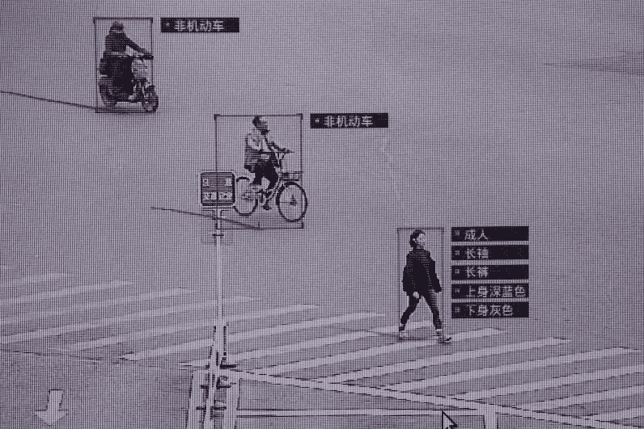
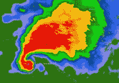
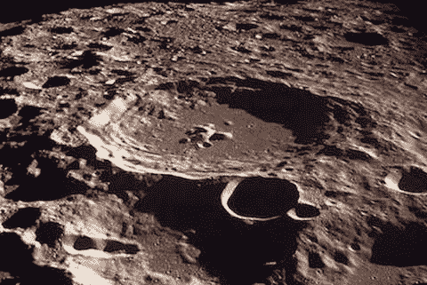

# 宝马机器学习周刊—第 6 周

> 原文：<https://towardsdatascience.com/bmw-machine-learning-weekly-week-6-5db7d4e92850?source=collection_archive---------5----------------------->

## 2018 年 3 月 22 日至 3 月 28 日

*关于机器学习(ML)、人工智能(AI)及相关研究领域的新闻。*

# 对乱穿马路者立即罚款

中国南方城市深圳的交警一向以严格执行无视交通规则而闻名，这座拥有 1200 万人口的大都市。现在，在人工智能和面部识别技术的帮助下，乱穿马路的行人(非法穿越道路的行人)不仅会被公开点名，还会通过即时消息通知他们的错误行为——以及罚款。
总部位于深圳的人工智能公司 Intellifusion 向深圳警方提供技术，在十字路口的大型 LED 屏幕上显示乱穿马路者的脸，该公司正在与当地移动电话运营商和微信等社交媒体平台合作，开发一个系统，一旦违规，违规者将收到个人短信。

[继续阅读……](http://www.scmp.com/tech/china-tech/article/2138960/jaywalkers-under-surveillance-shenzhen-soon-be-punished-text)

# EmTech Digital 2018

今年在旧金山举行的 [EmTech Digital](https://events.technologyreview.com/emtech/digital/18/) 几天前结束了。会议特别关注引领中国人工智能革命的公司，人工智能如何渗透到从制造到零售的企业，以及最近随着机器做出更大更复杂的决定，导致算法揭示其隐藏的偏见而出现的伦理困境。演讲者和公司展示了一些主题，如[探索在食品生产中使用人工智能的新方法](https://www.technologyreview.com/s/610549/exclusive-alphabet-x-is-exploring-new-ways-to-use-ai-in-food-production/)，展示了[迄今为止最灵活的机器](https://www.technologyreview.com/s/610587/robots-get-closer-to-human-like-dexterity/)，并警告说[人工智能在假新闻制作中变得越来越重要](https://www.technologyreview.com/s/610635/fake-news-20-personalized-optimized-and-even-harder-to-stop/)。

[参见概述](https://www.technologyreview.com/collection/emtech-digital-2018-coverage/)

# 冰雹预测人工智能万岁

每年，恶劣天气都会造成数十亿美元的财产损失，并导致数百人死亡或受伤。虽然龙卷风比冰雹更危险，但也更罕见。然而，准确预测严重的冰雹——特别是那些产生大于 25 毫米冰雹的冰雹，这是气象界对“大冰雹”的阈值——需要气象人力。本周在圣何塞举行的 Nvidia GPU 技术会议上，美国国家大气研究中心的研究人员展示了他们的深度学习模型，该模型从雷达图像中预测了这种危险的冰雹。到目前为止，ML 技术在预测雷达图像中显示的空间模式的恶劣天气事件方面还存在困难。更新的深度学习技术，如卷积神经网络(CNN)，可以产生更好的结果。

[继续阅读……](https://www.datanami.com/2018/03/28/hail-cant-hide-from-deep-learning-researcher-finds/)

# 人工智能识别月球上的新环形山

尽管在过去的几十年里技术有了巨大的发展，但是计算月球上陨石坑的方法并没有太大的进步，仍然严重依赖人眼进行识别。为了消除手动跟踪月球洞穴和盆地的单调感，多伦多大学斯卡伯勒分校的一组研究人员提出了一种创新技术，导致发现了 6000 个新的陨石坑。利用 CNN，研究小组使用轨道卫星收集的海拔地图数据，在覆盖月球表面三分之二的区域上训练算法。然后，他们在剩下的三分之一的区域测试了这项技术，这是一个它还没有见过的区域。深度学习算法能够以令人难以置信的精度和非常详细的细节来绘制未知的地形。它发现的陨石坑是人工方法的两倍。

[继续阅读……](http://www.astronomy.com/news/2018/03/artificial-intelligence-identifies-6000-new-craters-on-the-moon)

# 值得注意的

*   **人工智能创造超现实的裸体肖像**
    一名人工智能研究人员决定看看，当他从一个数据集向一个生成敌对网络(GAN)提供数千幅裸体肖像，然后训练它创造自己的奇异艺术品时，会发生什么。这件艺术品不完全是感性的。大多数裸体看起来像是在大热天融化，使得超现实主义艺术运动看起来乏味平常。[见艾——画。]( https://www.cnet.com/news/ai-gets-naughty-by-generating-nude-portraits/)
*   经济学家本周发布了一份报告，聚焦人工智能的引入对就业市场的影响。[阅读更多…](https://www.economist.com/news/leaders/21739658-artificial-intelligence-pushes-beyond-tech-industry-work-could-become-faireror-more)
*   **面向儿童的人工智能项目**
    项目“[面向儿童的机器学习](https://machinelearningforkids.co.uk/#!/worksheets)”旨在以一种有趣而直观的方式向儿童教授人工智能。[阅读更多…](https://boingboing.net/2018/03/28/educational-supervised-learnin.html)
*   **防止 ML 中的歧视性结果**
    世界经济论坛发布了一篇论文，为开发者提供了一个框架，以防止 ML 开发和应用中的歧视。该文件提出了四项指导原则:积极包容、公平、理解权和获得补救。[阅读更多…](https://www.opengovasia.com/articles/wef-paper-proposes-principles-to-prevent-discriminatory-outcomes-in-machine-learning)