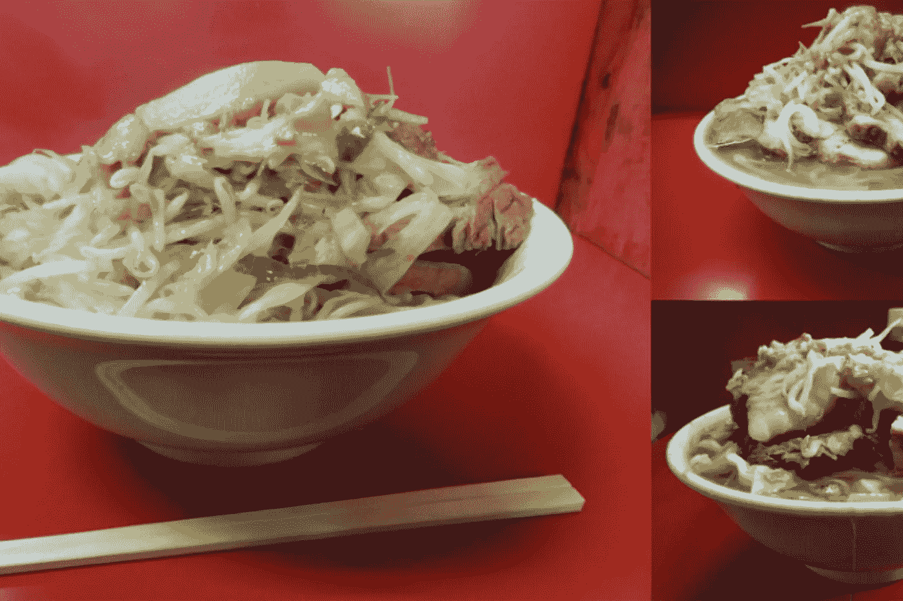

# 宝马机器学习周刊—第 7 周

> 原文：<https://towardsdatascience.com/bmw-machine-learning-weekly-week-7-a22bcba816b5?source=collection_archive---------6----------------------->

## 2018 年 3 月 29 日至 4 月 4 日

*关于机器学习(ML)、人工智能(AI)及相关研究领域的新闻。*

# 估计行星上存在生命的可能性

一种人工智能算法正在学习识别其他世界的生命支持条件模式。普利茅斯大学的一个团队说，它可以预测这些行星上存在生命的可能性。研究人员训练了他们的神经网络，根据它们是否最像今天的地球、早期的地球、火星、金星或土星的卫星泰坦，将行星分为五种不同的类型。所有这五个物体都是已知有大气层的岩石体，是太阳系中最有可能适合居住的物体。“鉴于迄今为止的结果，这种方法可能会被证明是非常有用的，可以利用地基和近地天文台的结果对不同类型的系外行星进行分类，”该项目的主管 Angelo Cangelosi 博士说。该技术也可能非常适合选择未来观测的目标，因为预计未来的太空任务，如欧空局的 Ariel 太空任务和美国宇航局的 James Webb 太空望远镜，将增加光谱细节。

[继续阅读……](https://www.sciencedaily.com/releases/2018/04/180404093914.htm)

# 抑郁:打字整齐划一，拿着手机有一个角度

正如这篇新发布的[论文](https://arxiv.org/abs/1803.08986?utm_source=MIT+Technology+Review&utm_campaign=f902c98828-EMAIL_CAMPAIGN_2018_04_04&utm_medium=email&utm_term=0_997ed6f472-f902c98828-154364817)所述，一个神经网络可以通过分析他们如何持有和点击智能手机来检测双相患者的抑郁和躁狂。研究人员给双相情感障碍者和控制者一部带有定制键盘的手机，收集按键和加速度计运动的数据。他们还要求参与者自我报告他们感到抑郁或狂躁的程度。与控制组相比，躁郁症患者在患有躁狂或抑郁症时，打字时间更加一致，而控制组的打字速度有所不同。一种解释可能是，躁郁症患者对刺激的反应不那么强烈，比如收到的短信。加速度计数据显示，有抑郁或躁狂症状的受试者倾向于以一定角度握持手机。该算法(名为 *DeepMood* )在通常不到一分钟的会话中达到了 90%的准确率。

[继续阅读……](https://www.technologyreview.com/the-download/610768/mood-disorders-could-be-diagnosed-by-the-way-you-fiddle-with-your-phone/)

# 拉面识别

如果你是一个足够大的拉面粉丝，也许你可以在 Instagram 上看到一张 tonkotsu 碗的照片，并立即认出它来自哪个餐厅。但计算机打败了我们，因为它们现在可以从同一家特许经营餐厅的 41 碗看似相同的拉面中，识别出一个菜单项来自哪个商店。数据科学家 Kenji Doi 做了这项美味的研究，使用谷歌的 AutoML Vision 对拉面 Jiro 的每一个菜单项进行分类，拉面 Jiro 是一家位于东京的拉面连锁店。他从 41 家商店中的每一家收集了大约 1170 张照片，并将 48000 张拉面照片的数据集输入软件。AutoML 花了大约 24 小时(18 分钟，在不太准确的基本模式下)完成数据训练，该模型能够以 95%的准确率预测拉面来自哪个商店。多伊认为，这个模型足够精确，能够区分切肉和浇头的位置。

[继续阅读……](https://www.theverge.com/tldr/2018/4/2/17189736/google-automl-vision-machine-learning-ramen)

# 值得注意的

*   **新纪录片:*你信任这台电脑吗？***
    新纪录片*你信任这台电脑吗？*本周将在韦斯特伍德的 Regency Village 剧院进行全球首映，及时探索了人工智能的崛起和思维机器的潜在危险。观看[预告片](https://www.youtube.com/watch?v=EdguhIzftH4)，阅读[更多](http://deadline.com/2018/04/do-you-trust-this-computer-trailer-chris-paine-artificial-intelligence-documentary-video-1202357639/)。
*   世界第三大唱片公司华纳音乐收购了 ML 初创公司 Sodatone，试图利用数据来发现下一个艾德·希兰。成立于多伦多的 Sodatone 追踪流媒体、巡演和社交媒体数据，寻找与听众产生共鸣的艺术家。随着越来越多的人在线观看娱乐节目，音乐、电影和电视高管正在寻找专有数据，以预测什么会受到观众的欢迎。[阅读更多…](https://www.ft.com/content/5ba53658-32a9-11e8-ac48-10c6fdc22f03)
*   麦当劳跳上人工智能列车
    麦当劳和任何快餐企业的核心是保持低成本和高效率的需求——这是大数据、人工智能和机器人可以支持的。人工智能可以帮助他们改善个性化的客户体验，利用客户数据创建数字菜单，开发 McRobots(麦当劳是第一家在亚利桑那州凤凰城开设完全由机器人经营的商店的同类餐厅，只有一小组人来支持他们。)，并展开趋势分析。[阅读更多……](https://www.forbes.com/sites/bernardmarr/2018/04/04/how-mcdonalds-is-getting-ready-for-the-4th-industrial-revolution-using-ai-big-data-and-robotics/#13fdb22e3d33)