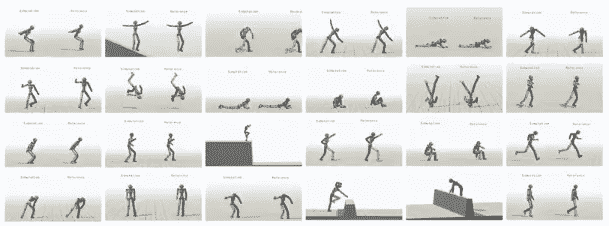

# 宝马机器学习周刊—第 8 周

> 原文：<https://towardsdatascience.com/bmw-machine-learning-weekly-week-8-149ca5108899?source=collection_archive---------7----------------------->

## 2018 年 4 月 5 日至 4 月 25 日

*关于机器学习(ML)、人工智能(AI)及相关研究领域的新闻。*

# 与人工智能互动

谷歌对[人工智能实验](https://experiments.withgoogle.com/ai)的最新贡献是让你与书籍对话:这个名为“[与书籍对话](https://books.google.com/talktobooks/)的项目让你与一个经过人工智能训练的算法进行真正的对话，该算法利用人类撰写的文本中的相关段落来回答问题。它让你发表声明或提出问题。然后，该工具在书中找到一个句子来回答问题或陈述，而不依赖于关键字匹配。另一个(更具互动性和趣味性的)工具是“ [Semantris](https://research.google.com/semantris) ”，一个由 ML 支持的单词联想游戏。Semantris 基本上测试你的单词联想能力，使用的软件和与书对话的软件是一样的。它会根据屏幕上的单词与您输入的答案的对应程度，对这些单词进行排名和评分。例如，如果你在一个 10 个单词的集合中得到单词“bed ”,你可能会想到键入“sleep”作为响应。然后，Semantris 将对这 10 个单词进行排名，并根据它认为床和睡眠之间的语义关系与“床”和列表中其他每个单词之间的关系相比有多好来给你打分。Google 过去的 AI 实验包括“[快，画！“T9”，一个学习如何识别你涂鸦的神经网络，或者“](https://quickdraw.withgoogle.com/) [Infinite Drum Machine](https://experiments.withgoogle.com/ai/drum-machine/view/) ”，让你使用日常世界的声音创造节拍。

[继续阅读……](https://www.theverge.com/2018/4/13/17235306/google-ai-experiments-natural-language-understanding-semantics-word-games)

# 通过强化学习掌握孔孚

加州大学伯克利分校和不列颠哥伦比亚大学的人工智能研究人员创造了虚拟角色，能够模仿一个人表演武术、跑酷和杂技的方式，坚持不懈地练习动作，直到他们恰到好处。这项工作可能会改变视频游戏和电影的制作方式。动画师可能会将真实的镜头输入到程序中，并让他们的角色通过练习来掌握它们，而不是以令人痛苦的细节来计划角色的动作。这样的角色可以被放到场景中，然后留下来执行动作。人工智能研究人员开发的虚拟角色使用了一种被称为强化学习的人工智能技术，其中虚拟角色对其运动进行实验，每当它稍微接近专家的运动时，就会收到积极的强化。强化学习意味着同样的算法可以用来训练一个角色做后空翻或月球漫步。

[继续阅读……](https://www.technologyreview.com/s/610773/virtual-robots-that-teach-themselves-kung-fu-could-revolutionize-video-games/)

# 人工智能将指导地震响应

[一个值得关注的问题](https://www.oneconcern.com/)，加州的一家初创公司正在使用 ML 向消防部门提供如何计划和应对地震的建议。一个关注点的目的是减少灾难响应规划过程中的猜测。使用关于房屋、建筑物、它们的材料、它们的建造时间以及当地面开始震动时它们倒塌的可能性的数据，以及关于自然环境和实时天气数据的数据，可以预测如果地震发生在特定地区会发生什么。然后在过去地震造成破坏的地区测试这个模型。

[继续阅读……](https://www.npr.org/2018/04/20/595564470/betting-on-artificial-intelligence-to-guide-earthquake-response)

# 欧盟的人工智能目标

欧盟委员会概述了欧洲促进投资的方法，并为人工智能制定了道德准则。它提出了一个三管齐下的方法来防止“人才外流”到其他非欧洲竞争对手，并认为欧盟需要协调欧洲行动才能站在人工智能发展的前沿。这三个目标被定义为:I)增加对人工智能的财政支持，并鼓励公共和私营部门采用；ii)为人工智能带来的社会经济变化做好准备 iii)确保与人工智能相关的适当的道德和法律框架。

[继续阅读……](http://europa.eu/rapid/press-release_IP-18-3362_en.htm)

# 值得注意的

*   **1984 年中情局关于人工智能**
    阅读了中情局 1984 年解密的[备忘录](https://www.cia.gov/library/readingroom/docs/CIA-RDP86M00886R000500040004-2.pdf)，其中一个“人工智能指导小组”(成立于 1983 年)向中情局主席通报了人工智能以及它是什么。[阅读更多…](https://thenextweb.com/artificial-intelligence/2018/04/23/cia-plans-to-replace-spies-with-ai/)
*   自动化就绪指数自动化系统的日益复杂将对工作和就业产生深远的影响，政府应该为剧变做好准备。由经济学人信息部创建并由 ABB 赞助的[自动化就绪指数](http://automationreadiness.eiu.com/)评估了 25 个国家对智能自动化的挑战和机遇的准备程度。韩国在该指数中拔得头筹，在每个政策领域都得分很高，其次是德国和新加坡。[阅读更多…](https://www.businesswire.com/news/home/20180423005873/en/ABB-Economist-Launch-Automation-Readiness-Index-Global)
*   Comet . ml
    [Comet](https://www.comet.ml/)声称他们希望为 AI 做 GitHub 为软件做的事情:允许数据科学团队自动跟踪他们的数据集、模型变化和实验历史，从而允许项目和方法的效率、透明度和可重复性。[阅读更多…](https://techcrunch.com/2018/04/05/cometml-wants-to-do-for-machine-learning-what-github-did-for-code/)