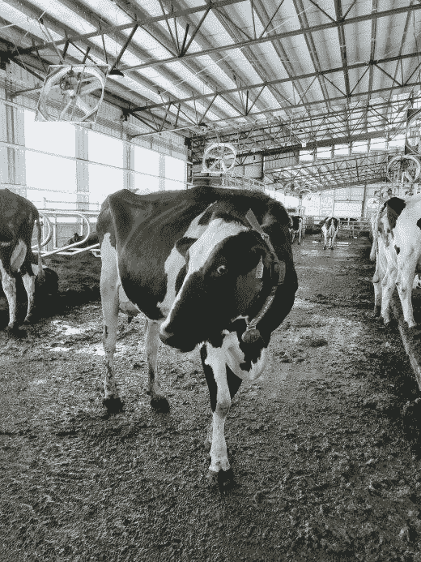
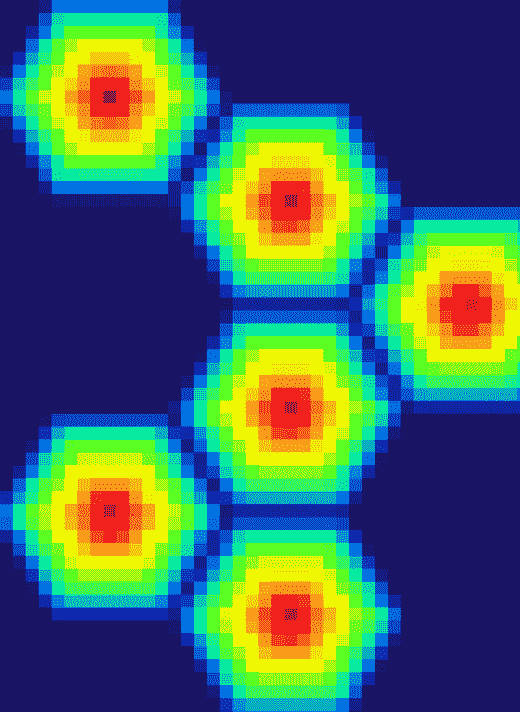

# 宝马机器学习周刊—第 10 周

> 原文：<https://towardsdatascience.com/bmw-machine-learning-weekly-week10-d3823170cf5?source=collection_archive---------13----------------------->

## 2018 年 5 月 3 日至 5 月 23 日

*关于机器学习(ML)、人工智能(AI)及相关研究领域的新闻。*

# 机器人奶牛模拟跟踪技术的未来

三头难以分辨的电子奶牛第一次尝试一种叫做 EmbediVet 的设备，这种设备是由一家名为[家畜实验室](https://www.embedivet.com)的初创公司发明的。植入奶牛体内的追踪器使用低能量蓝牙连接附近的基站，并传输关于奶牛咀嚼频率、温度和在农场漫步的信息。目前，他们只是过着正常的生活，无意中提供数据来训练人工神经网络。希望在不久的将来，这种人工智能将帮助农民快速轻松地了解奶牛和其他牲畜的饮食状况，它们是否生病或即将分娩——这些事情在今天通常只是通过观察和等待来完成，但当你有数百或数千只动物需要关注时，很难发现。家畜实验室声称，植入的 EmbediVet 对牛来说没有可穿戴的那么烦人，并且可能是一种更强大的收集有用数据和随着时间的推移发现牛行为模式的方法。家畜实验室的首席执行官 Tim Cannon 从来没有打算为奶牛制作一个嵌入式 Fitbit。他真正想要的是用同样的技术重新设计自己，以及任何想这样做的人。

[继续阅读……](https://www.technologyreview.com/s/611144/cyborg-cows-are-coming-to-a-farm-near-you/)

# 改进聊天机器人技术

人工智能初创公司 Gamalon 开发了一种聪明的新方法，让聊天机器人和虚拟助理与我们交谈。Gamalon 采用让人工智能接受不确定性和模糊性的方法，可能会矛盾地帮助未来的虚拟助手减少困惑。他们的方法通过提供一种处理话语可能传达的多重含义的方式，让计算机进行更有意义和更连贯的对话。如果一个人说了或输入了一些含糊不清的话，系统会对最可能的意思做出判断。今天的虚拟助手和聊天机器人通常遵循简单的规则来回答问题，而 Gamalon 的方法将概率技术添加到统计 ML 中，合成自动处理概率的程序。在实践中，这意味着系统可以通过对某人的意思做出最佳猜测来处理不确定性。这种方法让机器从更少量的数据中学习，降低了出错率。另一个关于聊天机器人的人工智能进步是来自康乃尔大学、谷歌拼图和维基媒体的[研究](https://arxiv.org/abs/1805.05345)，他们开发了一种软件，帮助计算机[在争论发生前发现在线争论](https://www.theverge.com/2018/5/23/17379526/machine-learning-ai-spot-arguments-online-wikipedia)。

[继续阅读……](https://www.technologyreview.com/s/611078/how-uncertainty-could-help-a-machine-hold-a-more-eloquent-conversation/)

# 类似大脑的全球定位系统

Alphabet 旗下的英国公司 DeepMind 创建了一个神经网络，模仿人类大脑中的网格细胞，帮助我们知道自己在哪里。DeepMind 的研究人员开始训练一个人工神经网络来模仿路径整合，这是一种动物用来计算它们在空间中运动的方法。该小组发现，神经网络发展出了类似于生物大脑中发现的“网格细胞”的东西。这些细胞排列成三角形网格，似乎为动物提供了一种在物理空间中定位的方式。然后，他们使用经过训练的网络，通过在他们的方法中添加强化学习来导航通过不熟悉的迷宫。他们发现，新训练的网络可以比以前的任何人工智能系统更有效地导航，并且它更像真正的动物一样探索空间。

[继续阅读……](https://www.technologyreview.com/s/611105/robots-may-someday-explore-the-world-using-features-borrowed-from-your-brain/)

# 区块链&汽车行业

宝马新闻:
Business Insider 报道，宝马、通用、雷诺和福特已经达成协议，成立移动开放区块链倡议(MOBI)，这是一个将探索区块链技术在汽车和移动行业中的应用的财团。区块链是一种数学结构，以几乎不可能伪造的方式存储数据。它可以用于各种有价值的数据。显然，除了探索区块链用例之外，MOBI 还打算制定通用标准和应用编程接口(API)。虽然这些公司没有具体说明他们计划探索的任何用例，但他们可以追求几种可能性。区块链是一种分布式、不可变的账本，早期回报表明，它非常适合在两方或多方之间安全地转移资金和信息，这是当今行业中相对常见的做法。

[继续阅读……](https://www.businessinsider.de/carmakers-exploring-blockchain-technology-2018-5?r=US&IR=T)

# 值得注意的

*   **婴儿翻译器**
    [Chatterbaby](https://chatterbaby.org/pages/) 是一款分析声音与沉默比率的频率和模式变化的应用程序，可以告诉父母他们的孩子为什么会哭。目前，这款应用的词汇非常有限(它可以区分饥饿、烦躁和痛苦)。然而，Chatterbaby 不仅仅是一个旨在帮助父母的 app。这也是一个大规模的数据收集工具，用来观察哭泣模式的不规则性是否可能携带自闭症的信号——也许有一天，可以诊断出自闭症。[阅读更多…](https://www.wired.com/story/can-this-ai-powered-baby-translator-help-diagnose-autism/)
*   **表情符号寻宝游戏**
    谷歌的[表情符号寻宝游戏](https://emojiscavengerhunt.withgoogle.com/?about=true)为表情符号的众多含义又增加了一个:玩 ML 的一种方式。一个表情符号出现了，你可以用手机的摄像头实时搜索它的例子。通常，利用神经网络需要连接到一组巨大的远程云服务器。但是，所有计算都直接在设备上进行，而不是连接到远程服务器群。表情符号寻宝游戏背后的人坚持认为这个游戏没有保存它拍摄的任何照片，并邀请人们在 GitHub 上查看他们的[开源代码](https://github.com/google/emoji-scavenger-hunt)。[阅读更多…](https://www.cultofmac.com/545779/google-gamifies-machine-learning-with-emoji-scavenger-hunt/)
*   在未能与宝马和梅赛德斯-奔驰达成交易后，这家科技巨头与大众签署了一项协议，将汽车制造商的一些新 T6 运输车改造成苹果的自动驾驶员工班车——三位知情人士表示，该项目落后于计划，几乎占据了苹果汽车团队的全部注意力。[阅读更多……](https://www.nytimes.com/2018/05/23/technology/apple-bmw-mercedes-volkswagen-driverless-cars.html)