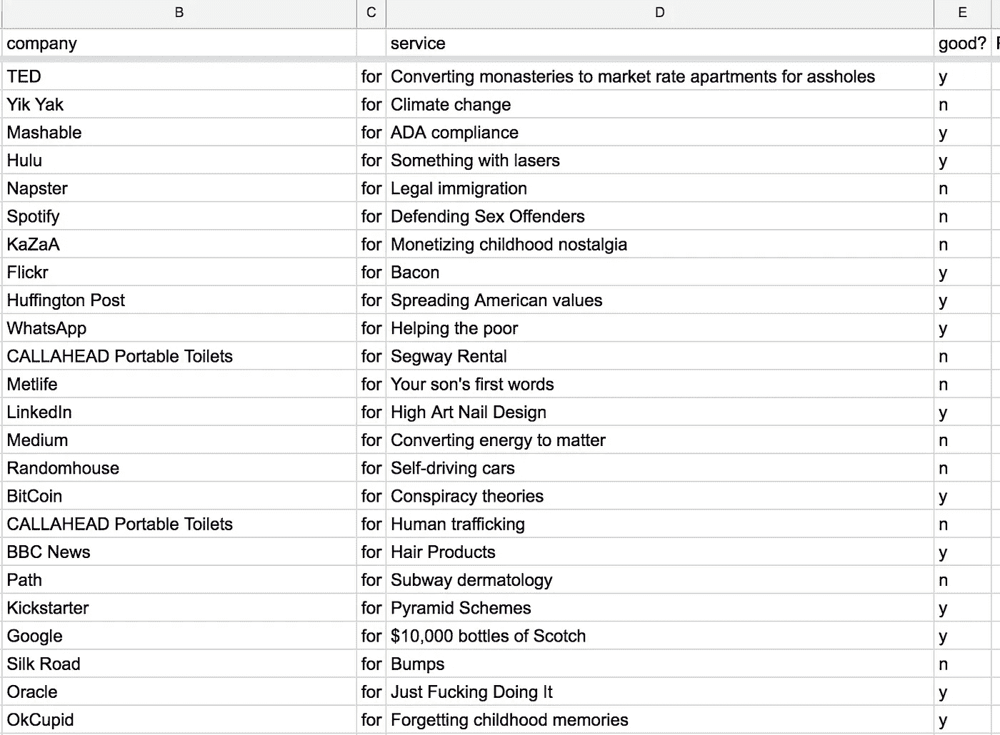
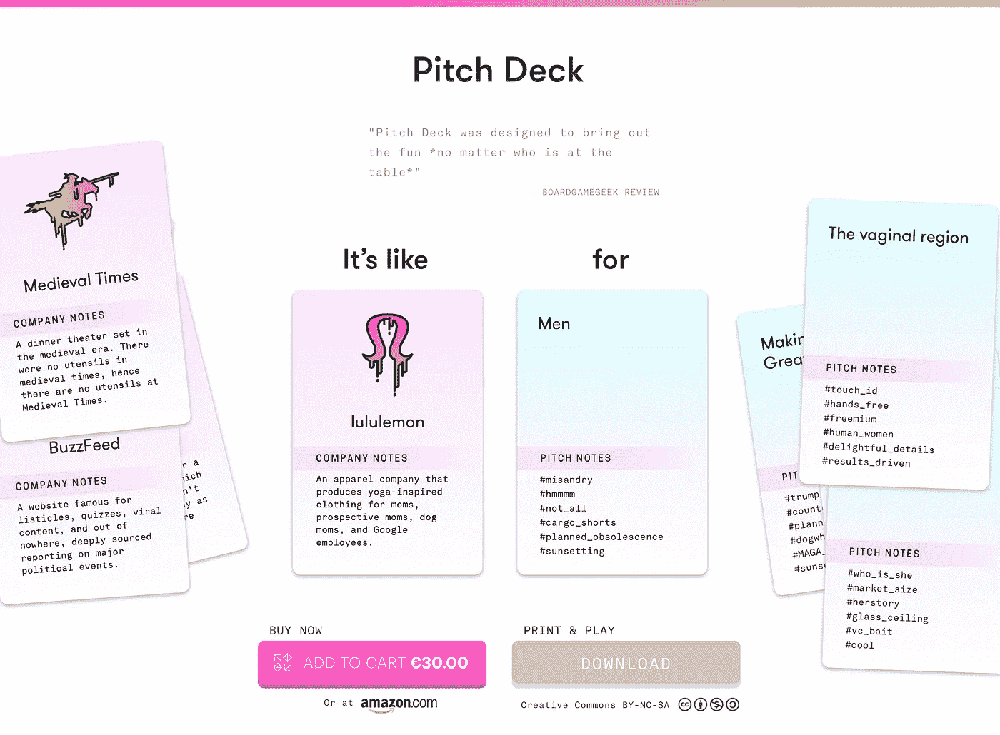
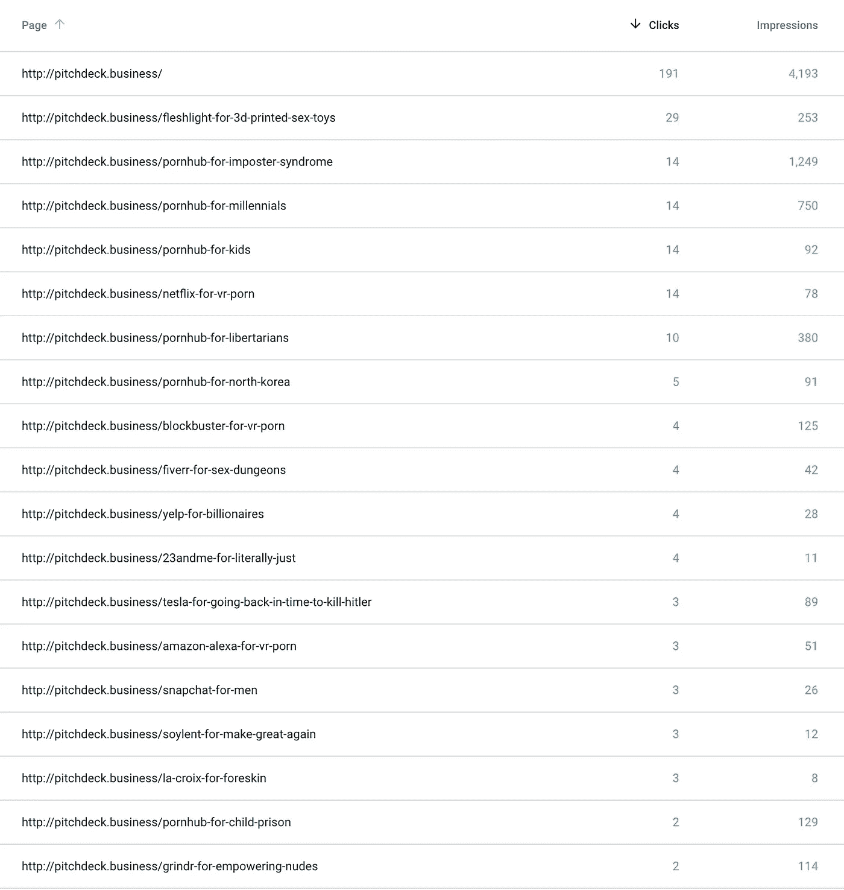

# 沸腾愚蠢创业想法的海洋

> 原文：<https://towardsdatascience.com/boiling-the-ocean-of-dumb-startup-ideas-c5c7eef562da?source=collection_archive---------8----------------------->

当我和亚历克斯·黑格(Alex Hague)第一次制作讽刺派对游戏 [**的原型时，我们将一份公司名称的电子表格放在一张我们最终称之为“推介卡”的列表旁——市场或人口统计数据，或者只是我们可以与公司卡配对的愚蠢想法。**](http://pitchdeck.business)

接下来，我制作了另一个标签，随机将公司与另一组随机创意配对，看看这些配对是否有趣:

An early spreadsheet we used for prototyping whether this game would be funny

从本质上来说，并不是所有的方法都有效，但是足够了，我们知道这是有意义的。(我们如何决定哪些公司和想法最终入选游戏是一个单独的帖子，我们总有一天会看到；TL；博士基本上是“像脸书和谷歌这样的公司太普通了，不能拿来开玩笑，非常广泛或非常具体的基于人口统计的推介卡效果最好。”)

两年后， [Pitch Deck](http://pitchdeck.business) 现已发货给我们所有的 [1，889 名 Kickstarter 支持者](https://www.kickstarter.com/projects/fred/pitch-deck)和[在亚马逊](https://www.amazon.com/dp/B076J2KRW1?&_encoding=UTF8&tag=pitchdeckgame-20&linkCode=ur2&linkId=547462298ccfa6b4d2ba62faf35ae592&camp=1789&creative=9325)上表现良好，获得所有 5 星评价。我们甚至刚刚得到了我们第一个友好的本地游戏商店[的聚光灯视频，来自丧魂之钟](https://www.youtube.com/watch?v=WeHMuW5f5P4&feature=youtu.be)。

# 网站的事做得太过分了

当我们开始零售游戏时，我们也在准备推出我们的网站 [pitchdeck.business](http://pitchdeck.business) ，我想知道为每一种可能的卡片组合建立一个页面会是什么样子。在游戏的零售版本中，大约有 31，500 双。一个很大的数字，但不是大到你不能暴力破解。

大约在那个时候，我的好友兼 Y Combinator 合伙人 T21 问我我们的搜索引擎优化策略是什么。我回答说“*没有，这是一个纸牌游戏，希望人们和他们的朋友一起玩，玩得开心，我们从中获得一些好口碑*”。

制作一款卡牌游戏之所以有趣，部分原因是它们有一种内在的病毒性质(也称为 [K 因素](https://en.wikipedia.org/wiki/K-factor_(marketing)))，人们会如何听说它们。因为游戏**必须**多人玩，每个副本代表一个可能的粉丝群体。如果游戏足够有趣，一些新玩家会买一个拷贝。这是一个良性循环。

事实上，我们经常听到 Pitch Deck 的粉丝说，他们在和朋友玩游戏的过程中通过手机购买了他们的副本。你可以把它想象成一种轻量级的网络效应:游戏每增加一个副本，并没有增加单个副本的整体价值，而是增加了更多朋友购买游戏的概率。

但是 Gustaf 的问题让我想知道这种每对一页的方法是否可能是一种颠覆性但精明的 SEO 策略——如果每对卡片都有一个被谷歌索引的 URL，那么任何时候有人查询`[AirBnB for Fish](http://pitchdeck.business/airbnb-for-fish)`我们都有机会在结果中显示出来。

如果有人无礼地用谷歌搜索一家公司的创意，而这家公司恰好在我们的游戏中，那么，他们可能也有兴趣购买一份。至少，如果你在谷歌上搜索`[Arby’s for Nonsexual glory holes](http://pitchdeck.business/arby-s-for-nonsexual-glory-holes)`，你很有可能会喜欢玩 Pitch Deck。

我还意识到，如果我们启用一些基本的分析和谷歌的搜索控制台，我们可以一窥人们最感兴趣的卡片。最受欢迎的网址反映了一种网络身份，就像我们在纸牌游戏中看到的那样。谷歌的搜索控制台可以让我们深入了解用户为了访问我们的网站而输入的关键词。

## 有时，当你试图建造一些简单的东西，但无法抗拒过度，这被称为“沸腾的海洋”。这就是这个想法的基本内容(我的意思是谁真的需要一个 Ruby on Rails 应用程序来玩纸牌游戏？！)但是一旦脑子里有了这个想法，我就忍不住了。

# 它活着

几个星期后，我已经把这个网站建成了一个基本的 Rails 应用程序，并为它植入了整个游戏。每张公司卡[都有自己的页面](http://pitchdeck.business/company_cards/)，所有[的 31500 种配对组合](http://pitchdeck.business/card_pairings/)和[每张宣传卡](http://pitchdeck.business/pitch_cards/)，以及[每张标签](http://pitchdeck.business/hashtags/)。

Google now knows about 34k+ URLs tied to our card game.

整个网站现在已经被谷歌搜索机器人索引，经过大约一个月的适度流量，我们已经收集了足够的数据来得出一些有趣的趋势。

但是在我继续说下去之前，先来个剧透和内容警告:事实证明，网络上最流行的宣传配对是性配对。他们一直都是。

反人类实验室的[卡牌也是如此:](https://www.cardsagainsthumanity.com/lab/) [Max Temkin](https://medium.com/u/e5d3ec93a057?source=post_page-----c5c7eef562da--------------------------------) 告诉我，他们实验室里做得最好的卡牌总是那些淘气的。在像我们这样的游戏中，这是一个有趣的偏见，因为它不会亲自出场；可能的解释是，当人们独自坐在电脑前时，他们更倾向于选择淫秽的纸牌配对，但当他们被要求与朋友一起玩时，他们会变得低调。

事实证明，人们发现 CAH 网站也有类似愚蠢的搜索词——是 Max 发给我的列表中最没有攻击性的一个。

# 免费独角兽公司的想法

宣传资料可能会被解读为一种愚蠢的方式，用来判断对一个优秀公司创意的需求。如果很多人都在寻找同一个想法，这显然意味着对它有某种兴趣。

到目前为止，我看到的最可行的方法是什么？`[Netflix for VR Porn](http://pitchdeck.business/netflix-for-vr-porn)`。我们暂时是这次搜索的第三个结果，但是在大量关于这个话题的炒作新闻中，这个页面似乎已经明显下降了。可能是因为我们不提供 VR 色情租赁网站。但是，嘿，这似乎是一个…值得追逐的肥沃市场。

另一个热门搜索导致人们投甲板？`3d printed fleshlight`。我们的网页“3D 打印情趣用品[Fleshlight](http://pitchdeck.business/fleshlight-for-3d-printed-sex-toys)”现在在搜索中排名第四。虽然这可能不是最有利可图的商业想法(事实上，这可能是一个可怕的想法——人们搜索这个的确切原因是因为*他们不想为真正的肉体之光*付费)，但它让人们看到了未来人们真正想用他们的 3D 打印机做什么，那就是用 ABS 塑料制造生殖器。

不幸的是，这种想法也凸显了人们经常在谷歌中输入的一些更黑暗的术语。最令人不安的是:`Pornhub for kids`的变体。现在我假设这不是给孩子的 Pornhub *，而是给*孩子的 Pornhub *。发现这一点真的令人不安，它提醒我们人们仍然在网上寻找各种各样的东西。我已经从谷歌上取消了这个和一些其他页面的索引(例如“儿童监狱的 PornHub”)，所以希望我们将不再出现在这些结果中。*不寒而栗。**

我要留着`[Farmersonly for VR porn](http://pitchdeck.business/farmersonly-for-vr-porn)`。

我最喜欢的另一个数据集是人们偶然发现的页面列表。以下是通过我们的谷歌搜索控制台获得的热门搜索结果:

我特别喜欢`[PornHub for imposter syndrome](https://www.google.com/search?q=PornHub+for+imposter+syndrome&rlz=1C5CHFA_enUS719US719&oq=PornHub+for+imposter+syndrome&aqs=chrome..69i57.217j0j7&sourceid=chrome&ie=UTF-8)`，我们目前在谷歌上占据第一、第二和第三的位置。我不知道这是恋物癖还是什么，但我很感兴趣。

搜索`Did Hitler kill Tesla`的人似乎会以“[特斯拉为结局，因为他回到过去杀死了希特勒](http://pitchdeck.business/tesla-for-going-back-in-time-to-kill-hitler)

至少有一个人点击了我们的页面`[soylent farts](http://pitchdeck.business/soylent-for-farts)`，结果是[一个相当好理解的问题](https://www.reddit.com/r/soylent/comments/29g2ga/how_to_stop_farting_on_soylent/)。三个人搜索`donald trump snuggie`，其中一个点了。Martha Stewart 在这个数据中也出奇地受欢迎，并出现在各种搜索中:`[egg salad martha stewart](http://pitchdeck.business/martha-stewart-living-omnimedia-for-egg-salad)`、`[martha stewart illuminati](http://pitchdeck.business/martha-stewart-living-omnimedia-for-the-illuminati)`、`[martha stewart racist](http://pitchdeck.business/martha-stewart-living-omnimedia-for-racist-news)`和`[martha stewart college](http://pitchdeck.business/martha-stewart-living-omnimedia-for-humanities-majors)` 都出现了。

我们没有预料到的最后一个转折是:人们经常搜索 Kickstarter 等公司的*实际*演示文稿(例如，PowerPoint 演示文稿)。

到目前为止，Yelp 以两次点击和几十次展示在该领域领先，但也很受欢迎的是`venmo pitch deck`、`rent the runway pitch deck`和`snapchat pitch deck`。

值得一提的是一个数据解释警告:由于组成 Pitch Deck 的内容并不能代表所有内容(这是一个基于我们对特定主题的幽默感的讽刺性纸牌游戏)，因此不可能真正得出任何有意义的结论。这只是对人们在谷歌上搜索什么的一种有趣、怪异和略带沮丧的窥视。

但是，如果你读到这里，你可能会想知道这些流量是否导致了游戏的销售。答案是，不幸的是，我们真的不知道。

我们大概知道有多少人通过我们的网站从哪些页面进入亚马逊，但实际上我们不知道更多。当谈到理解将人们引向你的清单的数据时，亚马逊是一个真正的黑匣子。我可能还需要做更多的工作来弄清真相，但事实是，我更喜欢这些数据的副作用，而不是任何旨在推动大量销售的东西。

最后，如果你对这种搜索趋势分析感兴趣，可以看看 Seth Stephens-Davidowitz 的文章。他写了一些伟大的工作，使用谷歌搜索趋势[分析人们的焦虑](https://www.nytimes.com/2016/08/07/opinion/sunday/fifty-states-of-anxiety.html?rref=collection%2Fbyline%2Fseth-stephens-davidowitz&action=click&contentCollection=undefined&region=stream&module=stream_unit&version=latest&contentPlacement=6&pgtype=collection)、[人们如何搜索性](https://www.nytimes.com/2015/01/25/opinion/sunday/seth-stephens-davidowitz-searching-for-sex.html?rref=collection%2Fbyline%2Fseth-stephens-davidowitz&action=click&contentCollection=undefined&region=stream&module=stream_unit&version=latest&contentPlacement=5&pgtype=collection)和[我们实际上有多种族主义](https://query.nytimes.com/gst/fullpage.html?res=9407EED61330F933A25755C0A9649D8B63&rref=collection%2Fbyline%2Fseth-stephens-davidowitz&action=click&contentCollection=undefined&region=stream&module=stream_unit&version=latest&contentPlacement=19&pgtype=collection)。